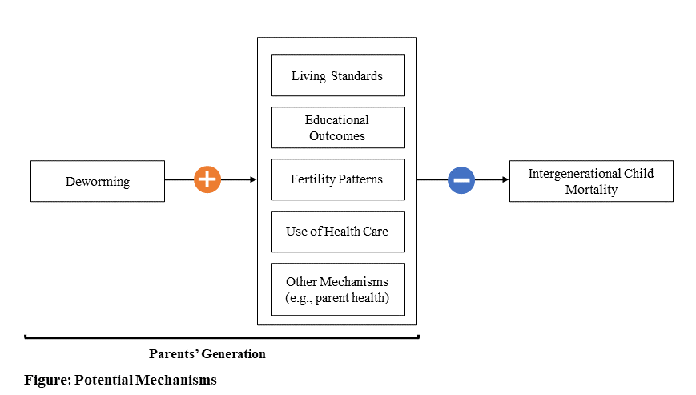

```{=tex}
\def\blue{\color{blue}}
\def\red{\color{red}}
```


```r
################
#####  Notes:
################
# Types of objects:
### Source ------->  Input & Model ------->  Policy Estimates (output)
###  (_so)           (_in)                           (_pe)
### values           functions                       values
###                  & values          
# Examples:                   
# - call_so_f       - tax_elas_in_f         - ten_year_revenue_pe
# - policy_so       - est_bill_in_f         - ten_year_top_tax_pe
#                                           - total_rev_pe
### arguments in functions should used "_var" and functions should used "_f"

# Each analytic code chunk will begin by listing all the inputs it needs, and
# the outputs it produces.
# - inputs: list
# - outputs: list
#### The key essential analytic steps are wrapted in a function   
#chunk_name_of_chunk <- function(){
##########################################
##########################################  
#
# here goes the essential analytic content
#
##########################################
##########################################  
#    return( )                         # A list with all the objects
#}                                     # generated inside the function
# The following line executes the code chunk and deposits its results
# into the current R enviornment:
#invisible( list2env(chunk_name_of_chunk(),.GlobalEnv) )
#
##### Execute values of the functions above when needed for the text:
# Anything under this comment is to create objects that are used in the body of
# text. Not to be used in the final results (could be deleted). Each of these
# object should end with the suffix _temp
#
# Use diagrams to represent complex nesting of functions. Example:
# # pv_costs_f
#  ├──── delta_ed_final_f
#  ├──── interest_f
#  └──── cost_per_student_f
#  |      └──── x
#  ├──── s2_f
#  └──── lambda2_in_f
```


```r
# - inputs: none
# - outputs: all sources coming from data, research and guesswork
chunk_sources <- function(){
###############################################################################
###############################################################################  

    #############
    ##### Setup
    #############  
    nsims_so <- 1e4
    rescale_so <- FALSE
    policy_estimate_so <- "a3_inc_a2_all_sim"
    run_sim_so <- FALSE
    main_run_so <- TRUE
    periods_so <- 50               #Total number of periods to forecast wages
    costs_temp_so <- 1
    main_pe_so <- round(read.csv(here('data','ea3_pe'))[,2], digits=1)

    #############
    ##### Data  
    #############
    ex_rate_so <- 74                # Exchange Rate - Central Bank of Kenya 74 , 85
    df_ex_rate_so <- data.frame(
      year = c(seq.int(2011, 2020,1)),
      ex_rate = c(
        88.81166667,
        84.53,
        86.12333333,
        87.9225,
        98.17916667,
        101.5041667,
        103.4104462,
        101.301574,
        101.9912984,
        106.4507802)) # Exchange rate (KES per international $)
    df_ex_rate_ppp_so <- data.frame(
      year = c(seq.int(2006,2018,1)),
      ex_rate_ppp = c(
        23.765,
        25.024,
        28.266,
        31.317,
        31.603,
        34.298,
        36.809,
        38.044,
        40.35,
        43.926,
        45.862,
        49.773,
        50.058)) # KLPS4_E+_globals.do (originally from the World Bank as of 2019 June)

    # Currency Conversion - ALL CURRENCY TO 2017 USD PPP
    ## USD --(exchange rate)--> KSH --(exchange rate)--> USD PPP --(CPI)--> USD PPP 2017
    ## unit_cost_ppp_so <- unit_cost_so*ex_rate_2018_so/ex_rate_2018_ppp_so
    ## unit_cost_2017usdppp_so <- unit_cost_ppp_so * cpi_2017_so / cpi_2018_so  # 0.8296927
    ## Exchange rate (USD -> KSH) - https://data.worldbank.org/indicator/PA.NUS.FCRF?locations=KE as of 2021/7/21
    ex_rate_2006_so <- 72.10083502
    ex_rate_2011_so <- 88.81166667
    ex_rate_2015_so <- 98.17916667
    ex_rate_2016_so <- 101.5041667
    ex_rate_2017_so <- 103.4104462
    ex_rate_2018_so <- 101.301574
    
    ## Exchange rate (KSH -> USD PPP) - # The exchange rate from Worms20_Globals.do as of Publishment of Hamory et al. 2021
    ex_rate_2006_ppp_so <- 23.765
    ex_rate_2011_ppp_so <- 34.298
    ex_rate_2015_ppp_so <- 43.926
    ex_rate_2016_ppp_so <- 45.862
    ex_rate_2017_ppp_so <- 49.773
    ex_rate_2018_ppp_so <- 50.058
    
    ## (For reference) Exchange rate (KSH -> USD PPP) - the NEW https://data.worldbank.org/indicator/PA.NUS.PPP?locations=KE
    # ex_rate_2006_ppp_so <- 24.52531877
    # ex_rate_2011_ppp_so <- 35.39612198
    # ex_rate_2015_ppp_so <- 39.04047775
    # ex_rate_2016_ppp_so <- 39.38495636
    # ex_rate_2017_ppp_so <- 40.18493652
    # ex_rate_2018_ppp_so <- 40.19336962
    
    ## CPI index - Ave. of HALF 1&2 https://data.bls.gov/timeseries/CUUR0000SA0 as of 2022/01/20
    cpi_2006_so <- 201.6
    cpi_2011_so <- 224.939
    cpi_2015_so <- 237.017
    cpi_2016_so <- 240.007
    cpi_2017_so <- 245.120
    cpi_2018_so <- 251.107
    
    
    growth_rate_so <- 1.52/100      #Per-capita GDP growth, 2002-2011 (accessed 1/29/13) -	World Bank - see notes
    gov_bonds_so <- 	0.1185	      #Kenyan interest on sovereign debt - Central Bank of Kenya
    gov_bonds_new_so <- 0.09
    inflation_so <-  0.02           #Kenyan inflation rate - World Bank Development Indicators
    inflation_new_so <- 0.04
    interest_10_so <- 0.1           #10% discounting rate
    tax_so <- 0.16575               #ADD INFO

    # GBD DALYs Kenya 2019 All causes, Both sexes, All ages 
    gbd_so <-read.csv("rawdata/data/gbd.csv") # data from Global Burden of Disease Study 2019 (GBD 2019) on 04/26/2022 and data on population from Kenya National Bureau of Statistics. 2019 Kenya Population and Housing Census Volume III: Distribution of Population by Age, Sex and Administrative Units. http://housingfinanceafrica.org/app/uploads/VOLUME-III-KPHC-2019.pdf
    # Fertility rate (Ft)
    klps_fert_so <- read_excel("rawdata/data/mortality_data_21.02.17.xlsx") # data from team of Walker et. al. 2022 (sent from: Michelle Layvant 02/17/2022, to: Satoshi Koiso, subject: "Data needed for figure")

    ## Life benefits in DALYs term per child
    ave_death_u5_so <- 0.652 # From Matthew Krupoff April 19 2022                        CHECK: Documentation and source

    
    # costs data
    df_costs_so <- read_excel("rawdata/data/DtW Cost per Child Data.xlsx",
                           sheet = "DtW Costs")
    # crosswalk data on region and country
    df_costs_cw_so <- read_excel("rawdata/data/DtW Cost per Child Data.xlsx",
                           sheet = "state_country")
    # data on number of treated children
    df_counts_so <- read_excel("rawdata/data/DtW Cost per Child Data.xlsx",
                           sheet = "DtW Treatment #s")
    # Prevalence data:
    # original study
    # Any infection on original study
    #prevalence_0_so <- c("hookworm" = 0.77, "roundworm" = 0.42, "whipworm" = 0.55,
    # "Schisto mansoni" = 0.22) # from Draft Cost-Effectiveness Model.xlsx ADD ORIGINAL SOURCE
    df_prevalence_so <- read_excel("data/prevalence_data.xlsx",
                           sheet = "Sheet1")
    # prevalence_0_so <- c("hookworm" = 0.77, "roundworm" = 0.42, "whipworm" =0.55, "Schisto mansoni" = 0.22) # from Draft Cost-Effectiveness Model.xlsx ADD ORIGINAL SOURCE
    prevalence_r_so <- c("india" = 0.5665, "kenya" = 0.345,
                         "nigeria" = 0.27, "vietnam" = 0.145)  #0.5665   0.5013121
    # based on https://docs.google.com/spreadsheets/d/1drKdU-kRjlRtwXq6nCqFC6gcoQ-eOaLfT9MWHSMZ0MA/edit?usp=sharing
    years_of_treat_t_so <- 2.41      #Years of Treatment in new setting

    new_costs_so <- NULL
    country_sel_so <- list("india", "kenya", "nigeria", "vietnam")
    country_sel_pop_so <- c(
      "india" = 1.366417750 * 1e9,
      "kenya" = 5.257397 * 1e7,
      "nigeria" = 2.0096360 * 1e8,
      "vietnam" = 9.646211 * 1e7
    )
    #https://data.worldbank.org/indicator/SP.POP.TOTL
    # options: "a1_tax_sim","a1_x_tax_sim","a1_all_sim", "a1_x_all_sim", "a2_tax_sim",
    # "a2_all_sim", "a3_inc_a1_all_sim", "a3_inc_a1_all_x_sim", "a3_inc_a2_all_sim"

    #############
    ##### Research
    #############
    df_research_so <- read_csv("rawdata/research/research_params.csv")   
    lambda1_so <- c(3.49, 0)            #Hrs per week increase for men and women, table 3, row 1, cols 2 & 3
    lambda1_sd_so <- c(1.42, 1.36)      #table 3, row 2, cols 2 & 3
    lambda1_new_so <- c(79.51465)       # avg treatment effect from klps2-4 (already adjusted for ppp and inflation to 2017) - w@w
    lambda1_new_sd_so <- c(76)          # Hamory et al 2021
    lambda2_so <- 10.2                  #Externality effect (proportional) - Table 3, row 1 col 4
    lambda2_sd_so <- 7.8                # Table 3, row 2 col 4
    #This is are the parameters labeled eta in the doc
    prevalence_0_so <- 0.92 # 0.92 doi: https://doi.org/10.1111/j.1468-0262.2004.00481.x  location: table 2, row 6, column 1
    wage_ag_so <- 	11.84	         #Mean hourly wage rate (KSH) - Suri 2011
    wage_ww_so <- 	14.5850933     #Control group hourly wage, ww (cond >=10 hrs per week) - Table 4, Panel B (Source data took the log, here the log is recovered)
    profits_se_so <- 1766          #Control group monthly self-employed profits -
                                   #Table 4, Panel C, Column 5, Row 1
                                   #FIX: MOST REFERENCES FROM TABLE 4 ARE TABLE 3
    hours_se_cond_so <- 38.1       #Control group weekly self-employed hours, conditional on hrs >0 - Table D13, Panel D
    hours_ag_so <- 8.3             #Control group hrs per week, agriculture - Table 3, Panel B
    hours_ww_so <- 6.9             #Control group hrs per week, working for wages - Table 3, Panel B
    hours_se_so <- 3.3             #Control group hrs per week, self-employment - Table 3, Panel B
    coef_exp_so <- c(0.1019575, -0.0010413)         #Years of experience coefficients (1-linear, 2-cuadratic)
                                                    #- see notes(0.1019575, -0.0010413), (0,0)
    coverage_so  <- 0.681333333    # (R) Fraction of treated primary school students within 6 km - from W@W - see note
    q_full_so <- 0.75              #Take up rates with full subsidy. From Miguel and Kremmer (2007)
    q_zero_so <- 0                 #Take up rates with zero subsidy. From Miguel and Kremmer (2007)
    delta_ed_so <- c(-0.00176350949079451, 0.00696052250263997, 0.0258570306763183,     # (Delta E) Additional direct secondary schooling increase (from Joan)
                        0.0239963665555466, 0.027301406306074, 0.0234125454594173,
                       0.0279278879439199, 0.00647044449446303, 0.00835739437790601)                                     
    delta_ed_so <- cbind(delta_ed_so, 1999:2007)
    delta_ed_par_so <- 1
    delta_ed_ext_par_so <- 1
    delta_ed_ext_so <- c(-0.0110126908021048,	0.0140448546741008,	-0.0034636291545585,  #Additional externality secondary schooling increase (from Joan)
                           0.0112940214439477,	0.0571608179771775,	-0.0560546793186931,
                           0.0558284756343451,	0.1546264843901160,	0.0055961489945619)
    delta_ed_ext_so <- cbind(delta_ed_ext_so, 1999:2007)
    include_ext_so <- TRUE
    teach_sal_so <- 5041           #Yearly secondary schooling compensation. From SP (B85), Assumed 2016 dollars 
    teach_ben_so <- 217.47         #Yearly secondary schooling teacher benefits	217.47.  From SP (B86), Assumed 2016 dollars
   
     #Monthly secondary schooling compensation	(in 2017 KES) overestimated to account for benefits -
    #news sources * 12 / ex_rate_2017_ppp_so
    # https://www.tuko.co.ke/287766-secondary-school-teachers-salary-kenya.html
    # https://www.standardmedia.co.ke/article/2001249581/windfall-for-teachers-as-tsc-releases-new-salaries
    teach_sal_new_so <- (50000 * 12 / 49.773)                           # USD 2017 PPP
    teach_ben_new_so <- 0
    ## Cost per DALY averted in Spring Cleaning (2011 USD) p. 148, paragraph 1
    ## https://academic.oup.com/qje/article-abstract/126/1/145/1903056?redirectedFrom=fulltext
    cost_per_daly_so <- 23.68
    #Cost per DALY averted per month in Stated_Preference_WTP_Child_Health.Rmd - WTP_child_med_med 
    #In 2016 USD
    WTP_child_med_so <- 13513.52
    
    df_cpi_so <- data.frame(
      year = c(seq.int(2006,2018,1)),
      cpi = c(
        201.6,
        207.342,
        215.303,
        214.537,
        218.056,
        224.939,
        229.594,
        232.957,
        236.736,
        237.017,
        240.007,
        245.120,
        251.107)) # KLPS4_E+_globals.do (originally from the Bureau of Labor Statistics) - Ave. of HALF 1&2 https://data.bls.gov/pdq/SurveyOutputServlet                              
    n_students_so <- 45            #Average pupils per teacher	45
    #ATTENTION!
    years_of_treat_0_so <- 2.41      #Additional Years of Treatment - Table 1, Panel A
    unit_cost_local_so <- 43.66    #Deworm the World
    unit_cost_so <- 0.42           # Unit cost of deworming (in 2018 USD) - from Evidence Action
    costs_par_so <- 1
    costs_par_sd_so <- 0.1
    counts_par_so <- 1
    counts_par_sd_so <- 0.1

    gamma_mort_so <- 0.017      # The Treatment Effects. To be aligned with the new paper after publication
    gamma_mort_sd_so <- 0.008   # doi, page, table, col, row
    tot_chld_so <- 2.6 # doi, page, table 2, col 7, panel A

    # the childbirth per dewormed individual 0-25 years after the treatment period in the study pop. To be aligned with the new paper after publication. Data shared by authors of Walker et. al. (2022)

    #############
    ##### Guess work   
    #############
    new_prevalence_r_so <- NULL
    staff_time_so <- 0.3           #Added Deworming costs due to government staff time
    time_to_jm_so <- 10            #Time from initial period until individual join the labor force
    periods_chldb_25_so <- 24         #years until the dewormed student can give childbirth
    life_exp_so <- 65             #expected length of life of saved children in Kenya in 2019 - United Nations 2019. “World Population Prospects 2019” https://population.un.org/wpp/Download/Files/1_Indicators%20(Standard)/EXCEL_FILES/3_Mortality/WPP2019_MORT_F07_1_LIFE_EXPECTANCY_0_BOTH_SEXES.xlsx.

    # Fix teach_sal_so       
    return( sapply( ls(pattern= "_so\\b"), function(x) get(x)) )
###############################################################################
###############################################################################    
}
invisible( list2env(chunk_sources(),.GlobalEnv) )
#############
##### Notes:
#############
# on growth_rate_so: (http://data.worldbank.org/indicator/NY.GDP.PCAP.KD/), see calculation
# on "Kenya GDP per capita" tab. In W@W this equals 1.52%. ISSUE: This growth number should
# be updated to be 2002-2014, I think.
#
# on coef_exp_so: 1998/1999 Kenyan labor force survey; regression of earnings on age, age^2,
# female dummy, indicators for attained primary/secondary/beyond, and province dummies.
# Estimate used in W@W: (0.1019575, -0.0010413). ISSUE: For now assume no further life cycle
# adjustment beyond KLPS-3 (likely a conservative assumption).
#
# coverage_so: Overall Saturation (0.511) / 0.75 - not reported in table, average of T & C
# SP = Baird-etal-QJE-2016_fiscal-impact-calculations.xlsx, sheet: Assumps&Panel A Calcs
```


::: divider
Executive Summary
:::

This report is part of an Open Policy Analysis (OPA) on deworming interventions. OPA is an approach to policy analysis wherein data, code, materials, and clear accounts of methodological decisions are made freely available to facilitate collaboration, discussion, and reuse. This OPA contains an [interactive graph](https://bitss-opa.shinyapps.io/dw-app/) that best represents the facts to inform policy makers, one report (this document) that clearly explains all the analysis, and [a repository](https://github.com/BITSS-OPA/opa-deworming) that contains all the materials to reproduce the report and final output.

This report describes four approaches to compute the net present value of mass deworming interventions. The first two approaches are exact reproductions from previous research [@baird2016worms; @klps4], the third approach is a combination of the previous two with some modification suggested by [Evidence Action](https://www.evidenceaction.org), a key technical assistance partner in this area that provides technical support to government-run deworming programs, and it represent the best estimate available for the [version 1.0](https://github.com/BITSS-OPA/opa-deworming/releases/tag/v1.0) of this OPA.

The fourth approach expands the previous approaches with benefits from the mortality rate reduction of under-five children born from the deworming respondents [@klps5]. It uses the same benefits as the previous approaches and adjusts for different costs, prevalence rates, and treatment length across settings. Though these are modeled estimates and should be interpreted with caution, this report suggests that this final approach should be used as the best available policy estimate to compare costs and benefits of deworming in different settings.

The main policy estimate predicts that a mass deworming intervention will have a net present value (comparison of a stream of benefits and costs from today's perspective) of USD \$289.8 (in 2018 dollars) per children for a setting with average prevalence and average unit costs (among the countries for which Evidence Action has data). We encourage readers interested in learning about the predicted value for a specific setting to use the [interactive app](https://bitss-opa.shinyapps.io/dw-app/).

::: divider
\*
:::

# Open Policy Analysis {.unnumbered}

This report is part of an Open Policy Analysis (OPA) project on deworming interventions. Using a framework for making policy analyses transparent and reproducible [@hoces2020framework], OPA's goal is to clearly show how an analysis was conducted and how to best represent key figures or results for policy makers to use as a factual basis for deliberation. OPA also facilitates the re-use of analyses across similar settings, and sheds light on how evidence generated by research is used in specific policy analyses[^1].

[^1]: In addition to making policy analyses more transparent and reproducible (the goal of the OPA initiative), CEGA leads a [Costing Transparency Initiative](https://cega.berkeley.edu/initiative/cost-transparency-initiative/) to increase the availability of data and knowledge on how the costs of different development interventions are estimated.

This OPA project contains three components, following the OPA principles laid out in the aforementioned paper:

1.  One single output that best represents the factual information required by policy makers to inform their position regarding a policy of mass deworming. This output is presented in the figure above, and described in the [results section](#3_Main_Results) of this report. Readers can use [this web app](https://bitss-opa.shinyapps.io/dw-app/) to explore the connection between each component of the analysis and the final output presented here.

2.  This report that details the data, code, and assumptions behind each component of the analysis and describes how to obtain the final policy estimate.

3.  [A repository](https://github.com/BITSS-OPA/opa-deworming) that contains all the materials needed to reproduce, or update the interactive app, the open policy report, and the overall analysis.

This report provides a complete description of the analysis behind the results presented to inform a policy discussion on deworming interventions. It describes how to reproduce the analysis in its entirety, and includes all the methodological choices involved. In order to document all the steps without overwhelming the reader, the report is displayed in a layered fashion. The first layer consists of a narrative description of the analysis. The second layer, which appears after clicking in the  contains equations that show how each piece of the analysis was carried out. The third and final layer displays the code used to operationalize each equation. This information is contained within this document using dynamic documentation [@xie2015dynamic], so interested readers can access the report's source file and easily reproduce the entire document in their own computing environments.

> *Note: This is Version 1.0 of the OPA. Please kindly report any errors in the dynamic document [here](https://github.com/BITSS-OPA/opa-deworming/blob/master/issue_template.md).*

# Introduction

Parasitic worm infections, also known as soil-transmitted helminths (STH) and schistosomiasis, are endemic in many countries, and disproportionately affect the poor. These parasitic worms interfere with regular bodily processes by decreasing nutrient uptake. Thus, these worms can lead to serious consequences on human health, education outcomes, and long-term economic well being. In particular, evidence indicates that these worms contribute to malnourishment, impairment of mental and physical development, lower school attendance, and decreased wages [@croke2014long; @miguel2004worms; @baird2016worms].

Evidence from previous mass deworming interventions has demonstrated to be a highly effective public health policy. A randomized health intervention, the Primary School Deworming Project (PSDP), launched by a non-governmental organization (NGO) provided deworming treatment to Kenyan children during 1998-2003. The total population of PSDP was 32,565 pupils in 75 primary schools, of which around two-thirds received deworming treatment for 2-3 years (@baird2016worms, inline page 1642 paragraph 3). The Kenya Life Panel Survey (KLPS), which has used data from representatives from PSDP, revealed that PSDP has gained significant benefits to dewormed students and their children over 20 years. This report provides a policy analysis that compares benefits and costs of deworming across different settings, allowing for the translation of research findings into different policy-relevant scenarios.

This OPA project contributes to strengthening the evidence-to-policy link in three areas. First, it identifies among several alternatives the result of a policy analyses, or policy estimate, that best represents the facts to policy makers. This is done with input from [Evidence Action](https://www.evidenceaction.org) (EA), a stakeholder who is closely involved in policymaking around deworming. Additionally an interactive app shows how this policy estimate varies when modifying any of its underlying assumptions. Second, this OPA project increases the transparency and reproducibility of existing policy analyses of costs and benefits of mass deworming programs. This is done by adding detailed documentation and code behind all the computational steps required to produce the final policy estimate as well the alternative approaches. Third, it makes available all the materials necessary to reproduce the result in this documentation, as well as the app with the final policy estimate.

This document describes four different approaches:

1.  The original cost benefit analysis (CBA) produced by @baird2016worms, which estimates the net present value of the PSDP after a 10-year follow-up of four different policy estimates.
2.  An updated version of @baird2016worms with additional follow-up data [@klps4].
3.  A third analysis that, building from the previous two approaches, focuses on one specific policy estimate, and allows for results to vary depending on key characteristics of current settings where deworming policies are being implemented. This new approach was developed in consultation with EA[^2].
4.  An analysis that combines the previous three approaches and economic benefits of reduced mortality rates of under-five children born from the dewormed cohort through 20 years after the PSDP with the results of [@klps5].

[^2]: Evidence Action's version of the analysis follows a similar structure to the cost effectiveness analysis performed by the charity evaluator GiveWell [@givewell].

# Methodology

The report first describes the common elements across the all four approaches, and then describes each approach in detail.

## Common structure {.unnumbered}

The starting point is a comparison of a stream of benefits and costs over the lifetime of the recipients of deworming. The final policy estimate is the discounted sum of all costs and benefits, known as the Net Present Value (NPV)[^3].

[^3]: Approaches 1 and 2 also present results in the format of internal rates of return (IRR). Following the principle of open output, the report restricts the presentation of results to just one format. NPV was chosen over IRR in consultation with Evidence Action to clearly communicate the scale of the welfare effects.

<details>

<summary>

Show all the details

</summary>

```{=tex}
\begin{equation}
NPV = B - C \\

\label{eq:1}
\tag{1}
\end{equation}
```
Where:

-   $NPV$: net present value of the deworming treatment\
-   $B$: present value of benefits of the deworming treatment\
-   $C$: present value of costs of the deworming treatment


```r
# - inputs: total per capita benefits, total per capita costs
# - outputs: Net Present Value (NPV)
chunk_final_pe <- function(){
###############################################################################
###############################################################################  

    NPV_pe_f <- function(benefits_var = 1, costs_var = 1){
        benefits_var - costs_var
    }
###############################################################################
###############################################################################  

    return(list("NPV_pe_f" = NPV_pe_f))
}
# Excecute the previos function and load the listed objects in to the current R
# session (global environment)
invisible( list2env(chunk_final_pe(),.GlobalEnv) )

##### Execute values of the functions above when needed for the text:
```

</details>

The benefits are equal to the additional lifetime earnings and the intergenerational child mortality benefits. The additional earnings are the monetary values that individuals are expected to generate due to the deworming treatment, which are computed as a discounted sum over the recipient's working lifetime. The intergenerational child mortality benefits are measured as monetary values of saved lives of children born from the dewormed recipient (parent).

<details>

<summary>

Show all the details

</summary>

```{=tex}
\begin{equation}
B =   \sum_{t=0}^{50}\left(  \frac{1}{1 + r}\right)^{t} (E_{t}+ IGMB_{t})


\label{eq:2}
\tag{2}
\end{equation}
```
Where:

-   $E_{t}$: earnings individuals are expected to generate at period t\
-   $IGMB_{t}$: monetary values of saved lives of children born from the dewormed individual at period t\
-   $r$: real interest rate as the discounting rate\
-   $t$: period t. Period 0 represents the time of intervention. Individuals are assumed to enter the labor market nine years after the treatment (for a total of ten years before the labor market).


```r
# - inputs: stream earnings, discounting rate, number of periods
# - outputs: function that computes the present value of benefits
chunk_benefits <- function(){
###############################################################################
###############################################################################  
 
   pv_benef_f <- function(
    earnings_var = earnings_in,
    intgen_var = intgen_in,
    interest_r_var = interest_in,
    periods_var = periods_so
  ) {
      index_t <- 0:periods_var
      res1 <- sum( ( 1 / (1 + interest_r_var) )^index_t * 
                     (earnings_var + intgen_var))
      return(res1)   
  }
  
###############################################################################
###############################################################################  
    return(list("pv_benef_f" = pv_benef_f))
}
invisible( list2env(chunk_benefits(),.GlobalEnv) )

##### Execute values of the functions above when needed for the text:
```

</details>

At a high level, the first three approaches focus on the same type of benefits: the increase in incomes over the lifetime of beneficiaries of deworming interventions. This is likely an underestimate of the benefits as it does not quantify the non-pecuniary effects of improved health. The fourth approach integrates the intergenerational child mortality benefits of deworming into the third approach. The costs include direct costs of implementing deworming programs and indirect costs, such as the additional costs to the education system resulting from increased school attendance.

The main differences in benefits across the first three approaches have to do with how to predict the earnings profiles over a lifetime, and how to account for differences in worm prevalence rates and the length of treatment across settings. Approaches 1 and 2 use different earning profiles; Approach 3 combines both earning profiles and adjusts for possible differences in prevalence rates of worm infections and length of treatment.

The main differences in costs between the approaches are whether indirect costs are included, and how to compute the relevant unit cost for the analysis. The first two approaches include indirect costs (due to additional schooling) and use the unit costs of a specific country (Kenya) where the study was originally conducted. In contrast, the third and fourth approaches do not include indirect costs and uses unit costs of various countries from the data provided by Evidence Action (see this [section](#indi_costs) for the definition of indirect costs in this context).

### The discounting rate {.unnumbered}

All three approaches use the real interest rate ($r$) as the discounting rate, which can be obtained from the interest rate on government bonds ($i$) minus the inflation rate ($\pi$).

<details>

<summary>

Show all the details

</summary>

```{=tex}
\begin{equation}
r = \frac{1 + i}{1 + \pi} - 1 \\
r \approx i - \pi

\label{eq:3}
\tag{3}
\end{equation}
```
Where:

-   $r$: real interest rate as the discounting rate\
-   $i$: interest rate on government bonds\
-   $\pi$: inflation rate


```r
# - inputs: nominal interest rate, inflation rate
# - outputs: real interest rate. exact and approximate formula
chunk_interest <- function(){
###############################################################################
###############################################################################  

    interest_f <- function(gov_bonds_var = gov_bonds_so ,
                           inflation_var = inflation_so) {  
        interest_exct_in <- (1 + gov_bonds_var) / (1 + inflation_var) - 1
        interest_in = gov_bonds_var - inflation_var
        return(list("interest_in" = interest_in,
                    "interest_exct_in" = interest_exct_in))
    }

###############################################################################
###############################################################################  
    return(list("interest_f" = interest_f))
}

invisible( list2env(chunk_interest(),.GlobalEnv) )

##### Execute values of the functions above when needed for the text:
interest_in <- as.numeric(
  interest_f(gov_bonds_var = gov_bonds_so,
             inflation_var = inflation_so)$interest_in
  )

interest_new_in <- as.numeric(
  interest_f(gov_bonds_var = gov_bonds_new_so,
             inflation_var = inflation_new_so)$interest_in  
  )
```

</details>

The actual value varies across approaches depending on the time and country chosen. For example, Approach 1 uses the return from government bonds and the inflation rate in Kenya for 2016, while approaches 2, 3, and 4 use the same country's value for 2019. This results in discount rates of 9.85% for approach 1, and 5% for approaches 2, 3, and 4.

### The currency conversion {.unnumbered}

```{=html}
<!---
World Bank regularly updates the PPP conversion factor, GDP. Although a new PPP conversion factor is available in 2020, we use the one accessed in June 2019 for compatibility purpose. The details about the conversion in the papers are in https://osf.io/q74rh/
the details about the World Bank conversion rates update are written in Appendix I in https://openknowledge.worldbank.org/bitstream/handle/10986/33623/9781464815300.pdf?sequence=4&isAllowed=y

# ex_rate_2017_ppp_new_so <- 40.18493652  # World Bank (accessed in Sep 2021) https://data.worldbank.org/indicator/PA.NUS.PPP?locations=KE
# ex_rate_2018_ppp_new_so <- 40.19336962  # World Bank (accessed in Sep 2021) https://data.worldbank.org/indicator/PA.NUS.PPP?locations=KE
--->
```
For compatibility purposes, all approaches show monetary values in 2017 USD in equivalent purchasing power parity (PPP) in addition to the original monetary values. The adjustment of currency unit to the 2017 USD PPP uses the World Bank PPP conversion factor [@world2019ppp]. It is calculated by exchanging US dollars in a specific year $t$ into the local currency (e.g., Kenyan shilling) in the same year, converting it into US dollars PPP in the year $t$, and then adjusting it for US inflation with the Consumer Price Index (CPI) to get USD PPP in 2017.

<details>

<summary>

Show all the details

</summary>

```{=tex}
\begin{equation}
KSH_{t} = USD_{t} \times ex^{USD}_{t} \\
USD^{PPP}_{t} = \frac{KSH_{t}}{ex^{PPP}_{t}}\\
USD^{PPP}_{2017} = USD^{PPP}_{t} \times \frac{CPI_{2017}}{CPI_{t}}

\label{eq:4}
\tag{4}
\end{equation}
```
Where:

-   $KSH_{t}$: Local currency (KSH) in year $t$\
-   $USD_{t}$: USD spent on the ground in year $t$\
-   $ex^{USD}_{t}$: the exchange rate of the local currency to USD in year $t$\
-   $USD^{PPP}_{t}$: USD PPP in year $t$\
-   $ex^{PPP}_{t}$: the exchange rate of the local currency to USD PPP in year $t$\
-   $CPI_{t}$: the Consumer Price Index in year $t$


```r
# - inputs: price in USD in year X, df_ex_rate_so (exchange rate of the local currency to USD), ex_rate_ppp_so (exchange rate of the local currency to USD PPP), df_cpi_so (CPI), year X
# - outputs: price in PPP 2017 USD
# Possible improvement:rewrite fn using tivyverse syntax to improve readability
chunk_currency <- function(){
###############################################################################
###############################################################################  

    currency_f <- function(price_var = 1, # USD spent on the ground
                           ex_rate_t_var = df_ex_rate_so,
                           ex_rate_ppp_t_var = df_ex_rate_ppp_so,
                           cpi_var = df_cpi_so,
                           t_var = 2017) {  
      ex_rate_t <- ex_rate_t_var[ex_rate_t_var["year"]==t_var,"ex_rate"]
      ex_rate_ppp_t <- ex_rate_ppp_t_var[ex_rate_ppp_t_var["year"]==t_var,
                                            "ex_rate_ppp"]
      cpi_2017 <- cpi_var[cpi_var["year"]==2017,"cpi"]
      cpi_t <- cpi_var[cpi_var["year"]==t_var,"cpi"]
      
      ksh_t <- price_var * ex_rate_t
      price_usdppp_t <- ksh_t / ex_rate_ppp_t
      price_2017usdppp_in <- as.numeric(price_usdppp_t * cpi_2017 / cpi_t)
        return(price_2017usdppp_in)
    }

###############################################################################
###############################################################################  
    return(list("currency_f" = currency_f))
}

invisible( list2env(chunk_currency(),.GlobalEnv) )

##### Execute values of the functions above when needed for the text:
```

</details>

## Approach 1: @baird2016worms

In this first approach, the effect on earnings over the entire lifetime is predicted by extrapolating the effects on hours worked by individuals in the original treatment group, ten years after the intervention.

Two types of results are presented: the total effect on earnings projected over a lifetime and the estimated fiscal effect due to the government collecting additional taxes on higher earnings. The effects are calculated in two scenarios: with and without externalities over the population of children who did not receive deworming interventions. In the original deworming study conducted in Kenya, there is evidence of epidemiological externalities for children who remained untreated but who attended treatment schools, as well as for children living near treatment schools. Externality effects may not be as relevant for current-day deworming programs since most programs are national programs that target all school-aged children (and in some cases, preschool-aged children) in at-risk areas.

### Gains in earnings

Gains in earnings ($\Delta W_{t}$) result from multiplying expected earnings in a certain period ($w_t$) with the effects of deworming on worked hours. This effect includes the direct effect of deworming on the individual ($\lambda_1$) and the indirect effect on earnings due to externalities ($\lambda_2$). The indirect effects are considered within the context of the treatment coverage and saturation.

<details>

<summary>

Show all the details

</summary>

```{=tex}
\begin{equation}
\Delta W_{t} = w_{t}\left( \lambda_{1} + \frac{p \lambda_{2}}{R} \right)

\label{eq:5}
\tag{5}
\end{equation}
```
Where:

-   $w_t$: the earnings in period $t$\
-   $\lambda_{1}$: the direct effects of deworming on earnings\
-   $\lambda_{2}$: the indirect effects of deworming on earnings\
-   $p$: saturation, measures the fraction of the population that is effectively using the treatment\
-   $R$: coverage, defined as the fraction, among all neighboring schools (within 6 km), that belongs to the treatment group.


```r
# - inputs: earnings wihtout treatment (wage_in), direct treatment eff
# (lambda1_so), indirect treatment eff (lambda2_so), saturation and coverage (coverage_so)
# - outputs: earnings (no name specified)
chunk_earnings1 <- function(){
###############################################################################
###############################################################################  

    earnings_app1_f <- function(wage_var = wage_t_in,
                          lambda1_var = lambda1_so,
                          lambda2_var = lambda2_so,
                          saturation_var = saturation,
                          coverage_var = coverage_so) {  
        res1 <- wage_var * ( lambda1_var + saturation_var *
                               lambda2_var / coverage_var )
        return(res1)
    }

###############################################################################
###############################################################################  
    return(list("earnings_app1_f" = earnings_app1_f))
}

invisible( list2env(chunk_earnings1(),.GlobalEnv) )
```

</details>

#### Earnings over time

Wages in year $t$ correspond to the initial weekly wages ($w_0$) adjusted by an economy-wide increase in salaries and by an increase in salaries due to additional experience at the individual level. The economy-wide wage adjustment is assumed to be equal to the per capita GDP growth ($g$) applied to the total number of years of work ($Xp$). The lifecycle path for wages increases at decreasing rates (wages typically increase with more years of work, then decline later in worklife). It is assumed that individuals enter the labor force 10 years after the treatment period. Weekly wages are multiplied by 52 weeks to obtain the annual rate.

The initial wage in dollars ($w_{0}$) is a weighted average of wages for the control group in agriculture, working wage, and self-employed sectors ($ag, ww, se$). The weights correspond to the fraction of all average worked hours dedicated to each sector ($h$).

The wage in agriculture comes from @suri2011selection, whereas the working wage comes from the study data and is defined as an hourly wage for those who reported more than 10 hours of work per week in the control group. The self-employed wage ($w_{se}$) was constructed as the reported monthly earnings from self-employed profits, divided by the reported weekly number of hours worked in self-employment for those who worked a positive number of hours (multiplied by 4.5 to obtain the monthly total).

The monthly self-employed profits and self-employed hours for the control group, for those with positive hours, also comes from the study data (Page 1168, Table 4, Panel C, Column 5, Row 1). The measure of hours in self employment used to compute wages is different from the one used to compute the weights above. The first one captures hours of work among those actively employed in the self-employed sector, and the second captures the average hours of work as self-employed among all the population of working age in the sample (hence capturing the relative importance of the self employed sector in the economy).

<details>

<summary>

Show all the details

</summary>

The wages/earnings are determined by:

```{=tex}
\begin{equation}
w_t =  \text{#weeks} \times w_0 (1 + g)^{Xp}(1 + \hat{\beta_1} Xp + \hat{\beta_2} Xp^2) \quad \text{for } t=10, \dots, 50

\label{eq:6}
\tag{6}
\end{equation}
```
```{=tex}
\begin{equation}
w_0 = \frac{1}{ex} \sum_{l \in \{ag, ww, se\}}w_{l}\alpha_{l}
\\ \quad \text{with: } \alpha_{l}= \frac{ h_{l}}{h_{ag} + h_{ww} + h_{se}}

\label{eq:7}
\tag{7}
\end{equation}
```
```{=tex}
\begin{equation}
w_{se} =  \frac{ \text{Monthly self-employed profits} }{4.5 \times E[h_{se}|h_{se}>0] }

\label{eq:8}
\tag{8}
\end{equation}
```
Where:

-   $w_t$: the weekly earnings in period $t$\
-   $w_0$: the initial weekly earnings\
-   $g$: per capita GDP growth\
-   $Xp$: years of work\
-   $\hat{\beta_1}$: coefficient estimate for $Xp$\
-   $\hat{\beta_2}$: coefficient estimate for $Xp^2$\
-   $ex$: exchange rate
-   $h$: average worked hours dedicated to each sector\
-   $ag$: agriculture\
-   $ww$: working wage\
-   $se$: self-employed sectors


```r
#inputs: wages (wage_ag_so, wage_ww_so) self employed income (profits_se_so,
#  hours_se_cond_so) hours of work (hours_ag_so, hours_ww_so, hours_se_so),
#  exchange rate (ex_rate_so), timing vars (periods_so, time_to_jm_so),
#  growth rate (growth_rate_so), mincer coef (coef_exp_so[1], coef_exp_so[2])
#
#outputs: Starting wages: value (wage_0_in) and function (wage_0_f),
# Wage trajectory: value (wage_t_in) and function (wage_t_f).
chunk_wages <- function(){
################################################################################
################################################################################  
    #close to value from spreadsheet (Assumps&Panel A Calcs!B137 = 0.1481084),
    #but I suspect diff due to computational precision

  wage_0_f <- function(wage_ag_var,
                          wage_ww_var,
                          profits_se_var,
                          hours_se_cond_var,
                          hours_ag_var,
                          hours_ww_var,
                          hours_se_var,
                          ex_rate_var){
        experience_aux <- 0:periods_so - time_to_jm_so
        wage_se <- profits_se_var / (4.5 * hours_se_cond_var)
        wage_ls <- c(wage_ag_var, wage_ww_var, wage_se)
        alpha_ls <- c(hours_ag_var, hours_ww_var, hours_se_var) /
          sum( c(hours_ag_var, hours_ww_var, hours_se_var) )
        res1 <- 1/ex_rate_var * sum( wage_ls * alpha_ls )
        return(res1)
    }

  wage_t_f <- function(wage_0_var,
                          growth_rate_var,
                          coef_exp1_var,
                          coef_exp2_var) {
        experience_aux <- 0:periods_so - time_to_jm_so
        res1 <- 52 * wage_0_var * ( ( 1 + growth_rate_var )^experience_aux ) *
          ( 1 + coef_exp1_var * experience_aux + coef_exp2_var *
              (experience_aux^2) ) * ifelse(0:periods_so >= time_to_jm_so, 1, 0)
        return(res1)
    }


################################################################################
################################################################################
    return(list("wage_0_f" = wage_0_f,
                "wage_t_f" = wage_t_f))
}

invisible( list2env(chunk_wages(),.GlobalEnv) )

##### Execute values of the functions above when needed for the text:
wage_0_in <- wage_0_f(wage_ag_var = wage_ag_so,  
                      wage_ww_var = wage_ww_so,
                      profits_se_var = profits_se_so,
                      hours_se_cond_var = hours_se_cond_so,  
                      hours_ag_var = hours_ag_so,
                      hours_ww_var = hours_ww_so,
                      hours_se_var = hours_se_so,
                      ex_rate_var = ex_rate_so)  

#close to value from spreadsheet (Calcs-Table 5!N21.. = 7.701634678),
#but I suspect diff due to computational precision
wage_t_in <- wage_t_f(wage_0_var = wage_0_in,
                      growth_rate_var = growth_rate_so,
                      coef_exp1_var = coef_exp_so[1],
                      coef_exp2_var = coef_exp_so[2])
```

</details>

#### Deworming effects: direct and externalities

The estimated impact of deworming on hours worked comes from @baird2016worms and are estimated separately for men ($\lambda_{1,male}$) and women ($\lambda_{1,female}$). These two parameters are combined with a simple mean in the analysis.

The estimated externality effect ($\lambda_{2}$) reflects the additional hours worked due to individuals who did not receive the treatment but still saw reductions in the likelihood of infection due to lower worm prevalence in their community. This parameter is not estimated by gender, so the report repeats its value two times. All the components of the equation \\ref{eq:9} come from @baird2016worms. The externality effects are adjusted by the coverage and saturation from the original study.

<details>

<summary>

Show all the details

</summary>

```{=tex}
\begin{equation}
\lambda_{1} = \frac{1}{2} \lambda_{1,male} + \frac{1}{2} \lambda_{1,female}\\

\label{eq:9}
\tag{9}
\end{equation}
```
Where:

-   $\lambda_1$: average impact of deworming on hours worked for both men and women\
-   $\lambda_{1,male}$: average impact of deworming on hours worked for men\
-   $\lambda_{1, female}$: average impact of deworming on hours worked for women


```r
# - inputs: direct (lambda1_so), and indirect (lambda2_so) treatment effects by gender
# - outputs: simple average of direct and indirect treatment eff.
chunk_lambdas<- function(){
###############################################################################
###############################################################################    

    lambda1_in_f <- function(lambda1_var = lambda1_so) {
        rep(0.5 * lambda1_var[1] + 0.5 *lambda1_var[2], 2)
    }
    lambda2_in_f <- function(lambda2_var = lambda2_so){
        rep(lambda2_var, 2)
    }

##############################################################################
###############################################################################  
    return(list("lambda1_in_f" = lambda1_in_f,
                "lambda2_in_f" = lambda2_in_f ) )
}
invisible( list2env(chunk_lambdas(),.GlobalEnv) )

##### Execute values of the functions above when needed for the text:
lambda1_in <- lambda1_in_f()
lambda2_in <- lambda2_in_f()
```

</details>

#### Coverage and saturation of the original study

The coverage ($R$) is defined as the fraction, among all neighboring schools (within a 6 km radius) treated within the study. Since the treatment was applied to approximately two-thirds of the population, $R = 0.68$[^4].

[^4]: Last paragraph of page 9 (1645) of @baird2016worms

The intervention's saturation, $p$, measures the fraction of the population that is effectively using the treatment. It is defined as a weighted average of the treatment take-up under a full subsidy for deworming and the take-up under zero subsidy.

For this setting, @kremer2007illusion (Page 48, Table 1, Panel C, Col 1, Row 3) estimated that take-up with full subsidy ($Q(full)$) was 0.75. @miguel2004worms (Table 3 and footnote 18) observed minimal to no take-up without subsidy ($Q(0)$); hence it is assigned the value of 0.

<details>

<summary>

Show all the details

</summary>

```{=tex}
\begin{equation}
p = R \times Q(full)  + (1 - R) \times Q(0)

\label{eq:10}
\tag{10}
\end{equation}
```
Where:

-   $p$: saturation, measures the fraction of the population that is effectively using the treatment\
-   $R$: coverage, measures the fraction of the population that is effectively using the treatment\
-   $Q(full)$: take-up with full subsidy\
-   $Q(0)$: take-up without subsidy


```r
# - inputs: coverage (coverage_so), take-up with full subsidy (q_full_so), and
# take-up with no subsidy (q_zero_so)
# - outputs: saturation (saturation_in)
chunk_coverage <- function(){
###############################################################################
###############################################################################  

  saturation_in_f <- function(coverage_var = coverage_so,
                              q_full_var = q_full_so,
                              q_zero_var = q_zero_so){
      saturation_in <- coverage_so * q_full_so + ( 1 - coverage_so ) * q_zero_so
      return(list("saturation_in" = saturation_in))
    }

###############################################################################
###############################################################################  
    return(list("saturation_in_f" = saturation_in_f))   
}
invisible( list2env(chunk_coverage(),.GlobalEnv) )

##### Execute values of the functions above when needed for the text:
saturation_in <- saturation_in_f()$saturation_in

# Computing values for inline text:

# pv_benef
# ├──── earnings_app1_f
# |      ├──── delta_ed_final_f
# |      ├──── saturation_in_f
# |      └──── wage_t_f()
# |      |      └──── wage_0_f()
# |      |            
# |      ├──── lambda1_in_f()
# |      └──── lambda2_in_f()
# |
# ├──── intgen_var = 0
# └──── interest_f()

earnings_no_ext_in <- earnings_app1_f(
  wage_var = wage_t_in,
  lambda1_var = lambda1_in[1],
  saturation_var = saturation_in,
  lambda2_var = 0,
  coverage_var = coverage_so
)

earnings_yes_ext_in <- earnings_app1_f(
  wage_var = wage_t_in,
  lambda1_var = lambda1_in[1],
  saturation_var = saturation_in,
  lambda2_var = lambda2_in[1],
  coverage_var = coverage_so
)

pv_benef_no_ext_in <- pv_benef_f(
  earnings_var = earnings_no_ext_in,
  intgen_var = 0,
  interest_r_var = interest_in,
  periods_var = periods_so
)

pv_benef_yes_ext_in <- pv_benef_f(
  earnings_var = earnings_yes_ext_in,
  intgen_var = 0,
  interest_r_var = interest_in,
  periods_var = periods_so
)
```

</details>

#### Assessing computational reproducibility of original results

Without externalities, @baird2016worms obtained a present value of benefits of 142.43, or 321.95 in 2017 USD PPP (table 5, column 3, and row 9). Including externalities, they obtain a present value of benefits of 766.81, or 1733.3 (table 5, column 3, and row 12). Following the steps described in this section, this analysis obtains the same result (142.4258784 and 766.8143995 respectively without rounding).

### Costs

The costs are a combination of direct costs of mass deworming (relative to the status quo, which is no subsidy for deworming) and indirect costs to the education system due to the additional time treated individuals spend in school.

<details>

<summary>

Show all the details

</summary>

```{=tex}
\begin{equation}
C =  \left( S_{2}Q(S_{2}) - S_{1}Q(S_{1}) \right) + K \sum_{t=0}^{50} \left( \frac{1}{1 + r}\right)^{t} \Delta \overline{E}_{t}(S1,S2)

\label{eq:11}
\tag{11}
\end{equation}
```
Where:

-   $S_2$: per-capita costs of deworming under the deworming intervention\
-   $S_1$: per-capita costs of deworming if the government does not provide any additional resources for deworming\
-   $Q(S_2)$: take-up under a mass deworming intervention\
-   $Q(S_1)$: take-up without additional resources from the government\
-   $K$: cost per student to get education\
-   $\Delta \overline{E}_{t}(S1, S2)$: estimated increase in school attendance


```r
# - inputs: periods (periods_so), additional education (delta_ed_final_in),
#  discount rate (interest) (varies by approach), cost per student
#  (cost_per_student_in), cost per treatment (s2_in), take-up with treatment
#  (q2_in)
# - outputs: present value of all costs (pv_costs_f)
chunk_cost2 <- function(){
###############################################################################
###############################################################################  

  pv_costs_f <- function(
    periods_var = periods_so,
    delta_ed_var = delta_ed_final_in,
    interest_r_var = NULL,
    cost_of_schooling_var = cost_per_student_in,
    s1_var = 0,
    q1_var = 0,
    s2_var = s2_in,
    q2_var = q2_in) {
        index_t <- 0:periods_var
        # Effects over 9 years of education (post treatment)
        delta_ed_s <- c(0, delta_ed_var, rep(0,41))
        (s2_var * q2_var  - s1_var * q1_var) +
          sum( ( 1 / (1 + interest_r_var) )^index_t *
                 delta_ed_s * cost_of_schooling_var)
    }

###############################################################################
###############################################################################  
    return(list("pv_costs_f" = pv_costs_f))    # Try to return only functions
}
invisible( list2env(chunk_cost2(),.GlobalEnv) )

##### Execute values of the functions above when needed for the text:  
```

</details>

#### Direct costs: increase in deworming costs

Direct deworming costs ($DC$) are defined as the take-up under a mass deworming intervention ($Q_{2}$), times the per-capita costs of deworming under the intervention ($S_{2}$). These costs are compared to a status quo scenario where the government does not provide any additional resources for deworming. This analysis assumes that there is no subsidy for deworming under the status quo.

##### Complete subsidy to per capita costs of deworming

With complete subsidy, the relevant costs represent the total direct costs of deworming in USD. The take-up with full subsidy ($Q_2$) comes from @kremer2007illusion and takes the value of 0.75.

<details>

<summary>

Show all the details

</summary>

```{=tex}
\begin{equation}
S_{2} = \frac{c_{kenya}}{ex}\times L_0 \\

\label{eq:12}
\tag{12}
\end{equation}
```
Where:

-   $c_{kenya}$: cost per person per year for the deworming intervention in Kenya (KSH)\
-   $ex$: exchange rate\
-   $L_0$: additional years of deworming treatment\


```r
# - inputs: unit costs in local currency (unit_cost_local_so), exchange rate
#  (ex_rate_so), years of treatment (years_of_treat_0_so)
# - outputs: unit costs of treatment (s2_f)
#                                                                               Harmonize with currency_f()
chunk_unit_costs2 <- function(){
###############################################################################
###############################################################################  

    s2_f <- function(unit_cost_local_var = unit_cost_local_so,
                     ex_rate_var = ex_rate_so,
                     years_of_treat_var = years_of_treat_0_so) {
      ( unit_cost_local_var / ex_rate_var ) * years_of_treat_var
    }

###############################################################################
###############################################################################  
    return(list("s2_f" = s2_f) )
}
invisible( list2env(chunk_unit_costs2(),.GlobalEnv) )
##### Execute values of the functions above when needed for the text:
s2_in <- s2_f()
```

</details>

#### Indirect costs: additional years of education and its costs for government {#indi_costs}

As a result of deworming treatment, there is an estimated increase in school attendance, which is multiplied by the cost of education per student to calculate the additional indirect cost on the education system imposed by a treated individual. The additional costs on education are computed as follows: first compute a cost per student ($K$). This is calculated as the salary of the teacher plus benefits, divided by the average number of students per teacher. Second, the cost per student is multiplied by the estimated increase in school attendance ($\Delta \overline{E}_{t}(S1,S2)$). For this the report uses a series of estimated effects, including the additional direct increase in secondary schooling from 1999 to 2007 obtained from an additional analysis related to @baird2016worms. This series does not take into account the externality effects. To incorporate externality effects, the report requires another series (from the same source) that estimates the additional secondary schooling increase due to the externality in order to add it to the original series.

<details>

<summary>

Show all the details

</summary>

```{=tex}
\begin{equation}
K = \frac{\text{teacher salary} + \text{teacher benefits}}{\text{# Students}}

\label{eq:13}
\tag{13}
\end{equation}
```

```r
# - inputs: teacher salary (teach_sal_so) and benefits (teach_ben_so), number
# of students (n_students_so), include externalities (include_ext_so), extra ed
# without ext (delta_ed_so), and extra ed due to ext (delta_ed_ext_so)
# - outputs: cost per student (cost_per_student_f), and total additional
# education (delta_ed_final_f)
chunk_edcosts <- function(){
###############################################################################
###############################################################################    

    cost_per_student_f <- function(teach_sal_var = teach_sal_so,
                                    teach_ben_var = teach_ben_so,
                                    n_students_var = n_students_so) {
        (teach_sal_var + teach_ben_var) / n_students_var
    }

    delta_ed_final_f <- function(include_ext_var = include_ext_so,
                                 delta_ed_var = delta_ed_so,
                                 delta_ed_ext_var = delta_ed_ext_so){
        if (include_ext_var == TRUE){
            delta_ed_final_in <-  delta_ed_ext_var[,1] + delta_ed_var[,1]
        }else{
            delta_ed_final_in <- delta_ed_var[,1]
        }
        return(delta_ed_final_in)
    }

###############################################################################
###############################################################################  
    return(list("cost_per_student_f" = cost_per_student_f,
                "delta_ed_final_f" = delta_ed_final_f))
}
invisible( list2env(chunk_edcosts(),.GlobalEnv) )

##### Execute values of the functions above when needed for the text:
cost_per_student_in <- cost_per_student_f()
delta_ed_final_no_ext_in <- delta_ed_final_f(include_ext_var = FALSE)
delta_ed_final_yes_ext_in <- delta_ed_final_f(include_ext_var = TRUE)

# Computing values for inline text:

# pv_costs_f
#  ├──── delta_ed_final_f
#  ├──── interest_f
#  ├──── cost_per_student_f
#  |      └──── x
#  ├──── s2_f
#  └──── lambda2_in_f

pv_cost_no_ext_in <- pv_costs_f(
      periods_var = periods_so,
      delta_ed_var = delta_ed_final_no_ext_in,
      interest_r_var = interest_in,
      cost_of_schooling_var = cost_per_student_in,
      s1_var = 0,
      q1_var = 0,
      s2_var = s2_in,
      q2_var = q_full_so
    )

pv_cost_yes_ext_in <- pv_costs_f(
      periods_var = periods_so,
      delta_ed_var = delta_ed_final_yes_ext_in,
      interest_r_var = interest_in,
      cost_of_schooling_var = cost_per_student_in,
      s1_var = 0,
      q1_var = 0,
      s2_var = s2_in,
      q2_var = q_full_so
    )
```

</details>

#### Assessing computational reproducibility of original results

Without externalities, the original analysis (@baird2016worms) obtains a present value of costs of 11.78, or 26.63 in 2017 USD PPP (table 5, column 3, and adding rows 6 and 3). Including externalities, they obtain a present value of benefits of 25.2 or 56.96 in 2017 USD PPP (table 5, column 3, and adding rows 6 and 3 and 7). Following the steps described in this section, this analysis obtains the same result (11.7761881 and 25.1962131, respectively, without rounding).


## Approach 2: @klps4

@klps4 follows the same principle as in @baird2016worms (increase in lifetime earnings), however, using updated data on the effects on the labor market outcomes. Instead of projecting a trend of earnings into the future (after the estimated impact of the 10 year follow-up), this analysis uses additional data from 15 and 20 year follow-ups after the original intervention. Costs are fairly similar to approach 1, with the addition that in this second approach, the costs also account for the discounting of the several rounds of treatment required for effective deworming. Additionally, the interest rate is updated to current values of return on Kenyan government bonds and inflation.

### Gains in earnings

This analysis uses gains in earnings ($\Delta W_{t}$) from 10, 15, and 20 years after the intervention to measure the effect of multiple rounds of deworming on welfare over time. This is an important difference from approach 1, which only measures gains in earnings at year 10 and extrapolates them into the future. To extrapolate earnings after the 20-year measurement, the authors assume that the welfare gains disappear 25 years after the intervention. Hence the treatment effect over an individual's working life is the sum of the treatment effects over their working lifetime[^5]. This approach also disregards externality effects and measures the estimated effects directly on earnings (as opposed to approach 1 that measures effects on earnings indirectly through hours worked). The estimated treatment effects that pools years 10, 15, and 20, is $80 dollars per person per year.

[^5]: In another specification, the authors assume that effects persist through the rest of an individual's working life. Here the report selects the specification that is most highlighted in the paper (most conservative specification). The authors also analyse the welfare effects over consumption, but given that they do not aggregate both outcomes in the welfare effect the report only chooses one and focuses on earning for comparability with approach 1).

Gains in yearly earnings represent the treatment effect on welfare ($\alpha^{pooled}$), which implicitly takes into consideration the lifecycle profile of wages, economywide growth, etc. This estimation approach is an important strength, and it is preferred because it uses additional data and it requires fewer parametric assumptions than approach 2.1.

<details>

<summary>

Show all the details

</summary>

```{=tex}
\begin{equation}
\Delta W_{t} = \mathbf{1}(10 < t \leq 25)\alpha^{pooled}

\label{eq:14}
\tag{14}
\end{equation}
```
Where:

-   $\Delta W_t$: gains in earnings from 10, 15, and 20 years after the intervention\
-   $\alpha^{pooled}$: pooled estimated treatment effects of 10, 15, 20 years after the intervention


```r
# - inputs: index for time (t_var), pooled treatment effect (lambda1_new_so[1])
# - outputs: effect on lifetime earnings (earnings_app2_f)
chunk_new_earnings <- function(){
###############################################################################
###############################################################################  

    earnings_app2_f <- function(t_var = 1,
                            lambda1k1_var = lambda1_new_so[1]) {
        1*(10 <= t_var & t_var < 25) * lambda1k1_var
    }

###############################################################################
###############################################################################             
    return(list("earnings_app2_f" = earnings_app2_f))
}

invisible( list2env(chunk_new_earnings(),.GlobalEnv) )
##### Execute values of the functions above when needed for the text:
earnings_no_ext_new_in <- earnings_app2_f(t_var = 0:50,
                                      lambda1k1_var = lambda1_new_so[1])
```

</details>

### Costs

#### Direct costs: increase in deworming costs

Similar to approach 1, the direct deworming costs under approach 2 are calculated by comparing the costs under a complete subsidy to the costs under the status quo of no subsidy. The two main differences with the previous cost estimates are that the direct costs are summed and discounted over the treatment period, and that the cost data has been updated after gathering more recent figures from Evidence Action.

<details>

<summary>

Show all the details

</summary>

```{=tex}
\begin{equation}
DC = \sum_{t=0}^{1.4} \left( \frac{1}{1 + r}\right)^{t} \big[S_{2}Q(S_{2}) - S_{1}Q(S_{1}) \big]

\label{eq:15}
\tag{15}
\end{equation}
```
Since the analysis is discrete and cannot sum over a non-integer, the following is found:

```{=tex}
\begin{equation}
DC = \big[S_{2}Q(S_{2}) - S_{1}Q(S_{1}) \big] + \left( \frac{1}{1 + r}\right)\big[S_{2}Q(S_{2}) - S_{1}Q(S_{1}) \big] + \\
.4\left( \frac{1}{1 + r}\right)^2 \big[S_{2}Q(S_{2}) - S_{1}Q(S_{1}) \big]

\label{eq:16}
\tag{16}
\end{equation}
```
Where:

-   $DC$: direct deworming costs\
-   $r$: discounting rate, defined as the real interest rate\
-   $S_2$: per-capita costs of deworming under the deworming intervention\
-   $S_1$: per-capita costs of deworming if the government does not provide any additional resources for deworming\
-   $Q(S_2)$: take-up under a mass deworming intervention\
-   $Q(S_1)$: take-up without additional resources from the government


```r
# - inputs: unit costs (unit_cost_local_so), exchange rate (ex_rate_so),
#  new interest rate (interest_new_in)
# - outputs: total unit costs (s2_new_f)
chunk_unit_costs2_new <- function(){
###############################################################################
###############################################################################  

  s2_new_f <- function(
    unit_cost_local_var = unit_cost_local_so,
    ex_rate_var = ex_rate_so,
    interest_var = interest_new_in,
    year_of_treat_var = years_of_treat_t_so) {
      unit_cost <- ( unit_cost_local_var / ex_rate_var )
      periods_temp <- floor(year_of_treat_var)
      part_of_last_year_temp <- round(year_of_treat_var - periods_temp, 1)
      if (periods_temp < 1) {
        0
      } else {
      sum(
        ( unit_cost * (1 + interest_var)^(-(0:periods_temp)) ) *
            c(rep(1,periods_temp), part_of_last_year_temp)
        )
      }
    }

###############################################################################
###############################################################################  
    return(list("s2_new_f" = s2_new_f) )
}
invisible( list2env(chunk_unit_costs2_new(),.GlobalEnv) )
##### Execute values of the functions above when needed for the text:
# New costs are all in dollars so, will compute them using ex rate of 1.

unit_cost_local_in <- currency_f(price_var = unit_cost_so, t_var = 2018)

s2_new_in <- s2_new_f(
  interest_var = interest_new_in,
  unit_cost_local_var = unit_cost_local_in,
  ex_rate_var = 1,
  year_of_treat_var = years_of_treat_t_so
)
q2_in <- q_full_so
```

</details>

With complete subsidy, the costs of the intervention become the total direct costs of deworming each child . The second study [@klps4] identifies the unit cost to be \$0.42 per year, in 2018 USD. Adjusting for purchasing power and inflation, the report gets a per capita cost of \$0.83. Adding all indirect costs over an average 2.4 years of treatment, the average cost of deworming each child over the entire treatment period is \$1.92, and after accounting for a take-up rate of 0.75 results in an average cost of \$1.44 (2017 USD PPP).

#### Indirect costs: additional years of education and its costs for government

```{=html}
<!--
THERE IS A POTENTIAL BUG HERE: `teach_sal_new_so` is already in PPP Dollars for 2017. 
-->
```
The indirect cost on the education system is calculated similarly to approach 1: the cost per student is multiplied by the increase in school attendance due to deworming. The cost of additional schooling is computed as the the annual cost of schooling per children times the number of additional years of schooling due to deworming. This analysis assumes that pressure is added to educational institutions for a maximum of nine years, starting at year zero, for a total of 10 years. The cost per student ($K$) is updated with new information on annual teacher salary (including benefits)[^6], \$25,045 (also adjusted for PPP), and the same average number of students per teacher (45).

[^6]: Based on the upper tier of monthly teacher salaries reported by two Kenyan news sources: @nyanchama2018 and @oduor2017. Since compensation for teachers in rural villages where the treatment was administered is below the national average, the report is overestimating the costs for a conservative analysis. The average number of students per teacher is 45.

Hence, the cost of schooling each child for an additional year is now \$556.6 (2017 USD PPP).

<details>

<summary>

Show all the details

</summary>

```{=tex}
\begin{equation}
K \sum_{t=0}^{8} \left( \frac{1}{1 + r}\right)^{t} \Delta \overline{E}_t(S1,S2)

\label{eq:17}
\tag{17}
\end{equation}
```
Where:

-   $K$: cost per student to get education\
-   $\Delta \overline{E}_{t}(S1, S2)$: the estimated increase in school attendance


</details>

Over this nine-year period, treated students attended school for an additional 0.15 years on average. Thus the average cost of additional schooling per child over the nine-year period is \$32.40.

### Assessing computational reproducibility of original results

The second approach does not report benefits and costs separately. With all these elements the main result from the original analysis that is comparable with the results discussed here is the NPV of 499.72 (2017 USD PPP; table A12, column 3, and row 6)[^7]. This result corresponds to a social internal rate of return of 40.7% (located as an inline result in the paper - also in Figure 1 - and in the appendix at table A12, column 3, and row 9). Following the steps described in this section, this analysis obtains the same result (499.7204831 and 40.7493077354523%, respectively, without rounding).

[^7]: While @klps4 uses an annual discount rate of 10% for the main estimates, this analysis follows the method written in Common Structure in 2. Methodology for consistency.

## Approach 3: Combination of Previous Approaches and Input From Key Policy Partners

In this third approach, the report borrowed some methodological elements from @baird2016worms and @klps4 and sought feedback from a key technical assistance partner to best identify one clear output to inform policy makers. BITSS worked in collaboration with the NGO Evidence Action, a key technical assistance partner in this area. Evidence Action's Deworm the World Initiative provides technical assistance to governments to implement school-based deworming programs. Deworm the World works closely with policymakers and government staff who are responsible for ensuring the implementation of deworming programs within their geographies to plan, scale, and sustain school-based deworming programs targeting at-risk children. Deworm the World works to gain and maintain critical support amongst these key stakeholders, thus having important influence over how policymakers take-in and use evidence for decision making. For this report, Evidence Action provided insights on the updated costs and benefits across different country contexts to offer a broader perspective helpful for policy makers.

Under this approach, the benefits from deworming described in Approaches 1 and 2 are scaled to reflect differences in baseline prevalence rates and length of treatment. Additionally, the relevant costs are constrained to direct costs alone (excluding additional costs on education). Finally, this approach uses inputs costs and prevalence that reflect the current settings where Evidence Action is supporting deworming interventions. As of 2020, Evidence Action supports deworming interventions in four countries.

### Benefits

#### Adjusting for different prevalence rates

To account for different baseline prevalence rates ($\eta$), the estimated treatment effect is decomposed in the impact of deworming on children who were treated and had a worm infection, or the effective treatment effect of deworming ($\lambda_{1}^{eff}$), and children who were treated and did not have a worm infection. By construction, the effect on this last group should be zero. Hence the effective treatment of deworming on infected populations will be equal to the estimated treatment (on the overall population), divided by the proportion of the prevalence of infections.

In the original evaluation, the prevalence rates were very high (0.92), hence the effect on the infected population was similar to that of the overall population. Currently, deworming interventions are often implemented in contexts with much lower baseline prevalence rates (though in populations with sufficient infection to justify treatment per World Health Organization's guidelines). To obtain the expected effect in a different context, the report needs to multiply the effect on the infected population by the prevalence rate in the new context ($\eta_{new}$).This report only looks at differences in worm prevalence across country contexts and does not look at the differences in the intensity (e.g. eggs per gram) of those infections. This is one area where future analysis could be done to add more nuance to existing estimates.

<details>

<summary>

Show all the details

</summary>

For approach 3, the report will modify the treatment effects of approaches 1 and 2 (equation 4 and 13, respectively) by the following:

```{=tex}
\begin{equation}
\lambda_{1} = \eta \lambda^{eff}_{1} + (1 -  \eta) \times 0 \\
\lambda^{r}_{1} = \eta_{new}\lambda^{eff}_{1}

\label{eq:18}
\tag{18}
\end{equation}
```
Where:

-   $\lambda_1$: direct effects of deworming on individuals' earnings. Here, the report uses the symbol for the treatment effect of approach 1, but the same logic applies to the treatment effect of approach 2 ($\alpha^{pooled}$)
-   $\lambda^{eff}_1$: impact of deworming on children who were treated and had a worm infection in the original evaluation\
-   $\lambda^r_1$: impact of deworming on children who were treated and had a worm infection in the new region\
-   $\eta$: prevalence rates in the original evaluation\
-   $\eta_{new}$: prevalence rates in the new region


```r
# - inputs: previously estimated treatment effect (lambda1_in_f), prevalence
# rates in the original setting (prevalence_0_so), prevalence in the new setting
# (prevalence_r_so), countries included in the analysis (country_sel_so)
# and their population (country_sel_pop_so), or single input of new prevalence
# (new_prevalence_r_so)
# - outputs: effective treatment effect (lambda_eff_f)
chunk_lambdas_eff<- function(){
###############################################################################
###############################################################################    

    lambda_eff_f <- function(lambda1_var = lambda1_in_f(),
                           prevalence_0_var = prevalence_0_so,
                           prevalence_r_var = prevalence_r_so,
                           country_sel_var = country_sel_so,
                           country_sel_pop_var = country_sel_pop_so,
                           other_prevl_r_var = new_prevalence_r_so){
      temp_sel <- as.character(country_sel_var)  
      # if a positive number of countries is selected
      if (is.null(other_prevl_r_var)) {
        temp_weights <- country_sel_pop_var[temp_sel] /
          sum(country_sel_pop_var[temp_sel])
        prevalence_r_final <- sum( prevalence_r_var[temp_sel] * temp_weights )
      } else {
        prevalence_r_final <- other_prevl_r_var  
      }
      lambda1_eff_temp <- lambda1_var / prevalence_0_var
      lambda1_eff_in <- lambda1_eff_temp * prevalence_r_final
      return(  
        list("lambda1_eff_in" = lambda1_eff_in,
             "prevalence_r_final_in" = prevalence_r_final)
              )
    }  

###############################################################################
###############################################################################  
    return( list("lambda_eff_f" = lambda_eff_f) )
}
invisible( list2env(chunk_lambdas_eff(),.GlobalEnv) )

##### Execute values of the functions above when needed for the text:
lambda1_r_in <- lambda_eff_f()$lambda1_eff_in
prevalence_r_in <- lambda_eff_f()$prevalence_r_final_in
```

</details>

Evidence Action provided prevalence survey data for the geographies where they are involved. In order to be most analogous with the baseline prevalence estimate used in the original study, the prevalence estimates used are 1) the earliest point estimates available from before, or close to the time of, Evidence Action's involvement in that geography, and 2) are representative of any STH infection.

#### Adjusting for different length of treatment

The number of consecutive years over which a population is exposed to deworming treatment determines the intensity of the effects over this population over time. The two approaches reproduced so far hold the length of treatment constant at the levels estimated by the original study (2.4 years). In this third approach, the report allows for the years of treatment to vary, affecting both benefits and costs. The report assumes that the effects are linear in the number of years of treatment, with no additional effects after 6 years of treatment. We use this assumption to be conservative, though we do have reason to believe that benefits do continue even after 6 years in some magnitude. The report assumed a maximum of 6 years of impact in this case based on the 20-year Kenya Life Panel Survey, which shows a leveling-off of treatment effect after approximately six years of deworming (@klps4; Figure A.5 in Appendix, page A-6).

Adding the element of treatment duration allows us to consider differences in the number of years of deworming treatment across different country contexts depending on program dynamics. Although the counterfactual of worm prevalence in the absence of treatment is largely unknown, it is known that consistent deworming continues to decrease worm prevalence over time, contributing to controlled worm environments and sustained benefits. In many deworming programs today, children receive regular treatment throughout a portion (and in some cases for the full term) of their primary schooling. It is worth noting that the assumption of linearity is an imperfect measure for various epidemiological reasons, though the report includes this variable of time into the equation as an estimate of the best guess at the differences in achieved impact over time, and in part because it helps capture that a new cohort enters primary school--and is therefore eligible for treatment--with each successive year of a deworming program.

<details>

<summary>

Show all the details

</summary>

For approach 3, treatment effects of approaches 1 and 2 (equations 7 and 12 respectively) will be modified by the following:

```{=tex}
\begin{equation}
\lambda_{1,t = 1} = \frac{\lambda_{1}}{L_{0}} \\
\lambda_{1,t} =
\begin{cases}
t \lambda_{1,t = 1} \quad \text{for } t=1, \dots, 6\\
\\
6  \lambda_{1,t = 1} \quad \text{for } t > 6\\
\end{cases}

\label{eq:19}
\tag{19}
\end{equation}
```

```r
# - inputs: treatment effect (lambda1_in_f), length of treatment in original
# study (years_of_treat_0_so), length of treatment in new setting (years_of_treat_t_so)
# - outputs: per year treatment effect (lambda1_t1) and total treatment effect
# (lambda1_t)

chunk_lambdas_t<- function(){
###############################################################################
###############################################################################    

    lambda_t_f <- function(lambda1_var = lambda1_in_f(),
                           years_of_treat_0_var = years_of_treat_0_so,
                           years_of_treat_t_var = years_of_treat_0_so){
          lambda1_t1 <- lambda1_var / years_of_treat_0_var
          if (years_of_treat_t_var<=6){
            lambda1_t <- years_of_treat_t_var * lambda1_t1
          } else if  (years_of_treat_t_var>6) {
            lambda1_t <- 6 * lambda1_t1
          }
          return(
            list(
              "lambda1_t1" = lambda1_t1,
              "lambda1_t" = lambda1_t)
            )
    }  

###############################################################################
###############################################################################  
    return( list("lambda_t_f" = lambda_t_f) )
}
invisible( list2env(chunk_lambdas_t(),.GlobalEnv) )

##### Execute values of the functions above when needed for the text:

# # earnings_app1_f
#  ├──── delta_ed_final_f
#  ├──── interest_f
#  └──── lambda_eff_f
#  |      └──── lambda_t_f
#  |            └──── lambda_in_f
#  ├──── saturation_f
#  └──── wage_t_f
#         └──── wage_0_f

lambda1_t_in <- lambda_eff_f(
  lambda1_var = lambda_t_f(
    lambda1_var = lambda1_in_f(),
    years_of_treat_0_var =  years_of_treat_0_so,
    years_of_treat_t_var =  years_of_treat_t_so
  )$lambda1_t,
  prevalence_0_var = prevalence_0_so,
  country_sel_var = list("india", "kenya", "nigeria", "vietnam"),
  other_prevl_r_var = NULL
)$lambda1_eff_in


app3_earnings_no_ext_in <- earnings_app1_f(
  wage_var = wage_t_in,
  lambda1_var = lambda1_t_in[1],
  saturation_var = saturation_in,
  lambda2_var = 0,
  coverage_var = coverage_so
)

app3_earnings_yes_ext_in <- earnings_app1_f(
  wage_var = wage_t_in,
  lambda1_var = lambda1_t_in[1],
  saturation_var = saturation_in,
  lambda2_var = lambda2_in[1],
  coverage_var = coverage_so
)

app3_pv_benef_no_ext_in <- pv_benef_f(
  earnings_var = app3_earnings_no_ext_in,
  intgen_var = 0,
  interest_r_var = interest_in,
  periods_var = periods_so
)

app3_pv_benef_yes_ext_in <- pv_benef_f(
  earnings_var = app3_earnings_yes_ext_in,
  intgen_var = 0,
  interest_r_var = interest_in,
  periods_var = periods_so
)


lambda1_t_new_in <- lambda_eff_f(
  lambda1_var = lambda_t_f(
    lambda1_var = lambda1_new_so[1],
    years_of_treat_0_var =  years_of_treat_0_so,
    years_of_treat_t_var =  years_of_treat_t_so
  )$lambda1_t,
  prevalence_0_var = prevalence_0_so,
  country_sel_var = list("india", "kenya", "nigeria", "vietnam"),
  other_prevl_r_var = NULL
)$lambda1_eff_in


earnings_no_ext_new_in<- earnings_app2_f(t_var = 0:50,
                                      lambda1k1_var = lambda1_t_new_in)

app3_pv_benef_all_new_in <- pv_benef_f(earnings_var = earnings_no_ext_new_in,
                                intgen_var = 0,
                                interest_r_var = interest_new_in,
                                periods_var = periods_so)
```

</details>

```{=html}
<!--
Now the benefits are flexible to worm prevalence and lenght of treatment. To facilitate comparison with the other two approaches, the report presents here the results using the same prevalence and length of treatment assumptions parameters as in approach 1 and 2. Both approaches implicitly assume prevalence rates of 100% and do not distinguish between original population and target populuation. Both approaches also set the length of treatment at 2.41 years.
-->
```
To compute the benefits for this approach, we use data on prevalence and length of treatment from the four countries for which Evidence Action has records. Readers interested in assessing the effects of deworming for a specific value of prevalence and length of treatment are referred to the [interactive app](https://bitss-opa.shinyapps.io/dw-app/) (tab on key assumptions) where they can input the values that best reflect their setting. To facilitate comparison with the other two approaches, we present here the results using the same length of treatment assumptions parameters as in approach 1 and 2.

Under approach 3, and using the same assumptions as above, the net present value of benefits is: 77.61 and 702 (175.43 and 1586.8 in 2017 USD PPP) when using benefits of approach 1 without and with externalities. The net present value of benefits is 289.9 when using the benefit structure of approach 2.

### Costs

Through Evidence Action's technical assistance, which typically includes financial support for program implementation, governments provide Evidence Action with country-level (and sometimes subnational-level) government cost data to feed into program costing analyses. To estimate the costs in this analysis, the report first takes the costs of deworming provided by Evidence Action (detailed below) and then follows a similar approach to @givewell, by including an additional estimate around the amount of government staff time required to run deworming programs (which is [not included](https://www.evidenceaction.org/what-is-the-cost-of-deworming-a-2016-update/#) in Evidence Action's per-unit costs). The default cost is the per unit cost per treatment round per child across all countries. This is obtained as the weighted average of per unit costs ($c_{i}$) in all countries where Evidence Action currently has data on implementation of deworming interventions [^8].

[^8]: In some settings Evidence Action provides two rounds of treatment per year. In those cases, the unit costs discussed here represent the sum of both rounds.

Costs per country include Evidence Action's technical assistance costs, government expenditure (including estimates of government staff time), and any other partner costs such as the cost of drugs donated by WHO. These items include: drug procurement and management, monitoring and evaluation, policy and advocacy, prevalence surveys, program management, public mobilization/community sensitization, and training and distribution. Costs can vary by geography due to factors of population size, treatment strategies, age of the program, and costs of "doing business."

The country weights are computed as the fraction of all treated individuals that correspond to a given country. The per capita cost of each country is obtained by dividing the country's total costs by the total number of treated individuals in a given period. Total costs for a country represent the total cost across country regions faced by three different payers: Evidence Action, country governments, and other partners. Costs used in this report vary slightly from Evidence Action's public cost data due to the additional factor of government staff time incorporated into this report.

<details>

<summary>

Show all the details

</summary>

```{=tex}
\begin{equation}
C = \sum_{i \in Countries } \omega_{i} c_{i}

\label{eq:20}
\tag{20}
\end{equation}
```
```{=tex}
\begin{equation}
\omega_{i} = \frac{N_{i}}{\sum_{i}N_{i}} \\

c_{i} = \frac{C_{i}}{N_{i}} \\

\label{eq:21}
\tag{21}
\end{equation}
```
```{=tex}
\begin{equation}
C_{i} = (1 + \delta_{g})\sum_{k \in payers}C_{i,k} \\
C_{i,k} = \sum_{l \in items}\sum_{m \in regions}C_{i,k,l,m}
\end{equation}
```
Where:

-   $C$: weighted average of per unit costs in all countries\
-   $c_i$: per unit costs in different countries\
-   $\omega_i$: country weights for computing the costs\
-   $N$: the number of all treated individuals\
-   $C_{i,k}$: costs of a country at a specific payer level\
-   $\delta_g$: additional government staff time required to implement a typical deworming intervention


```r
# - inputs: cost data by payer type at the contry/province level by year (df_costs_so)
#  crosswalk between country/state and region (df_costs_cw_so), treatment counts
#  by country/province and year (df_counts_so); staff time adjusment factor
#  (staff_time_so),
# - outputs: country level cost and population data (costs1_p1_f) and country
#  weights and per capita costs (costs1_p2_f)
#
chunk_cost1_inp <- function(){
###############################################################################
###############################################################################  
  # clean and aggreagate data at country level
  costs1_p1_f <- function(
    df_costs_var = df_costs_so,
    df_costs_cw_var = df_costs_cw_so,
    df_counts_var = df_counts_so) {
    ## Counts
    # Data cleanning:
    # Add country variable
    # anoying message: https://stackoverflow.com/questions/62140483/how-to-interpret-dplyr-message-summarise-regrouping-output-by-x-override

    df_counts_temp <- df_costs_cw_var %>%
      right_join(df_counts_var, by = "Country/State") %>%
      mutate(Country = tolower(Country))
    # keep only last year on record
    suppressMessages(            
        df_counts_last <- df_counts_temp %>%
          group_by(Country) %>%
          summarise("last_year" = max(Year)) %>%
          right_join(df_counts_temp, by = "Country") %>%
          filter(Year == last_year)          
    )
    # compute counts as the sum with-in country-year of treatments
    suppressMessages(            
        c_counts <- df_counts_last %>%
          group_by(Country, Year) %>%
          summarise("total" = sum(`# dewormed`))
    )

    ## Costs
    # Data cleaning:
    # Add country variable
    df_costs_temp <- df_costs_cw_var %>%
      right_join(df_costs_var, by = "Country/State") %>%
      select(-Country.y) %>% rename(Country = Country.x) %>%
      mutate(Country = tolower(Country))
    # values for last year with cost information
    suppressMessages(            
    df_costs_last <- df_costs_temp %>%
      group_by(Country) %>%
      summarise("last_year" = max(Year)) %>%
      right_join(df_costs_temp, by = "Country") %>%
      filter(Year == last_year)    
      )      
     # summing across payers and regions (last equation)
    suppressMessages(            
    costs_by_payer <- df_costs_last %>%
      filter(Payer != "Total") %>%
      group_by(Country, Payer) %>%
      summarise("costs_by_payer" =
                  sum(suppressWarnings( as.numeric(Cost) ), na.rm = TRUE))
    )    
    #sum across payers
    suppressMessages(            
    country_cost <- costs_by_payer %>%
      group_by(Country) %>%
      summarise("costs_by_country" =
                  sum(costs_by_payer) )  
    # Compute the per capita cost for each country (c_i and w_i)
    )
    costs_data_in <- country_cost %>%
       left_join(c_counts, by = "Country")

    return( costs_data_in )
  }

  # Compute weights and per capta costs
  costs1_p2_f <- function(country_total_var = costs_data_in$total,
                         country_cost_var = costs_data_in$costs_by_country,
                         staff_time_var = staff_time_so,
                         country_name_var = costs_data_in$Country,
                         select_var = list("india", "kenya", "nigeria",
                                           "vietnam"),
                         other_costs_var = NULL) {
      # select countries
      country_total_var_temp <- country_total_var[country_name_var %in% select_var]
      country_cost_var_temp <- country_cost_var[country_name_var %in% select_var]
      # create country weight
      c_weights <- country_total_var_temp / sum(country_total_var_temp)
      # create country per capita costs, adjusted by staff time
      per_cap <- country_cost_var_temp * (1 + staff_time_var) /
        country_total_var_temp
      # replace contry costs with new one if there is a new country
      # (only count that new country)
      # (the weighthed sum of this scalar will just be the same number)
      if (!is.null(other_costs_var)) {
      # if (FALSE) {  
        per_cap <- other_costs_var * (1 + staff_time_var)
      }
      return( sum(c_weights * per_cap) )
    }
###############################################################################
###############################################################################  
    return( list("costs1_p1_f" = costs1_p1_f,
                 "costs1_p2_f" = costs1_p2_f) )
}
invisible( list2env(chunk_cost1_inp(),.GlobalEnv) )

##### Execute values of the functions above when needed for the text:
costs_data_in <- costs1_p1_f()
costs1_p2_in <- costs1_p2_f(select_var = list("india", "kenya", "nigeria",
                                              "vietnam"))
```

</details>

The unit costs of treatments, although small, vary substantially across regions. When including cost information for all the countries where Evidence Action has data (India, Kenya, Nigeria, Vietnam) the unit costs is $0.08 per round of treatment (\$0.17 in 2017 USD PPP). This final cost is primarily driven by the cost and large population of India, with a unit cost of $0.06, the other 3 remaining countries have relatively larger unit costs: $0.54, $0.86, $0.52 for Kenya, Nigeria and Vietnam respectively.

## Approach 4: Combination of Approach 3 and Intergeneratinoal Child Mortality Benefits

In this fourth approach, the report adds intergenerational mortality benefits of mortality reduction of under-five children born from dewormed population of the original study. This benefits are added to the benefits computed under the third approach.

### Concept of Intergeneratinoal Child Mortality Benefits

In addition to the direct benefits in earnings of deworming to the treated students, we extrapolate the intergenerational mortality benefits to the children of the dewormed students (who are adults now). The potential mechanism is that the improved health and socioeconomic status of dewormed students, which can be captured as living standards and residential choice, education, fertility patterns, and usage of health care, also improve their children's health by reducing the mortality rates as illustrated by the figure below. For a more detailed discussion see @klps5.



### Direct costs and benefits of the Primary School Deworming Project

In the KLPS, on average, one person has **2.6 children in a lifetime [@klps5]**. The deworming treatment reduced the under-five mortality rates of children of dewormed students by **17 per 1,000 children**. Thus, the treatment to one person roughly averted the death of 0.04 children among per treated individual. From a perspective of cost, the direct deworming costs per one student are \$1.44 (2017 USD PPP), given the treatment period of 2.41 years and take-up rate of 75%. So, we could simply say that 0.04 lives can be protected by spending \$1.44 per treatment to one person. The below sections further explains the costs and benefits of saved children of dewormed students with additional parameters.

```{=html}
<!--Multiplying the per-capita cost by the number of treated students (21,710 people), the direct program cost is $30,256.
So, we could simply say that 1,347.76 lives can be protected by spending $30,256. The below sections further explain the costs and benefits of saved children of dewormed students with additional parameters.-->
```
### Intergenerational Mortality Benefits

The yearly benefits are calculated as a monetary value of years of lives saved of under-five children's per dewormed individual ($IGMB_t$). The calculation is conducted as the multiplication of the monetary value of health benefits per adjusted year of life saved ($M_p$) and the average treatment effects on the mortality under-five of children of the dewormed cohort ($γ_{t}$) times the fertility rate t years after deworming ($F_{t}$), and the life expectancy in Disability Adjusted Life Years, or DALYs, ($H$). This approach assumes that the benefits are added for a maximum of 25 years after the deworming intervention, which is analyzed in @klps5.

<details>

<summary>

Show all the details

</summary>

```{=tex}
\begin{equation}
IGMB_{t} = M_p \gamma_{t} F_{t} H \\

\label{eq:22}
\tag{22}
\end{equation}
```
Where:

-   $IGMB_{t}$: the monetary value of years of saved of under-five children's per dewormed individual.
-   $M_p$: the monetary value of health benefits per adjusted year of life saved ($H$), measured in @klps5. Other possible values are shown in the interactive graph of this OPA.
-   $γ_{t}$: the average treatment effects on the under-five mortality reduction of children born from the dewormed cohort.
-   $F_{t}$: the fertility rate per individual $t$ years after the deworming intervention.
-   $H$: life expectancy in Disability Adjusted Life Years, or DALYs.


```r
###########################
# Intergenerational Child Mortality Benefits  
###########################
# - inputs: fert_yr_25_in, gamma_mort_so, addlife_in,rp_in,sp_in
# - outputs: intgen_b
chunk_interg_ben <- function(){
###############################################################################
###############################################################################  
  intgen_app4_f <- function( fert_yr_var = fert_yr_25_in,    # F_t
                             gamma_mort_var = gamma_mort_so, # gamma
                             addlife_var = h_in,             # H
                             cp_daly_var = c(rp_in, sp_in)   # M_p
                             ){
      # Store results for Revealed Preference method and Survery Preference method
      intgen_b <- matrix(NA,25,2)
      for (i in 1:2){
        # gamma * Ft * H * Mp 
        intgen_b[,i] <- gamma_mort_var * fert_yr_var *  addlife_var * cp_daly_var[i]
      }
      # We impute the benefits starting at age 5, given the outcome variable in  Walker et. al. 2022
      # is survival at age 5. So each row in the benefit matrix/vector, should be read as benefits 
      # in year of children born in years t-5
      yr_0_4_row  <- matrix(0,5,2)
      intgen_b <- rbind(yr_0_4_row, intgen_b) # assuming the benefits emerge at age 5, shift benefits by five years                                                                         #EXPLAIN   
      return(intgen_b)
    }
###############################################################################
###############################################################################  
  return( list("intgen_app4_f" = intgen_app4_f) )
}
invisible( list2env(chunk_interg_ben(),.GlobalEnv) )
```

</details>

The monetary value of health benefits ($M_p$) is the saved cost when one DALY is averted. @klps5 uses two approaches: revealed preference and stated preference. Adjusted by the inflation and PPP to USD in 2017, the $M_p$ for revealed preference is \$66.82, and the $M_p$ for stated preference is \$3611.2, respectively (2017 USD PPP). The reader can modify the values for $M_p$ in the interactive app of this OPA.

The treatment effects on under-five mortality for the children of the dewormed cohort ($γ_{t}$) is 0.017 (@klps5. Table 1, Panel A, Column 1, Row 1). The fertility rate $t$ years after deworming ($F_{t}$) is calculated as the number of children born per individual at $t$ years after the deworming intervention. (@klps5. Figure A.4).

We separate $H$ into two terms: the first term captures the additional healthy life years for those who died before age 5 and the second term captures the additional healthy life years for those who survived past age 5 (up to age 65). For each term, in order to compute the number of additional healthy life years, we consider both the average per-capita years of life lost due to premature mortality (YLL) and the average per-capita years of life lived with disability (YLD), incurred by the population aged 0-64 in Kenya across 5-year age groups. Each of these terms is computed by summing across the total YLL (YLD) of each 5-year age cohort (dividing by 5 to get a per year estimate) and then diving it by the total population across all of the relevant 5-year age cohorts.

<details>

<summary>

Show all the details

</summary>

```{=tex}
\begin{equation}
H = \left( 5- 
            \left( \text{Avg Age of Death} | \text{Dying before Age 5} \right) 
      \right) \left( 
      1 - \frac{\sum_{a=0}^{a<5} YLD_a}{\sum_{a=0}^{a<5} Pop_a}
              \right) \\ 
              + (65-5) \left(
                              1-\frac{\sum_{a=5}^{a<65} YLL_a}{\sum_{a=5}^{a<65} Pop_a} 
                       \right) 
                       \left( 1- \frac{\sum_{a=5}^{a<65} YLD_a}{\sum_{a=5}^{a<65} Pop_a} 
                       \right) \\
    \text{for} \; a = \{0-4, 5-9, \cdots , 60-64\}

\label{eq:23}
\tag{23}
\end{equation}
```


```r
# TODOs:
# - Replace all currency conversions with currency_f wherever possible            DONE
# - Explain all unexplained numbers
# - Describe added data sets to readme file                                       DONE
# - Separate and explain into 3 code chunks: clean up, conversions, computing H   
# - Feed intgen_app4_f into pv_benef
# - Review costs
# - Reproduce result of app 3 with new function (feeding ingen_b_in=0)
# - Update one-run
# - Update simulations
# - Update shiny app 


#######SECTION ON H
gbd_so$age_c <- as.factor(gbd_so$age_c) 

# Selecting YLD data for under 5 
gbd_YLD_u5 <-gbd_so[gbd_so$measure == "YLDs (Years Lived with Disability)" & 
                 gbd_so$age_c %in% c("0-4"), ]
# Removing unused factor labels
gbd_YLD_u5$age_c <- factor( gbd_YLD_u5$age_c, levels = c("0-4") ) 

# Selecting YLL data for 5 to 64  
gbd_YLL_5t65 <- gbd_so[gbd_so$measure == "YLLs (Years of Life Lost)" &
                      gbd_so$age_c %in% c(
                                        "5-9",
                                        "10-14",
                                        "15-19",
                                        "20-24",
                                        "25-29",
                                        "30-34",
                                        "35-39",
                                        "40-44",
                                        "45-49",
                                        "50-54",
                                        "55-59",
                                        "60-64"
                                        ), ]
#Removing unused factor labels
gbd_YLL_5t65$age_c <- factor( gbd_YLL_5t65$age_c, levels = c(
                                                              "5-9",
                                                              "10-14",
                                                              "15-19",
                                                              "20-24",
                                                              "25-29",
                                                              "30-34",
                                                              "35-39",
                                                              "40-44",
                                                              "45-49",
                                                              "50-54",
                                                              "55-59",
                                                              "60-64"
                                                              )
                              ) # sorting

# Selecting YLD data for 5 to 64  
gbd_YLD_5t65 <- gbd_so[gbd_so$measure == "YLDs (Years Lived with Disability)" &
                    gbd_so$age_c %in% c(
                                      "5-9",
                                      "10-14",
                                      "15-19",
                                      "20-24",
                                      "25-29",
                                      "30-34",
                                      "35-39",
                                      "40-44",
                                      "45-49",
                                      "50-54",
                                      "55-59",
                                      "60-64"
                                      ), ]
# Remove unused levels
gbd_YLD_5t65$age_c <- factor( gbd_YLD_5t65$age_c, levels = c(
                                                              "5-9",
                                                              "10-14",
                                                              "15-19",
                                                              "20-24",
                                                              "25-29",
                                                              "30-34",
                                                              "35-39",
                                                              "40-44",
                                                              "45-49",
                                                              "50-54",
                                                              "55-59",
                                                              "60-64" 
                                                              )
                              ) # sorting
```


```r
###########################
# H
###########################
# - inputs: ave_death_u5_so, gbd_YLD_u5$val, gbd_YLD_u5$pop, gbd_YLD_5t65$val, 
#           gbd_YLD_5t65$pop, gbd_YLL_5t65$val, gbd_YLL_5t65$pop
# - outputs: h_in
chunk_h <- function(){
###############################################################################
###############################################################################  
  h_f <- function(ave_death_u5_var = ave_death_u5_so,
                  pop_u5_var = gbd_YLD_u5$pop,
                  pop_5t65_var = gbd_YLD_5t65$pop,
                  yld_u5_var = gbd_YLD_u5$val,
                  yld_5t65_var = gbd_YLD_5t65$val,
                  yll_5t65_var = gbd_YLL_5t65$val){
    res1 <- (5 - ave_death_u5_var) * (1 -  sum( yld_u5_var/5 ) / sum(pop_u5_var) )  +
            (65 - 5) * (1 -  sum(yld_5t65_var/5) / sum(pop_5t65_var) ) * 
            (1 - sum(yll_5t65_var / 5) / sum(pop_5t65_var))
    return(res1)
  }
###############################################################################
###############################################################################  
return( list("h_f" = h_f) )
}
invisible( list2env(chunk_h(),.GlobalEnv) )

h_in <- h_f()
```


```r
#####SECTION ON Mp
# Cost per DALY (Mp)
## Revealed Preference - Spring Cleaning (2011 USD)
rp_in <-  currency_f(cost_per_daly_so, t_var = 2011)                                     

## Stated Preference - Health Status WTP from 2016 Kenyan Schillings to 2017 USD PPP - Based on monthly WTP
sp_in <- currency_f((12 * WTP_child_med_so) / ex_rate_2016_so, t_var = 2016)              

#####Costs
# Adjust for inflation: convert all costs to 2017 USD PPP
unit_cost_2017usdppp_in <- currency_f(unit_cost_so, t_var = 2018) 
```


```r
####SECTION FOR Ft
# limit fertility between 1998 and 2020 for treated group
klps_fert_9820_t <- klps_fert_so %>%
  filter(date_merge >= 1998 & date_merge <=2020 & psdp_treat == 1)

# Add 2 additional years of fertility rates under the assumption that it remains 
# constant and equal to its last value
fert_t_23 <- klps_fert_9820_t$avg_child_resp_treat
fert_yr_25_in <- c(fert_t_23, rep(fert_t_23[23], 2))                      
```


```r
#COMPUTE IGMB
IGMB_t_in <- intgen_app4_f() 

#COMPUTE PV of benefits
app4_pv_benef_rp_in <- pv_benef_f(
  earnings_var = 0,
  intgen_var = c(IGMB_t_in[, 1], rep(0, 21)),
  interest_r_var = interest_new_in,
  periods_var = periods_so
) # revealed preference

app4_pv_benef_sp_in <- pv_benef_f(
  earnings_var = 0,
  intgen_var = c(IGMB_t_in[, 2], rep(0, 21)),
  interest_r_var = interest_new_in,
  periods_var = periods_so
) # stated preference
```

</details>

To be conservative, this approach does not consider the factors generated when both parents are dewormed although additional effects might be produced if both male and female parents get treatment. This approach assumes that the benefits are only gained in the children born from the treated student through their under-five mortality reduction. Estimating the direct health benefits to the treated students is not necessarily straightforward. Parasitic worm infections are not lethal, which makes it complex to quantify the direct health effects of deworming. For future extension of the OPA, it would be worth adding the direct health benefits.


</details>

Under approach 4, and using the same assumptions as above, the present value of child survival benefits is \$83.54 for revealed preference and \$4514.84 for stated preference.

### Costs

The costs for approach four follow the costs of @klps5 (which adopts the direct deworming costs under @baird2016worms, \$1.44 (2017 USD PPP), 2.4 years of treatment, and take-up rate of 0.75).


### Assessing computational reproducibility of original results

The original analysis in [@klps5] estimtates an NPV of 82.1 (table A9, column 2, and row 3) for revealed preference and an NPV of 4513.4 (table A9, column 3, and row 3) for stated preference. These results corresponds to social internal rates of return of 41.1% (located as an inline result in the paper - also in Figure 3 - and in the appendix at table A9, column 2, and row 5) and 123.6% (located as an inline result in the paper - also in Figure 3 - and in the appendix at table A9, column 3, and row 5) for revealed preference and stated preference, respectively. 

Following the steps described in this section, this approach obtains the same results (82.0981152 and 41.06% for revealed preference and 4513.4034375 and 123.6% for stated preference, respectively).

## Accounting for Uncertainty

This open policy analysis has aimed to make all the analysis presented so far highly reproducible. One direct result of this novel approach is that now it is possible to thoroughly assess how the final policy estimates change when any of the underlying sources of the analysis changes. This report has identified each source used in the analysis behind benefits and costs of deworming interventions. Each of these sources in turn is measured with some uncertainty (either in prediction of future values or estimation of past ones). Traditional policy analysis assumes that each of these sources has no uncertainty, and in some cases incorporates uncertainty or performed sensitivity analysis for a few parameters of interest. By following the open policy analysis principles the report now can allow for each source to vary and explore the overall uncertainty of the final policy estimate.

Our approach consists in assuming that each source used in the analysis can be represented as a random draw from a normal distribution. The mean corresponds to the measured value. The standard deviation corresponds to the estimated standard error when available, and to a fraction of the mean when not available. As a default analysis, these standard deviations are suggested to be set to 10% of the mean. This choice is arbitrary, but unlike the default arbitrary choice of setting the standard deviations to zero, it makes explicit the uncertainty and it can be modified in the app.

<details>

<summary>

Show all the details

</summary>

Let $x$ denote each source used in this analysis.

```{=tex}
\begin{equation}
x \sim N(\hat{x}, \sigma_{x})

\label{eq:24}
\tag{24}
\\
\sigma_{x} =
\begin{cases}
\hat{\sigma_{x}} \quad \text{If $\hat{\sigma_{x}}$ is available}\\
\\
\delta_{u}\hat{x} \quad \text{otherwise}
\end{cases}
\end{equation}
```
As a default $\delta_{u} = 0.1$


```r
# This function takes as inputs means and standard deviations of source
# parameters and simulate draws of each source. When the source is a scalar,
# it generates a draw from a normal dist (mean, sd). When it is a "small"
# (less than 4 elements) vector, generates independent multivariate normals.

# LIST ALL NEW PARAMETERS: 
# - H: ave_death_u5_so, gbd_YLD_u5$val, gbd_YLD_u5$pop, gbd_YLD_5t65$val, gbd_YLD_5t65$pop, gbd_YLL_5t65$val, gbd_YLL_5t65$pop
# - M: cost_per_daly_so, WTP_child_med_so, ex_rate_2016_so
# - Ft: fert_yr_25_in
# - Gamma: gamma_mort_so


#begin by cleaning up the cost data once
costs_data_in <- costs1_p1_f(df_costs_var = df_costs_so,
                          df_costs_cw_var = df_costs_cw_so,
                          df_counts_var = df_counts_so)


# Data: source comes from a standard data source. Government statistic or other
# publicly available statistic
# Research: any sources that requires some type of investigation to obtain
# Guesswork: no clear source available

sim_data1_f <- function(nsims_var2 = 1e2,                   # "Setup" vars
                      main_run_var2,
                      periods_var2,
                      costs_data_var2 = costs_data_in,
                      run_sim_var2,
                      countries_var2,

                      ex_rate_var2,                  # "Data" vars
                      ex_rate_sd_var2,
                      growth_rate_var2,
                      growth_rate_sd_var2,
                      gov_bonds_var2,
                      gov_bonds_sd_var2,
                      gov_bonds_new_var2,                                                              
                      gov_bonds_new_sd_var2,                                                          
                      inflation_var2,
                      inflation_sd_var2,
                      inflation_new_var2,                          
                      inflation_new_sd_var2,                      
                      tax_var2,
                      tax_sd_var2,

                      lambda1_var2,                  # "Research" vars
                      lambda1_sd_var2,
                      lambda1_new_var2,
                      lambda1_new_sd_var2,
                      lambda2_var2,
                      lambda2_sd_var2,
                      wage_ag_var2,                 
                      wage_ag_sd_var2,
                      wage_ww_var2,
                      wage_ww_sd_var2,
                      profits_se_var2,
                      profits_se_sd_var2,
                      hours_se_cond_var2,
                      hours_se_cond_sd_var2,
                      hours_ag_var2,
                      hours_ag_sd_var2,
                      hours_ww_var2,
                      hours_ww_sd_var2,
                      hours_se_var2,
                      hours_se_sd_var2,
                      coef_exp_var2,         # sd for coef_exp is hard coded
                      prevalence_0_var2,
                      prevalence_0_sd_var2,
                      prevalence_r_var2,
                      prevalence_r_sd_var2,
                      new_prevl_r_var2,       # substitudes the prev_r above??
                      new_prevl_r_sd_var2,
                      coverage_var2,
                      coverage_sd_var2,
                      q_full_var2,
                      q_full_sd_var2,
                      q_zero_var2,
                      q_zero_sd_var2,
                      delta_ed_var2,
                      delta_ed_sd_var2,
                      delta_ed_ext_var2,
                      delta_ed_ext_sd_var2,
                      teach_sal_var2,
                      teach_sal_sd_var2,
                      teach_ben_var2,
                      teach_ben_sd_var2,
                      teach_sal_new_var2,
                      teach_sal_new_sd_var2,
                      teach_ben_new_var2,
                      teach_ben_new_sd_var2,
                      n_students_var2,
                      n_students_sd_var2,
                      years_of_treat_0_var2,
                      years_of_treat_0_sd_var2,
                      years_of_treat_t_var2,
                      years_of_treat_t_sd_var2,
                      unit_cost_local_var2,
                      unit_cost_local_sd_var2,
                      unit_cost_local_new_var2,
                      unit_cost_local_new_sd_var2,
                      costs_par_var2,
                      costs_par_sd_var2,
                      counts_par_var2,
                      counts_par_sd_var2,
                      staff_time_var2,      # Guesswork
                      staff_time_sd_var2,
                      new_costs_var2,
                      new_costs_sd_var2,
                      
                      ave_death_u5_var2,    # app4
                      ave_death_u5_sd_var2,
                      gbd_YLD_u5_val_var2,
                      gbd_YLD_u5_val_sd_var2,
                      gbd_YLD_u5_pop_var2,
                      gbd_YLD_u5_pop_sd_var2,
                      gbd_YLD_5t65_val_var2,
                      gbd_YLD_5t65_val_sd_var2,
                      gbd_YLD_5t65_pop_var2,
                      gbd_YLD_5t65_pop_sd_var2,
                      gbd_YLL_5t65_val_var2,
                      gbd_YLL_5t65_val_sd_var2,
                      gbd_YLL_5t65_pop_var2,
                      gbd_YLL_5t65_pop_sd_var2,
                      cost_per_daly_var2,
                      cost_per_daly_sd_var2,
                      WTP_child_med_var2,
                      WTP_child_med_sd_var2,
                      ex_rate_2016_var2,
                      ex_rate_2016_sd_var2,
                      fert_yr_25_var2,
                      fert_yr_25_sd_var2,
                      gamma_mort_var2,
                      gamma_mort_sd_var2
                      ) {
    start_time <- Sys.time()
    ################
    ###### Draws
    ################
    set.seed(142857)
    #Default dist: normal, default sd: 0.1* mean
    #
    # Sources are separated into: data, research and guess work
    ## Data
    gov_bonds_sim <-        rnorm(n = nsims_var2, mean = gov_bonds_var2,
                                  sd = gov_bonds_sd_var2)
    inflation_sim <-        rnorm(nsims_var2, inflation_var2,
                                  inflation_sd_var2)
    gov_bonds_new_sim <-    rnorm(n = nsims_var2, mean = gov_bonds_new_var2,
                                  sd = gov_bonds_new_sd_var2)
    inflation_new_sim <-    rnorm(nsims_var2, inflation_new_var2,
                                  inflation_new_sd_var2)                  
    growth_rate_sim <-      rnorm(nsims_var2, growth_rate_var2, growth_rate_sd_var2)
    ex_rate_sim <-          rnorm(nsims_var2, ex_rate_var2, ex_rate_sd_var2)
    tax_sim <-              rnorm(nsims_var2, tax_var2, tax_sd_var2)

    ## Research
    aux1 <-0.1 * c(lambda1_var2[1], 0.01)
    # Each list is a pair mean, sd.
    aux2 <-  lapply(1:2, function(x) c(lambda1_var2[x], c(1.42, 1.36)[x] ) )
    lambda1_sim <- sapply(aux2,
                          function(x)  rnorm(nsims_var2, mean = x[1], sd = x[2]) )
    lambda2_sim <-          rnorm(nsims_var2, lambda2_var2,  lambda2_sd_var2)
    # New lambda here
    lambda1_new_sim <- rnorm(nsims_var2, lambda1_new_var2,  lambda1_new_sd_var2)

    wage_ag_sim <-          rnorm(nsims_var2, wage_ag_var2, wage_ag_sd_var2)
    wage_ww_sim <-          rnorm(nsims_var2, wage_ww_var2, wage_ww_sd_var2)
    profits_se_sim <-       rnorm(nsims_var2, profits_se_var2, profits_se_sd_var2)
    hours_se_cond_sim <-    rnorm(nsims_var2, hours_se_cond_var2,
                                  hours_se_cond_sd_var2)
    hours_ag_sim <-         rnorm(nsims_var2, hours_ag_var2, hours_ag_sd_var2)
    hours_ww_sim <-         rnorm(nsims_var2, hours_ww_var2, hours_ww_sd_var2)
    hours_se_sim <-         rnorm(nsims_var2, hours_se_var2, hours_se_sd_var2)
    coverage_sim <-         rnorm(nsims_var2, coverage_var2, coverage_sd_var2)

    unit_cost_local_sim <-  rnorm(nsims_var2, unit_cost_local_var2,
                                  unit_cost_local_sd_var2)
    unit_cost_local_new_sim <-  rnorm(nsims_var2, unit_cost_local_new_var2,
                              unit_cost_local_new_sd_var2)

    years_of_treat_0_sim <-   rnorm(nsims_var2, years_of_treat_0_var2,
                                  years_of_treat_0_sd_var2)
    years_of_treat_t_sim <-   rnorm(nsims_var2, years_of_treat_t_var2,
                                  years_of_treat_t_sd_var2)

    q_full_sim <-           rnorm(nsims_var2, q_full_var2, q_full_sd_var2)
    q_zero_sim <-           rnorm(nsims_var2, q_zero_var2, q_zero_sd_var2)

    # Prevalence here TO DO: draw from a beta instead of "truncated" normal
    prevalence_0_sim <- rnorm(nsims_var2, prevalence_0_var2, prevalence_0_sd_var2)
    prevalence_0_sim <- ifelse(
      prevalence_0_sim > 1,
      yes = 1,
      no = ifelse(prevalence_0_sim < 0, yes = 0, no = prevalence_0_sim)
    )

    aux4 <- lapply(countries_var2, #will have trouble when selecting no countries
                   function(x) c(prevalence_r_so[x],
                                 prevalence_r_so[x]) )

    # first draw samples of prevalence for each country
    prevalence_r_sim <- sapply(aux4,
                                function(x)
                                  rnorm(
                                    nsims_var2,
                                    mean = x[1] * prevalence_r_var2,
                                    sd = x[2] * prevalence_r_sd_var2
                                  ))
    prevalence_r_sim <- ifelse(
      prevalence_r_sim > 1,
      yes = 1,
      no = ifelse(prevalence_r_sim < 0, yes = 0, no = prevalence_r_sim)
    )
    colnames(prevalence_r_sim) <- as.character(countries_var2)  

    #SATOSHI INSERT RANDOM VARS FOR APP 4
    ave_death_u5_sim <-  rnorm(nsims_var2, mean = ave_death_u5_var2, 
                               sd = ave_death_u5_sd_var2)

    # For H  # referred to `costs1_df_sim`
    gbd_YLD_u5_val_in <- gbd_YLD_u5_val_var2
    gbd_YLD_u5_pop_in <- gbd_YLD_u5_pop_var2

    # drawing samples form gbd_YLD_u5
    gbd_YLD_u5_val_sim <- rnorm(nsims_var2, mean = gbd_YLD_u5_val_var2, 
                               sd = gbd_YLD_u5_val_sd_var2)

    gbd_YLD_u5_pop_sim <- rnorm(nsims_var2, mean = gbd_YLD_u5_pop_var2, 
                               sd = gbd_YLD_u5_pop_sd_var2)
    #computing unit cost for each simulation draw
    gbd_YLD_u5_sim <- NULL

    #building "nsims_var2" simulated data sets (corresponding to costs_data_in)
    for (aux1_i in 1:nsims_var2){
      gbd_YLD_u5_sim[[aux1_i]] <- data.frame(
        "age_c" = gbd_YLD_u5$age_c,
        "val" = gbd_YLD_u5_val_sim[aux1_i],
        "pop" = gbd_YLD_u5_pop_sim[aux1_i]
        )
    }

    gbd_YLD_5t65_val_in <- gbd_YLD_5t65_val_var2
    gbd_YLD_5t65_pop_in <- gbd_YLD_5t65_pop_var2

    # drawing samples form gbd_YLD_5t65
    gbd_YLD_5t65_val_sim <- sapply(gbd_YLD_5t65_val_in,
                               function(x)  rnorm(nsims_var2,
                                                  mean = x * gbd_YLD_5t65_val_var2,
                                                  sd = x * gbd_YLD_5t65_val_sd_var2)
                               )
    gbd_YLD_5t65_pop_sim <- sapply(gbd_YLD_5t65_pop_in,
                               function(x)  rnorm(nsims_var2,
                                                  mean = x * gbd_YLD_5t65_pop_var2,
                                                  sd = x * gbd_YLD_5t65_pop_sd_var2)
                               )

    #computing unit cost for each simulation draw
    gbd_YLD_5t65_sim <- NULL

    #building "nsims_var2" simulated data sets (corresponding to costs_data_in)
    for (aux1_i in 1:nsims_var2){
      gbd_YLD_5t65_sim[[aux1_i]] <- data.frame(
        "age_c" = gbd_YLD_5t65$age_c,
        "val" = gbd_YLD_5t65_val_sim[aux1_i,],
        "pop" = gbd_YLD_5t65_pop_sim[aux1_i,]
        )
    }

    gbd_YLL_5t65_val_in <- gbd_YLL_5t65_val_var2
    gbd_YLL_5t65_pop_in <- gbd_YLL_5t65_pop_var2
    # drawing samples form gbd_YLL_5t65
    gbd_YLL_5t65_val_sim <- sapply(gbd_YLL_5t65_val_in,
                               function(x)  rnorm(nsims_var2,
                                                  mean = x * gbd_YLL_5t65_val_var2,
                                                  sd = x * gbd_YLL_5t65_val_sd_var2)
                               )
    gbd_YLL_5t65_pop_sim <- sapply(gbd_YLL_5t65_pop_in,
                               function(x)  rnorm(nsims_var2,
                                                  mean = x * gbd_YLL_5t65_pop_var2,
                                                  sd = x * gbd_YLL_5t65_pop_sd_var2)
                               )
    #computing unit cost for each simulation draw
    gbd_YLL_5t65_sim <- NULL

    #building "nsims_var2" simulated data sets (corresponding to costs_data_in)
    for (aux1_i in 1:nsims_var2){
      gbd_YLL_5t65_sim[[aux1_i]] <- data.frame(
        "age_c" = gbd_YLL_5t65$age_c,
        "val" = gbd_YLL_5t65_val_sim[aux1_i,],
        "pop" = gbd_YLL_5t65_pop_sim[aux1_i,]
        )
    }

    cost_per_daly_sim <- rnorm(nsims_var2, mean = cost_per_daly_var2, 
                               sd = cost_per_daly_sd_var2)
    WTP_child_med_sim <- rnorm(nsims_var2, mean = WTP_child_med_var2, 
                               sd = WTP_child_med_sd_var2)
    ex_rate_2016_sim <- rnorm(nsims_var2, mean = ex_rate_2016_var2, 
                              sd = ex_rate_2016_sd_var2)
    gamma_mort_sim <- rnorm(nsims_var2, mean = gamma_mort_var2, sd = gamma_mort_sd_var2)

    # For fert_yr25_sim
    klps_fert_9820_t <- klps_fert_so %>%
     filter(date_merge >= 1998 & date_merge <=2020 & psdp_treat == 1)
    # Add 2 additional years of fertility rates under the assumption that it remains
    # constant and equal to its last value
    fert_t_23 <- klps_fert_9820_t$avg_child_resp_treat
    fert_yr_25_in <- c(fert_t_23, rep(fert_t_23[23], 2))
    fert_yr_25_sim <- sapply(fert_yr_25_in,
                        function(x) rnorm(nsims_var2,
                                          mean = x * fert_yr_25_var2,
                                          sd = x * fert_yr_25_sd_var2))

    # if there is a new entry of prevalence, draw from it. If there is not
    # then leave as null
    if (!is.null(new_prevl_r_var2)){
          new_prevl_r_sim <- rnorm(nsims_var2, new_prevl_r_var2, new_prevl_r_sd_var2)
          new_prevl_r_sim <- ifelse(
            new_prevl_r_sim > 1,
            yes = 1,
            no = ifelse(new_prevl_r_sim < 0, 0, new_prevl_r_sim)
          )
    } else if (is.null(new_prevl_r_var2)){
          new_prevl_r_sim <- NULL
    }
    aux2 <- lapply(1:2, function(x) c(coef_exp_var2[x],c(0.001 , 0.001)[x]) )
    coef_exp_sim <- sapply(aux2, function(x)  rnorm(nsims_var2, mean = x[1],
                                                    sd = x[2]) )     
    teach_sal_sim <-    rnorm(nsims_var2, teach_sal_var2, teach_sal_sd_var2)
    teach_ben_sim <-    rnorm(nsims_var2, teach_ben_var2, teach_ben_sd_var2)

    teach_sal_new_sim <-    rnorm(nsims_var2, teach_sal_new_var2,
                                  teach_sal_new_sd_var2)
    teach_ben_new_sim <-    rnorm(nsims_var2, teach_ben_new_var2,
                                  teach_ben_new_sd_var2)

    n_students_sim <-   rnorm(nsims_var2, n_students_var2, n_students_sd_var2)
    # TO DO: modify to have a scalar multlying the series, and have that
    # scalar being N(1,0.1)
    delta_ed_sim <- sapply(delta_ed_so[,1],
                           function(x) rnorm(
                             nsims_var2,
                             mean = x * delta_ed_var2,
                             sd = delta_ed_sd_var2 * sd(delta_ed_so[, 1])) )
    colnames(delta_ed_sim) <- 1999:2007
    # modify to have a scalar multlying the series, and have that scalar
    # being N(1,0.1)
    delta_ed_ext_sim <- sapply(delta_ed_ext_so[,1],
                               function(x)  {
                                 rnorm(
                                   nsims_var2,
                                   mean = x * delta_ed_ext_var2,
                                   sd =  sd(delta_ed_ext_so[, 1]) *
                                     delta_ed_ext_sd_var2
                                 )
                                 }
                               )
    colnames(delta_ed_ext_sim) <- 1999:2007

    counts_in <- costs_data_var2$total
    costs_no_staff_in <- costs_data_var2$costs_by_country

    # drawing samples form counts
    costs1_counts_sim <- sapply(counts_in,
                                function(x)  rnorm(nsims_var2,
                                                   mean = x * counts_par_var2,  
                                                   sd = x * counts_par_sd_var2)
                                )
    # drawing samples from costs
    costs1_all_costs_sim <- sapply(costs_no_staff_in,
                                function(x)  rnorm(nsims_var2,
                                                   mean = x * costs_par_var2,  
                                                   sd = x * costs_par_sd_var2)
                                )

    #computing unit cost for each simulation draw
    costs1_df_sim <- NULL

    #building "nsims_var2" simulated data sets (corresponding to costs_data_in)
    for (aux1_i in 1:nsims_var2){
      costs1_df_sim[[aux1_i]] <- data.frame(
        "Country" = costs_data_var2$Country,
        "total" = costs1_counts_sim[aux1_i,],
        "costs_by_country" = costs1_all_costs_sim[aux1_i,]
        )
    }
    temp_cost_sim <- rnorm(nsims_var2,
                           mean = new_costs_var2,
                           sd = new_costs_sd_var2)
    ## Guess work
    # drawing samples from staff time
    staff_time_sim <- rnorm(nsims_var2, staff_time_var2, staff_time_sd_var2)      
    periods_val <- 50           #Total number of periods to forecast wages
    time_to_jm_val <- 10        #periods until individual join the labor force

    ######    
    ######    

    ################
    ###### Runs    
    ################

    #Vectors to store the results of each simulation
    a1_tax_sim           <- rep(NA, nsims_var2) #a1_tax_pe
    a1_x_tax_sim         <- rep(NA, nsims_var2) #a1_x_tax_pe
    a1_all_sim           <- rep(NA, nsims_var2) #a1_all_pe
    a1_x_all_sim         <- rep(NA, nsims_var2) #a1_x_all_pe
    a2_tax_sim           <- rep(NA, nsims_var2) #a2_tax
    a2_all_sim           <- rep(NA, nsims_var2) #a2_all
    a3_inc_a1_all_sim    <- rep(NA, nsims_var2) #a3_inc_a1_all
    a3_inc_a1_all_x_sim  <- rep(NA, nsims_var2) #a3_inc_a1_all_x
    a3_inc_a2_all_sim    <- rep(NA, nsims_var2) #a3_inc_a2_all_mpe
    a4_intgen_sim        <- rep(NA, nsims_var2)
    a4_inc_a3_sim        <- rep(NA, nsims_var2)

    browser()

    for (i in 1:nsims_var2) {
    # one_run_f, for the most part, does not include standard deviations   
      invisible( list2env(
        one_run_f(main_run_var1 = FALSE,              
                run_sim_var1 = TRUE,
                wage_ag_var1 = wage_ag_sim[i],
                wage_ww_var1 = wage_ww_sim[i],
                profits_se_var1 = profits_se_sim[i],
                hours_se_cond_var1 = hours_se_cond_sim[i],
                hours_ag_var1 = hours_ag_sim[i],
                hours_ww_var1 = hours_ww_sim[i],
                hours_se_var1 = hours_se_sim[i],
                ex_rate_var1 = ex_rate_sim[i],
                growth_rate_var1 = growth_rate_sim[i],
                coef_exp_var1 = coef_exp_sim[i, 1], coef_exp2_var1 = coef_exp_sim[i,2],
                lambda1_var1 = lambda1_in_f(lambda1_var = lambda1_sim[i,]),
                prevalence_0_var1 = prevalence_0_sim[i],
                prevalence_r_var1 = prevalence_r_sim[i, ],
                new_prevl_r_var1 = new_prevl_r_sim[i],
                lambda2_var1 = lambda2_sim[i],
                coverage_var1 = coverage_sim[i],
                q_full_var1 = q_full_sim[i],
                q_zero_var1 = q_zero_sim[i],
                lambda1_new_var1 = lambda1_new_sim[i],
                gov_bonds_var1 = gov_bonds_sim[i],
                inflation_var1 = inflation_sim[i],
                gov_bonds_new_var1 = gov_bonds_new_sim[i],
                inflation_new_var1 = inflation_new_sim[i],
                delta_ed_var1 = cbind(delta_ed_sim[i,], 1999:2007),
                delta_ed_ext_var1 = cbind(delta_ed_ext_sim[i,], 1999:2007),
                teach_sal_var1 = teach_sal_sim[i],
                teach_ben_var1 = teach_ben_sim[i],
                teach_sal_new_var1 = teach_sal_new_sim[i],
                teach_ben_new_var1 = teach_ben_new_sim[i],
                n_students_var1 = n_students_sim[i],
                unit_cost_local_var1 = unit_cost_local_sim[i],
                unit_cost_local_new_var1 = unit_cost_local_new_sim[i],
                years_of_treat_0_var1 = years_of_treat_0_sim[i],
                years_of_treat_t_var1 = years_of_treat_t_sim[i],
                tax_var1 = tax_sim[i],
                periods_var1 = periods_so,
                df_costs_var1 = costs1_df_sim[[i]],
                new_costs_var1 = temp_cost_sim[i],    
                staff_time_var1 = staff_time_sim[i],
                countries_var1 = countries_var2,
                ave_death_u5_var1 = ave_death_u5_sim[i],
                gbd_YLD_u5_var1 = gbd_YLD_u5_sim[i],
                gbd_YLD_5t65_var1 = gbd_YLD_5t65_sim[i],
                gbd_YLL_5t65_var1 = gbd_YLL_5t65_sim[i],
                fert_yr_25_var1 = fert_yr_25_sim[i],
                cost_per_daly_var1 = cost_per_daly_sim[i],
                WTP_child_med_var1 = WTP_child_med_sim[i],
                ex_rate_2016_var1 = ex_rate_2016_sim[i],
                gamma_mort_var1 = gamma_mort_sim[i]
                ),.GlobalEnv) ) # add costs here
      #Baird 1: Costs = Baird w/tax and no externalities (no ext); Benef = Baird no ext
      a1_tax_sim[i] <- NPV_pe_f(benefits_var = pv_benef_tax_nx_in, costs_var = costs2_in)
      #Baird 2: Costs = Baird w/tax and yes externalities (no ext); Benef = Baird yes ext
      a1_x_tax_sim[i]  <- NPV_pe_f(benefits_var = pv_benef_tax_yx_in, costs_var = costs2_x_in)
      # Baird 3: Benefits = Baird all and no ext; Costs = Baird no ext
      a1_all_sim[i]  <- NPV_pe_f(benefits_var = pv_benef_all_nx_in, costs_var = costs2_in)
      # Baird 4: Benefits = Baird all and yes ext; Costs = Baird yes ext
      a1_x_all_sim[i]  <- NPV_pe_f(benefits_var = pv_benef_all_yx_in, costs_var = costs2_x_in)
      #KLPS4_1: benefits = KLPS4 w/t and no ext; Costs =	Baird no ext
      a2_tax_sim[i]  <- NPV_pe_f(benefits_var = pv_benef_tax_new_in, costs_var = costs_a2_in)
      #KLPS4_2:benefits = KLPS4 all and no ext; Costs =	Baird no ext
      a2_all_sim[i]  <- NPV_pe_f(benefits_var = pv_benef_all_new_in, costs_var = costs_a2_in)
      # EA1: no externality NPV using Evidence Action's costs
      a3_inc_a1_all_sim[i]  <- NPV_pe_f(benefits_var = pv_benef_all_nx_prevl_in, costs_var = costs2_ea_in)
      # EA2: yes externality NPV using Evidence Action's costs
      a3_inc_a1_all_x_sim[i]  <- NPV_pe_f(benefits_var = pv_benef_all_yx_prevl_in, costs_var = costs2_ea_in)
      # EA3: benef= KLPS all and no ext; Costs=Evidence Action
      a3_inc_a2_all_sim[i]  <- NPV_pe_f(benefits_var = pv_benef_all_prevl_new_in, costs_var = costs2_ea_in)
      # INTGEN 1: 
      # benef = Intergenerational Child in revealed preference; 
      # cost=deworming cost in KLPS4 no ext or teaching
      a4_intgen_sim[i]  <- NPV_pe_f(benefits_var = pv_benef_intgen_rp_in, 
                                    costs_var = costs_a4_in)
      # INTGEN 2: 
      # benef= KLPS all and no ext + Intergenerational child; 
      # costs=Evidence Action in 2017 USD PPP
      a4_inc_a3_sim[i]  <- NPV_pe_f(benefits_var = pv_benef_all_prevl_new_intgen_in,
                                    costs_var = currency_f(costs2_ea_in,t_var=2018))
    }

    total_time_sim <- Sys.time() - start_time

    ######    
    ######     
    return( list(
      "a1_tax_sim"          = a1_tax_sim,         
      "a1_x_tax_sim"        = a1_x_tax_sim,         
      "a1_all_sim"          = a1_all_sim,         
      "a1_x_all_sim"        = a1_x_all_sim,         
      "a2_tax_sim"          = a2_tax_sim,        
      "a2_all_sim"          = a2_all_sim,        
      "a3_inc_a1_all_sim"   = a3_inc_a1_all_sim,            
      "a3_inc_a1_all_x_sim" = a3_inc_a1_all_x_sim,            
      "a3_inc_a2_all_sim"   = a3_inc_a2_all_sim,
      "a4_intgen_sim"       = a4_intgen_sim,
      "a4_inc_a3_sim"       = a4_inc_a3_sim,
      "total_time_sim"      = total_time_sim
    ) )
}

policy_estimates_varnames <- c(
  "a1_tax_sim",
  "a1_x_tax_sim",
  "a1_all_sim",
  "a1_x_all_sim",
  "a2_tax_sim",
  "a2_all_sim",
  "a3_inc_a1_all_sim",
  "a3_inc_a1_all_x_sim",
  "a3_inc_a2_all_sim",
  "a4_intgen_sim",
  "a4_inc_a3_sim"
)

policy_estimates_text <- c(
  "A1. Tax revenue",
  "A1. With externalities. Tax",
  "A1. All income",
  "A1. With ext. All income",
  "A2. Tax",
  "A2. All income",
  "A3. All income of A1",
  "A3. All income of A1, with ext.",
  "A3. All income of A2. Main Policy Estimate",
  "A4. Intergenerational Mortality",
  "A4. All income of A2 and Intergenerational Mortality"
  )
```

</details>

# Main Results

This report has presented four different approaches to measuring the welfare effects of deworming interventions. The first approach was based on the original paper that measured the welfare effects of deworming [@baird2016worms] and proposed four different ways to compute this effect (with and without externalities, and from a societal or fiscal perspective). The second approach, based on more recent data, focused only on direct effects, and relies less on predictive effects over the lifecycle. Results for the second approach are also separated between the societal and fiscal perspective.

The third approach uses similar methodologies with three main differences. First, the report allows the benefits to be scaled to account for differences in the prevalence of worm infections in settings different from the original study. Second, the report allows the benefits to be scaled by the length of treatment provided to children within a particular setting. Finally, based on feedback from Evidence Action on the relevant costs from present-day deworming programs, this approach uses more up to date information on treatment costs and it does not take into account the knock-on effects of additional schooling costs as a result of increased school attendance, which are accounted for in approaches #1 and #2[^9].

[^9]: Evidence Action suggests that the added costs on education will not be considered as costs from a policy maker's perspective. Those costs correspond to another intervention on itself (education) and incorporating its costs would require incorporating its benefits.

The fourth approach shows two different results: one is based on [@klps5], which sheds light on the intergenerational child mortality benefits and deworming drug costs. To be conservative, this result only focus on the revealed preference valuation. The other adds the intergenerational mortality benefits to approach 3.3.

The table below summarises the four different approaches and the different alternatives within each approach. The main policy estimate is defined as that of Evidence Action (approach 4) using the latest research [@klps4]: approach 4.2 in the table (in bold).

<details>

<summary>

Show all the details

</summary>


```r
# TODO: Wrap this code chunk in chunk_xxxfunction

#chunk_runvalues <- function(){
# Function dependency is depicted as follows:
# f(g()) =
# f
# └──── g
#
#       ##     ###    ####    #####
# 1     2       3     4       5
#       ##     ###    ####    #####
# NPV_pe_f
# ├──── pv_benef_f
# │      ├──── earnings_app1_f
# │      |      ├──── wage_t_f
# │      |      |      └──── wage_0_f
# |      |      ├──── lambda_eff_f
# │      |      |      └────lambda1_t_f
# │      |      |            └────lambda1_in_f
# |      |      ├──── lambda1_in_f
# |      |      ├──── lambda2_in_f
# │      |      └──── saturation_in_f
# │      ├──── earnings_app2_f
# │      |      └────lambda_eff_f
# │      |           └────lambda1_t_f
# │      ├──── intgen_app4_f
# |      |      ├─ h_f()
# |      |      └─ currency_f()
# │      └──── interest_f
# │  
# └──── pv_costs_f (pv_costs_f)
#        ├──── delta_ed_final_f
#        ├──── interest_f
#        └──── s2_new_f
#        |      └──── costs1_p2_f
#        |             └──── costs1_p1_f
#        ├──── s2_f
#        └──── cost_per_student_f
#       ##     ###    ####    #####


# Approach 1
# NPV_pe_f --> a1_tax_pe
#     └────pv_benef_f --> pv_benef_tax_nx_in
#     |     ├────earnings_app1_f --> earnings_no_ext_in * tax_var1
#     |     |     ├────wage_t_f --> wage_t_in
#     |     |     |     └────wage_0_f --> wage_0_in
#     |     |     ├────lambda1_in_f --> lambda1_in
#     |     |     └────saturation_in_f --> saturation_in
#     |     └────interest_f --> interest_in
#     |
#     |
#     └────pv_costs_f --> costs2_in
#           ├────delta_ed_final_f --> delta_ed_final_in
#           ├────cost_per_student_f --> cost_per_student_in
#           ├────s2_f --> s2_in
#           └────interest_f --> interest_in


# unit test function
unit_test_f <- function(to_test_var, original_var, main_run_var = TRUE){
    if (main_run_var == TRUE) {
        if (length(to_test_var) > 1) {
            fails_test <- ( abs(sd(to_test_var) - original_var) > 0.0001 )
            text_val <- sd(to_test_var)
        } else {
            fails_test <- ( abs(to_test_var - original_var) > 0.0001 )
            text_val <- to_test_var
        }
        # if (fails_test) {
        #     print(paste("Output has changed at",
        #                 deparse(substitute(to_test_var) ),
        #                 " to ", text_val) )
        # }
      }
}

# TODO: update values of unit test within one_run_f
# one run of all the steps to get one policy estimate
one_run_f <-
  function(main_run_var1 = main_run_so,
           run_sim_var1 = run_sim_so,
           wage_ag_var1 = wage_ag_so,
           wage_ww_var1 = wage_ww_so,
           profits_se_var1 = profits_se_so,
           hours_se_cond_var1 = hours_se_cond_so,
           hours_ag_var1 = hours_ag_so,
           hours_ww_var1 = hours_ww_so,
           hours_se_var1 = hours_se_so,
           ex_rate_var1 = ex_rate_so,
           growth_rate_var1 = growth_rate_so,
           coef_exp_var1 = coef_exp_so[1],
           coef_exp2_var1 = coef_exp_so[2],
           lambda1_var1 = lambda1_in_f(lambda1_var = lambda1_so),
           prevalence_0_var1 = prevalence_0_so,
           prevalence_r_var1 = prevalence_r_so,
           new_prevl_r_var1 = new_prevalence_r_so,
           lambda2_var1 = lambda2_so,                                        
           coverage_var1 = coverage_so,                                        
           q_full_var1 = q_full_so,                                        
           q_zero_var1 = q_zero_so,                                        
           lambda1_new_var1 = lambda1_new_so,                                        
           gov_bonds_var1 = gov_bonds_so,                                        
           inflation_var1 = inflation_so,                                        
           gov_bonds_new_var1 = gov_bonds_new_so,                                                     
           inflation_new_var1 = inflation_new_so,                                       
           df_costs_var1 = costs_data_in,                                        
           staff_time_var1 = staff_time_so,                                        
           delta_ed_var1 = delta_ed_so,                                        
           delta_ed_ext_var1 = delta_ed_ext_so,                                        
           teach_sal_var1 = teach_sal_so,                                        
           teach_ben_var1 = teach_ben_so,                                        
           n_students_var1 = n_students_so,                                        
           teach_sal_new_var1 = teach_sal_new_so,                                            
           teach_ben_new_var1 = teach_ben_new_so,                              
           unit_cost_local_var1 = unit_cost_local_so,     
           unit_cost_local_new_var1 = currency_f(price_var = unit_cost_so, t_var = 2018),
           new_costs_var1 = new_costs_so,    
           countries_var1 = country_sel_so,
           years_of_treat_0_var1 = years_of_treat_0_so,
           years_of_treat_t_var1 = years_of_treat_t_so,
           tax_var1 = tax_so,                                        
           periods_var1 = periods_so,
           ave_death_u5_var1 = ave_death_u5_so,
           gbd_YLD_u5_var1 = gbd_YLD_u5,
           gbd_YLD_5t65_var1 = gbd_YLD_5t65,
           gbd_YLL_5t65_var1 = gbd_YLL_5t65,
           fert_yr_25_var1 = fert_yr_25_in,
           cost_per_daly_var1 = cost_per_daly_so,
           WTP_child_med_var1 = WTP_child_med_so,
           ex_rate_2016_var1 = ex_rate_2016_so,
           gamma_mort_var1 = gamma_mort_so
           ) {                                        
    ####------------ Inputs for wage_t -----------------------------------------
    wage_0_in <- wage_0_f(
      wage_ag_var = wage_ag_var1,
      wage_ww_var = wage_ww_var1,
      profits_se_var = profits_se_var1,
      hours_se_cond_var = hours_se_cond_var1,
      hours_ag_var = hours_ag_var1,
      hours_ww_var = hours_ww_var1,
      hours_se_var = hours_se_var1,
      ex_rate_var = ex_rate_var1
    )
    unit_test_f(wage_0_in, 0.170124466664436, main_run_var = main_run_var1)
    ###---------- Inputs for earnings_app1_f ---------------------------------------
    wage_t_in <- wage_t_f(
      wage_0_var = wage_0_in,
      growth_rate_var = growth_rate_var1,
      coef_exp1_var = coef_exp_var1,
      coef_exp2_var = coef_exp2_var1
    )
    unit_test_f(wage_t_in, 17.8464946727946, main_run_var = main_run_var1)

    lambda1_in <- lambda1_in_f(lambda1_var = lambda1_var1)
    unit_test_f(lambda1_in[1], 1.745, main_run_var = main_run_var1)

    lambda1_t_temp = lambda_t_f(
        lambda1_var = lambda1_in_f(lambda1_var = lambda1_var1),
        years_of_treat_0_var = years_of_treat_0_var1,
        years_of_treat_t_var = years_of_treat_t_var1  
        )$lambda1_t

    lambda1_prevl_in <- lambda_eff_f(
      lambda1_var = lambda1_t_temp,
      prevalence_0_var = prevalence_0_var1,
      prevalence_r_var = prevalence_r_var1,
      other_prevl_r_var = new_prevl_r_var1,
      country_sel_var = countries_var1
      )$lambda1_eff_in
    unit_test_f(lambda1_prevl_in[1], 0.9508583060968, main_run_var = main_run_var1)

    lambda2_in <- lambda2_in_f(lambda2_var = lambda2_var1)
    unit_test_f(lambda2_in[1], 10.2 , main_run_var = main_run_var1)

    saturation_in <- saturation_in_f(coverage_var = coverage_var1,
                                     q_full_var = q_full_var1,
                                     q_zero_var = q_zero_var1)$saturation_in
    unit_test_f(saturation_in, 0.511, main_run_var = main_run_var1)

    ###------------ Inputs for earnings_app2_f--------------------------------------
    lambda1_new_in <- lambda1_new_var1
    unit_test_f(lambda1_new_in, 79.51465,
              main_run_var = main_run_var1)
    lambda1_t_temp = lambda_t_f(
      lambda1_var = lambda1_new_var1,
      years_of_treat_0_var = years_of_treat_0_var1,
      years_of_treat_t_var = years_of_treat_t_var1  
    )$lambda1_t
    lambda1_prevl_new_in <- lambda_eff_f(lambda1_var = lambda1_t_temp,
                             prevalence_0_var = prevalence_0_var1,
                             prevalence_r_var = prevalence_r_var1,
                             other_prevl_r_var = new_prevl_r_var1,
                            country_sel_var = countries_var1
                            )$lambda1_eff_in
    unit_test_f(lambda1_prevl_new_in[1], 43.3278884864681, main_run_var = main_run_var1)

    ##------------ Inputs for pv_benef_f ---------------------------------------
    # earnings1
    earnings_no_ext_in <- earnings_app1_f(
      wage_var = wage_t_in,
      lambda1_var = lambda1_in[1],
      lambda2_var = 0,
      saturation_var = saturation_in,
      coverage_var = coverage_var1
    )
    earnings_yes_ext_in <- earnings_app1_f(
      wage_var = wage_t_in,
      lambda1_var = lambda1_in[1],
      lambda2_var = lambda2_in[1],
      saturation_var = saturation_in,
      coverage_var = coverage_var1
    )

    # earnings1 with prevalence
    earnings_no_ext_prevl_in <- earnings_app1_f(
      wage_var = wage_t_in,
      lambda1_var = lambda1_prevl_in[1],
      lambda2_var = 0,
      saturation_var = saturation_in,
      coverage_var = coverage_var1
    )
    earnings_yes_ext_prevl_in <- earnings_app1_f(
      wage_var = wage_t_in,
      lambda1_var = lambda1_prevl_in[1],
      lambda2_var = lambda2_in[1],
      saturation_var = saturation_in,
      coverage_var = coverage_var1
    )

    # earnings2
    earnings_no_ext_new_in <- earnings_app2_f(t_var = 0:50,
                                          lambda1k1_var = lambda1_new_in[1])
    # earnings2 with prevalence
    earnings_no_ext_prevl_new_in <- earnings_app2_f(t_var = 0:50,
                                          lambda1k1_var = lambda1_prevl_new_in[1])

    # interest rate NEED TO UPDATE TO EXACT RESULT
    interest_in <- interest_f(gov_bonds_var = gov_bonds_var1,
                              inflation_var = inflation_var1)$interest_in
    unit_test_f(earnings_no_ext_in, 31.1421332040266,
              main_run_var = main_run_var1)
    unit_test_f(earnings_yes_ext_in, 167.667817450905,
              main_run_var = main_run_var1)
    unit_test_f(earnings_no_ext_prevl_in, 16.9694876943406,
              main_run_var = main_run_var1)
    unit_test_f(earnings_yes_ext_prevl_in, 153.495171941219,
              main_run_var = main_run_var1)    
    unit_test_f(interest_in, 0.0985, main_run_var = main_run_var1)

    ###------------ Inputs for intgen_app4_f --------------------------------------
    h_in <- h_f(ave_death_u5_var = ave_death_u5_var1,
                pop_u5_var = gbd_YLD_u5_var1$pop,
                pop_5t65_var = gbd_YLD_5t65_var1$pop,
                yld_u5_var = gbd_YLD_u5_var1$val,
                yld_5t65_var = gbd_YLD_5t65_var1$val,
                yll_5t65_var = gbd_YLL_5t65_var1$val)
    ## Revealed Preference - Spring Cleaning (2011 USD)
    rp_in <-  currency_f(cost_per_daly_var1, t_var = 2011)
  
    ## Stated Preference - Health Status WTP from 2016 Kenyan Schillings to 2017 USD PPP - Based on monthly WTP
    sp_in <- currency_f((12 * WTP_child_med_var1) / ex_rate_2016_var1, t_var = 2016)

    unit_test_f(h_in, 61.04799, main_run_var = main_run_var1)
    unit_test_f(rp_in, 66.81853, main_run_var = main_run_var1)
    unit_test_f(sp_in, 3611.199, main_run_var = main_run_var1)
    
    ##-------------- Inputs for costs2_f----------------------------------------
    # Make explicit non-function inputs:
    delta_ed_final_in <- delta_ed_final_f(include_ext_var = FALSE,
                                          delta_ed_var = delta_ed_var1,
                                          delta_ed_ext_var = delta_ed_ext_var1)
    unit_test_f(delta_ed_final_in, 0.01134819, main_run_var = main_run_var1)

    delta_ed_final_x_in <- delta_ed_final_f(
      include_ext_var = TRUE,
      delta_ed_var = delta_ed_var1,
      delta_ed_ext_var = delta_ed_ext_var1
    )
    unit_test_f(delta_ed_final_x_in,  0.05911765, main_run_var = main_run_var1)

    interest_in <- interest_f(gov_bonds_var = gov_bonds_var1,
                              inflation_var = inflation_var1)$interest_in
    unit_test_f(interest_in, 0.0985, main_run_var = main_run_var1)

    interest_new_in <- interest_f(
      gov_bonds_var = gov_bonds_new_var1,
      inflation_var = inflation_new_var1)$interest_in

    cost_per_student_in <-  cost_per_student_f(teach_sal_var = teach_sal_var1,
                                               teach_ben_var = teach_ben_var1,
                                               n_students_var = n_students_var1)
    unit_test_f(cost_per_student_in,  116.8549, main_run_var = main_run_var1)

    cost_per_student_new_in <- cost_per_student_f(
      teach_sal_var = teach_sal_new_var1,
      teach_ben_var = teach_ben_new_var1,
      n_students_var = n_students_var1
    )

    s2_in <- s2_f(
      unit_cost_local_var = unit_cost_local_var1,
      ex_rate_var = ex_rate_var1,
      years_of_treat_var = years_of_treat_0_var1
    )
    unit_test_f(s2_in, 1.4219, main_run_var = main_run_var1)
    #--------------- Inputs for NPV_pe_f--------------------
    # Make explicit non-function inputs:
    #Benefits:
    #Baird w/tax and no externalities (no ext)
    pv_benef_tax_nx_in <- pv_benef_f(
      earnings_var = earnings_no_ext_in * tax_var1,
      intgen_var = 0,
      interest_r_var = interest_in,
      periods_var = periods_var1
    )
    unit_test_f(pv_benef_tax_nx_in, 23.6070893378784,
              main_run_var = main_run_var1)
    #Baird w/t and ext
    pv_benef_tax_yx_in <- pv_benef_f(
      earnings_var = earnings_yes_ext_in * tax_var1,
      intgen_var = 0,
      interest_r_var = interest_in,
      periods_var = periods_var1
    )
    unit_test_f(pv_benef_tax_yx_in, 127.0994867217, main_run_var = main_run_var1)
    #Baird all and no
    pv_benef_all_nx_in <- pv_benef_f(
      earnings_var = earnings_no_ext_in,
      intgen_var = 0,
      interest_r_var = interest_in,
      periods_var = periods_var1
    )
    unit_test_f(pv_benef_all_nx_in, 142.42587835824, main_run_var = main_run_var1)
    #Baird all and no ext + prevalence
    pv_benef_all_nx_prevl_in <- pv_benef_f(
      earnings_var = earnings_no_ext_prevl_in,
      intgen_var = 0,
      interest_r_var = interest_in,
      periods_var = periods_var1
    )
    unit_test_f(pv_benef_all_nx_prevl_in, 77.608498246463, main_run_var = main_run_var1)
    #Baird all and ext
    pv_benef_all_yx_in <- pv_benef_f(
      earnings_var = earnings_yes_ext_in,
      intgen_var = 0,
      interest_r_var = interest_in,
      periods_var = periods_var1
    )
    unit_test_f(pv_benef_all_yx_in, 766.814399527604,
              main_run_var = main_run_var1)
    #Baird all and ext
    pv_benef_all_yx_prevl_in <- pv_benef_f(
      earnings_var = earnings_yes_ext_prevl_in,
      intgen_var = 0,
      interest_r_var = interest_in,
      periods_var = periods_var1
    )
    unit_test_f(pv_benef_all_yx_prevl_in, 701.997019415827,
              main_run_var = main_run_var1)

    #KLPS4 w/t and no ext
    pv_benef_tax_new_in <- pv_benef_f(
      earnings_var = earnings_no_ext_new_in * tax_var1,
      intgen_var = 0,
      interest_r_var = interest_new_in,
      periods_var = periods_var1
    )
    unit_test_f(pv_benef_tax_new_in, 88.1820199569814,
              main_run_var = main_run_var1)

    # KLPS4 all and no ext
    pv_benef_all_new_in <- pv_benef_f(earnings_var = earnings_no_ext_new_in,
                                   intgen_var = 0,
                                   interest_r_var = interest_new_in,
                                   periods_var = periods_var1)
    unit_test_f(pv_benef_all_new_in, 532.018219951622, main_run_var = main_run_var1)
    # KLPS4 all and no ext + prevalence
    pv_benef_all_prevl_new_in <- pv_benef_f(earnings_var = earnings_no_ext_prevl_new_in,
                                   intgen_var = 0,
                                   interest_r_var = interest_new_in,
                                   periods_var = periods_var1)
    unit_test_f(pv_benef_all_prevl_new_in, 289.899107986178, main_run_var = main_run_var1)

    # Insert all function to compute children survival benefits
    # INTGEN 1: Intergenerational Child Benefits with revealed preference
    pv_benef_intgen_rp_in <- pv_benef_f(
    earnings_var = 0,
    intgen_var = c(intgen_app4_f(fert_yr_var = fert_yr_25_var1,
                             gamma_mort_var = gamma_mort_var1,
                             addlife_var = h_in,
                             cp_daly_var = c(rp_in, sp_in)),rep(0,21)),
      interest_r_var = interest_new_in,
      periods_var = periods_so
      )

    # unit_test_f(pv_benef_intgen_rp_in, NA, main_run_var = main_run_var1)

    # INTGEN 2: benef= KLPS all and no ext + Intergenerational child; costs=Evidence Action
    pv_benef_all_prevl_new_intgen_in <- pv_benef_f(
      earnings_var = earnings_no_ext_prevl_new_in,
      intgen_var = c(intgen_app4_f(fert_yr_var = fert_yr_25_var1,
                             gamma_mort_var = gamma_mort_var1,
                             addlife_var = h_in,
                             cp_daly_var = c(rp_in, sp_in)),rep(0,21)),
      interest_r_var = interest_new_in,
      periods_var = periods_so
      )

    # unit_test_f(pv_benef_all_prevl_new_intgen_in, NA, main_run_var = main_run_var1)
    
    #Costs asd
    # costs1: Evidence Action's costs no externalities
    cost1_in <- costs1_p2_f(country_total_var = df_costs_var1$total,
                            country_cost_var = df_costs_var1$costs_by_country,
                            staff_time_var = staff_time_var1,
                            country_name_var = df_costs_var1$Country,
                            select_var = countries_var1,
                            other_costs_var = new_costs_var1)
    unit_test_f(cost1_in,  0.08480686,
              main_run_var = main_run_var1)
    # s2_ea_in <-- cost1_in (costs1_p2_f) <-- cost_data (costs1_p1_f())
    s2_ea_in <- s2_new_f(interest_var = interest_new_in,
                      unit_cost_local_var = cost1_in,
                      ex_rate_var = 1,
                      year_of_treat_var = years_of_treat_t_var1)
    unit_test_f(s2_ea_in,  0.19634422968991, main_run_var = main_run_var1)
    costs2_ea_in <- pv_costs_f(
      periods_var = periods_var1,
      delta_ed_var = delta_ed_final_in,
      interest_r_var = interest_new_in,
      cost_of_schooling_var = 0,
      s1_var = 0,
      q1_var = 0,
      s2_var = s2_ea_in,
      q2_var = q_full_var1
    )
    unit_test_f(costs2_ea_in,  0.147258172267433, main_run_var = main_run_var1)
    # costs2: Baird no externalities
    costs2_in <- pv_costs_f(
      periods_var = periods_var1,
      delta_ed_var = delta_ed_final_in,
      interest_r_var = interest_in,
      cost_of_schooling_var = cost_per_student_in,
      s1_var = 0,
      q1_var = q_zero_var1,
      s2_var = s2_in,
      q2_var = q_full_var1
    )
    unit_test_f(costs2_in, 11.776188118988, main_run_var = main_run_var1)
earnings_no_ext_in
    # Baird yes externalities
    costs2_x_in <- pv_costs_f(
      periods_var = periods_var1,
      delta_ed_var = delta_ed_final_x_in,
      interest_r_var = interest_in,
      cost_of_schooling_var = cost_per_student_in,
      s1_var = 0,
      q1_var = q_zero_var1,
      s2_var = s2_in,
      q2_var = q_full_var1
    )
    unit_test_f(costs2_x_in,  25.1962130559894, main_run_var = main_run_var1)

    s2_new_in <- s2_new_f(interest_var = interest_new_in,
                          unit_cost_local_var = unit_cost_local_new_var1,
                          ex_rate_var = 1,
                          year_of_treat_var = years_of_treat_t_var1)
    # costs2: KLPS4
    costs_a2_in <- pv_costs_f(
      periods_var = periods_var1,
      delta_ed_var = delta_ed_final_in,
      interest_r_var = interest_new_in,
      cost_of_schooling_var = cost_per_student_new_in,
      s1_var = 0,
      q1_var = q_zero_var1,
      s2_var = s2_new_in,
      q2_var = q_full_var1
    )
    unit_test_f(costs_a2_in, 32.2977546110344, main_run_var = main_run_var1)
    
    #costs_a4: [@klps5]
    costs_a4_in <- pv_costs_f(
      periods_var = periods_var1,
      delta_ed_var = 0,
      interest_r_var = interest_new_in,
      cost_of_schooling_var = 0,
      s1_var = 0,
      q1_var = q_zero_var1,
      s2_var = s2_new_in,
      q2_var = q_full_var1
      )
    # unit_test_f(costs_a4_in, NA, main_run_var = main_run_var1)

    return( list(
      "wage_0_in" = wage_0_in,
      "wage_t_in" = wage_t_in,
      "lambda1_in" = lambda1_in,
      "lambda1_prevl_in" = lambda1_prevl_in,
      "lambda2_in" = lambda2_in,
      "saturation_in" = saturation_in,
      "lambda1_new_in" = lambda1_new_in,
      "lambda1_prevl_new_in" = lambda1_prevl_new_in,
      "earnings_no_ext_in" = earnings_no_ext_in,
      "earnings_no_ext_prevl_in" = earnings_no_ext_prevl_in,
      "earnings_yes_ext_in" = earnings_yes_ext_in,
      "earnings_yes_ext_prevl_in" = earnings_yes_ext_prevl_in,
      "earnings_no_ext_new_in" = earnings_no_ext_new_in,
      "earnings_no_ext_prevl_new_in" = earnings_no_ext_prevl_new_in,
      "interest_in" = interest_in,
      "costs1_country_in" = costs_data_in,
      "delta_ed_final_in" = delta_ed_final_in,
      "delta_ed_final_x_in" = delta_ed_final_x_in,
      "cost_per_student_in" = cost_per_student_in,
      "s2_in" = s2_in,
      "pv_benef_tax_nx_in" = pv_benef_tax_nx_in,
      "pv_benef_tax_yx_in" = pv_benef_tax_yx_in,
      "pv_benef_intgen_rp_in"= pv_benef_intgen_rp_in,              # SATOSHI FILL IN
      "pv_benef_all_nx_in" = pv_benef_all_nx_in,
      "pv_benef_all_nx_prevl_in" = pv_benef_all_nx_prevl_in,
      "pv_benef_all_yx_in" =  pv_benef_all_yx_in,
      "pv_benef_all_yx_prevl_in" = pv_benef_all_yx_prevl_in,
      "pv_benef_tax_new_in" = pv_benef_tax_new_in,
      "pv_benef_all_new_in" = pv_benef_all_new_in,
      "pv_benef_all_prevl_new_in" = pv_benef_all_prevl_new_in,
      "pv_benef_all_prevl_new_intgen_in" = pv_benef_all_prevl_new_intgen_in,
      "costs2_ea_in" = costs2_ea_in,
      "costs2_in" = costs2_in,
      "costs2_x_in" = costs2_x_in,
      "costs_a2_in" = costs_a2_in,
      "cost1_in" = cost1_in,
      "costs_a4_in" = costs_a4_in
    ) )
  }

invisible( list2env(one_run_f(),.GlobalEnv) )

#  return( sapply( ls(pattern= "_in\\b"), function(x) get(x)) )

#}
```


```r
#Baird 1: Costs = Baird w/tax and no externalities (no ext);
#Benef = Baird no ext
a1_tax_pe <- NPV_pe_f(benefits_var = pv_benef_tax_nx_in, costs_var = costs2_in)
unit_test_f(a1_tax_pe, 11.8309012188904)
#Benef = Baird no ext in 2017 USD PPP
a1_tax_pe_2017usdppp <- currency_f(NPV_pe_f(benefits_var = pv_benef_tax_nx_in, costs_var = costs2_in),t_var = 2016)
#unit_test_f(a1_tax_pe_2017usdppp, NA)

#Baird 2: Costs = Baird w/tax and yes externalities (no ext);
#Benef = Baird yes ext
a1_x_tax_pe <- NPV_pe_f(benefits_var = pv_benef_tax_yx_in, costs_var = costs2_x_in)
unit_test_f(a1_x_tax_pe, 101.903273665711)
#Benef = Baird yes ext in 2017 USD PPP
a1_x_tax_pe_2017usdppp <- currency_f(NPV_pe_f(benefits_var = pv_benef_tax_yx_in, costs_var = costs2_x_in), t_var = 2016)
#unit_test_f(a1_x_tax_pe_2017usdppp, NA)

# Baird 3: Benefits = Baird all and no ext; Costs = Baird no ext
a1_all_pe <- NPV_pe_f(benefits_var = pv_benef_all_nx_in, costs_var = costs2_in)
unit_test_f(a1_all_pe, 130.649690239252)
# Baird 3: Benefits = Baird all and no ext; Costs = Baird no ext in 2017 USD PPP
a1_all_pe_2017usdppp <- currency_f(NPV_pe_f(benefits_var = pv_benef_all_nx_in, costs_var = costs2_in),t_var = 2016)
#unit_test_f(a1_all_pe_2017usdppp, NA)

# Baird 4: Benefits = Baird all and yes ext; Costs = Baird yes ext
a1_x_all_pe <- NPV_pe_f(benefits_var = pv_benef_all_yx_in, costs_var = costs2_x_in)
unit_test_f(a1_x_all_pe, 741.618186471615)
# Baird 4: Benefits = Baird all and yes ext; Costs = Baird yes ext in 2017 USD PPP
a1_x_all_pe_2017usdppp <- currency_f(NPV_pe_f(benefits_var = pv_benef_all_yx_in, costs_var = costs2_x_in),t_var = 2016)
#unit_test_f(a1_x_all_pe_2017usdppp, NA)

#KLPS4_1: benefits = KLPS4 w/t and no ext; Costs =	Baird no ext
klps4_1_pe <- NPV_pe_f(benefits_var = pv_benef_tax_new_in, costs_var = costs_a2_in)
unit_test_f(klps4_1_pe, 55.884265345947)
#KLPS4_2:benefits = KLPS4 all and no ext; Costs =	Baird no ext
klps4_2_pe <- NPV_pe_f(benefits_var = pv_benef_all_new_in, costs_var = costs_a2_in)
unit_test_f(klps4_2_pe, 499.720465340588)

# EA1: no externality NPV using Evidence Action's costs
ea1_pe <- NPV_pe_f(benefits_var = pv_benef_all_nx_prevl_in, costs_var = costs2_ea_in)
unit_test_f(ea1_pe, 77.4612400741955)
# EA1: no externality NPV using Evidence Action's costs 2017 USD PPP
ea1_pe_2017usdppp <- NPV_pe_f(benefits_var = currency_f(pv_benef_all_nx_prevl_in,t_var = 2016), costs_var = currency_f(costs2_ea_in, t_var = 2018))
#unit_test_f(ea1_pe_2017usdppp, NA)


# EA2: yes externality NPV using Evidence Action's costs
ea2_pe <- NPV_pe_f(benefits_var = pv_benef_all_yx_prevl_in, costs_var = costs2_ea_in)
unit_test_f(ea2_pe, 701.849761243559)
# EA2: yes externality NPV using Evidence Action's costs 2017 USD PPP
ea2_pe_2017usdppp <- NPV_pe_f(benefits_var = currency_f(pv_benef_all_yx_prevl_in,t_var = 2016), costs_var = currency_f(costs2_ea_in,t_var = 2018))
#unit_test_f(ea2_pe_2017usdppp, NA)

# EA3: benef= KLPS all and no ext; Costs=Evidence Action
ea3_pe <- NPV_pe_f(benefits_var = pv_benef_all_prevl_new_in, costs_var = costs2_ea_in)
unit_test_f(ea3_pe, 289.751849813911)
# EA3: benef= KLPS all and no ext; Costs=Evidence Action 2017 USD PPP
ea3_pe_2017usdppp <- NPV_pe_f(benefits_var = pv_benef_all_prevl_new_in, costs_var = currency_f(costs2_ea_in,t_var = 2018))
#unit_test_f(ea3_pe_2017usdppp, NA)

# INTGEN 1: benef=Intergenerational Child; cost=Evidence Action
a4_intgen_pe  <- NPV_pe_f(benefits_var = pv_benef_intgen_rp_in, costs_var = costs_a4_in)
# unit_test_f(a4_intgen_pe, NA)
# INTGEN 2: benef= KLPS all and no ext + Intergenerational child; costs=Evidence Action
a4_inc_a3_pe  <- NPV_pe_f(benefits_var = pv_benef_all_prevl_new_intgen_in, costs_var = currency_f(costs2_ea_in,t_var = 2018))
# unit_test_f(a4_inc_a3_pe, NA)

ea3_save_path = here('data','ea3_pe')
write.csv(ea3_pe, file = ea3_save_path)
```

</details>

| Approach | Benefits                               | Costs                                   | Social NPV (all)          | Fiscal NPV (tax)          | Social NPV (all; 2017 USD PPP)       | Fiscal NPV (tax; 2017 USD PPP)       |
|-----------|-----------|-----------|-----------|-----------|-----------|-----------|
| 1.1      | @baird2016worms with no externalities  | Treatment, Education                    | 130.6   | 11.8   | 295.3   | 26.7   |
| 1.2      | @baird2016worms with externalities     | Treatment, Education with externalities | 741.6 | 101.9 | 1676.4 | 230.3 |
| 2.1      | @klps4 with no externalities           | Treatment, Education                    | 499.7  | 55.9  | 499.7             | 55.9             |
| 3.1      | 1.1 + prevalence + length of treatment | Treatment (EA)                          | 77.5      | \-                        | 175.1      | \-                                   |
| 3.2      | 1.2 + prevalence + length              | Treatment (EA)                          | 701.8      | \-                        | 1586.5      | \-                                   |
| 3.3  | 2.1 + prevalence + length          | Treatment (EA)                      | 289.8  | \-                     | 289.6  | \-                                |
| 4.1  | @klps5 only Intergenerational Child Mortality Benefits          | Treatment                      | 5230.3  | \-                    |5230.3  | \-                    |
| **4.2**  | **3.3 + @klps5 (Intergenerational Child Mortality Benefits)**          | **Treatment (EA)**                      | **5811.3**  | \-                    |**5811.3**  | \-                    |


# References
