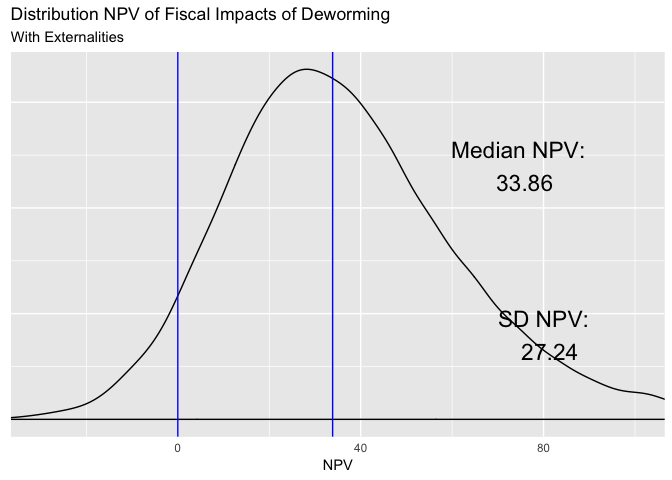

\def\blue{\color{blue}}


```r
options(tinytex.verbose = TRUE)
```


```r
# To do:
# 1 - Re-write w_t with w_0 outside.                DONE
# 2 - use app functions for sims in DD              DONE 
# 3 - run app based on DD                           DONE
# 4 - add starting values from script into app      DONE
# 5 - deploy                                        DONE
# - scale lambda 1 to infection rates
# - add small output after each section
# - ...

call_params_f <- function(){
    #############
    ##### Data  
    #############
    gov_bonds_so <- 	0.1185	     #Kenyan interest on sovereign debt - Central Bank of Kenya
    inflation_so <-  0.02          #Kenyan inflation rate - World Bank Development Indicators
    wage_ag_so <- 	11.84	         #Mean hourly wage rate (KSH) - Suri 2011
    wage_ww_so <- 	14.5850933     #Control group hourly wage, ww (cond >=10 hrs per week) - Table 4, Panel B
    profits_se_so <- 1766          #Control group monthly self-employed profits - Table 4, Panel A  FIX: MOST REFERENCES FROM TABLE 4 ARE TABLE 3
    hours_se_cond_so <- 38.1       #Control group weekly self-employed hours, conditional on hrs >0 - Table D13, Panel D
    hours_ag_so <- 8.3             #Control group hrs per week, agriculture - Table 4, Panel D
    hours_ww_so <- 6.9             #Control group hrs per week, working for wages - Table 4, Panel B
    hours_se_so <- 3.3             #Control group hrs per week, self-employment - Table 4, Panel A
    ex_rate_so <- 85               #Exchange Rate - Central Bank of Kenya
    growth_rate_so <- 1.52/100     #Per-capita GDP growth, 2002-2011 (accessed 1/29/13) -	World Bank - see notes
    coverage_so  <- 0.681333333    # (R) Fraction of treated primary school students within 6 km - from W@W - see note
    tax_so <- 0.16575              #ADD INFO!
    unit_cost_local_so <- 43.66    #Deworm the World
    years_of_treat_so <- 2.41      #Additional Years of Treatment - Table 1, Panel A
    #############
    ##### Research
    #############    
    lambda1_so <- c(3.49, 0)       #Hrs per week increase for men and women CONFIRM
    lambda2_so <- 10.2             #Externality effect (proportional) - Table 3, Panel B
    q_full_so <- 0.75              #Take up rates with full subsidy. From Miguel and Kremmer (2007)
    q_zero_so <- 0                 #Take up rates with zero subsidy. From Miguel and Kremmer (2007)
    delta_ed_so <- c(-0.00176350949079451, 0.00696052250263997, 0.0258570306763183,     # (Delta E) Additional direct seconday schooling increase (from Joan)
                        0.0239963665555466, 0.027301406306074, 0.0234125454594173,
                       0.0279278879439199, 0.00647044449446303, 0.00835739437790601)                                     
    delta_ed_so <- cbind(delta_ed_so, 1999:2007)
    delta_ed_ext_so <- c(-0.0110126908021048,	0.0140448546741008,	-0.0034636291545585,  #Additional externality secondary schooling increase (from Joan)
                           0.0112940214439477,	0.0571608179771775,	-0.0560546793186931,
                           0.0558284756343451,	0.1546264843901160,	0.0055961489945619)
    delta_ed_ext_so <- cbind(delta_ed_ext_so, 1999:2007)    
    include_ext_so <- TRUE
    
    #############
    ##### Guess work   
    #############
    periods_so <- 50               #Total number of periods to forecast wages
    time_to_jm_so <- 10            #Time from intial period until individual join the labor force
    coef_exp_so <- c(0, 0)         #Years of experience coefficients (1-linear, 2-cuadratic)	- see notes
    teach_sal_so <- 5041           #Yearly secondary schooling compensation	5041 - from ROI materials
    teach_ben_so <- 217.47         #Yearly secondary schooling teacher benefits	217.47
    n_students_so <- 45            #Average pupils per teacher	45
    return( sapply( ls(pattern= "_so\\b"), function(x) get(x)) ) 
}
invisible( list2env(call_params_f(),.GlobalEnv) )


#############
##### Notes:
#############
### Source ---->  Input ----> Model ----> Policy Estimates (output)
###  (_so)        (_in)       (_mo)        (_pe)
### values      functions   functions      values
###             & values    & values 
### arguments in functions should used "_var" and functions should "_f"

#invisible( list2env(call_params_f(),.GlobalEnv) )

# on growth_rate_so: (http://data.worldbank.org/indicator/NY.GDP.PCAP.KD/), see calculation on "Kenya GDP per capita" tab. In W@W this equals 1.52%. ISSUE: This growth number should be updated to be 2002-2014, I think.
# on coef_exp_so: 1998/1999 Kenyan labor force survey; regression of earnings on age, age^2, female dummy, indicators for attained primary/secondary/beyond, and province dummies. Estimate used in W@W: (0.1019575, -0.0010413). ISSUE: For now assume no further life cycle adjustment beyond KLPS-3 (likely a conservative assumption).
# coverage_so: Overall Saturation (0.511) / 0.75 - not reported in table, average of T & C
```


# Key policy estimates for policy makers  


# Methodology
 
The target parameter to reproduce corresponds to the NPV of deworming, including spillovers, and can be found in the file `Baird-etal-QJE-2016_fiscal-impact-calculations-UPDATED-KLPS-3_2018-01-04.xlsx`, sheet, `Calcs-Table 5`, cell `C51`. 

## Main Equation (the model)

\begin{equation}
NPV =  \sum_{\gamma} N_{\gamma} \left[
\tau \sum_{t=0}^{50} \left( \frac{1}{1 + r}\right)^{t} w_{t}
\left( \lambda_{1, \gamma} + \frac{p \lambda_{2, \gamma}}{R} \right) -
K \sum_{t=0}^{50} \left( \frac{1}{1 + r}\right)^{t} \Delta \overline{E}_{\gamma t}(S1,S2)
\right] - \left( S_{2}Q(S_{2}) - S_{1}Q(S_{1}) \right)
\label{eq:1}
\tag{1}
\end{equation}


```r
# add suffix _var to args 
# - inputs: tax_rev_init_mo, top_tax_base_in  
# - outputs: total_rev_pe 
# Gamma is used to index gender.
npv_mo_f <- function(n_male_var = 1/2, n_female_var = 1/2, 
                interest_r_var = interest_in,
                wage_var = wage_t_mo,
                lambda1_male_var = lambda1_so[1],
                lambda1_female_var = lambda1_so[2], 
                tax_var = tax_so,
                saturation_var = saturation_in,             
                coverage_var = coverage_so,
                cost_of_schooling_var = cost_per_student_in,
                delta_ed_male_var = delta_ed_so[,1],
                delta_ed_female_var = delta_ed_so[,1], 
                lambda2_male_var = lambda2_in[1],
                lambda2_female_var = lambda2_in[2],
                s1_var = 0, q1_var = 0, s2_var = s2_in, q2_var = q2_in,
                periods_var = periods_so) {
  ns <- c(n_male_var, n_female_var)
  lambda1s <- c(lambda1_male_var, lambda1_female_var)
  lambda2s <- c(lambda2_male_var, lambda2_female_var)
  index_t <- 0:periods_var
  delta_ed_s <- cbind(delta_ed_male_var, delta_ed_female_var) 
  delta_ed_s <- rbind(c(0,0), delta_ed_s, matrix(0,41, 2) )

  benef <- matrix(NA, 51,2)
  for (i in 1:2){
  benef[,i] <- ( 1 / (1 + interest_r_var) )^index_t * wage_var *
                     ( lambda1s[i] + saturation_var * lambda2s[i] / coverage_var )
  }

  res1 <- sum( ns * ( tax_var * apply(benef, 2, sum) -
            apply( ( 1 / (1 + interest_r_var) )^index_t *
                     delta_ed_s * cost_of_schooling_var, 2, sum) )
          ) - (s2_var * q2_var  - s1_var * q1_var)
#  wser()
  return(res1)   
}
```


## Sub components:

### 1 - "$r$"  

The real interest rate $r$ is obtained from the interest rate on betterment bonds (0.118) minus the inflation rate (0.02).


```r
# - inputs: gov_bonds_so, inflation_so
# - outputs: interest_in
interest_in_f <- function(gov_bonds_var = gov_bonds_so , inflation_var = inflation_so) {  
  interest_in = gov_bonds_var - inflation_var 
  return(list("interest_in" = interest_in))
}
invisible( list2env(interest_in_f(),.GlobalEnv) )
```

The resulting value is a $r$ = 9.85%

### 2 - "$w_{t}$"

\begin{equation}
NPV =  \sum_{\gamma} N_{\gamma} \left[
\tau \sum_{t=0}^{50}\left(  \frac{1}{1 + r}\right)^{t} \blue{ w_{t} }
\left( \lambda_{1, \gamma} + \frac{p \lambda_{2, \gamma}}{R} \right) -
K \sum_{t=0}^{50} \left( \frac{1}{1 + r}\right)^{t} \Delta \overline{E}_{\gamma t}(S1,S2)
\right] - \left( S_{2}Q(S_{2}) - S_{1}Q(S_{1}) \right)
\end{equation}


\begin{equation}
w_t =  \text{#weeks} \times w_0 (1 + g)^{Xp}(1 + \hat{\beta_1} Xp + \hat{\beta_2} Xp^2) \quad \text{for } t=10, \dots, 50
\end{equation}

individual in the data are assumed to enter the labor force 10 years after the (data) present day ($w_t = 0$ for $t<10$). Wage at time $t$ is the weekly starting wage in USD ($w_0$) that has a base growth rate equal to the per capita GDP growth ($g$) applied to however many years of work ($Xp$). In addition to this growth, the salaries are adjusted to represent a (concave) wage life cycle profile ($1 + \hat{\beta_1} Xp + \hat{\beta_2} Xp^2$).

#### 2.1 - "$w_0$"

\begin{equation}
w_t =  \text{#weeks} \times \blue{w_0} (1 + g)^{Xp}(1 + \hat{\beta_1} Xp + \hat{\beta_2} Xp^2)
\end{equation}

\begin{equation}
w_0 = \frac{1}{ex} \sum_{l \in \{ag, ww, se\}}w_{l}\alpha_{l} \\ \quad \text{with: } \alpha_{l}= \frac{ h_{l}}{h_{ag} + h_{ww} + h_{se}}  
\end{equation}

The initial wage in dollars ($w_{0}$) is a weighted average of wages for control group in agriculture, working wage, and self-employed sectors ($ag, ww, se$). The weights correspond to the average number of hours in each sector ($h_l$) relative to the sum of the average number of hours in each sector.

The wage in agriculture comes from research (Suri, 2011), the working wage comes from the data and its defined as  hourly wage for the control group for those who reported more than 10 hrs of work per week. The self-employed wage ($w_{se}$) was constructed as follows:

\begin{equation}
w_{se} =  \frac{ \text{Monthly self-employed profits} }{4.5 \times E[h_{se}|h_{se}>0] }
\end{equation}

Where both parameters (Monthly self-employed profits and self-employed hours for the control group, conditional on hrs >0 - $E[h_{se}|h_{se}>0]$ -) come from the data (ww paper).  The measure of hours in self employment used to compute wages is ($E[h_{se}|h_{se}>0]$) is different from the one is to compute the weights $\alpha_l$ above. The first one captures hours of work among those actively employed in the self-employed sector, and the second one captures the average hours of work in self-employed among all the population of workin age in the sample (hence capturing the relative inportance of the self employed sector in the economy)


```r
#inputs: wages (wage_ag_so, wage_ww_so) self employed income (profits_se_so, 
#  hours_se_cond_so) hours of work (hours_ag_so, hours_ww_so, hours_se_so), 
#  exchange rate (ex_rate_so), timing vars (periods_so, time_to_jm_so), 
#  growth rate (growth_rate_so), mincer coef (coef_exp_so[1], coef_exp_so[2])
#
#outputs: Starting wages: value (wage_0_mo) and function (wage_0_mo_f), Wage trayectory:
#  value (wage_t_mo) and function (wage_t_mo_f).
wages_f <- function(wage_ag_var_h1 = wage_ag_so,  
                     wage_ww_var_h1 = wage_ww_so,
                     profits_se_var_h1 = profits_se_so,
                     hours_se_cond_var_h1 = hours_se_cond_so,  
                     hours_ag_var_h1 = hours_ag_so,
                     hours_ww_var_h1 = hours_ww_so,
                     hours_se_var_h1 = hours_se_so,
                     ex_rate_var_h1 = ex_rate_so, 
                     periods_var_h1 = periods_so, 
                     time_to_jm_var_h1 = time_to_jm_so, 
                     growth_rate_var_h1 = growth_rate_so,
                     coef_exp1_var_h1 = coef_exp_so[1],
                     coef_exp2_var_h1 = coef_exp_so[2]){
################################################################################
################################################################################  

    experience_aux <- 0:periods_var_h1 - time_to_jm_var_h1

    #close to value from spreadsheet (Assumps&Panel A Calcs!B137 = 0.1481084),
    #but I suspect diff due to computational precision
    
    wage_0_mo_f <- function(wage_ag_var, wage_ww_var, profits_se_var, hours_se_cond_var, 
                            hours_ag_var, hours_ww_var, hours_se_var, ex_rate_var) {
      wage_se <- profits_se_var / (4.5 * hours_se_cond_var)
      wage_ls <- c(wage_ag_var, wage_ww_var, wage_se)
      alpha_ls <- c(hours_ag_var, hours_ww_var, hours_se_var) / sum( c(hours_ag_var, hours_ww_var, hours_se_var) )
      res1 <- 1/ex_rate_var * sum( wage_ls * alpha_ls )
      return(res1)
    }
    
    wage_t_mo_f <- function(wage_0_var,
                       growth_rate_var,
                       experience_var,
                       coef_exp1_var,
                       coef_exp2_var) {
      res1 <- 52 * wage_0_var *( ( 1 + growth_rate_var )^experience_var ) *
        ( 1 + coef_exp1_var * experience_var + coef_exp2_var * experience_var^2 ) *
        ifelse(0:periods_var_h1 >= time_to_jm_var_h1, 1, 0)
      return(res1)
    }
    
    wage_0_mo <- wage_0_mo_f(wage_ag_var = wage_ag_var_h1,  
                         wage_ww_var = wage_ww_var_h1,
                         profits_se_var = profits_se_var_h1,
                         hours_se_cond_var = hours_se_cond_var_h1,  
                         hours_ag_var = hours_ag_var_h1,
                         hours_ww_var = hours_ww_var_h1,
                         hours_se_var = hours_se_var_h1,
                         ex_rate_var = ex_rate_var_h1)  

    #close to value from spreadsheet (Calcs-Table 5!N21.. = 7.701634678),
    #but I suspect diff due to computational precision
    wage_t_mo <- wage_t_mo_f(wage_0_var = wage_0_mo,
                       growth_rate_var = growth_rate_var_h1,
                       experience_var = experience_aux,
                       coef_exp1_var = coef_exp1_var_h1,
                       coef_exp2_var = coef_exp2_var_h1)

################################################################################
################################################################################
    return(list("wage_0_mo_f" = wage_0_mo_f, "wage_0_mo" = wage_0_mo, 
                "wage_t_mo_f" = wage_t_mo_f, "wage_t_mo" = wage_t_mo))
}

invisible( list2env(wages_f(),.GlobalEnv) )
```

### 3 - "$\lambda_{1,\gamma}$"  and  "$\lambda_{2,\gamma}$"

\begin{equation}
NPV =  \sum_{\gamma} N_{\gamma} \left[
\tau \sum_{t=0}^{50}\left(  \frac{1}{1 + r}\right)^{t} w_{t}
\left(\blue{ \lambda_{1, \gamma} } + \frac{p \blue{\lambda_{2, \gamma}}}{R} \right) -
K \sum_{t=0}^{50} \left( \frac{1}{1 + r}\right)^{t} \Delta \overline{E}_{\gamma t}(S1,S2)
\right] - \left( S_{2}Q(S_{2}) - S_{1}Q(S_{1}) \right)
\end{equation}

$\lambda_{1,\gamma}$ represents the estimated impact of deworming on hours of work for men a women. This two parameter are combined with a underweighted mean:

\begin{equation}
\lambda_{1} = \frac{1}{2} \lambda_{1,male} + \frac{1}{2} \lambda_{1,female}
\end{equation}
Its components come from research (W\@W).

$\lambda_{2,\gamma}$ the estimated externality effect (EXPLAIN) and comes from research (W\@W). Note that this parameter in not estimated by gender, so we repeat its value two times.


```r
# - inputs: gov_bonds_so, inflation_so
# - outputs: interest_in
lambdas_in_f <- function(lambda1_var = lambda1_so, lambda2_var = lambda2_so){
    lambda1_in <- rep(0.5 * lambda1_var[1] + 0.5 *lambda1_var[2], 2)
    lambda2_in <- rep(lambda2_var, 2)
    return(list("lambda1_in" = lambda1_in, "lambda2_in" = lambda2_in))  
}

invisible( list2env(lambdas_in_f(),.GlobalEnv) )
```


### 4 - $R$ and $p$

\begin{equation}
NPV =  \sum_{\gamma} N_{\gamma} \left[
\tau \sum_{t=0}^{50}\left(  \frac{1}{1 + r}\right)^{t} w_{t}
\left( \lambda_{1, \gamma}  + \frac{\blue{p} \lambda_{2, \gamma}}{\blue{R}} \right) -
K \sum_{t=0}^{50} \left( \frac{1}{1 + r}\right)^{t} \Delta \overline{E}_{\gamma t}(S1,S2)
\right] - \left( S_{2}Q(S_{2}) - S_{1}Q(S_{1}) \right)
\end{equation}

The coverage, $R$, is defined as the fraction, among all neighboring schools (within 6 km), that belongs to the treatment group (last paragraph of page 9(1645) of paper). As the treatment was appplied to approximatedly two thirds of the population, $R$ is set to: $R  = 0.68$.  

The saturation of the intervention, $p$, measures the fraction of the population that is effectively usign the treatment and is defined as:  

\begin{equation}
p = R \times Q(full)  + (1 - R) \times Q(0)
\end{equation}

For this (or similar?) setting Miguel and Kremer 2007 [add page, table, col, row] estimate that there is almost no take-up without subsidy, hence $Q(0)$ is assinged the value of 0. The same article [add page, table, col, row] estimates that take-up with full subsidy is $Q(full) = 0.75$.


```r
# - inputs: coverage_so, q_full_so, q_zero_so 
# - outputs: saturation_in 
saturation_in_f <- function(coverage_var = coverage_so, q_full_var = q_full_so, q_zero_var = q_zero_so){
    saturation_in <- coverage_so * q_full_so + ( 1 - coverage_so ) * q_zero_so
    return(list("saturation_in" = saturation_in)) 
} 
invisible( list2env(saturation_in_f(),.GlobalEnv) )
```


### 5 - $K$ and $\Delta \overline{E}_{\gamma t}(S1,S2)$ 

\begin{equation}
NPV =  \sum_{\gamma} N_{\gamma} \left[
\tau \sum_{t=0}^{50}\left(  \frac{1}{1 + r}\right)^{t} w_{t}
\left( \lambda_{1, \gamma}  + \frac{p \lambda_{2, \gamma}}{R} \right) -
\blue{K} \sum_{t=0}^{50} \left( \frac{1}{1 + r}\right)^{t} \blue{ \Delta \overline{E}_{\gamma t}(S1,S2) }
\right] - \left( S_{2}Q(S_{2}) - S_{1}Q(S_{1}) \right)
\end{equation}

$K$ represents the cost per student. This is calculated as the salary of the teacher plus benefits, divided by the average number of students per teacher.

\begin{equation}
K = \frac{\text{teacher salary} + \text{teacher benefits}}{\text{# Students}}
\end{equation}

For $\Delta \overline{E}_{\gamma t}(S1,S2)$ we use a series of estimated effects the additional direct increase in secondary schooling from 1999 to 2007 obtained from [need to define the source "from Joan" in `Assumps&Panel A Calcs!A93`].

This series does not take into account the externality effects. To incorporate the we need another series (same source) that estimates the additional secondary schooling increase due to the externality and add it to the original series.


```r
include_ext_mo <- TRUE
# - inputs: coverage_so, q_full_so, q_zero_so 
# - outputs: saturation_in 
ed_costs_in_f <- function(teach_sal_var = teach_sal_so, teach_ben_var = teach_ben_so, 
                          n_students_var = n_students_so, delta_ed_ext_var = delta_ed_ext_so,
                          delta_ed_var = delta_ed_so, include_ext_var = include_ext_mo){
    
    cost_per_student_in <- (teach_sal_var + teach_ben_var) / n_students_var
    
    # Nothing here yet with delta_ed_vals, but would like to incorporate model from Joan
    delta_ed_ext_total_in <- delta_ed_ext_var[,1] + delta_ed_var[,1]
    
    if (include_ext_var == TRUE){
      delta_ed_final_in <-  delta_ed_ext_total_in
    }else{
      delta_ed_final_in <- delta_ed_var[,1]
    }
    return(list("cost_per_student_in" = cost_per_student_in, "delta_ed_final_in" = 
                  delta_ed_final_in,  "delta_ed_ext_total_in" = delta_ed_ext_total_in)) 
} 
invisible( list2env(ed_costs_in_f(),.GlobalEnv) )
```

**Note:** need to understand better the date of each component (of the model, not only this section).

### 6 - $\left( S_{2}Q(S_{2}) - S_{1}Q(S_{1}) \right)$

\begin{equation}
NPV =  \sum_{\gamma} N_{\gamma} \left[
\tau \sum_{t=0}^{50}\left(  \frac{1}{1 + r}\right)^{t} w_{t}
\left( \lambda_{1, \gamma}  + \frac{p \lambda_{2, \gamma}}{R} \right) -
K \sum_{t=0}^{50} \left( \frac{1}{1 + r}\right)^{t} \Delta \overline{E}_{\gamma t}(S1,S2)
\right] - \blue{ \left( S_{2}Q(S_{2}) - S_{1}Q(S_{1}) \right) }
\end{equation}

#### 6.1 - $S_{1}Q(S_{1}) = 0$
There is no subsidy for deworming under the status quo.   


#### 6.2 - $S_{2}$: complete subsidy to per capita costs of deworming.

With complete subsidy, $S_2$ represents the total direct costs of deworming in USD. Calculated as follows

\begin{equation}
S_{2} = \frac{\text{Cost per person per year (KSH)}	}{ex}\times \text{Additional years of treatment} \\
\end{equation}

#### 6.3 - $Q_{2}$
The take-up with full subsidy ($Q_2$) comes from a previous study (Miguel and Kremer 2007) and takes the value of 0.75.


```r
# - inputs: 
# - outputs: 
costs_f <- function(unit_cost_local_var = unit_cost_local_so, ex_rate_var = ex_rate_so,
                    years_of_treat_var = years_of_treat_so, q_full_var = q_full_so){
    s2_in <- ( unit_cost_local_var / ex_rate_var ) * years_of_treat_var
    q2_in <- q_full_var
    return(list("s2_in" = s2_in, "q2_in" = q2_in)) 
} 
invisible( list2env(costs_f(),.GlobalEnv) )
```

# Main results


```r
#no externality NPV
res_npv_no_ext_pe <- npv_mo_f(lambda2_male_var = 0, lambda2_female_var = 0)

#yes externality NPV
res_npv_yes_ext_pe <- npv_mo_f(delta_ed_male_var = delta_ed_ext_total_in,
                       delta_ed_female_var = delta_ed_ext_total_in )
```


- **NPV without externalities ($\lambda_2 = 0$):** -0.6097    

- **NPV with externalities ($\lambda_2 = 10.2$ ):** 34.3187


```r
rm(list = ls()[!(ls() %in% ls(pattern = "_f\\b"))])
invisible( list2env(call_params_f(), .GlobalEnv) )

# Copy and paste code for MC simulation in DD
# Copy and paste code in app. 
# 
# Think of long term solution to this problem
# 
invisible( list2env(interest_in_f(),.GlobalEnv) )
invisible( list2env(wages_f(),.GlobalEnv) )
invisible( list2env(lambdas_in_f(),.GlobalEnv) )
invisible( list2env(saturation_in_f(),.GlobalEnv) )
invisible( list2env(ed_costs_in_f(include_ext_var = TRUE),.GlobalEnv) )
invisible( list2env(costs_f(),.GlobalEnv) )

#npv_mo_f(lambda2_male_var = 0, lambda2_female_var = 0)

#npv_mo_f(delta_ed_male_var = delta_ed_ext_total_in,
#                       delta_ed_female_var = delta_ed_ext_total_in )

#re-write above without list2env(). Just use lists
```

# Montecarlo simulations  

```r
##### Simulate original parameters
rm(list = ls()[!(ls() %in% ls(pattern = "call_params_f()"))])
invisible( list2env(call_params_f(), .GlobalEnv) )


npv_mo_f <- function(n_male_var = 1/2, n_female_var = 1/2, 
                interest_r_var = interest_in,
                wage_var = wage_t_mo,
                lambda1_male_var = lambda1_so[1],
                lambda1_female_var = lambda1_so[2], 
                tax_var = tax_so,
                saturation_var = saturation_in,             
                coverage_var = coverage_so,
                cost_of_schooling_var = cost_per_student_in,
                delta_ed_male_var = delta_ed_so[,1],
                delta_ed_female_var = delta_ed_so[,1], 
                lambda2_male_var = lambda2_in[1],
                lambda2_female_var = lambda2_in[2],
                s1_var = 0, q1_var = 0, s2_var = s2_in, q2_var = q2_in,
                periods_var = periods_so) {
  ns <- c(n_male_var, n_female_var)
  lambda1s <- c(lambda1_male_var, lambda1_female_var)
  lambda2s <- c(lambda2_male_var, lambda2_female_var)
  index_t <- 0:periods_var
  delta_ed_s <- cbind(delta_ed_male_var, delta_ed_female_var) 
  delta_ed_s <- rbind(c(0,0), delta_ed_s, matrix(0,41, 2) )

  benef <- matrix(NA, 51,2)
  for (i in 1:2){
  benef[,i] <- ( 1 / (1 + interest_r_var) )^index_t * wage_var *
                     ( lambda1s[i] + saturation_var * lambda2s[i] / coverage_var )
  }

  res1 <- sum( ns * ( tax_var * apply(benef, 2, sum) -
            apply( ( 1 / (1 + interest_r_var) )^index_t *
                     delta_ed_s * cost_of_schooling_var, 2, sum) )
          ) - (s2_var * q2_var  - s1_var * q1_var)
#  wser()
  return(res1)   
}

wage_0_mo_f <- function(wage_ag_var, wage_ww_var, profits_se_var, hours_se_cond_var, 
                        hours_ag_var, hours_ww_var, hours_se_var, ex_rate_var) {
  wage_se <- profits_se_var / (4.5 * hours_se_cond_var)
  wage_ls <- c(wage_ag_var, wage_ww_var, wage_se)
  alpha_ls <- c(hours_ag_var, hours_ww_var, hours_se_var) / sum( c(hours_ag_var, hours_ww_var, hours_se_var) )
  res1 <- 1/ex_rate_var * sum( wage_ls * alpha_ls )
  return(res1)
}

wage_t_mo_f <- function(wage_0_var, growth_rate_var, experience_var, 
                        coef_exp1_var, coef_exp2_var) {
  res1 <- 52 * wage_0_var *( ( 1 + growth_rate_var )^experience_var ) *
    ( 1 + coef_exp1_var * experience_var + coef_exp2_var * experience_var^2 ) *
    ifelse(0:periods_so >= time_to_jm_so, 1, 0)
  return(res1)
}
set.seed(1234)
nsims <- 1e4
include_ext_mo <- TRUE

#Defaoult dist: normal, default sd: 0.1* mean
## Data 
gov_bonds_sim <-        rnorm(n = nsims, mean = gov_bonds_so, sd = 0.1 * gov_bonds_so)	
inflation_sim <-        rnorm(nsims, inflation_so, 0.1 * inflation_so)
wage_ag_sim <-          rnorm(nsims, wage_ag_so, 0.1 * wage_ag_so)
wage_ww_sim <-          rnorm(nsims, wage_ww_so, 0.1 * wage_ww_so)
profits_se_sim <-       rnorm(nsims, profits_se_so, 0.1 * profits_se_so)
hours_se_cond_sim <-    rnorm(nsims, hours_se_cond_so, 0.1 * hours_se_cond_so)
hours_ag_sim <-         rnorm(nsims, hours_ag_so, 0.1 * hours_ag_so)
hours_ww_sim <-         rnorm(nsims, hours_ww_so, 0.1 * hours_ww_so)
hours_se_sim <-         rnorm(nsims, hours_se_so, 0.1 * hours_se_so)
ex_rate_sim <-          rnorm(nsims, ex_rate_so, 0.1 * ex_rate_so)
growth_rate_sim <-      rnorm(nsims, growth_rate_so, 0.1 * growth_rate_so)
coverage_sim <-         rnorm(nsims, coverage_so, 0.1 * coverage_so)
tax_sim <-              rnorm(nsims, tax_so, 0.1 * tax_so)
unit_cost_local_sim <-  rnorm(nsims, unit_cost_local_so, 0.1 * unit_cost_local_so)
years_of_treat_sim <-   rnorm(nsims, years_of_treat_so, 0.1 * years_of_treat_so)

## Research
aux1 <- 0.1 * c(lambda1_so[1], 0.01)
# Each list is a pair mean, sd. 
aux2 <- lapply(1:2,function(x) c(lambda1_so[x], aux1[x] ) )
lambda1_sim <- sapply(aux2, function(x)  rnorm(nsims, mean = x[1], sd = x[2]) ) 
lambda2_sim <-          rnorm(nsims, lambda2_so,  0.1 * lambda2_so)
q_full_sim <-           rnorm(nsims, q_full_so, 0.1 * q_full_so)
q_zero_sim <-           rnorm(nsims, q_zero_so, 0.1 * q_zero_so)

## Guess work
periods_val <- 50           #Total number of periods to forecast wages
time_to_jm_val <- 10        #Time from intial period until individual join the labor force
aux2 <- lapply(1:2, function(x) c(coef_exp_so[x],c(0.001 , 0.001)[x]) )
coef_exp_sim <- sapply(aux2, function(x)  rnorm(nsims, mean = x[1], sd = x[2]) )     
teach_sal_sim <-    rnorm(nsims, teach_sal_so, 0.1 * teach_sal_so)
teach_ben_sim <-    rnorm(nsims, teach_ben_so, 0.1 * teach_ben_so)
n_students_sim <-   rnorm(nsims, n_students_so, 0.1 * n_students_so)

delta_ed_sim <- sapply(delta_ed_so[,1], function(x) rnorm(nsims, mean = 
                                                                  x * 1, 
                                                                  sd = 1 * sd(delta_ed_so[,1]) ) )
colnames(delta_ed_sim) <- 1999:2007

delta_ed_ext_sim <- sapply(delta_ed_ext_so[,1], function(x)  rnorm(nsims, mean = 
                                                                            x * 1, 
                                                                          sd = 1 * sd(delta_ed_ext_so[,1])))
colnames(delta_ed_ext_sim) <- 1999:2007

########
npv_sim <- rep(NA, nsims)

#to loop over: 
for (i in 1:nsims) {

#1 - r
interest_in <- gov_bonds_sim[i] - inflation_sim[i]
#2 - w
experience_aux <- 0:periods_so - time_to_jm_so

wage_0_mo <- wage_0_mo_f(wage_ag_var = wage_ag_sim[i],  
                     wage_ww_var = wage_ww_sim[i],
                     profits_se_var = profits_se_sim[i],
                     hours_se_cond_var = hours_se_cond_sim[i],  
                     hours_ag_var = hours_ag_sim[i],
                     hours_ww_var = hours_ww_sim[i],
                     hours_se_var = hours_se_sim[i],
                     ex_rate_var = ex_rate_sim[i])  

#close to value from spreadsheet (Calcs-Table 5!N21.. = 7.701634678),
#but I suspect diff due to computational precision
wage_t_mo <- wage_t_mo_f(wage_0_var = wage_0_mo,
                   growth_rate_var = growth_rate_sim[i],
                   experience_var = experience_aux,
                   coef_exp1_var = coef_exp_sim[i,1],
                   coef_exp2_var = coef_exp_sim[i,2])

#3 - lambda
lambda1_in <- rep(0.5 * lambda1_sim[i,1] + 0.5 *lambda1_sim[i,2], 2)
lambda2_in <- rep(lambda2_sim[i], 2)

#4 - R and p
saturation_in <- coverage_sim[i] * q_full_sim[i] + ( 1 - coverage_sim[i] ) * q_zero_sim[i]

#5 - K and ΔE⎯⎯⎯⎯γt(S1,S2)
cost_per_student_in <- (teach_sal_sim[i] + teach_ben_sim[i]) / n_students_sim[i]

# Nothing here yet with delta_ed_vals, but would like to incorporate model from Joan
delta_ed_ext_total_in <- delta_ed_ext_sim[i,] + delta_ed_sim[i,]

if (include_ext_mo == TRUE){
  delta_ed_final_in <-  delta_ed_ext_total_in
}else{
  delta_ed_final_in <- delta_ed_var[i,]
}

#6 - (S2Q(S2)−S1Q(S1))
s2_in <- ( unit_cost_local_sim[i] / ex_rate_sim[i] ) * years_of_treat_sim[i]
q2_in <- q_full_sim[i]

npv_sim[i] <- npv_mo_f(n_male_var = 1/2, n_female_var = 1/2, 
                interest_r_var = interest_in,
                wage_var = wage_t_mo,
                lambda1_male_var = lambda1_in[1],
                lambda1_female_var = lambda1_in[2], 
                tax_var = tax_sim[i],
                saturation_var = saturation_in,             
                coverage_var = coverage_sim[i],
                cost_of_schooling_var = cost_per_student_in,
                delta_ed_male_var = delta_ed_final_in,
                delta_ed_female_var = delta_ed_final_in, 
                lambda2_male_var = lambda2_in[1],
                lambda2_female_var = lambda2_in[2],
                s1_var = 0, q1_var = 0, s2_var = s2_in, q2_var = q2_in,
                periods_var = periods_so)
##################

}


########
# ANALYSE OUTPUT

# unit test
if (abs(sd(npv_sim) - 27.23765)>0.0001 ) {
  print("Output has change")
}

npv_for_text <- paste("Median NPV:\n ", round(median(npv_sim), 2))
npv_for_text2 <- paste("SD NPV:\n ", round(sd(npv_sim), 2))

ggplot() +
  geom_density(aes(x = npv_sim,
                   alpha = 1/2), kernel = "gau") +
  geom_vline(xintercept = c(0, median(npv_sim)), col="blue") +
  coord_cartesian(xlim = c(-30,100)) +
  guides(alpha = "none", colour="none") +
  labs(y = NULL,
       x = "NPV" ,
       title = "Distribution NPV of Fiscal Impacts of Deworming",
       subtitle = "With Externalities")+
  annotate("text", x = 2.2 * median(npv_sim), y = 0.012, label = npv_for_text, size = 6)+
  annotate("text", x = 80, y = 0.004, label = npv_for_text2, size = 6)+
  theme(axis.ticks = element_blank(), axis.text.y = element_blank())
```

<!-- -->


```r
sim.data1 <- function(nsims = 1e4, 
                      gov_bonds_vari,                #Data
                      gov_bonds_sd,
                      inflation_vari,
                      inflation_sd,
                      wage_ag_vari,
                      wage_ag_sd,
                      wage_ww_vari,
                      wage_ww_sd,
                      profits_se_vari,
                      profits_se_sd,
                      hours_se_cond_vari,
                      hours_se_cond_sd,
                      hours_ag_vari, 
                      hours_ag_sd,
                      hours_ww_vari,
                      hours_ww_sd,
                      hours_se_vari,
                      hours_se_sd,
                      ex_rate_vari,
                      ex_rate_sd,
                      growth_rate_vari, 
                      growth_rate_sd, 
                      coverage_vari,
                      coverage_sd,
                      full_saturation_vari, 
                      full_saturation_sd, 
                      saturation_vari,
                      saturation_sd,
                      tax_vari, 
                      tax_sd, 
                      unit_cost_local_vari, 
                      unit_cost_local_sd, 
                      years_of_treat_vari,
                      years_of_treat_sd,
                      lambda1_vari,                   #Research
                      lambda1_sd, 
                      lambda2_vari,
                      lambda2_sd,
                      q_full_vari, 
                      q_full_sd,
                      q_zero_vari,
                      q_zero_sd,
                      delta_ed_par1,
                      delta_ed_sd1,
                      delta_ed_par2,
                      delta_ed_sd2,
                      coef_exp_vari,                  #Guesswork
                      coef_exp_sd,
                      teach_sal_vari,
                      teach_sal_sd,
                      teach_ben_vari,
                      teach_ben_sd,
                      n_students_vari,
                      n_students_sd, 
                      include_ext_vari=TRUE
    ) {
      set.seed(1234)
      #Defaoult dist: normal, default sd: 0.1* mean
      ## Data 
      gov_bonds_sim <- rnorm(n = nsims, mean = gov_bonds_vari, sd = gov_bonds_sd)	
      inflation_sim <- rnorm(nsims, inflation_vari, inflation_sd)
      wage_ag_sim <- rnorm(nsims, wage_ag_vari, wage_ag_sd)
      wage_ww_sim <- rnorm(nsims, wage_ww_vari, wage_ww_sd)
      profits_se_sim <- rnorm(nsims, profits_se_vari, profits_se_sd)
      hours_se_cond_sim <- rnorm(nsims, hours_se_cond_vari, hours_se_cond_sd)
      hours_ag_sim <- rnorm(nsims, hours_ag_vari, hours_ag_sd)
      hours_ww_sim <- rnorm(nsims, hours_ww_vari, hours_ww_sd)
      hours_se_sim <- rnorm(nsims, hours_se_vari, hours_se_sd)
      ex_rate_sim <- rnorm(nsims, ex_rate_vari, ex_rate_sd)
      growth_rate_sim <- rnorm(nsims, growth_rate_vari, growth_rate_sd)
      coverage_sim <- rnorm(nsims, coverage_vari, coverage_sd)
      saturation_sim <- rnorm(nsims, saturation_vari, saturation_sd)
      full_saturation_sim <- rnorm(nsims, full_saturation_vari, full_saturation_sd) ###Check here later
      tax_sim <- rnorm(nsims, tax_vari, tax_sd)
      unit_cost_local_sim <- rnorm(nsims, unit_cost_local_vari, unit_cost_local_sd)
      years_of_treat_sim <- rnorm(nsims, years_of_treat_vari, years_of_treat_sd)
      
      ## Research
      aux1 <- lapply(1:2,function(x) c(lambda1_vari[x],lambda1_sd[x]) )
      lambda1_sim <- sapply(aux1, function(x)  rnorm(nsims, mean = x[1], sd = x[2]) ) 
      lambda2_sim <- rnorm(nsims, lambda2_vari, lambda2_sd)
      q_full_sim <- rnorm(nsims, q_full_vari, q_full_sd)
      q_zero_sim <- rnorm(nsims, q_zero_vari, q_zero_sd)
      
      ## Guess work
      periods_val <- 50           #Total number of periods to forecast wages
      time_to_jm_val <- 10        #Time from intial period until individual join the labor force
      aux2 <- lapply(1:2,function(x) c(coef_exp_vari[x],coef_exp_sd[x]) )
      coef_exp_val_sim <- sapply(aux2, function(x)  rnorm(nsims, mean = x[1], sd = x[2]) )     
      teach_sal_val_sim <- rnorm(nsims, teach_sal_vari, teach_sal_sd)
      teach_ben_val_sim <- rnorm(nsims, teach_ben_vari, teach_ben_sd)
      n_students_val_sim <- rnorm(nsims, n_students_vari, n_students_sd)
      
      delta_ed_vals_sim <- sapply(delta_ed_so[,1], function(x)  rnorm(nsims, mean = 
                                                                          x * delta_ed_par1, 
                                                                        sd = delta_ed_sd1 * sd(delta_ed_so[,1]) ) )
      colnames(delta_ed_vals_sim) <- 1999:2007
      
      delta_ed_ext_vals_sim <- sapply(delta_ed_ext_so[,1], function(x)  rnorm(nsims, mean = 
                                                                                  x * delta_ed_par2, 
                                                                                sd = delta_ed_sd2 * sd(delta_ed_ext_so[,1])))
      colnames(delta_ed_ext_vals_sim) <- 1999:2007
      
      track_env_var <- .GlobalEnv

      npv_sim <- rep(NA, nsims)
      #yes externality NPV
      for (i in 1:nsims) {
          # 1 - "r""
          invisible( list2env( interest_in_f(gov_bonds_sim[i], inflation_sim[i]), envir = track_env_var ) )
          # 2 - "w_t"
          invisible( list2env( wages_f(wage_ag_var_h1 = wage_ag_sim[i],
                                 wage_ww_var_h = wage_ww_sim[i],
                                 profits_se_var_h = profits_se_sim[i],
                                 hours_se_cond_var_h = hours_se_cond_sim[i],
                                 hours_ag_var_h = hours_ag_sim[i],
                                 hours_ww_var_h = hours_ww_sim[i],
                                 hours_se_var_h = hours_se_sim[i],
                                 ex_rate_var_h = ex_rate_sim[i], 
                                 periods_var_h1 = periods_so,
                                 time_to_jm_var_h1 = time_to_jm_so, 
                                 growth_rate_var_h1 = growth_rate_sim[i],
                                 experience_var_h1 = experience_temp,
                                 coef_exp1_var_h1 = coef_exp_sim[i,1],
                                 coef_exp2_var_h1 = coef_exp_sim[i,2]), envir = track_env_var ) )
          # 3 - “λ1,γ” and “λ2,γ”
          invisible( list2env( lambdas_in_f(lambda1_var = lambda1_sim[i,], lambda2_var = lambda2_sim[i,]), envir = track_env_var) ) 
          # 4 - R and p
          invisible( list2env(saturation_in_f(coverage_var = coverage_sim[i], q_full_var = q_full_sim[i], 
                                              q_zero_var = q_zero_sim[i]), envir = track_env_var ) )
          # 5 - K and ΔE⎯⎯⎯⎯γt(S1,S2)
          invisible( list2env(ed_costs_in_f(teach_sal_var = teach_sal_sim[i], teach_ben_var = teach_ben_sim[i], 
                                            n_students_var = n_students_sim[i], delta_ed_ext_var = cbind(delta_ed_ext_sim[i,], 1), 
                                            delta_ed_var = cbind(delta_ed_sim[i,],1), include_ext_var = TRUE), envir = track_env_var) )
           #6 - (S2Q(S2)−S1Q(S1))
          invisible( list2env(costs_f(unit_cost_local_var = unit_cost_local_sim[i], ex_rate_var = ex_rate_sim[i], 
                                      years_of_treat_var = years_of_treat_sim[i], q_full_var = q_full_sim[i]), envir = track_env_var ) )
          
          npv_sim[i] <- npv_mo_f(n_male_var = 1/2, n_female_var = 1/2, 
                          interest_r_var = interest_in,
                          wage_var = wage_t_mo,
                          lambda1_male_var = lambda1_in[1],
                          lambda1_female_var = lambda1_in[2], 
                          tax_var = tax_sim[i],
                          saturation_var = saturation_in,             
                          coverage_var = coverage_sim[i],
                          cost_of_schooling_var = cost_per_student_in,
                          delta_ed_male_var = delta_ed_sim[i,],
                          delta_ed_female_var = delta_ed_sim[i,], 
                          lambda2_male_var = lambda2_in[1],
                          lambda2_female_var = lambda2_in[2],
                          s1_var = 0, q1_var = 0, s2_var = s2_in, q2_var = q2_in,
                          periods_var = periods_so)
      }
      return(npv_sim)
    }


sim.data1(nsims = 1e3, 
          gov_bonds_vari = gov_bonds_so, 
          gov_bonds_sd = 0.1 * gov_bonds_so,
          inflation_vari = inflation_so,
          inflation_sd = 0.1 * inflation_so,
          wage_ag_vari = wage_ag_so,
          wage_ag_sd = 0.1 * wage_ag_so,
          wage_ww_vari = wage_ww_so,
          wage_ww_sd = 0.1 * wage_ww_so,
          profits_se_vari = profits_se_so, 
          profits_se_sd = 0.1 * profits_se_so, 
          hours_se_cond_vari = hours_se_cond_so, 
          hours_se_cond_sd = 0.1 * hours_se_cond_so, 
          hours_ag_vari = hours_ag_so, 
          hours_ag_sd = 0.1 * hours_ag_so, 
          hours_ww_vari = hours_ww_so,
          hours_ww_sd = 0.1 * hours_ww_so,
          hours_se_vari = hours_se_so,
          hours_se_sd = 0.1 * hours_se_so,
          ex_rate_vari = ex_rate_so,
          ex_rate_sd = 0.1 * ex_rate_so,
          growth_rate_vari = growth_rate_so,
          growth_rate_sd = 0.1 * growth_rate_so,
          coverage_vari = coverage_so,
          coverage_sd = 0.1 * coverage_so,
          saturation_vari = 1,
          saturation_sd = 1,
          tax_vari = tax_so, 
          tax_sd = 0.1 * tax_so, 
          unit_cost_local_vari = unit_cost_local_so, 
          unit_cost_local_sd = 0.1 * unit_cost_local_so, 
          years_of_treat_vari = years_of_treat_so,
          years_of_treat_sd = 0.1 * years_of_treat_so,
          lambda1_vari = lambda1_so,
          lambda1_sd = 0.1 * c(lambda1_so[1], 0.01),
          lambda2_vari = lambda2_so, 
          lambda2_sd = 0.1 * lambda2_so, 
          q_full_vari = q_full_so, 
          q_full_sd = 0.1 * q_full_so, 
          q_zero_vari = q_zero_so, 
          q_zero_sd = 0.1 * q_zero_so, 
          coef_exp_vari = coef_exp_so, 
          coef_exp_sd = c(0.001 , 0.001), 
          teach_sal_vari = teach_sal_so,
          teach_sal_sd = 0.1 * teach_sal_so,
          teach_ben_vari = teach_ben_so,
          teach_ben_sd = 0.1 * teach_ben_so,
          n_students_vari = n_students_so, 
          n_students_sd = 0.1 * n_students_so, 
          include_ext_vari = TRUE, 
          full_saturation_vari = full_saturation_so,
          full_saturation_sd = 0.1 * full_saturation_so,
          delta_ed_par1 = 1,
          delta_ed_sd1 = 1,
          delta_ed_par2 = 1,
          delta_ed_sd2 = 1
) 
 
 


# run the model 
#  input: Input vectors for NPV function
#  output: one vector of NPVs (of lenght Nsims)
# Repeat Nsims times
#  input: all functions from above + NSims
#  output: vector of Results of length NSims

# TO DO: fix negative wage trends do to high negative term in the square of experience. 

#  generate 1 draw of primitive values:
#  inputs: K primitive means and K standard deviations
#  output: K values with one from simulations

# asd <- one_draw()
# Takes each element of list and assings it an object with the same name
# list2env(asd,.GlobalEnv)
# compute the elements of the model
#  input: K vectors with draws from sims
#  output: Input vectors for NPV functions
```


```r
# -0.6096942
sims_f <- function(..., n_sims_var = 10) {
track_env_var <- .GlobalEnv

    npv_sim <- rep(NA, n_sims_var)
    for (i in 1:n_sims_var) {
    #if (i>=2) {rm(ls(pattern = "_sim\\b"))}
    #rm(list = ls()[!(ls() %in% (ls(pattern = "_so\\b") )])
    invisible( list2env(onedraw_sim_f(...), envir = track_env_var ) )
    # 1 - "r""
    invisible( list2env( interest_in_f(gov_bonds_sim, inflation_sim), envir = track_env_var ) )
    # 2 - "w_t"
    invisible( list2env( wages_f(wage_ag_var_h1 = wage_ag_sim,
                           wage_ww_var_h = wage_ww_sim,
                           profits_se_var_h = profits_se_sim,
                           hours_se_cond_var_h = hours_se_cond_sim,
                           hours_ag_var_h = hours_ag_sim,
                           hours_ww_var_h = hours_ww_sim,
                           hours_se_var_h = hours_se_sim,
                           ex_rate_var_h = ex_rate_sim, 
                           periods_var_h1 = periods_so,
                           time_to_jm_var_h1 = time_to_jm_so, 
                           growth_rate_var_h1 = growth_rate_sim,
                           experience_var_h1 = experience_temp,
                           coef_exp1_var_h1 = coef_exp_sim[1],
                           coef_exp2_var_h1 = coef_exp_sim[2]), envir = track_env_var ) )
    # 3 - “λ1,γ” and “λ2,γ”
    invisible( list2env( lambdas_in_f(lambda1_var = lambda1_sim, lambda2_var = lambda2_sim), envir = track_env_var) ) 
    # 4 - R and p
    invisible( list2env(saturation_in_f(coverage_var = coverage_sim, q_full_var = q_full_sim, 
                                        q_zero_var = q_zero_sim), envir = track_env_var ) )
    # 5 - K and ΔE⎯⎯⎯⎯γt(S1,S2)
    invisible( list2env(ed_costs_in_f(teach_sal_var = teach_sal_sim, teach_ben_var = teach_ben_sim, 
                                      n_students_var = n_students_sim, delta_ed_ext_var = cbind(delta_ed_ext_sim, 1), 
                                      delta_ed_var = cbind(delta_ed_sim,1), include_ext_var = TRUE), envir = track_env_var) )
     #6 - (S2Q(S2)−S1Q(S1))
    invisible( list2env(costs_f(unit_cost_local_var = unit_cost_local_sim, ex_rate_var = ex_rate_sim, 
                                years_of_treat_var = years_of_treat_sim, q_full_var = q_full_sim), envir = track_env_var ) )
    
    npv_sim[i] <- npv_mo_f(n_male_var = 1/2, n_female_var = 1/2, 
                    interest_r_var = interest_in,
                    wage_var = wage_t_mo,
                    lambda1_male_var = lambda1_in[1],
                    lambda1_female_var = lambda1_in[2], 
                    tax_var = tax_sim,
                    saturation_var = saturation_in,             
                    coverage_var = coverage_sim,
                    cost_of_schooling_var = cost_per_student_in,
                    delta_ed_male_var = delta_ed_sim,
                    delta_ed_female_var = delta_ed_sim, 
                    lambda2_male_var = lambda2_in[1],
                    lambda2_female_var = lambda2_in[2],
                    s1_var = 0, q1_var = 0, s2_var = s2_in, q2_var = q2_in,
                    periods_var = periods_so)
    #if (npv_sim[i]<0) {browser()}
    }
    return(npv_sim)
}
```


```r
rm(list = ls()[!(ls() %in% ls(pattern = "_f\\b") )])

set.seed(142857)

invisible( list2env(call_params_f(), .GlobalEnv) )

track_env <- environment()


npv_sim <- sims_f(n_sims_var = 1e4)

########
# ANALYSE OUTPUT

# unit test
if (abs(sd(npv_sim) - 28.38155)>0.0001 ) {
  print("Output has change")
}

npv_for_text <- paste("Median NPV:\n ", round(median(npv_sim), 2))
npv_for_text2 <- paste("SD NPV:\n ", round(sd(npv_sim), 2))

ggplot() +
  geom_density(aes(x = npv_sim,
                   alpha = 1/2), kernel = "gau") +
  geom_vline(xintercept = c(0, median(npv_sim)), col="blue") +
  coord_cartesian(xlim = c(-30,100)) +
  guides(alpha = "none", colour="none") +
  labs(y = NULL,
       x = "NPV" ,
       title = "Distribution NPV of Fiscal Impacts of Deworming",
       subtitle = "With Externalities")+
  annotate("text", x = 2.2 * median(npv_sim), y = 0.012, label = npv_for_text, size = 6)+
  annotate("text", x = 80, y = 0.004, label = npv_for_text2, size = 6)+
  theme(axis.ticks = element_blank(), axis.text.y = element_blank())
```


```r
rm(list = ls()[!(ls() %in% ls(pattern = "_f\\b") )])


list2env(call_params_f(), .GlobalEnv)

    #rm(list = ls(pattern= "_so\\b") )
 
    #invisible( list2env(onedraw_sim_f(), .GlobalEnv ) )
    # 1 - "r""
    invisible( list2env( interest_in_f(gov_bonds_so, inflation_so), .GlobalEnv ) )
    # 2 - "w_t"
    invisible( list2env( wages_f(wage_ag_var_h1 = wage_ag_so,
                           wage_ww_var_h = wage_ww_so,
                           profits_se_var_h = profits_se_so,
                           hours_se_cond_var_h = hours_se_cond_so,
                           hours_ag_var_h = hours_ag_so,
                           hours_ww_var_h = hours_ww_so,
                           hours_se_var_h = hours_se_so,
                           ex_rate_var_h = ex_rate_so, 
                           periods_var_h1 = periods_so,
                           time_to_jm_var_h1 = time_to_jm_so, 
                           growth_rate_var_h1 = growth_rate_so,
                           experience_var_h1 = experience_temp,
                           coef_exp1_var_h1 = coef_exp_so[1],
                           coef_exp2_var_h1 = coef_exp_so[2]), .GlobalEnv ) )
    # 3 - “λ1,γ” and “λ2,γ”
    invisible( list2env( lambdas_in_f(lambda1_var = lambda1_so, lambda2_var = lambda2_so), .GlobalEnv ) ) 
    # 4 - R and p
    invisible( list2env(saturation_in_f(coverage_var = coverage_so, q_full_var = q_full_so, 
                                        q_zero_var = q_zero_so), .GlobalEnv ) )
    # 5 - K and ΔE⎯⎯⎯⎯γt(S1,S2)
    invisible( list2env(ed_costs_in_f(teach_sal_var = teach_sal_so, teach_ben_var = teach_ben_so, 
                                      n_students_var = n_students_so, delta_ed_ext_var = delta_ed_ext_so, 
                                      delta_ed_var = delta_ed_so, include_ext_var = TRUE), .GlobalEnv ) )
     #6 - (S2Q(S2)−S1Q(S1))
    invisible( list2env(costs_f(unit_cost_local_var = unit_cost_local_so, ex_rate_var = ex_rate_so, 
                                years_of_treat_var = years_of_treat_so, q_full_var = q_full_so), .GlobalEnv ) )
    
    npv_mo_f(n_male_var = 1/2, n_female_var = 1/2, 
                    interest_r_var = interest_in,
                    wage_var = wage_t_mo,
                    lambda1_male_var = lambda1_in[1],
                    lambda1_female_var = lambda1_in[2], 
                    tax_var = tax_so,
                    saturation_var = saturation_in,             
                    coverage_var = coverage_so,
                    cost_of_schooling_var = cost_per_student_in,
                    delta_ed_male_var = delta_ed_so[,1],
                    delta_ed_female_var = delta_ed_so[,1], 
                    lambda2_male_var = 0,
                    lambda2_female_var = 0,
                    s1_var = 0, q1_var = 0, s2_var = s2_in, q2_var = q2_in,
                    periods_var = periods_so)
```


# Sensitivity Analysis  
