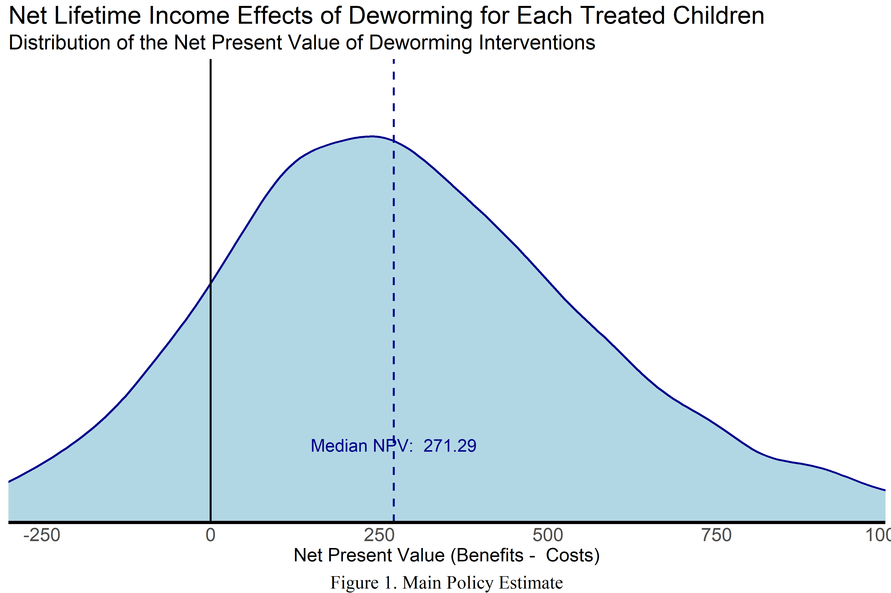

---
pdf_document:
  extra_dependencies: ["xcolor"]
date: "12 July, 2020"
output:
  html_document:
    code_folding: hide
    code_download: true
    collapsed: yes
    keep_md: yes
    number_sections: yes
    smooth_scroll: no
    toc: yes
    toc_depth: 3
    toc_float: yes
  pdf_document: default
  word_document: default
editor_options:
  chunk_output_type: console
title: "A Unifying Open Policy Analysis for Deworming"
bibliography: bibliography.bib  
link-citations: true
---
\def\blue{\color{blue}}
\def\red{\color{red}}


```r
################
#####  Notes:
################
### Source ---------->  Input ---------->  Model ---------->  Policy Estimates (output)
###  (_so)              (_in)              (_mo)                (_pe)
### values            functions          functions              values
###                   & values           & values             
# - call_sources_f- tax_elasticity_in_f  - tax_revenue_mo_f     - ten_year_revenue_pe
# - policy_f      - est_billionares_in_f - total_rev_mo_f       - ten_year_top_tax_pe
#                                        - ten_years_mo_f       - total_rev_pe
### arguments in functions should used "_var" and functions should "_f"


# DESCRIBE CHUNK STRUCTURE
# - inputs: list
# - outputs: list
#### function:  
#sample_function_f <- function(){
##########################################
##########################################  
#
# here goes the content
#
##########################################
##########################################  
#    return( )                                  # A list with all (most?) the elements
#}                                              # generated inside the function
#invisible( list2env(sample_function_f(),.GlobalEnv) )
#
```


```r
# - inputs: none
# - outputs: all sources coming from data, research and guesswork
chunk_params <- function(){
###############################################################################
###############################################################################  
    #############
    ##### Data  
    #############
    gov_bonds_so <- 	0.1185	     #Kenyan interest on sovereign debt - Central Bank of Kenya
    inflation_so <-  0.02          #Kenyan inflation rate - World Bank Development Indicators
    gov_bonds_new_so <- 0.09
    inflation_new_so <- 0.04

    wage_ag_so <- 	11.84	         #Mean hourly wage rate (KSH) - Suri 2011
    wage_ww_so <- 	14.5850933     #Control group hourly wage, ww (cond >=10 hrs per week) - Table 4, Panel B
    profits_se_so <- 1766          #Control group monthly self-employed profits -
                                   #Table 4, Panel A FIX: MOST REFERENCES FROM TABLE 4 ARE TABLE 3
    hours_se_cond_so <- 38.1       #Control group weekly self-employed hours, conditional on hrs >0 - Table D13, Panel D
    hours_ag_so <- 8.3             #Control group hrs per week, agriculture - Table 4, Panel D
    hours_ww_so <- 6.9             #Control group hrs per week, working for wages - Table 4, Panel B
    hours_se_so <- 3.3             #Control group hrs per week, self-employment - Table 4, Panel A
    ex_rate_so <- 74               #Exchange Rate - Central Bank of Kenya 74 , 85

    ex_rate_2018        <- 101.30  # Exchange rate (KES per international $)
                                    # - https://data.worldbank.org/indicator/PA.NUS.FCRF?locations=KE
    ex_rate_2018_ppp_so <- 50.058   # KLPS4_E+_globals.do (originally from the World Bank)
    ex_rate_2017_ppp_so <- 49.773   # KLPS4_E+_globals.do (originally from the World Bank)
    cpi_2018_so <- 251.10           # KLPS4_E+_globals.do (originally from the Bureau of Labor Statistics)
    cpi_2017_so <- 245.120          # KLPS4_E+_globals.do (originally from the Bureau of Labor Statistics)

    growth_rate_so <- 1.52/100     #Per-capita GDP growth, 2002-2011 (accessed 1/29/13) -	World Bank - see notes
    coverage_so  <- 0.681333333    # (R) Fraction of treated primary school students within 6 km - from W@W - see note
    tax_so <- 0.16575              #ADD INFO!
    unit_cost_local_so <- 43.66    #Deworm the World

    unit_cost_so <- 0.42           # Unit cost of deworming (in 2018 USD) - from Evidence Action
    unit_cost_ppp_so <- unit_cost_so*ex_rate_2018/ex_rate_2018_ppp_so
    unit_cost_2017usdppp_so <- unit_cost_ppp_so*cpi_2017_so/cpi_2018_so

    years_of_treat_so <- 2.41      #Additional Years of Treatment - Table 1, Panel A
    # costs data
    df_costs_so <- read_excel("rawdata/data/DtW Cost per Child Data.xlsx",
                           sheet = "DtW Costs")
    # crosswalk data on region and country
    df_costs_cw_so <- read_excel("rawdata/data/DtW Cost per Child Data.xlsx",
                           sheet = "state_country")
    # data on number of treated children
    df_counts_so <- read_excel("rawdata/data/DtW Cost per Child Data.xlsx",
                           sheet = "DtW Treatment #s")
    # Prevalence data:
    # original study
    # Any infection on original study
    #alpha_0_so <- c("hookworm" = 0.77, "roundworm" = 0.42, "whipworm" =0.55,
    # "Schisto mansoni" = 0.22) # from Draft Cost-Effectiveness Model.xlsx ADD ORIGINAL SOURCE
    df_alpha_so <- read_excel("data/prevalence_data.xlsx",
                           sheet = "Sheet1")

    #############
    ##### Research
    #############
    df_research_so <- read_csv("rawdata/research/research_params.csv")   
    lambda1_so <- c(3.49, 0)            #Hrs per week increase for men and women CONFIRM
    lambda2_so <- 10.2                  #Externality effect (proportional) - Table 3, Panel B
    lambda1_new_so <- c(86.54642,   # avg treatment effect from klps2 (already adjusted for ppp and inflation) - w@w
                               82.99311,   # avg treatment effect from klps3 (already adjusted for ppp and inflation) - w@w
                               85.44088)   # avg treatment effect from klps4 (already adjusted for ppp and inflation) - w@w
    lambda1_new_sd_so <- c(43, 83, 172)  # ADD SOURCE
    q_full_so <- 0.75              #Take up rates with full subsidy. From Miguel and Kremmer (2007)
    q_zero_so <- 0                 #Take up rates with zero subsidy. From Miguel and Kremmer (2007)
    delta_ed_so <- c(-0.00176350949079451, 0.00696052250263997, 0.0258570306763183,     # (Delta E) Additional direct secondary schooling increase (from Joan)
                        0.0239963665555466, 0.027301406306074, 0.0234125454594173,
                       0.0279278879439199, 0.00647044449446303, 0.00835739437790601)                                     
    delta_ed_so <- cbind(delta_ed_so, 1999:2007)
    delta_ed_ext_so <- c(-0.0110126908021048,	0.0140448546741008,	-0.0034636291545585,  #Additional externality secondary schooling increase (from Joan)
                           0.0112940214439477,	0.0571608179771775,	-0.0560546793186931,
                           0.0558284756343451,	0.1546264843901160,	0.0055961489945619)
    delta_ed_ext_so <- cbind(delta_ed_ext_so, 1999:2007)    
    delta_ed_par_so <- 1
    delta_ed_ext_par_so <- 1
    include_ext_so <- TRUE
    alpha_0_so <- 1#0.77 #0.77
    alpha_r_so <- 1#0.15 #0.15
    #############
    ##### Guess work   
    #############
    periods_so <- 50               #Total number of periods to forecast wages
    time_to_jm_so <- 10            #Time from initial period until individual join the labor force
    coef_exp_so <- c(0.1019575, -0.0010413)         #Years of experience coefficients (1-linear, 2-cuadratic)
                                                    #- see notes(0.1019575, -0.0010413), (0,0)
    teach_sal_so <- 5041           #Yearly secondary schooling compensation	5041 - from ROI materials
    teach_ben_so <- 217.47         #Yearly secondary schooling teacher benefits	217.47
    teach_sal_new_so <- (50000*12/49.77)
    teach_ben_new_so <- 0
                                  #Monthly secondary schooling compensation	(in 2017 KES) overestimated to account for benefits -
                                  #news sources * 12 / ex_rate_2017_ppp_so
                                  # https://www.tuko.co.ke/287766-secondary-school-teachers-salary-kenya.html
                                  # https://www.standardmedia.co.ke/article/2001249581/windfall-for-teachers-as-tsc-releases-new-salaries
    teach_sal_2017usdppp_so <- teach_sal_new_so * cpi_2017_so / cpi_2017_so # redundant, but for the sake of consistency

    n_students_so <- 45            #Average pupils per teacher	45
    staff_time_so <- 0.3           #Added Deworming costs due to goverment staff time
    run_sim_so <- FALSE
    main_run_so <- TRUE
    rescale_so <- TRUE
    costs_par_so <- 1
    costs_par_sd_so <- 0.1
    counts_par_so <- 1
    counts_par_sd_so <- 0.1
    nsims_so <- 1e1
    # options: "baird1_sim","baird2_sim","baird3_sim", "baird4_sim", "klps4_1_sim",
    # "klps4_2_sim", "ea1_sim", "ea2_sim", "ea3_sim", "cea_no_ext_ea_sim", "rcea_no_ext_ea_sim"
    policy_estimate_so <- "ea3_sim"

    # Fix teach_sal_so       
    return( sapply( ls(pattern= "_so\\b"), function(x) get(x)) )
###############################################################################
###############################################################################    
}
invisible( list2env(chunk_params(),.GlobalEnv) )

#############
##### Notes:
#############
# on growth_rate_so: (http://data.worldbank.org/indicator/NY.GDP.PCAP.KD/), see calculation
# on "Kenya GDP per capita" tab. In W@W this equals 1.52%. ISSUE: This growth number should
# be updated to be 2002-2014, I think.
#
# on coef_exp_so: 1998/1999 Kenyan labor force survey; regression of earnings on age, age^2,
# female dummy, indicators for attained primary/secondary/beyond, and province dummies.
# Estimate used in W@W: (0.1019575, -0.0010413). ISSUE: For now assume no further life cycle
# adjustment beyond KLPS-3 (likely a conservative assumption).
#
# coverage_so: Overall Saturation (0.511) / 0.75 - not reported in table, average of T & C
```

 

# Introduction  

Mass deworming has demonstrated to be a highly effective public health intervention in the past. Here we provide a policy analysis that compares benefits and costs of deworming for different potential new settings. The goal of this analysis is to provide the best empirical information for policy makers debating the implemention of a deworming policy. This document describes all the analytical steps required to reproduce the analysis, displaying the actual computer code use in each step. In addition to this report, the reader can find all the materials to reproduce the findings presented here in [github.org/bitss/opa-deworming](https://github.org/bitss/opa-deworming). The main output, presented in the [results section](#policy-estimate) of this report, can also be explored interactively for different assumptions in [this web app](add link).


The Cost Benefit Analysis (CBA) of deworming is computed using three different approaches:   
  1. the original CBA produced by @baird2016worms,   
  2. an updated version of such analysis by a symilar research team [@klps4], and   
  3. a third approach that borrows some components of the previous two and some specific components requested by the NGO, Evidence Action (EA)[^1].


<!--
OLD TEXT:
The key policy estimate consists of a cost effectiveness analysis that compares the present
value of benefits and costs. The benefits quantified here are the effects on wages an the
costs are those of delivering the deworming treatment.  

The benefits will account for the direct effects of deworming and plus the indirect effects of deworming due to smaller pool of sick people in the community (herd inmunity). Effects are computed as a change in the earning profile of the population.

This analaysis contains elements from GiveWell's cost effectiveness analaysis (see [here](https://docs.google.com/spreadsheets/d/1McptF0GVGv-QBlhWx_IoNVstWvt1z-RwVSu16ciypgs/edit#gid=1537947274), an editable version can be found [here](https://docs.google.com/spreadsheets/d/1rL8NPB8xnxqs1pr_MMEA0j27sAqEuAluwGSML7pREzk/edit#gid=1537947274))  and the cost benefit analysis described in [Baird et al., 2016](https://academic.oup.com/qje/article/131/4/1637/2468871).  
-->

# Methodology  

We first describe the common elements across all three approaches, and then describe each approach in detail.

## Common structure

The starting point is a comparison of a stream of benefits and costs over the lifetime of the recipients of deworming. The final policy estimate is the discounted sum of all costs and benefits, known as the Net Present Value (NPV). Another format to present this analysis is as a cost effectiveness ratio, in absolute terms or relative to the benchmark of cash transfers.

<details><summary>Show all the details</summary>

\begin{equation}
NPV = B - C \\
CEA = \frac{B \times F_0}{C} \\
RCEA = \frac{CEA(B,C)}{CEA_{cash}}

\label{eq:1}
\tag{1}
\end{equation}


```r
# - inputs: total per capita benefits, total per capita costs, fudging factor
# - outputs: Cost-effectiveness ratio & ratio to cash CEA
chunk_policy_est <- function(){
###############################################################################
###############################################################################  

    NPV_pe_f <- function(benefits_var = 1, costs_var = 1){
        benefits_var - costs_var
    }
    CEA_pe_f <- function(benefits_var = 1, fudging_var = 0, costs_var = 1) {
        ( benefits_var * ( 1 + fudging_var ) ) / costs_var
    }
    RCEA_pe_f <- function(CEA_var = 1, CEA_cash_var = 1){
        CEA_var / CEA_cash_var
    }

###############################################################################
###############################################################################  
    return(list("CEA_pe_f" = CEA_pe_f,
                "RCEA_pe_f" = RCEA_pe_f,
                "NPV_pe_f" = NPV_pe_f))
}
invisible( list2env(chunk_policy_est(),.GlobalEnv) )
table_1 <- matrix("", nrow = 1, ncol = 3)
table_2 <- matrix("", nrow = 1, ncol = 2)
```


</details>

Benefits are equal to the additional earnings that indivudual are expected to generate due to a deworming treatment. These additional earrnings are computed as a discounted sum over their working lifetime.  


<details><summary>Show all the details</summary>


\begin{equation}
B =   \sum_{t=0}^{50}\left(  \frac{1}{1 + r}\right)^{t} E_{t}

\label{eq:2}
\tag{2}
\end{equation}


```r
# - inputs: nothing
# - outputs: function that computes the country weights used in the final costs
chunk_benefits <- function(){
###############################################################################
###############################################################################  

    pv_benef_f <- function(earnings_var = earnings_in, interest_r_var = interest_in,
                    periods_var = periods_so) {
      index_t <- 0:periods_var
      res1 <- sum( ( 1 / (1 + interest_r_var) )^index_t * earnings_var )
      return(res1)   
    }

###############################################################################
###############################################################################  
    return(list("pv_benef_f" = pv_benef_f))
}
invisible( list2env(chunk_benefits(),.GlobalEnv) )
```
</details>


At a high level all three approaches focus on the same type of benefits: the increase in incomes over the lifetime of beneficiaries of deworming. This is probably an under-estimate of the benefits as it does not quantify the non-pecuniary effects of improved health.  The costs can be separated into direct costs of implementing deworming policies, and indirect costs associated with the benefits of deworming.

The main differences across the three approaches regarding benefits have to do with how to predict the earnings profiles over a lifecycle, and whether or not to account for different prevalence rates. Approaches 1 and 2 use different earning profiles, and approach 3 combines both earning profiles and adjusts for possible differences in prevalence rates of worm infections.

The main differences in costs have to do with whether indirect costs are included, and what is the relevant unit cost for the analysis. The first two approaches include indirect costs and use the unit costs of a specific country (Kenya) while the third approach does not include indirect costs and use unit costs of multiple countries.


### The discounting rate  

All approaches use the real interest rate ($r$) as the discounting rate. This is obtained from the interest rate on goverment bonds ($i$) minus the inflation rate ($\pi$).

<details><summary>Show all the details</summary>

\begin{equation}
r =   g - \pi

\label{eq:3}
\tag{3}
\end{equation}


```r
# - inputs: gov_bonds_so, inflation_so
# - outputs: interest_in
chunk_interest <- function(){
###############################################################################
###############################################################################  

    interest_f <- function(gov_bonds_var = gov_bonds_so ,
                           inflation_var = inflation_so) {  
        interest_in = gov_bonds_var - inflation_var
        return(list("interest_in" = interest_in))
    }

###############################################################################
###############################################################################  
    return(list("interest_f" = interest_f))
}

invisible( list2env(chunk_interest(),.GlobalEnv) )
interest_16 <- as.numeric( interest_f(gov_bonds_var = gov_bonds_so,
                                      inflation_var = inflation_so) )
interest_19 <- as.numeric( interest_f(gov_bonds_var = gov_bonds_new_so,
                                      inflation_var = inflation_new_so)  )
```

</details>

The actual value will vary across approaches depending on the time and country chosen. For example approach 1 used the return from government bonds and inflation in Kenya for the year 2016, while approach 3 used the values for the same country but for the year 2019. This resulted in discount rates of 9.85% and 5% respectively. 

<!-- Add fold/unfold for tables -->
<details><summary>View Summary Table</summary>

<table class="table table-striped table-hover table-condensed" style="margin-left: auto; margin-right: auto;">
<caption>Summary of equations use until this point in the document</caption>
 <thead>
  <tr>
   <th style="text-align:left;"> Equation </th>
   <th style="text-align:left;"> # </th>
  </tr>
 </thead>
<tbody>
  <tr>
   <td style="text-align:left;">  </td>
   <td style="text-align:left;">  </td>
  </tr>
  <tr>
   <td style="text-align:left;"> $NPV = B - C$ </td>
   <td style="text-align:left;"> $(1)$ </td>
  </tr>
  <tr>
   <td style="text-align:left;"> $B=\sum_{t=0}^{50}\left(\frac{1}{1+r}\right)^{t}E_{t}$ </td>
   <td style="text-align:left;"> $(2)$ </td>
  </tr>
  <tr>
   <td style="text-align:left;"> $r=g-\pi$ </td>
   <td style="text-align:left;"> $(3)$ </td>
  </tr>
</tbody>
</table>

<table class="table table-striped table-hover table-condensed" style="margin-left: auto; margin-right: auto;">
<caption>Sources: summary of inputs specified until this point in the document</caption>
 <thead>
  <tr>
   <th style="text-align:left;"> Data </th>
   <th style="text-align:left;"> Research </th>
   <th style="text-align:left;"> Guesswork </th>
  </tr>
 </thead>
<tbody>
  <tr>
   <td style="text-align:left;"> $\pi_{16}=0.02$ </td>
   <td style="text-align:left;">  </td>
   <td style="text-align:left;">  </td>
  </tr>
  <tr>
   <td style="text-align:left;"> $i_{16}=0.1185$ </td>
   <td style="text-align:left;">  </td>
   <td style="text-align:left;">  </td>
  </tr>
  <tr>
   <td style="text-align:left;"> $\pi_{19}=0.04$ </td>
   <td style="text-align:left;">  </td>
   <td style="text-align:left;">  </td>
  </tr>
  <tr>
   <td style="text-align:left;"> $i_{19}=0.09$ </td>
   <td style="text-align:left;">  </td>
   <td style="text-align:left;">  </td>
  </tr>
</tbody>
</table>

</details>


## Approach 1: @baird2016worms

In this first approach, the effect on earnings over the entire lifecycle are predicted by extrapolating the effects on hours worked by individuals in the original treatment group, ten years after the intervention. 

Two type of results are presented: the total effect on earnings projected over a lifetime, and the estimated additional fiscal effect due to the goverment collecting taxes on higher earnings. The effects are calculated in two scenarios: with and without externalities.

###  Gains in earnings

Gains in earnings ($E_t$) are the result of multiplying expected earnings in a certain period ($w_t$) with the effects of deworming on worked hours. This effect can have two components: a direct effect of deworming on the individual ($\lambda_1$) and the indirect effect on earnings due to externalities ($\lambda_2$). The indirect effects are considered within the context of the treatment's coverage and saturation.

<details><summary>Show all the details</summary>


[^6]: The original equation separates effects by gender. But the final calculation (behind table 5 in paper) does not separate by gender.

\begin{equation}
E_t = w_{t}\left( \lambda_{1} + \frac{p \lambda_{2}}{R} \right)

\label{eq:4}
\tag{4}
\end{equation}

Where[^6]:   

 - $w_t$: are the earnings in period $t$.   
 - $\lambda_{1}$: is the direct effects of deworming on earnings.  
 - $\lambda_{2}$: is the indirect effects of deworming on earnings.   
 - $p$: saturation, measures the fraction of the population that is effectively using the treatment.  
 - $R$: coverage, defined as the fraction, among all neighboring schools (within 6 km), that belongs to the treatment group.  


```r
# - inputs: gov_bonds_so, inflation_so
# - outputs: interest_in
chunk_earnings1 <- function(){
###############################################################################
###############################################################################  

    earnings1_f <- function(wage_var = wage_in,
                          lambda1_var = lambda1_so,
                          lambda2_var = lambda2_so,
                          saturation_var = saturation, coverage_var) {  
        res1 <- wage_var * ( lambda1_var + saturation_var * lambda2_var / coverage_var )
        return(res1)
    }

###############################################################################
###############################################################################  
    return(list("earnings1_f" = earnings1_f))
}

invisible( list2env(chunk_earnings1(),.GlobalEnv) )
```

</details>

#### Earnings over time

Earnings in period t ($w_t$) are determined by multiplying the number of weeks worked up to time t by the weekly starting wage, which is adjusted to account for per capita GDP growth and a concave life cycle path for wages (wages typically increase with more years of work, then decline later in a life cycle). This all operates under the assumption that individuals in the data enter the labor force 10 years after the present day.

Individuals in the data are assumed to enter the labor force 10 years after the (data) present day ($w_t = 0, Xp = 0$ for $t<10$, and $Xp = t - 10$ for $t\geq 10$). Wage at time $t$ is the weekly starting wage in USD ($w_0$) that has a base growth rate equal to the per capita GDP growth ($g$) applied to however many years of work ($Xp$). In addition to this growth, the salaries are adjusted to represent a (concave) wage life cycle profile ($1 + \hat{\beta_1} Xp + \hat{\beta_2} Xp^2$).

The initial wage in dollars ($w_{0}$) is a weighted average of wages for control group in agriculture, working wage, and self-employed sectors ($ag, ww, se$). The weights correspond to the average number of hours in each sector ($h_l$) relative to the sum of the average number of hours in each sector.  

The wage in agriculture comes from research (Suri, 2011), the working wage comes from the data and is defined as  hourly wage for the control group for those who reported more than 10 hrs of work per week. The self-employed wage ($w_{se}$) was constructed as follows:


<details><summary>Show all the details</summary>

The wages/earnings are determined by:  

\begin{equation}
w_t =  \text{#weeks} \times w_0 (1 + g)^{Xp}(1 + \hat{\beta_1} Xp + \hat{\beta_2} Xp^2) \quad \text{for } t=10, \dots, 50

\label{eq:5}
\tag{5}
\end{equation}

\begin{equation}
w_t =  \text{#weeks} \times w_0 (1 + g)^{Xp}(1 + \hat{\beta_1} Xp + \hat{\beta_2} Xp^2)

\label{eq:6}
\tag{6}
\end{equation}

\begin{equation}
w_0 = \frac{1}{ex} \sum_{l \in \{ag, ww, se\}}w_{l}\alpha_{l}
\\ \quad \text{with: } \alpha_{l}= \frac{ h_{l}}{h_{ag} + h_{ww} + h_{se}}  
\end{equation}

\begin{equation}
w_{se} =  \frac{ \text{Monthly self-employed profits} }{4.5 \times E[h_{se}|h_{se}>0] }

\label{eq:7}
\tag{7}
\end{equation}


```r
#inputs: wages (wage_ag_so, wage_ww_so) self employed income (profits_se_so,
#  hours_se_cond_so) hours of work (hours_ag_so, hours_ww_so, hours_se_so),
#  exchange rate (ex_rate_so), timing vars (periods_so, time_to_jm_so),
#  growth rate (growth_rate_so), mincer coef (coef_exp_so[1], coef_exp_so[2])
#
#outputs: Starting wages: value (wage_0_mo) and function (wage_0_mo_f), Wage trajectory:
#  value (wage_t_mo) and function (wage_t_mo_f).
chunk_wages <- function(){
################################################################################
################################################################################  
    #close to value from spreadsheet (Assumps&Panel A Calcs!B137 = 0.1481084),
    #but I suspect diff due to computational precision

    wage_0_mo_f <- function(wage_ag_var, wage_ww_var, profits_se_var, hours_se_cond_var,
                            hours_ag_var, hours_ww_var, hours_se_var, ex_rate_var) {
        experience_aux <- 0:periods_so - time_to_jm_so
        wage_se <- profits_se_var / (4.5 * hours_se_cond_var)
        wage_ls <- c(wage_ag_var, wage_ww_var, wage_se)
        alpha_ls <- c(hours_ag_var, hours_ww_var, hours_se_var) / sum( c(hours_ag_var, hours_ww_var, hours_se_var) )
        res1 <- 1/ex_rate_var * sum( wage_ls * alpha_ls )
        return(res1)
    }

    wage_t_mo_f <- function(wage_0_var,
                       growth_rate_var,
                       coef_exp1_var,
                       coef_exp2_var) {
        experience_aux <- 0:periods_so - time_to_jm_so
        res1 <- 52 * wage_0_var *( ( 1 + growth_rate_var )^experience_aux ) *
          ( 1 + coef_exp1_var * experience_aux + coef_exp2_var * (experience_aux^2) ) *
          ifelse(0:periods_so >= time_to_jm_so, 1, 0)
        return(res1)
    }

    wage_0_mo <- wage_0_mo_f(wage_ag_var = wage_ag_so,  
                         wage_ww_var = wage_ww_so,
                         profits_se_var = profits_se_so,
                         hours_se_cond_var = hours_se_cond_so,  
                         hours_ag_var = hours_ag_so,
                         hours_ww_var = hours_ww_so,
                         hours_se_var = hours_se_so,
                         ex_rate_var = ex_rate_so)  

    #close to value from spreadsheet (Calcs-Table 5!N21.. = 7.701634678),
    #but I suspect diff due to computational precision
    wage_t_mo <- wage_t_mo_f(wage_0_var = wage_0_mo,
                       growth_rate_var = growth_rate_so,
                       coef_exp1_var = coef_exp_so[1],
                       coef_exp2_var = coef_exp_so[2])

################################################################################
################################################################################
    return(list("wage_0_mo_f" = wage_0_mo_f, "wage_0_mo" = wage_0_mo,
                "wage_t_mo_f" = wage_t_mo_f, "wage_t_mo" = wage_t_mo))
}

invisible( list2env(chunk_wages(),.GlobalEnv) )
```

</details>

Where both parameters (Monthly self-employed profits and self-employed hours for the control group, conditional on hrs >0 - $E[h_{se}|h_{se}>0]$ -) come from the data [@baird2016worms].  The measure of hours in self employment used to compute wages ($E[h_{se}|h_{se}>0]$) is different from the one used to compute the weights $\alpha_l$ above. The first one captures hours of work among those actively employed in the self-employed sector, and the second one captures the average hours of work in self-employed among all the population of working age in the sample (hence capturing the relative importance of the self employed sector in the economy).


#### "$\lambda_{1}$"  and  "$\lambda_{2}$"

$\lambda_{1,\gamma}$ represents the estimated impact of deworming on hours of work for men and women. This two parameters are combined with a simple mean:

\begin{equation}
\lambda_{1} = \frac{1}{2} \lambda_{1,male} + \frac{1}{2} \lambda_{1,female}\\

\label{eq:8}
\tag{8}
\end{equation}

$\lambda_{2,\gamma}$ the estimated externality effect (EXPLAIN) and comes from research (W\@W). Note that this parameter is not estimated by gender, so we repeat its value two times. All the components to the equation \\ref{eq:8} come from @baird2016worms.


```r
# - inputs:
# - outputs:
chunk_lambdas<- function(){
###############################################################################
###############################################################################    

    lambda1_in_f <- function(lambda1_var = lambda1_so) {
        rep(0.5 * lambda1_var[1] + 0.5 *lambda1_var[2], 2)
    }

    lambda_r_f <- function(lambda1_var = lambda1_in_f(), alpha_0_var = alpha_0_so,
                         alpha_r_var=alpha_r_so){
        lambda1_eff_temp <- lambda1_var / alpha_0_var
        return( lambda1_eff_temp * alpha_r_var )
    }  

    lambda2_in_f <- function(lambda2_var = lambda2_so){
        rep(lambda2_var, 2)
    }

##############################################################################
###############################################################################  
    return(list("lambda_r_f" = lambda_r_f,     
                "lambda1_in_f" = lambda1_in_f,
                "lambda2_in_f" = lambda2_in_f ) )
}
invisible( list2env(chunk_lambdas(),.GlobalEnv) )

##### Execute values of the functions above when needed for the text:
lambda1_in <- lambda1_in_f()
lambda1_r_in <- lambda_r_f()
lambda2_in <- lambda2_in_f()
```

#### $R$ and $p$


The coverage, $R$, is defined as the fraction, among all neighboring schools (within 6 km), that belongs to the treatment group^[6]. As the treatment was applied to approximately two thirds of the population, $R$ is set to: $R  = 0.68$.  

The saturation of the intervention, $p$, measures the fraction of the population that is effectively using the treatment and is defined as:  

\begin{equation}
p = R \times Q(full)  + (1 - R) \times Q(0)

\label{eq:9}
\tag{9}
\end{equation}

For this (or similar?) setting Miguel and Kremer 2007 [add page, table, col, row] estimate that there is almost no take-up without subsidy, hence $Q(0)$ is assigned the value of 0. The same article [add page, table, col, row] estimates that take-up with full subsidy is $Q(full) = 0.75$.


```r
# - inputs: coverage_so, q_full_so, q_zero_so
# - outputs: saturation_in
chunk_coverage <- function(){
###############################################################################
###############################################################################  

    saturation_in_f <- function(coverage_var = coverage_so, q_full_var = q_full_so,
                                q_zero_var = q_zero_so){
        saturation_in <- coverage_so * q_full_so + ( 1 - coverage_so ) * q_zero_so
        return(list("saturation_in" = saturation_in))
    }

###############################################################################
###############################################################################  
    return(list("saturation_in_f" = saturation_in_f))    # Try to return only functions
}
invisible( list2env(chunk_coverage(),.GlobalEnv) )

##### Execute values of the functions above when needed for the text:
```


<details><summary>View Summary Table</summary>


<table class="table table-striped table-hover table-condensed" style="margin-left: auto; margin-right: auto;">
<caption>Summary of equations use until this point in the document</caption>
 <thead>
  <tr>
   <th style="text-align:left;"> Equation </th>
   <th style="text-align:left;"> # </th>
  </tr>
 </thead>
<tbody>
  <tr>
   <td style="text-align:left;">  </td>
   <td style="text-align:left;">  </td>
  </tr>
  <tr>
   <td style="text-align:left;"> $NPV = B - C$ </td>
   <td style="text-align:left;"> $(1)$ </td>
  </tr>
  <tr>
   <td style="text-align:left;"> $B=\sum_{t=0}^{50}\left(\frac{1}{1+r}\right)^{t}E_{t}$ </td>
   <td style="text-align:left;"> $(2)$ </td>
  </tr>
  <tr>
   <td style="text-align:left;"> $r=g-\pi$ </td>
   <td style="text-align:left;"> $(3)$ </td>
  </tr>
  <tr>
   <td style="text-align:left;"> $E_t = w_{t}\left( \lambda_{1} + \frac{p \lambda_{2}}{R} \right)$ </td>
   <td style="text-align:left;"> $(4)$ </td>
  </tr>
  <tr>
   <td style="text-align:left;"> $w_t =  \text{#weeks} \times w_0 (1 + g)^{Xp}(1 + \hat{\beta_1} Xp + \hat{\beta_2} Xp^2)$ </td>
   <td style="text-align:left;"> $(5)$ </td>
  </tr>
  <tr>
   <td style="text-align:left;"> $w_0 = \frac{1}{ex} \sum_{l \in \{ag, ww, se\}}w_{l}\alpha_{l}
                     \quad \text{with: } \alpha_{l}= \frac{ h_{l}}{h_{ag} + h_{ww} + h_{se}}$ </td>
   <td style="text-align:left;"> $(6)$ </td>
  </tr>
  <tr>
   <td style="text-align:left;"> $w_{se} = \frac{\text{Monthly self-employed profits}}{4.5 \times E[h_{se}|h_{se} \text{&gt;} 0]}$ </td>
   <td style="text-align:left;"> $(7)$ </td>
  </tr>
  <tr>
   <td style="text-align:left;"> $\lambda_{1} = \frac{1}{2} \lambda_{1,male} + \frac{1}{2} \lambda_{1,female}$ </td>
   <td style="text-align:left;"> $(8)$ </td>
  </tr>
  <tr>
   <td style="text-align:left;"> $p = R \times Q(full)  + (1 - R) \times Q(0)$ </td>
   <td style="text-align:left;"> $(9)$ </td>
  </tr>
</tbody>
</table>

<table class="table table-striped table-hover table-condensed" style="margin-left: auto; margin-right: auto;">
<caption>Sources: summary of inputs specified until this point in the document</caption>
 <thead>
  <tr>
   <th style="text-align:left;"> Data </th>
   <th style="text-align:left;"> Research </th>
   <th style="text-align:left;"> Guesswork </th>
  </tr>
 </thead>
<tbody>
  <tr>
   <td style="text-align:left;"> $\pi_{16}=0.02$ </td>
   <td style="text-align:left;"> $p=NA$ </td>
   <td style="text-align:left;">  </td>
  </tr>
  <tr>
   <td style="text-align:left;"> $i_{16}=0.1185$ </td>
   <td style="text-align:left;"> $R=NA$ </td>
   <td style="text-align:left;">  </td>
  </tr>
  <tr>
   <td style="text-align:left;"> $\pi_{19}=0.04$ </td>
   <td style="text-align:left;"> $\lambda_1=NA$ </td>
   <td style="text-align:left;">  </td>
  </tr>
  <tr>
   <td style="text-align:left;"> $i_{19}=0.09$ </td>
   <td style="text-align:left;"> $\lambda_2=NA$ </td>
   <td style="text-align:left;">  </td>
  </tr>
  <tr>
   <td style="text-align:left;"> $w_l=NA$ </td>
   <td style="text-align:left;"> $\hat{\beta}_1=NA$ </td>
   <td style="text-align:left;">  </td>
  </tr>
  <tr>
   <td style="text-align:left;"> $w_{ww}=NA$ </td>
   <td style="text-align:left;"> $\hat{\beta}_2=NA$ </td>
   <td style="text-align:left;">  </td>
  </tr>
  <tr>
   <td style="text-align:left;"> $w_{se}=NA$ </td>
   <td style="text-align:left;">  </td>
   <td style="text-align:left;">  </td>
  </tr>
  <tr>
   <td style="text-align:left;"> $h_l=NA$ </td>
   <td style="text-align:left;">  </td>
   <td style="text-align:left;">  </td>
  </tr>
  <tr>
   <td style="text-align:left;"> $h_{ag}=NA$ </td>
   <td style="text-align:left;">  </td>
   <td style="text-align:left;">  </td>
  </tr>
  <tr>
   <td style="text-align:left;"> $h_{ww}=NA$ </td>
   <td style="text-align:left;">  </td>
   <td style="text-align:left;">  </td>
  </tr>
  <tr>
   <td style="text-align:left;"> $h_{se}=NA$ </td>
   <td style="text-align:left;">  </td>
   <td style="text-align:left;">  </td>
  </tr>
  <tr>
   <td style="text-align:left;"> $Q(full)=0.75$ </td>
   <td style="text-align:left;">  </td>
   <td style="text-align:left;">  </td>
  </tr>
  <tr>
   <td style="text-align:left;"> $Q(0)=0$ </td>
   <td style="text-align:left;">  </td>
   <td style="text-align:left;">  </td>
  </tr>
</tbody>
</table>


</details>

### Costs

The costs are a combination of direct costs on mass deworming (relative to the status quo, which is no subsidy for deworming) and indirect costs on the education system due to the additional time treated individuals spend in school.

\begin{equation}
C =  \left( S_{2}Q(S_{2}) - S_{1}Q(S_{1}) \right) + K \sum_{t=0}^{50} \left( \frac{1}{1 + r}\right)^{t} \Delta \overline{E}_{t}(S1,S2)

\label{eq:10}
\tag{10}
\end{equation}

<!-- Add fold/unfold for tables -->
<details><summary>Click Here to View Analysis Table</summary>

<table class="table table-striped table-hover table-condensed" style="margin-left: auto; margin-right: auto;">
<caption>Sources: summary of inputs</caption>
 <thead>
  <tr>
   <th style="text-align:left;"> Data </th>
   <th style="text-align:left;"> Research </th>
   <th style="text-align:left;"> Guesswork </th>
  </tr>
 </thead>
<tbody>
  <tr>
   <td style="text-align:left;"> $C=NA$ </td>
   <td style="text-align:left;"> $S_2=NA$ </td>
   <td style="text-align:left;"> $Q=NA$ </td>
  </tr>
  <tr>
   <td style="text-align:left;"> $S_1=NA$ </td>
   <td style="text-align:left;"> $K=NA$ </td>
   <td style="text-align:left;"> $r=NA$ </td>
  </tr>
  <tr>
   <td style="text-align:left;"> $r=NA$ </td>
   <td style="text-align:left;"> $t=NA$ </td>
   <td style="text-align:left;"> $\Delta \bar{E}_t=NA$ </td>
  </tr>
</tbody>
</table>
</details>


```r
# - inputs:
# - outputs:
chunk_cost2 <- function(){
###############################################################################
###############################################################################  

    cost2_f <- function(periods_var = periods_so, delta_ed_var = delta_ed_final_in,
               interest_r_var = interest, cost_of_schooling_var = cost_per_student_in,
               s1_var = 0, q1_var = 0, s2_var = s2_in, q2_var = q2_in) {
        index_t <- 0:periods_var
        delta_ed_s <- c(0, delta_ed_var, rep(0,41))
        sum( ( 1 / (1 + interest_r_var) )^index_t *
                delta_ed_s * cost_of_schooling_var) +
        (s2_var * q2_var  - s1_var * q1_var)
    }
###############################################################################
###############################################################################  
    return(list("cost2_f" = cost2_f))    # Try to return only functions
}
invisible( list2env(chunk_cost2(),.GlobalEnv) )

##### Execute values of the functions above when needed for the text:  
```

#### Increase in deworming costs

Direct deworming costs ($DC$) are defined as the take-up under a mass deworming ($Q_{2}$) intervention, times the per-capita costs of deworming under the intervention ($S_{2}$). This costs are compared to a scenario where the government provides no additional resource for deworming ($S_{1}Q(S_{1})$).  

\begin{equation}
DC = S_{2}Q(S_{2}) - S_{1}Q(S_{1})

\label{eq:11}
\tag{11}
\end{equation}

<details><summary>View Summary Table</summary>
<table class="table table-striped table-hover table-condensed" style="margin-left: auto; margin-right: auto;">
<caption>Summary of equations use until this point in the document</caption>
 <thead>
  <tr>
   <th style="text-align:left;"> Equation </th>
   <th style="text-align:left;"> # </th>
  </tr>
 </thead>
<tbody>
  <tr>
   <td style="text-align:left;">  </td>
   <td style="text-align:left;">  </td>
  </tr>
  <tr>
   <td style="text-align:left;"> $NPV = B - C$ </td>
   <td style="text-align:left;"> $(1)$ </td>
  </tr>
  <tr>
   <td style="text-align:left;"> $B=\sum_{t=0}^{50}\left(\frac{1}{1+r}\right)^{t}E_{t}$ </td>
   <td style="text-align:left;"> $(2)$ </td>
  </tr>
  <tr>
   <td style="text-align:left;"> $r=g-\pi$ </td>
   <td style="text-align:left;"> $(3)$ </td>
  </tr>
  <tr>
   <td style="text-align:left;"> $E_t = w_{t}\left( \lambda_{1} + \frac{p \lambda_{2}}{R} \right)$ </td>
   <td style="text-align:left;"> $(4)$ </td>
  </tr>
  <tr>
   <td style="text-align:left;"> $w_t =  \text{#weeks} \times w_0 (1 + g)^{Xp}(1 + \hat{\beta_1} Xp + \hat{\beta_2} Xp^2)$ </td>
   <td style="text-align:left;"> $(5)$ </td>
  </tr>
  <tr>
   <td style="text-align:left;"> $w_0 = \frac{1}{ex} \sum_{l \in \{ag, ww, se\}}w_{l}\alpha_{l}
                     \quad \text{with: } \alpha_{l}= \frac{ h_{l}}{h_{ag} + h_{ww} + h_{se}}$ </td>
   <td style="text-align:left;"> $(6)$ </td>
  </tr>
  <tr>
   <td style="text-align:left;"> $w_{se} = \frac{\text{Monthly self-employed profits}}{4.5 \times E[h_{se}|h_{se} \text{&gt;} 0]}$ </td>
   <td style="text-align:left;"> $(7)$ </td>
  </tr>
  <tr>
   <td style="text-align:left;"> $\lambda_{1} = \frac{1}{2} \lambda_{1,male} + \frac{1}{2} \lambda_{1,female}$ </td>
   <td style="text-align:left;"> $(8)$ </td>
  </tr>
  <tr>
   <td style="text-align:left;"> $p = R \times Q(full)  + (1 - R) \times Q(0)$ </td>
   <td style="text-align:left;"> $(9)$ </td>
  </tr>
  <tr>
   <td style="text-align:left;"> $C =  \left( S_{2}Q(S_{2}) - S_{1}Q(S_{1}) \right) + K \sum_{t=0}^{50} \left( \frac{1}{1 + r}\right)^{t} \Delta \overline{E}_{t}(S1,S2)$ </td>
   <td style="text-align:left;"> $(10)$ </td>
  </tr>
  <tr>
   <td style="text-align:left;"> $DC = S_{2}Q(S_{2}) - S_{1}Q(S_{1})$ </td>
   <td style="text-align:left;"> $(11)$ </td>
  </tr>
</tbody>
</table>

<table class="table table-striped table-hover table-condensed" style="margin-left: auto; margin-right: auto;">
<caption>Sources: summary of inputs specified until this point in the document</caption>
 <thead>
  <tr>
   <th style="text-align:left;"> Data </th>
   <th style="text-align:left;"> Research </th>
   <th style="text-align:left;"> Guesswork </th>
  </tr>
 </thead>
<tbody>
  <tr>
   <td style="text-align:left;"> $\pi_{16}=0.02$ </td>
   <td style="text-align:left;"> $p=NA$ </td>
   <td style="text-align:left;">  </td>
  </tr>
  <tr>
   <td style="text-align:left;"> $i_{16}=0.1185$ </td>
   <td style="text-align:left;"> $R=NA$ </td>
   <td style="text-align:left;">  </td>
  </tr>
  <tr>
   <td style="text-align:left;"> $\pi_{19}=0.04$ </td>
   <td style="text-align:left;"> $\lambda_1=NA$ </td>
   <td style="text-align:left;">  </td>
  </tr>
  <tr>
   <td style="text-align:left;"> $i_{19}=0.09$ </td>
   <td style="text-align:left;"> $\lambda_2=NA$ </td>
   <td style="text-align:left;">  </td>
  </tr>
  <tr>
   <td style="text-align:left;"> $w_l=NA$ </td>
   <td style="text-align:left;"> $\hat{\beta}_1=NA$ </td>
   <td style="text-align:left;">  </td>
  </tr>
  <tr>
   <td style="text-align:left;"> $w_{ww}=NA$ </td>
   <td style="text-align:left;"> $\hat{\beta}_2=NA$ </td>
   <td style="text-align:left;">  </td>
  </tr>
  <tr>
   <td style="text-align:left;"> $w_{se}=NA$ </td>
   <td style="text-align:left;">  </td>
   <td style="text-align:left;">  </td>
  </tr>
  <tr>
   <td style="text-align:left;"> $h_l=NA$ </td>
   <td style="text-align:left;">  </td>
   <td style="text-align:left;">  </td>
  </tr>
  <tr>
   <td style="text-align:left;"> $h_{ag}=NA$ </td>
   <td style="text-align:left;">  </td>
   <td style="text-align:left;">  </td>
  </tr>
  <tr>
   <td style="text-align:left;"> $h_{ww}=NA$ </td>
   <td style="text-align:left;">  </td>
   <td style="text-align:left;">  </td>
  </tr>
  <tr>
   <td style="text-align:left;"> $h_{se}=NA$ </td>
   <td style="text-align:left;">  </td>
   <td style="text-align:left;">  </td>
  </tr>
  <tr>
   <td style="text-align:left;"> $Q(full)=0.75$ </td>
   <td style="text-align:left;">  </td>
   <td style="text-align:left;">  </td>
  </tr>
  <tr>
   <td style="text-align:left;"> $Q(0)=0$ </td>
   <td style="text-align:left;">  </td>
   <td style="text-align:left;">  </td>
  </tr>
</tbody>
</table>
</details>

##### Status quo
This analysis assumes that there is no subsidy for deworming under the status quo ($S_{1}Q(S_{1}) = 0$).    

##### $S_{2}$: complete subsidy to per capita costs of deworming.  
With complete subsidy, $S_2$ represents the total direct costs of deworming in USD. Calculated as follows

\begin{equation}
S_{2} = \frac{\text{Cost per person per year (KSH)}	}{ex}\times \text{Additional years of treatment} \\

\label{eq:12}
\tag{12}
\end{equation}

<details><summary>View Summary Table</summary>
<table class="table table-striped table-hover table-condensed" style="margin-left: auto; margin-right: auto;">
<caption>Summary of equations use until this point in the document</caption>
 <thead>
  <tr>
   <th style="text-align:left;"> Equation </th>
   <th style="text-align:left;"> # </th>
  </tr>
 </thead>
<tbody>
  <tr>
   <td style="text-align:left;">  </td>
   <td style="text-align:left;">  </td>
  </tr>
  <tr>
   <td style="text-align:left;"> $NPV = B - C$ </td>
   <td style="text-align:left;"> $(1)$ </td>
  </tr>
  <tr>
   <td style="text-align:left;"> $B=\sum_{t=0}^{50}\left(\frac{1}{1+r}\right)^{t}E_{t}$ </td>
   <td style="text-align:left;"> $(2)$ </td>
  </tr>
  <tr>
   <td style="text-align:left;"> $r=g-\pi$ </td>
   <td style="text-align:left;"> $(3)$ </td>
  </tr>
  <tr>
   <td style="text-align:left;"> $E_t = w_{t}\left( \lambda_{1} + \frac{p \lambda_{2}}{R} \right)$ </td>
   <td style="text-align:left;"> $(4)$ </td>
  </tr>
  <tr>
   <td style="text-align:left;"> $w_t =  \text{#weeks} \times w_0 (1 + g)^{Xp}(1 + \hat{\beta_1} Xp + \hat{\beta_2} Xp^2)$ </td>
   <td style="text-align:left;"> $(5)$ </td>
  </tr>
  <tr>
   <td style="text-align:left;"> $w_0 = \frac{1}{ex} \sum_{l \in \{ag, ww, se\}}w_{l}\alpha_{l}
                     \quad \text{with: } \alpha_{l}= \frac{ h_{l}}{h_{ag} + h_{ww} + h_{se}}$ </td>
   <td style="text-align:left;"> $(6)$ </td>
  </tr>
  <tr>
   <td style="text-align:left;"> $w_{se} = \frac{\text{Monthly self-employed profits}}{4.5 \times E[h_{se}|h_{se} \text{&gt;} 0]}$ </td>
   <td style="text-align:left;"> $(7)$ </td>
  </tr>
  <tr>
   <td style="text-align:left;"> $\lambda_{1} = \frac{1}{2} \lambda_{1,male} + \frac{1}{2} \lambda_{1,female}$ </td>
   <td style="text-align:left;"> $(8)$ </td>
  </tr>
  <tr>
   <td style="text-align:left;"> $p = R \times Q(full)  + (1 - R) \times Q(0)$ </td>
   <td style="text-align:left;"> $(9)$ </td>
  </tr>
  <tr>
   <td style="text-align:left;"> $C =  \left( S_{2}Q(S_{2}) - S_{1}Q(S_{1}) \right) + K \sum_{t=0}^{50} \left( \frac{1}{1 + r}\right)^{t} \Delta \overline{E}_{t}(S1,S2)$ </td>
   <td style="text-align:left;"> $(10)$ </td>
  </tr>
  <tr>
   <td style="text-align:left;"> $DC = S_{2}Q(S_{2}) - S_{1}Q(S_{1})$ </td>
   <td style="text-align:left;"> $(11)$ </td>
  </tr>
  <tr>
   <td style="text-align:left;"> $S_{2} = \frac{\text{Cost per person per year (KSH)}	}{ex}\times \text{Additional years of treatment}$ </td>
   <td style="text-align:left;"> $(12)$ </td>
  </tr>
</tbody>
</table>

<table class="table table-striped table-hover table-condensed" style="margin-left: auto; margin-right: auto;">
<caption>Sources: summary of inputs specified until this point in the document</caption>
 <thead>
  <tr>
   <th style="text-align:left;"> Data </th>
   <th style="text-align:left;"> Research </th>
   <th style="text-align:left;"> Guesswork </th>
  </tr>
 </thead>
<tbody>
  <tr>
   <td style="text-align:left;"> $\pi_{16}=0.02$ </td>
   <td style="text-align:left;"> $p=NA$ </td>
   <td style="text-align:left;">  </td>
  </tr>
  <tr>
   <td style="text-align:left;"> $i_{16}=0.1185$ </td>
   <td style="text-align:left;"> $R=NA$ </td>
   <td style="text-align:left;">  </td>
  </tr>
  <tr>
   <td style="text-align:left;"> $\pi_{19}=0.04$ </td>
   <td style="text-align:left;"> $\lambda_1=NA$ </td>
   <td style="text-align:left;">  </td>
  </tr>
  <tr>
   <td style="text-align:left;"> $i_{19}=0.09$ </td>
   <td style="text-align:left;"> $\lambda_2=NA$ </td>
   <td style="text-align:left;">  </td>
  </tr>
  <tr>
   <td style="text-align:left;"> $w_l=NA$ </td>
   <td style="text-align:left;"> $\hat{\beta}_1=NA$ </td>
   <td style="text-align:left;">  </td>
  </tr>
  <tr>
   <td style="text-align:left;"> $w_{ww}=NA$ </td>
   <td style="text-align:left;"> $\hat{\beta}_2=NA$ </td>
   <td style="text-align:left;">  </td>
  </tr>
  <tr>
   <td style="text-align:left;"> $w_{se}=NA$ </td>
   <td style="text-align:left;">  </td>
   <td style="text-align:left;">  </td>
  </tr>
  <tr>
   <td style="text-align:left;"> $h_l=NA$ </td>
   <td style="text-align:left;">  </td>
   <td style="text-align:left;">  </td>
  </tr>
  <tr>
   <td style="text-align:left;"> $h_{ag}=NA$ </td>
   <td style="text-align:left;">  </td>
   <td style="text-align:left;">  </td>
  </tr>
  <tr>
   <td style="text-align:left;"> $h_{ww}=NA$ </td>
   <td style="text-align:left;">  </td>
   <td style="text-align:left;">  </td>
  </tr>
  <tr>
   <td style="text-align:left;"> $h_{se}=NA$ </td>
   <td style="text-align:left;">  </td>
   <td style="text-align:left;">  </td>
  </tr>
  <tr>
   <td style="text-align:left;"> $Q(full)=0.75$ </td>
   <td style="text-align:left;">  </td>
   <td style="text-align:left;">  </td>
  </tr>
  <tr>
   <td style="text-align:left;"> $Q(0)=0$ </td>
   <td style="text-align:left;">  </td>
   <td style="text-align:left;">  </td>
  </tr>
</tbody>
</table>
</details>

##### $Q_{2}$  
The take-up with full subsidy ($Q_2$) comes from a previous study [@kremer2007illusion] and takes the value of 0.75.


```r
# - inputs:
# - outputs:
chunk_unit_costs2 <- function(){
###############################################################################
###############################################################################  

    s2_f <- function(unit_cost_local_var = unit_cost_local_so,
                     ex_rate_var = ex_rate_so, years_of_treat_var = years_of_treat_so) {
      ( unit_cost_local_var / ex_rate_var ) * years_of_treat_var
    }

###############################################################################
###############################################################################  
    return(list("s2_f" = s2_f) )
}
invisible( list2env(chunk_unit_costs2(),.GlobalEnv) )
##### Execute values of the functions above when needed for the text:
```

<!-- Add fold/unfold for tables -->
<details><summary>Click Here to View Analysis Table</summary>

<table class="table table-striped table-hover table-condensed" style="margin-left: auto; margin-right: auto;">
<caption>Sources: summary of inputs</caption>
 <thead>
  <tr>
   <th style="text-align:left;"> Data </th>
   <th style="text-align:left;"> Research </th>
   <th style="text-align:left;"> Guesswork </th>
  </tr>
 </thead>
<tbody>
  <tr>
   <td style="text-align:left;"> $DC=NA$ </td>
   <td style="text-align:left;"> $S_2=NA$ </td>
   <td style="text-align:left;"> $Q=NA$ </td>
  </tr>
  <tr>
   <td style="text-align:left;"> $S_1=NA$ </td>
   <td style="text-align:left;"> $KSH=NA$ </td>
   <td style="text-align:left;"> $ex=NA$ </td>
  </tr>
  <tr>
   <td style="text-align:left;"> $Q_2=NA$ </td>
   <td style="text-align:left;">  </td>
   <td style="text-align:left;">  </td>
  </tr>
</tbody>
</table>
</details>


#### $K$ and $\Delta \overline{E}_{t}(S1,S2)$

With the intervention there is an estimated increase in school attendance, which is multiplied by the cost of education per student to calculate the additional indirect cost on the education system imposed by a treated individual, who tends to spend more time in school than an untreated counterpart.

<details><summary>Equations</summary>
The additional costs on education are computed as following: first compute a cost per student ($K$). This is calculated as the salary of the teacher plus benefits, divided by the average number of students per teacher.

\begin{equation}
K = \frac{\text{teacher salary} + \text{teacher benefits}}{\text{# Students}}

\label{eq:13}
\tag{13}
\end{equation}

Second, the cost per student is multiplied by the estimated increase in school attendance ($\Delta \overline{E}_{t}(S1,S2)$).
For this we use a series of estimated effects the additional direct increase in secondary schooling from 1999 to 2007 obtained from an additional analysis related to @baird2016worms^[7].

This series does not take into account the externality effects. To incorporate it we need another series (same source) that estimates the additional secondary schooling increase due to the externality and add it to the original series.


```r
# - inputs:
# - outputs:
chunk_edcosts <- function(){
###############################################################################
###############################################################################    

    cost_per_student_f <- function(teach_sal_var = teach_sal_so,
                                    teach_ben_var = teach_ben_so,
                                    n_students_var = n_students_so) {
        (teach_sal_var + teach_ben_var) / n_students_var
    }

    delta_ed_final_f <- function(include_ext_var = include_ext_so, delta_ed_var = delta_ed_so,
                           delta_ed_ext_var = delta_ed_ext_so){
        if (include_ext_var == TRUE){
            delta_ed_final_in <-  delta_ed_ext_var[,1] + delta_ed_var[,1]
        }else{
            delta_ed_final_in <- delta_ed_var[,1]
        }
        return(delta_ed_final_in)
    }

###############################################################################
###############################################################################  
    return(list("cost_per_student_f" = cost_per_student_f,
                "delta_ed_final_f" = delta_ed_final_f))
}
invisible( list2env(chunk_edcosts(),.GlobalEnv) )

##### Execute values of the functions above when needed for the text:
cost_per_student_in <- cost_per_student_f()
delta_ed_final_in <- delta_ed_final_f(include_ext_var = FALSE)
```


Without externalities, they obtain total NPV of benefits of 142.43, with 12.9 in tax revenue for government (table 5, column 3, and rows 9, 10 respectively).

Including externalities, they obtain total NPV of benefits of 766.81, with 102.97 in tax revenue for government (table 5, column 3, and rows 12, 13 respectively).
</details>


```r
# Numbers are reproduces, the only difference is that  Baird et al, presents them in a different way.
# Equivalence below:
# Baird et al 2016                                          Here
# 142.43 - 10.71 - 1.07                                   = 130.65
# (142.43 * 0.16575 - 10.71 = 12.89777) - 1.07            = 11.82777
# 766.81 - 10.71 - 13.42 - 1.07                           = 741.61
# (766.81 * 0.16575 - 10.71 - 13.42 = 102.9688) - 1.07    = 101.8988
```

<details><summary>View Summary Table</summary>
<table class="table table-striped table-hover table-condensed" style="margin-left: auto; margin-right: auto;">
<caption>Summary of equations use until this point in the document</caption>
 <thead>
  <tr>
   <th style="text-align:left;"> Equation </th>
   <th style="text-align:left;"> # </th>
  </tr>
 </thead>
<tbody>
  <tr>
   <td style="text-align:left;">  </td>
   <td style="text-align:left;">  </td>
  </tr>
  <tr>
   <td style="text-align:left;"> $NPV = B - C$ </td>
   <td style="text-align:left;"> $(1)$ </td>
  </tr>
  <tr>
   <td style="text-align:left;"> $B=\sum_{t=0}^{50}\left(\frac{1}{1+r}\right)^{t}E_{t}$ </td>
   <td style="text-align:left;"> $(2)$ </td>
  </tr>
  <tr>
   <td style="text-align:left;"> $r=g-\pi$ </td>
   <td style="text-align:left;"> $(3)$ </td>
  </tr>
  <tr>
   <td style="text-align:left;"> $E_t = w_{t}\left( \lambda_{1} + \frac{p \lambda_{2}}{R} \right)$ </td>
   <td style="text-align:left;"> $(4)$ </td>
  </tr>
  <tr>
   <td style="text-align:left;"> $w_t =  \text{#weeks} \times w_0 (1 + g)^{Xp}(1 + \hat{\beta_1} Xp + \hat{\beta_2} Xp^2)$ </td>
   <td style="text-align:left;"> $(5)$ </td>
  </tr>
  <tr>
   <td style="text-align:left;"> $w_0 = \frac{1}{ex} \sum_{l \in \{ag, ww, se\}}w_{l}\alpha_{l}
                     \quad \text{with: } \alpha_{l}= \frac{ h_{l}}{h_{ag} + h_{ww} + h_{se}}$ </td>
   <td style="text-align:left;"> $(6)$ </td>
  </tr>
  <tr>
   <td style="text-align:left;"> $w_{se} = \frac{\text{Monthly self-employed profits}}{4.5 \times E[h_{se}|h_{se} \text{&gt;} 0]}$ </td>
   <td style="text-align:left;"> $(7)$ </td>
  </tr>
  <tr>
   <td style="text-align:left;"> $\lambda_{1} = \frac{1}{2} \lambda_{1,male} + \frac{1}{2} \lambda_{1,female}$ </td>
   <td style="text-align:left;"> $(8)$ </td>
  </tr>
  <tr>
   <td style="text-align:left;"> $p = R \times Q(full)  + (1 - R) \times Q(0)$ </td>
   <td style="text-align:left;"> $(9)$ </td>
  </tr>
  <tr>
   <td style="text-align:left;"> $C =  \left( S_{2}Q(S_{2}) - S_{1}Q(S_{1}) \right) + K \sum_{t=0}^{50} \left( \frac{1}{1 + r}\right)^{t} \Delta \overline{E}_{t}(S1,S2)$ </td>
   <td style="text-align:left;"> $(10)$ </td>
  </tr>
  <tr>
   <td style="text-align:left;"> $DC = S_{2}Q(S_{2}) - S_{1}Q(S_{1})$ </td>
   <td style="text-align:left;"> $(11)$ </td>
  </tr>
  <tr>
   <td style="text-align:left;"> $S_{2} = \frac{\text{Cost per person per year (KSH)}	}{ex}\times \text{Additional years of treatment}$ </td>
   <td style="text-align:left;"> $(12)$ </td>
  </tr>
  <tr>
   <td style="text-align:left;"> $K = \frac{\text{teacher salary} + \text{teacher benefits}}{\text{# Students}}$ </td>
   <td style="text-align:left;"> $(13)$ </td>
  </tr>
</tbody>
</table>

<table class="table table-striped table-hover table-condensed" style="margin-left: auto; margin-right: auto;">
<caption>Sources: summary of inputs specified until this point in the document</caption>
 <thead>
  <tr>
   <th style="text-align:left;"> Data </th>
   <th style="text-align:left;"> Research </th>
   <th style="text-align:left;"> Guesswork </th>
  </tr>
 </thead>
<tbody>
  <tr>
   <td style="text-align:left;"> $\pi_{16}=0.02$ </td>
   <td style="text-align:left;"> $p=NA$ </td>
   <td style="text-align:left;">  </td>
  </tr>
  <tr>
   <td style="text-align:left;"> $i_{16}=0.1185$ </td>
   <td style="text-align:left;"> $R=NA$ </td>
   <td style="text-align:left;">  </td>
  </tr>
  <tr>
   <td style="text-align:left;"> $\pi_{19}=0.04$ </td>
   <td style="text-align:left;"> $\lambda_1=NA$ </td>
   <td style="text-align:left;">  </td>
  </tr>
  <tr>
   <td style="text-align:left;"> $i_{19}=0.09$ </td>
   <td style="text-align:left;"> $\lambda_2=NA$ </td>
   <td style="text-align:left;">  </td>
  </tr>
  <tr>
   <td style="text-align:left;"> $w_l=NA$ </td>
   <td style="text-align:left;"> $\hat{\beta}_1=NA$ </td>
   <td style="text-align:left;">  </td>
  </tr>
  <tr>
   <td style="text-align:left;"> $w_{ww}=NA$ </td>
   <td style="text-align:left;"> $\hat{\beta}_2=NA$ </td>
   <td style="text-align:left;">  </td>
  </tr>
  <tr>
   <td style="text-align:left;"> $w_{se}=NA$ </td>
   <td style="text-align:left;">  </td>
   <td style="text-align:left;">  </td>
  </tr>
  <tr>
   <td style="text-align:left;"> $h_l=NA$ </td>
   <td style="text-align:left;">  </td>
   <td style="text-align:left;">  </td>
  </tr>
  <tr>
   <td style="text-align:left;"> $h_{ag}=NA$ </td>
   <td style="text-align:left;">  </td>
   <td style="text-align:left;">  </td>
  </tr>
  <tr>
   <td style="text-align:left;"> $h_{ww}=NA$ </td>
   <td style="text-align:left;">  </td>
   <td style="text-align:left;">  </td>
  </tr>
  <tr>
   <td style="text-align:left;"> $h_{se}=NA$ </td>
   <td style="text-align:left;">  </td>
   <td style="text-align:left;">  </td>
  </tr>
  <tr>
   <td style="text-align:left;"> $Q(full)=0.75$ </td>
   <td style="text-align:left;">  </td>
   <td style="text-align:left;">  </td>
  </tr>
  <tr>
   <td style="text-align:left;"> $Q(0)=0$ </td>
   <td style="text-align:left;">  </td>
   <td style="text-align:left;">  </td>
  </tr>
</tbody>
</table>
</details>

-----------------

## Approach 2: @klps4

In this second approach, benefits follow the same principle as in approach 1 (increase in lifetime earnings), but now there is more data on the actual effects on the labor market outcomes. Instead of projecting a trend of earnings into the future, this analysis uses the data from 15 and 20 year follow-ups to the original intervention.  Costs are fairly similar to approach 1, with the addition that in the second approach, the costs also account for several rounds of treatment required for effective deworming.  

The interest rate here is updated to current values of return on (Kenyan) goverment bonds and inflation.


```r
#interest_in_new <- as.numeric(interest_f(gov_bonds_var = 0.09, inflation_var = 0.04))
interest_in_new <- interest_19
```

### Gains in earnings ($E_t$)

Gains in earnings from 10, 15, and 20 years after intervention are used to measure the effect of multiple rounds of deworming on welfare over time. Because we assume that the welfare gains 20 years after the intervention persist through the rest of an individual's working life, the treatment effect over an individual's working life is the sum of the treatment effects on welfare at each follow-up.

<details><summary>Equation</summary>
AQUI VOY

$E_t$ represents the treatment effect on welfare, so it implicitly takes into consideration the life cycle profile of wages, economywide growth, etc.

We estimate treatment effects on total welfare by round. KLPS2 captures effects after 10 years; KLPS3 captures the effects after 15 years; and KLPS4 after 20 years. We will need to make assumptions about welfare gains from deworming after 20 years.

@klps4 assumes that the effect on welfare identified 20 years after the intervention persists through one's working life[^8].

[^8]: In another specification the authors assume that effects disappear after 25 years. Here we select the more persistent specification.

\begin{equation}
E_t = \mathbf{1}(10 < t \leq 15)\alpha^{KLPS2} + \mathbf{1}(15 < t \leq 20)\alpha^{KLPS3} + \mathbf{1}(t > 20)\alpha^{KLPS4}
\text{ for } t \leq 50

\label{eq:14}
\tag{14}
\end{equation}


This expression assumes that there are no additional earnings gains for the treatment group for the first 10 years post-intervention. This model also disregards externality effects.

Using earnings gains to measure welfare, we substitute each $\alpha$ term with the average treatment effect on earnings in each round of data collection: 87, 83, 85 dollars per person per year.
</details>


```r
# - inputs:
# - outputs:
chunk_new_earnings <- function(){
###############################################################################
###############################################################################  

    earnings2_f <- function(t_var = 1,
                               lambda1k1_var = lambda1_new_so[1],
                               lambda1k2_var = lambda1_new_so[2],
                               lambda1k3_var = lambda1_new_so[3]) {
        1*(10 <= t_var & t_var < 15) * lambda1k1_var +
        1*(15 <= t_var & t_var < 20) * lambda1k2_var +
        1*(20 <= t_var) * lambda1k3_var
    }

###############################################################################
###############################################################################             
    return(list("earnings2_f" = earnings2_f))
}

invisible( list2env(chunk_new_earnings(),.GlobalEnv) )
```

<!-- Add fold/unfold for tables -->
<details><summary>Click Here to View Analysis Table</summary>

<table class="table table-striped table-hover table-condensed" style="margin-left: auto; margin-right: auto;">
<caption>Sources: summary of inputs</caption>
 <thead>
  <tr>
   <th style="text-align:left;"> Data </th>
   <th style="text-align:left;"> Research </th>
   <th style="text-align:left;"> Guesswork </th>
  </tr>
 </thead>
<tbody>
  <tr>
   <td style="text-align:left;"> $E_t=NA$ </td>
   <td style="text-align:left;"> $t=NA$ </td>
   <td style="text-align:left;"> $\alpha^{KLPS2}=NA$ </td>
  </tr>
  <tr>
   <td style="text-align:left;"> $\alpha^{KLPS3}=NA$ </td>
   <td style="text-align:left;"> $\alpha^{KLPS4}=NA$ </td>
   <td style="text-align:left;">  </td>
  </tr>
</tbody>
</table>
</details>
<details><summary>View Summary Table</summary>
<table class="table table-striped table-hover table-condensed" style="margin-left: auto; margin-right: auto;">
<caption>Summary of equations use until this point in the document</caption>
 <thead>
  <tr>
   <th style="text-align:left;"> Equation </th>
   <th style="text-align:left;"> # </th>
  </tr>
 </thead>
<tbody>
  <tr>
   <td style="text-align:left;">  </td>
   <td style="text-align:left;">  </td>
  </tr>
  <tr>
   <td style="text-align:left;"> $NPV = B - C$ </td>
   <td style="text-align:left;"> $(1)$ </td>
  </tr>
  <tr>
   <td style="text-align:left;"> $B=\sum_{t=0}^{50}\left(\frac{1}{1+r}\right)^{t}E_{t}$ </td>
   <td style="text-align:left;"> $(2)$ </td>
  </tr>
  <tr>
   <td style="text-align:left;"> $r=g-\pi$ </td>
   <td style="text-align:left;"> $(3)$ </td>
  </tr>
  <tr>
   <td style="text-align:left;"> $E_t = w_{t}\left( \lambda_{1} + \frac{p \lambda_{2}}{R} \right)$ </td>
   <td style="text-align:left;"> $(4)$ </td>
  </tr>
  <tr>
   <td style="text-align:left;"> $w_t =  \text{#weeks} \times w_0 (1 + g)^{Xp}(1 + \hat{\beta_1} Xp + \hat{\beta_2} Xp^2)$ </td>
   <td style="text-align:left;"> $(5)$ </td>
  </tr>
  <tr>
   <td style="text-align:left;"> $w_0 = \frac{1}{ex} \sum_{l \in \{ag, ww, se\}}w_{l}\alpha_{l}
                     \quad \text{with: } \alpha_{l}= \frac{ h_{l}}{h_{ag} + h_{ww} + h_{se}}$ </td>
   <td style="text-align:left;"> $(6)$ </td>
  </tr>
  <tr>
   <td style="text-align:left;"> $w_{se} = \frac{\text{Monthly self-employed profits}}{4.5 \times E[h_{se}|h_{se} \text{&gt;} 0]}$ </td>
   <td style="text-align:left;"> $(7)$ </td>
  </tr>
  <tr>
   <td style="text-align:left;"> $\lambda_{1} = \frac{1}{2} \lambda_{1,male} + \frac{1}{2} \lambda_{1,female}$ </td>
   <td style="text-align:left;"> $(8)$ </td>
  </tr>
  <tr>
   <td style="text-align:left;"> $p = R \times Q(full)  + (1 - R) \times Q(0)$ </td>
   <td style="text-align:left;"> $(9)$ </td>
  </tr>
  <tr>
   <td style="text-align:left;"> $C =  \left( S_{2}Q(S_{2}) - S_{1}Q(S_{1}) \right) + K \sum_{t=0}^{50} \left( \frac{1}{1 + r}\right)^{t} \Delta \overline{E}_{t}(S1,S2)$ </td>
   <td style="text-align:left;"> $(10)$ </td>
  </tr>
  <tr>
   <td style="text-align:left;"> $DC = S_{2}Q(S_{2}) - S_{1}Q(S_{1})$ </td>
   <td style="text-align:left;"> $(11)$ </td>
  </tr>
  <tr>
   <td style="text-align:left;"> $S_{2} = \frac{\text{Cost per person per year (KSH)}	}{ex}\times \text{Additional years of treatment}$ </td>
   <td style="text-align:left;"> $(12)$ </td>
  </tr>
  <tr>
   <td style="text-align:left;"> $K = \frac{\text{teacher salary} + \text{teacher benefits}}{\text{# Students}}$ </td>
   <td style="text-align:left;"> $(13)$ </td>
  </tr>
  <tr>
   <td style="text-align:left;"> $E_t = \mathbf{1}(10 \text{&lt;} t \leq 15)\alpha^{KLPS2} + \mathbf{1}(15 \text{&lt;} t \leq 20)lpha^{KLPS3} + \mathbf{1}(t \text{&gt;} 20)\alpha^{KLPS4}$ </td>
   <td style="text-align:left;"> $(14)$ </td>
  </tr>
</tbody>
</table>

<table class="table table-striped table-hover table-condensed" style="margin-left: auto; margin-right: auto;">
<caption>Sources: summary of inputs specified until this point in the document</caption>
 <thead>
  <tr>
   <th style="text-align:left;"> Data </th>
   <th style="text-align:left;"> Research </th>
   <th style="text-align:left;"> Guesswork </th>
  </tr>
 </thead>
<tbody>
  <tr>
   <td style="text-align:left;"> $\pi_{16}=0.02$ </td>
   <td style="text-align:left;"> $p=NA$ </td>
   <td style="text-align:left;">  </td>
  </tr>
  <tr>
   <td style="text-align:left;"> $i_{16}=0.1185$ </td>
   <td style="text-align:left;"> $R=NA$ </td>
   <td style="text-align:left;">  </td>
  </tr>
  <tr>
   <td style="text-align:left;"> $\pi_{19}=0.04$ </td>
   <td style="text-align:left;"> $\lambda_1=NA$ </td>
   <td style="text-align:left;">  </td>
  </tr>
  <tr>
   <td style="text-align:left;"> $i_{19}=0.09$ </td>
   <td style="text-align:left;"> $\lambda_2=NA$ </td>
   <td style="text-align:left;">  </td>
  </tr>
  <tr>
   <td style="text-align:left;"> $w_l=NA$ </td>
   <td style="text-align:left;"> $\hat{\beta}_1=NA$ </td>
   <td style="text-align:left;">  </td>
  </tr>
  <tr>
   <td style="text-align:left;"> $w_{ww}=NA$ </td>
   <td style="text-align:left;"> $\hat{\beta}_2=NA$ </td>
   <td style="text-align:left;">  </td>
  </tr>
  <tr>
   <td style="text-align:left;"> $w_{se}=NA$ </td>
   <td style="text-align:left;">  </td>
   <td style="text-align:left;">  </td>
  </tr>
  <tr>
   <td style="text-align:left;"> $h_l=NA$ </td>
   <td style="text-align:left;">  </td>
   <td style="text-align:left;">  </td>
  </tr>
  <tr>
   <td style="text-align:left;"> $h_{ag}=NA$ </td>
   <td style="text-align:left;">  </td>
   <td style="text-align:left;">  </td>
  </tr>
  <tr>
   <td style="text-align:left;"> $h_{ww}=NA$ </td>
   <td style="text-align:left;">  </td>
   <td style="text-align:left;">  </td>
  </tr>
  <tr>
   <td style="text-align:left;"> $h_{se}=NA$ </td>
   <td style="text-align:left;">  </td>
   <td style="text-align:left;">  </td>
  </tr>
  <tr>
   <td style="text-align:left;"> $Q(full)=0.75$ </td>
   <td style="text-align:left;">  </td>
   <td style="text-align:left;">  </td>
  </tr>
  <tr>
   <td style="text-align:left;"> $Q(0)=0$ </td>
   <td style="text-align:left;">  </td>
   <td style="text-align:left;">  </td>
  </tr>
</tbody>
</table>
</details>

### Costs

Like approach 1, the direct deworming costs under approach 2 are calculated by comparing the costs under a complete subsidy to the status quo, but the direct costs are now discounted over the treatment period.

<details><summary>Equations</summary>

The costs have a  similar structure as @baird2016worms. Two differences: unit costs are estimated more accurately now, and the specific prices have been updated.  

New way to compute unit costs of deworming treatment:
\begin{equation}
DC = \sum_{t=0}^{1.4} \left( \frac{1}{1 + r}\right)^{t} \big[S_{2}Q(S_{2}) - S_{1}Q(S_{1}) \big]

\label{eq:15}
\tag{15}
\end{equation}

Since the analysis is discrete, and we can not sum over a non-integer, we find
\begin{equation}
DC = \big[S_{2}Q(S_{2}) - S_{1}Q(S_{1}) \big] + \left( \frac{1}{1 + r}\right)\big[S_{2}Q(S_{2}) - S_{1}Q(S_{1}) \big] + \\
.4\left( \frac{1}{1 + r}\right)^2 \big[S_{2}Q(S_{2}) - S_{1}Q(S_{1}) \big]

\label{eq:16}
\tag{16}
\end{equation}
</details>

With complete subsidy, $S_2$ represents the total direct costs of deworming each child in USD. Most recent (2018) data from Evidence Action reveals this cost to be $0.42$. Adjusting for purchasing power and inflation, we get a per capita cost of $0.83$.


```r
# - inputs:
# - outputs:
chunk_unit_costs2_new <- function(){
###############################################################################
###############################################################################  

    s2_f_new <- function(unit_cost_local_var = unit_cost_local_so,
                     ex_rate_var = ex_rate_so,
                     interest_var = interest_in_new) {
      unit_cost <- ( unit_cost_local_var / ex_rate_var )
      sum(( unit_cost * (1 + interest_var)^(-(0:2)) ) * c(1,1,0.4))
    }

###############################################################################
###############################################################################  
    return(list("s2_f_new" = s2_f_new) )
}
invisible( list2env(chunk_unit_costs2_new(),.GlobalEnv) )
##### Execute values of the functions above when needed for the text:

s2_in <- s2_f_new(interest_var = interest_in_new, unit_cost_local_var = 0.8296927, ex_rate_var = 1)
s2_new <- s2_in
q2_in <- q_full_so
```

Adding all indirect cost, the average cost of deworming each child over the entire treatment period is $1.44.
<!-- Add fold/unfold for tables -->
<details><summary>Click Here to View Analysis Table</summary>

<table class="table table-striped table-hover table-condensed" style="margin-left: auto; margin-right: auto;">
<caption>Sources: summary of inputs</caption>
 <thead>
  <tr>
   <th style="text-align:left;"> Data </th>
   <th style="text-align:left;"> Research </th>
   <th style="text-align:left;"> Guesswork </th>
  </tr>
 </thead>
<tbody>
  <tr>
   <td style="text-align:left;"> $DC=NA$ </td>
   <td style="text-align:left;"> $r=NA$ </td>
   <td style="text-align:left;"> $S_2=NA$ </td>
  </tr>
  <tr>
   <td style="text-align:left;"> $Q=NA$ </td>
   <td style="text-align:left;"> $S_1=NA$ </td>
   <td style="text-align:left;">  </td>
  </tr>
</tbody>
</table>
</details>
<details><summary>View Summary Table</summary>
<table class="table table-striped table-hover table-condensed" style="margin-left: auto; margin-right: auto;">
<caption>Summary of equations use until this point in the document</caption>
 <thead>
  <tr>
   <th style="text-align:left;"> Equation </th>
   <th style="text-align:left;"> # </th>
  </tr>
 </thead>
<tbody>
  <tr>
   <td style="text-align:left;">  </td>
   <td style="text-align:left;">  </td>
  </tr>
  <tr>
   <td style="text-align:left;"> $NPV = B - C$ </td>
   <td style="text-align:left;"> $(1)$ </td>
  </tr>
  <tr>
   <td style="text-align:left;"> $B=\sum_{t=0}^{50}\left(\frac{1}{1+r}\right)^{t}E_{t}$ </td>
   <td style="text-align:left;"> $(2)$ </td>
  </tr>
  <tr>
   <td style="text-align:left;"> $r=g-\pi$ </td>
   <td style="text-align:left;"> $(3)$ </td>
  </tr>
  <tr>
   <td style="text-align:left;"> $E_t = w_{t}\left( \lambda_{1} + \frac{p \lambda_{2}}{R} \right)$ </td>
   <td style="text-align:left;"> $(4)$ </td>
  </tr>
  <tr>
   <td style="text-align:left;"> $w_t =  \text{#weeks} \times w_0 (1 + g)^{Xp}(1 + \hat{\beta_1} Xp + \hat{\beta_2} Xp^2)$ </td>
   <td style="text-align:left;"> $(5)$ </td>
  </tr>
  <tr>
   <td style="text-align:left;"> $w_0 = \frac{1}{ex} \sum_{l \in \{ag, ww, se\}}w_{l}\alpha_{l}
                     \quad \text{with: } \alpha_{l}= \frac{ h_{l}}{h_{ag} + h_{ww} + h_{se}}$ </td>
   <td style="text-align:left;"> $(6)$ </td>
  </tr>
  <tr>
   <td style="text-align:left;"> $w_{se} = \frac{\text{Monthly self-employed profits}}{4.5 \times E[h_{se}|h_{se} \text{&gt;} 0]}$ </td>
   <td style="text-align:left;"> $(7)$ </td>
  </tr>
  <tr>
   <td style="text-align:left;"> $\lambda_{1} = \frac{1}{2} \lambda_{1,male} + \frac{1}{2} \lambda_{1,female}$ </td>
   <td style="text-align:left;"> $(8)$ </td>
  </tr>
  <tr>
   <td style="text-align:left;"> $p = R \times Q(full)  + (1 - R) \times Q(0)$ </td>
   <td style="text-align:left;"> $(9)$ </td>
  </tr>
  <tr>
   <td style="text-align:left;"> $C =  \left( S_{2}Q(S_{2}) - S_{1}Q(S_{1}) \right) + K \sum_{t=0}^{50} \left( \frac{1}{1 + r}\right)^{t} \Delta \overline{E}_{t}(S1,S2)$ </td>
   <td style="text-align:left;"> $(10)$ </td>
  </tr>
  <tr>
   <td style="text-align:left;"> $DC = S_{2}Q(S_{2}) - S_{1}Q(S_{1})$ </td>
   <td style="text-align:left;"> $(11)$ </td>
  </tr>
  <tr>
   <td style="text-align:left;"> $S_{2} = \frac{\text{Cost per person per year (KSH)}	}{ex}\times \text{Additional years of treatment}$ </td>
   <td style="text-align:left;"> $(12)$ </td>
  </tr>
  <tr>
   <td style="text-align:left;"> $K = \frac{\text{teacher salary} + \text{teacher benefits}}{\text{# Students}}$ </td>
   <td style="text-align:left;"> $(13)$ </td>
  </tr>
  <tr>
   <td style="text-align:left;"> $E_t = \mathbf{1}(10 \text{&lt;} t \leq 15)\alpha^{KLPS2} + \mathbf{1}(15 \text{&lt;} t \leq 20)lpha^{KLPS3} + \mathbf{1}(t \text{&gt;} 20)\alpha^{KLPS4}$ </td>
   <td style="text-align:left;"> $(14)$ </td>
  </tr>
  <tr>
   <td style="text-align:left;"> $DC = \sum_{t=0}^{`r round(years_of_treat_so,1)-1`} \left( \frac{1}{1 + r}\right)^{t} \big[S_{2}Q(S_{2}) - S_{1}Q(S_{1}) \big]$ </td>
   <td style="text-align:left;"> $(15)$ </td>
  </tr>
  <tr>
   <td style="text-align:left;"> $DC = \big[S_{2}Q(S_{2}) - S_{1}Q(S_{1}) \big] + \left( \frac{1}{1 + r}\right)\big[S_{2}Q(S_{2}) - S_{1}Q(S_{1}) \big] + \
.4\left( \frac{1}{1 + r}\right)^2 \big[S_{2}Q(S_{2}) - S_{1}Q(S_{1}) \big]$ </td>
   <td style="text-align:left;"> $(16)$ </td>
  </tr>
</tbody>
</table>

<table class="table table-striped table-hover table-condensed" style="margin-left: auto; margin-right: auto;">
<caption>Sources: summary of inputs specified until this point in the document</caption>
 <thead>
  <tr>
   <th style="text-align:left;"> Data </th>
   <th style="text-align:left;"> Research </th>
   <th style="text-align:left;"> Guesswork </th>
  </tr>
 </thead>
<tbody>
  <tr>
   <td style="text-align:left;"> $\pi_{16}=0.02$ </td>
   <td style="text-align:left;"> $p=NA$ </td>
   <td style="text-align:left;">  </td>
  </tr>
  <tr>
   <td style="text-align:left;"> $i_{16}=0.1185$ </td>
   <td style="text-align:left;"> $R=NA$ </td>
   <td style="text-align:left;">  </td>
  </tr>
  <tr>
   <td style="text-align:left;"> $\pi_{19}=0.04$ </td>
   <td style="text-align:left;"> $\lambda_1=NA$ </td>
   <td style="text-align:left;">  </td>
  </tr>
  <tr>
   <td style="text-align:left;"> $i_{19}=0.09$ </td>
   <td style="text-align:left;"> $\lambda_2=NA$ </td>
   <td style="text-align:left;">  </td>
  </tr>
  <tr>
   <td style="text-align:left;"> $w_l=NA$ </td>
   <td style="text-align:left;"> $\hat{\beta}_1=NA$ </td>
   <td style="text-align:left;">  </td>
  </tr>
  <tr>
   <td style="text-align:left;"> $w_{ww}=NA$ </td>
   <td style="text-align:left;"> $\hat{\beta}_2=NA$ </td>
   <td style="text-align:left;">  </td>
  </tr>
  <tr>
   <td style="text-align:left;"> $w_{se}=NA$ </td>
   <td style="text-align:left;">  </td>
   <td style="text-align:left;">  </td>
  </tr>
  <tr>
   <td style="text-align:left;"> $h_l=NA$ </td>
   <td style="text-align:left;">  </td>
   <td style="text-align:left;">  </td>
  </tr>
  <tr>
   <td style="text-align:left;"> $h_{ag}=NA$ </td>
   <td style="text-align:left;">  </td>
   <td style="text-align:left;">  </td>
  </tr>
  <tr>
   <td style="text-align:left;"> $h_{ww}=NA$ </td>
   <td style="text-align:left;">  </td>
   <td style="text-align:left;">  </td>
  </tr>
  <tr>
   <td style="text-align:left;"> $h_{se}=NA$ </td>
   <td style="text-align:left;">  </td>
   <td style="text-align:left;">  </td>
  </tr>
  <tr>
   <td style="text-align:left;"> $Q(full)=0.75$ </td>
   <td style="text-align:left;">  </td>
   <td style="text-align:left;">  </td>
  </tr>
  <tr>
   <td style="text-align:left;"> $Q(0)=0$ </td>
   <td style="text-align:left;">  </td>
   <td style="text-align:left;">  </td>
  </tr>
</tbody>
</table>
</details>

#### Cost of schooling

The indirect cost on the education system is calculated similarly to approach 1: the cost per student is multiplied by the increase in school attendance due to deworming. However, under approach 2 the additional cost of education is discounted because we assume that the additional burden on educational institutions is imposed for nine years at most. 

<details><summary>Equation</summary>
We account for the cost of schooling since deworming medication increases school attendance and may put pressure on educational institutions. Schooling costs are given by the discounted sum of the additional cost of education per child as a result of deworming.

The cost of additional schooling is given by the product of the annual cost of schooling each child and number of additional years children attend school as a result of deworming. Assuming pressure is added to educational institutions for a maximum of nine years, starting at year zero, we have

\begin{equation}
K \sum_{t=0}^{8} \left( \frac{1}{1 + r}\right)^{t} \Delta \overline{E}_t(S1,S2)

\label{eq:17}
\tag{17}
\end{equation}

The cost per student ($K$) is updated with new information on annual teacher salary (including benefits)[^9], $12055 (also adjusted for PPP), and same number of average number of students per teacher (45).

Hence, the cost of schooling each child for an additional year is now $267.9 (USD).

[^9]: Based on the upper tier of monthly teacher salaries reported by two Kenyan news sources: Nyanchama (2018) and Oduor [FIND SOURCES]. Since compensation for teachers in rural villages where the treatment was administered is below the national average, we are overestimating the costs for a conservative analysis. The average number of students per teacher is 45, based on **[FILL IN]**.


```r
delta_ed_in <- delta_ed_so[,1]
cost_per_student_in_new <- cost_per_student_f(teach_sal_var = (50000*12/49.77),
                                          teach_ben_var = 0,
                                          n_students_var = 45)
```
</details>

Over this nine year period, students attended school for an additional 0.15 years on average.

**Then we get an average cost of additional schooling per child over the nine-year period, $32.40.**

<!-- Add fold/unfold for tables -->
<details><summary>Click Here to View Analysis Table</summary>

<table class="table table-striped table-hover table-condensed" style="margin-left: auto; margin-right: auto;">
<caption>Sources: summary of inputs</caption>
 <thead>
  <tr>
   <th style="text-align:left;"> Data </th>
   <th style="text-align:left;"> Research </th>
   <th style="text-align:left;"> Guesswork </th>
  </tr>
 </thead>
<tbody>
  <tr>
   <td style="text-align:left;"> $K=NA$ </td>
   <td style="text-align:left;"> $r=NA$ </td>
   <td style="text-align:left;"> $t=NA$ </td>
  </tr>
  <tr>
   <td style="text-align:left;"> $\Delta \bar{E}_t=NA$ </td>
   <td style="text-align:left;"> $S_1=NA$ </td>
   <td style="text-align:left;"> $S_2=NA$ </td>
  </tr>
</tbody>
</table>
</details>


<details><summary>View Summary Table</summary>
<table class="table table-striped table-hover table-condensed" style="margin-left: auto; margin-right: auto;">
<caption>Summary of equations use until this point in the document</caption>
 <thead>
  <tr>
   <th style="text-align:left;"> Equation </th>
   <th style="text-align:left;"> # </th>
  </tr>
 </thead>
<tbody>
  <tr>
   <td style="text-align:left;">  </td>
   <td style="text-align:left;">  </td>
  </tr>
  <tr>
   <td style="text-align:left;"> $NPV = B - C$ </td>
   <td style="text-align:left;"> $(1)$ </td>
  </tr>
  <tr>
   <td style="text-align:left;"> $B=\sum_{t=0}^{50}\left(\frac{1}{1+r}\right)^{t}E_{t}$ </td>
   <td style="text-align:left;"> $(2)$ </td>
  </tr>
  <tr>
   <td style="text-align:left;"> $r=g-\pi$ </td>
   <td style="text-align:left;"> $(3)$ </td>
  </tr>
  <tr>
   <td style="text-align:left;"> $E_t = w_{t}\left( \lambda_{1} + \frac{p \lambda_{2}}{R} \right)$ </td>
   <td style="text-align:left;"> $(4)$ </td>
  </tr>
  <tr>
   <td style="text-align:left;"> $w_t =  \text{#weeks} \times w_0 (1 + g)^{Xp}(1 + \hat{\beta_1} Xp + \hat{\beta_2} Xp^2)$ </td>
   <td style="text-align:left;"> $(5)$ </td>
  </tr>
  <tr>
   <td style="text-align:left;"> $w_0 = \frac{1}{ex} \sum_{l \in \{ag, ww, se\}}w_{l}\alpha_{l}
                     \quad \text{with: } \alpha_{l}= \frac{ h_{l}}{h_{ag} + h_{ww} + h_{se}}$ </td>
   <td style="text-align:left;"> $(6)$ </td>
  </tr>
  <tr>
   <td style="text-align:left;"> $w_{se} = \frac{\text{Monthly self-employed profits}}{4.5 \times E[h_{se}|h_{se} \text{&gt;} 0]}$ </td>
   <td style="text-align:left;"> $(7)$ </td>
  </tr>
  <tr>
   <td style="text-align:left;"> $\lambda_{1} = \frac{1}{2} \lambda_{1,male} + \frac{1}{2} \lambda_{1,female}$ </td>
   <td style="text-align:left;"> $(8)$ </td>
  </tr>
  <tr>
   <td style="text-align:left;"> $p = R \times Q(full)  + (1 - R) \times Q(0)$ </td>
   <td style="text-align:left;"> $(9)$ </td>
  </tr>
  <tr>
   <td style="text-align:left;"> $C =  \left( S_{2}Q(S_{2}) - S_{1}Q(S_{1}) \right) + K \sum_{t=0}^{50} \left( \frac{1}{1 + r}\right)^{t} \Delta \overline{E}_{t}(S1,S2)$ </td>
   <td style="text-align:left;"> $(10)$ </td>
  </tr>
  <tr>
   <td style="text-align:left;"> $DC = S_{2}Q(S_{2}) - S_{1}Q(S_{1})$ </td>
   <td style="text-align:left;"> $(11)$ </td>
  </tr>
  <tr>
   <td style="text-align:left;"> $S_{2} = \frac{\text{Cost per person per year (KSH)}	}{ex}\times \text{Additional years of treatment}$ </td>
   <td style="text-align:left;"> $(12)$ </td>
  </tr>
  <tr>
   <td style="text-align:left;"> $K = \frac{\text{teacher salary} + \text{teacher benefits}}{\text{# Students}}$ </td>
   <td style="text-align:left;"> $(13)$ </td>
  </tr>
  <tr>
   <td style="text-align:left;"> $E_t = \mathbf{1}(10 \text{&lt;} t \leq 15)\alpha^{KLPS2} + \mathbf{1}(15 \text{&lt;} t \leq 20)lpha^{KLPS3} + \mathbf{1}(t \text{&gt;} 20)\alpha^{KLPS4}$ </td>
   <td style="text-align:left;"> $(14)$ </td>
  </tr>
  <tr>
   <td style="text-align:left;"> $DC = \sum_{t=0}^{`r round(years_of_treat_so,1)-1`} \left( \frac{1}{1 + r}\right)^{t} \big[S_{2}Q(S_{2}) - S_{1}Q(S_{1}) \big]$ </td>
   <td style="text-align:left;"> $(15)$ </td>
  </tr>
  <tr>
   <td style="text-align:left;"> $DC = \big[S_{2}Q(S_{2}) - S_{1}Q(S_{1}) \big] + \left( \frac{1}{1 + r}\right)\big[S_{2}Q(S_{2}) - S_{1}Q(S_{1}) \big] + \
.4\left( \frac{1}{1 + r}\right)^2 \big[S_{2}Q(S_{2}) - S_{1}Q(S_{1}) \big]$ </td>
   <td style="text-align:left;"> $(16)$ </td>
  </tr>
  <tr>
   <td style="text-align:left;"> $K \sum_{t=0}^{8} \left( \frac{1}{1 + r}\right)^{t} \Delta \overline{E}_t(S1,S2)$ </td>
   <td style="text-align:left;"> $(17)$ </td>
  </tr>
</tbody>
</table>

<table class="table table-striped table-hover table-condensed" style="margin-left: auto; margin-right: auto;">
<caption>Sources: summary of inputs specified until this point in the document</caption>
 <thead>
  <tr>
   <th style="text-align:left;"> Data </th>
   <th style="text-align:left;"> Research </th>
   <th style="text-align:left;"> Guesswork </th>
  </tr>
 </thead>
<tbody>
  <tr>
   <td style="text-align:left;"> $\pi_{16}=0.02$ </td>
   <td style="text-align:left;"> $p=NA$ </td>
   <td style="text-align:left;">  </td>
  </tr>
  <tr>
   <td style="text-align:left;"> $i_{16}=0.1185$ </td>
   <td style="text-align:left;"> $R=NA$ </td>
   <td style="text-align:left;">  </td>
  </tr>
  <tr>
   <td style="text-align:left;"> $\pi_{19}=0.04$ </td>
   <td style="text-align:left;"> $\lambda_1=NA$ </td>
   <td style="text-align:left;">  </td>
  </tr>
  <tr>
   <td style="text-align:left;"> $i_{19}=0.09$ </td>
   <td style="text-align:left;"> $\lambda_2=NA$ </td>
   <td style="text-align:left;">  </td>
  </tr>
  <tr>
   <td style="text-align:left;"> $w_l=NA$ </td>
   <td style="text-align:left;"> $\hat{\beta}_1=NA$ </td>
   <td style="text-align:left;">  </td>
  </tr>
  <tr>
   <td style="text-align:left;"> $w_{ww}=NA$ </td>
   <td style="text-align:left;"> $\hat{\beta}_2=NA$ </td>
   <td style="text-align:left;">  </td>
  </tr>
  <tr>
   <td style="text-align:left;"> $w_{se}=NA$ </td>
   <td style="text-align:left;">  </td>
   <td style="text-align:left;">  </td>
  </tr>
  <tr>
   <td style="text-align:left;"> $h_l=NA$ </td>
   <td style="text-align:left;">  </td>
   <td style="text-align:left;">  </td>
  </tr>
  <tr>
   <td style="text-align:left;"> $h_{ag}=NA$ </td>
   <td style="text-align:left;">  </td>
   <td style="text-align:left;">  </td>
  </tr>
  <tr>
   <td style="text-align:left;"> $h_{ww}=NA$ </td>
   <td style="text-align:left;">  </td>
   <td style="text-align:left;">  </td>
  </tr>
  <tr>
   <td style="text-align:left;"> $h_{se}=NA$ </td>
   <td style="text-align:left;">  </td>
   <td style="text-align:left;">  </td>
  </tr>
  <tr>
   <td style="text-align:left;"> $Q(full)=0.75$ </td>
   <td style="text-align:left;">  </td>
   <td style="text-align:left;">  </td>
  </tr>
  <tr>
   <td style="text-align:left;"> $Q(0)=0$ </td>
   <td style="text-align:left;">  </td>
   <td style="text-align:left;">  </td>
  </tr>
</tbody>
</table>
</details>

-------------------


## Approach 3: Evidence Action

- Key elements:
  - No costs on ed.
  - Country specific costs.   


### Costs ("$C$")

For each country where Evidence Action provides technical assistance, GiveWell estimates the deworming cost per child using a combination of technical assistance costs, indirect and direct government expenditure, and partner costs. GiveWell's estimated cost is a weighted average of the unit costs across countries: for each country, the annual per capita cost is weighted by the proportion of the country's deworming costs relative to the total deworming costs across countries.

<details><summary>Equation</summary>
\begin{equation}
C = \sum_{i \in Countries } \omega_{i} c_{i}

\label{eq:18}
\tag{18}
\end{equation}

GiveWell estimates the cost per child dewormed in geographies where Evidence Action provides technical assistance. These costs include Evidence Action's technical assistance costs, government expenditure (including estimates of government staff time), and any other partner costs such as the cost of drugs donated by WHO.

Costs can vary by geography due to factors of scale, treatment strategies, age of the program, and costs of "doing business."

The final cost is a weighted average of the unit cost across countries.

- $\omega_{i}$: Weight for the weighted average.  
- $c_{i}$: Total cost per child, per year in country $i$.  
</details>

```r
# - inputs: nothing
# - outputs: function that computs the weighted sum of country costs
chunk_cost1 <- function(){
###############################################################################
###############################################################################  

    costs1_f <- function(country_w_var = 1, country_cost_var = 1) {
        sum(country_w_var * country_cost_var)
    }

###############################################################################
###############################################################################  
    return(list("costs1_f" = costs1_f))
}


invisible( list2env(chunk_cost1(),.GlobalEnv) )
```


\begin{equation}
\omega_{i} = \frac{N_{i}}{\sum_{j}N_{j}} \\
c_{i} = \frac{C_{i}}{N_{i}} \\

\label{eq:19}
\tag{19}
\end{equation}


\begin{equation}
C_{i} = (1 + \delta_{g})\sum_{k \in payers}C_{i,k} \\
C_{i,k} = \sum_{l \in items}\sum_{m \in regions}C_{i,k,l,m}

\end{equation}


All costs are in USD.

GW original analysis weights each country to take into account the number of treatments provided as well as the proportion of costs incurred by DtWI in that geography. The analytical foundations for such weights are not clear. Also not clear why should only account for DtW costs.  


- $N_{i}$: Number of treated children in country $i$.  
- $Ex_{i}$: Exchange rate from country $i$ to USD.  
- $k$: Costs distribute across $k$ payers.   
- $l$: Each payers costs come from $l$ items.   


```r
# - inputs: nothing
# - outputs: function that computes the country weights used in the final costs
chunk_cost1_inp <- function(){
###############################################################################
###############################################################################  
    costs1_costs_f <- function(df_costs_var = df_costs_so,
                               df_costs_cw_var = df_costs_cw_so,
                               staff_time_var = staff_time_so){
      # Add country
      df_costs_var <- df_costs_cw_var %>%
        right_join(df_costs_var, by = "Country/State") %>%
        select(-Country.y) %>% rename(Country = Country.x) %>%
        mutate(Country = tolower(Country))
      # values for last year with cost information
      df_costs_last <- df_costs_var %>%
        group_by(Country) %>%
        summarise("last_year" = max(Year)) %>%
        right_join(df_costs_var, by = "Country") %>%
        filter(Year == last_year)    

      # summing across payers and regions (last equation)
      costs_by_item_temp <- df_costs_last %>%
        filter(Payer != "Total") %>%
        group_by(Country, `Program Area`) %>%
        summarise("costs_by_region" = sum(suppressWarnings( as.numeric(Cost) ), na.rm = TRUE))

      #sum across country/state and multiply by delta
      country_cost <- costs_by_item_temp %>%
        group_by(Country) %>%
        summarise("costs_by_country" = sum(costs_by_region) * (1 + staff_time_var))  

      return( list("cost_data" = country_cost) )
    }

    costs1_counts_f <- function(df_counts_var = df_counts_so,
                          df_costs_cw_var = df_costs_cw_so){
      # Add country
      df_counts_var <- df_costs_cw_var %>%
        right_join(df_counts_var, by = "Country/State") %>%
        mutate(Country = tolower(Country))

      # values for last year with cost information
      df_counts_last <- df_counts_var %>%
        group_by(Country) %>%
        summarise("last_year" = max(Year)) %>%
        right_join(df_counts_var, by = "Country") %>%
        filter(Year == last_year)    

      c_counts <- df_counts_last %>%
        group_by(Country, Year) %>%
        summarise("total" = sum(`# dewormed`))

      return( list("counts_data" = c_counts) )
    }

    costs1_ratios_in_f <- function(counts_var = costs1_counts_f()$counts_data,
                                   costs_var = costs1_costs_f()$cost_data){
      # create country weight
      c_weights <- counts_var %>% ungroup() %>%
        mutate(country_w = total / sum(total))

      # Compute the per capita cost for each country
      ratios_data <- costs_var %>%
         left_join(c_weights, by = "Country") %>%
         mutate("per_cap" = costs_by_country / total)

          return( list("ratios_data" = ratios_data) )
      }

###############################################################################
###############################################################################  
    return( list("costs1_costs_f" = costs1_costs_f,
                "costs1_counts_f" = costs1_counts_f,
                "costs1_ratios_in_f" = costs1_ratios_in_f) )
}
invisible( list2env(chunk_cost1_inp(),.GlobalEnv) )
```

<!-- Add fold/unfold for tables -->
<details><summary>Click Here to View Analysis Table</summary>

<table class="table table-striped table-hover table-condensed" style="margin-left: auto; margin-right: auto;">
<caption>Sources: summary of inputs</caption>
 <thead>
  <tr>
   <th style="text-align:left;"> Data </th>
   <th style="text-align:left;"> Research </th>
   <th style="text-align:left;"> Guesswork </th>
  </tr>
 </thead>
<tbody>
  <tr>
   <td style="text-align:left;"> $N_i=NA$ </td>
   <td style="text-align:left;"> $Ex_i=NA$ </td>
   <td style="text-align:left;"> $k=NA$ </td>
  </tr>
  <tr>
   <td style="text-align:left;"> $l=NA$ </td>
   <td style="text-align:left;">  </td>
   <td style="text-align:left;">  </td>
  </tr>
</tbody>
</table>
</details>
<details><summary>View Summary Table</summary>
<table class="table table-striped table-hover table-condensed" style="margin-left: auto; margin-right: auto;">
<caption>Summary of equations use until this point in the document</caption>
 <thead>
  <tr>
   <th style="text-align:left;"> Equation </th>
   <th style="text-align:left;"> # </th>
  </tr>
 </thead>
<tbody>
  <tr>
   <td style="text-align:left;">  </td>
   <td style="text-align:left;">  </td>
  </tr>
  <tr>
   <td style="text-align:left;"> $NPV = B - C$ </td>
   <td style="text-align:left;"> $(1)$ </td>
  </tr>
  <tr>
   <td style="text-align:left;"> $B=\sum_{t=0}^{50}\left(\frac{1}{1+r}\right)^{t}E_{t}$ </td>
   <td style="text-align:left;"> $(2)$ </td>
  </tr>
  <tr>
   <td style="text-align:left;"> $r=g-\pi$ </td>
   <td style="text-align:left;"> $(3)$ </td>
  </tr>
  <tr>
   <td style="text-align:left;"> $E_t = w_{t}\left( \lambda_{1} + \frac{p \lambda_{2}}{R} \right)$ </td>
   <td style="text-align:left;"> $(4)$ </td>
  </tr>
  <tr>
   <td style="text-align:left;"> $w_t =  \text{#weeks} \times w_0 (1 + g)^{Xp}(1 + \hat{\beta_1} Xp + \hat{\beta_2} Xp^2)$ </td>
   <td style="text-align:left;"> $(5)$ </td>
  </tr>
  <tr>
   <td style="text-align:left;"> $w_0 = \frac{1}{ex} \sum_{l \in \{ag, ww, se\}}w_{l}\alpha_{l}
                     \quad \text{with: } \alpha_{l}= \frac{ h_{l}}{h_{ag} + h_{ww} + h_{se}}$ </td>
   <td style="text-align:left;"> $(6)$ </td>
  </tr>
  <tr>
   <td style="text-align:left;"> $w_{se} = \frac{\text{Monthly self-employed profits}}{4.5 \times E[h_{se}|h_{se} \text{&gt;} 0]}$ </td>
   <td style="text-align:left;"> $(7)$ </td>
  </tr>
  <tr>
   <td style="text-align:left;"> $\lambda_{1} = \frac{1}{2} \lambda_{1,male} + \frac{1}{2} \lambda_{1,female}$ </td>
   <td style="text-align:left;"> $(8)$ </td>
  </tr>
  <tr>
   <td style="text-align:left;"> $p = R \times Q(full)  + (1 - R) \times Q(0)$ </td>
   <td style="text-align:left;"> $(9)$ </td>
  </tr>
  <tr>
   <td style="text-align:left;"> $C =  \left( S_{2}Q(S_{2}) - S_{1}Q(S_{1}) \right) + K \sum_{t=0}^{50} \left( \frac{1}{1 + r}\right)^{t} \Delta \overline{E}_{t}(S1,S2)$ </td>
   <td style="text-align:left;"> $(10)$ </td>
  </tr>
  <tr>
   <td style="text-align:left;"> $DC = S_{2}Q(S_{2}) - S_{1}Q(S_{1})$ </td>
   <td style="text-align:left;"> $(11)$ </td>
  </tr>
  <tr>
   <td style="text-align:left;"> $S_{2} = \frac{\text{Cost per person per year (KSH)}	}{ex}\times \text{Additional years of treatment}$ </td>
   <td style="text-align:left;"> $(12)$ </td>
  </tr>
  <tr>
   <td style="text-align:left;"> $K = \frac{\text{teacher salary} + \text{teacher benefits}}{\text{# Students}}$ </td>
   <td style="text-align:left;"> $(13)$ </td>
  </tr>
  <tr>
   <td style="text-align:left;"> $E_t = \mathbf{1}(10 \text{&lt;} t \leq 15)\alpha^{KLPS2} + \mathbf{1}(15 \text{&lt;} t \leq 20)lpha^{KLPS3} + \mathbf{1}(t \text{&gt;} 20)\alpha^{KLPS4}$ </td>
   <td style="text-align:left;"> $(14)$ </td>
  </tr>
  <tr>
   <td style="text-align:left;"> $DC = \sum_{t=0}^{`r round(years_of_treat_so,1)-1`} \left( \frac{1}{1 + r}\right)^{t} \big[S_{2}Q(S_{2}) - S_{1}Q(S_{1}) \big]$ </td>
   <td style="text-align:left;"> $(15)$ </td>
  </tr>
  <tr>
   <td style="text-align:left;"> $DC = \big[S_{2}Q(S_{2}) - S_{1}Q(S_{1}) \big] + \left( \frac{1}{1 + r}\right)\big[S_{2}Q(S_{2}) - S_{1}Q(S_{1}) \big] + \
.4\left( \frac{1}{1 + r}\right)^2 \big[S_{2}Q(S_{2}) - S_{1}Q(S_{1}) \big]$ </td>
   <td style="text-align:left;"> $(16)$ </td>
  </tr>
  <tr>
   <td style="text-align:left;"> $K \sum_{t=0}^{8} \left( \frac{1}{1 + r}\right)^{t} \Delta \overline{E}_t(S1,S2)$ </td>
   <td style="text-align:left;"> $(17)$ </td>
  </tr>
  <tr>
   <td style="text-align:left;"> $C = \sum_{i \in Countries } \omega_{i} c_{i}$ </td>
   <td style="text-align:left;"> $(18)$ </td>
  </tr>
  <tr>
   <td style="text-align:left;"> $\omega_{i} = \frac{N_{i}}{\sum_{j}N_{j}} \
c_{i} = rac{C_{i}}{N_{i}} \
C_{i} = (1 + \delta_{g})\sum_{k \in payers}C_{i,k} \
C_{i,k} = \sum_{l \in items}\sum_{m \in regions}C_{i,k,l,m}$ </td>
   <td style="text-align:left;"> $(19)$ </td>
  </tr>
</tbody>
</table>

<table class="table table-striped table-hover table-condensed" style="margin-left: auto; margin-right: auto;">
<caption>Sources: summary of inputs specified until this point in the document</caption>
 <thead>
  <tr>
   <th style="text-align:left;"> Data </th>
   <th style="text-align:left;"> Research </th>
   <th style="text-align:left;"> Guesswork </th>
  </tr>
 </thead>
<tbody>
  <tr>
   <td style="text-align:left;"> $\pi_{16}=0.02$ </td>
   <td style="text-align:left;"> $p=NA$ </td>
   <td style="text-align:left;">  </td>
  </tr>
  <tr>
   <td style="text-align:left;"> $i_{16}=0.1185$ </td>
   <td style="text-align:left;"> $R=NA$ </td>
   <td style="text-align:left;">  </td>
  </tr>
  <tr>
   <td style="text-align:left;"> $\pi_{19}=0.04$ </td>
   <td style="text-align:left;"> $\lambda_1=NA$ </td>
   <td style="text-align:left;">  </td>
  </tr>
  <tr>
   <td style="text-align:left;"> $i_{19}=0.09$ </td>
   <td style="text-align:left;"> $\lambda_2=NA$ </td>
   <td style="text-align:left;">  </td>
  </tr>
  <tr>
   <td style="text-align:left;"> $w_l=NA$ </td>
   <td style="text-align:left;"> $\hat{\beta}_1=NA$ </td>
   <td style="text-align:left;">  </td>
  </tr>
  <tr>
   <td style="text-align:left;"> $w_{ww}=NA$ </td>
   <td style="text-align:left;"> $\hat{\beta}_2=NA$ </td>
   <td style="text-align:left;">  </td>
  </tr>
  <tr>
   <td style="text-align:left;"> $w_{se}=NA$ </td>
   <td style="text-align:left;">  </td>
   <td style="text-align:left;">  </td>
  </tr>
  <tr>
   <td style="text-align:left;"> $h_l=NA$ </td>
   <td style="text-align:left;">  </td>
   <td style="text-align:left;">  </td>
  </tr>
  <tr>
   <td style="text-align:left;"> $h_{ag}=NA$ </td>
   <td style="text-align:left;">  </td>
   <td style="text-align:left;">  </td>
  </tr>
  <tr>
   <td style="text-align:left;"> $h_{ww}=NA$ </td>
   <td style="text-align:left;">  </td>
   <td style="text-align:left;">  </td>
  </tr>
  <tr>
   <td style="text-align:left;"> $h_{se}=NA$ </td>
   <td style="text-align:left;">  </td>
   <td style="text-align:left;">  </td>
  </tr>
  <tr>
   <td style="text-align:left;"> $Q(full)=0.75$ </td>
   <td style="text-align:left;">  </td>
   <td style="text-align:left;">  </td>
  </tr>
  <tr>
   <td style="text-align:left;"> $Q(0)=0$ </td>
   <td style="text-align:left;">  </td>
   <td style="text-align:left;">  </td>
  </tr>
</tbody>
</table>

</details>

#### Data required to compute costs.

$N_{i}, C_{i,k,l}, \delta_{g}$


### Benefits   
From either @baird2016worms or @klps4. Only difference is that results now take into account prevalence.

#### "$\lambda_{1}^{eff}$"  

\begin{equation}
\lambda_{1} = \alpha \lambda^{eff}_{1} + (1 -  \alpha) \times 0

\label{eq:20}
\tag{20}
\end{equation}


Where:      

 - $\alpha$: represents the incidence of the condition.  
 - $\lambda_{1}^{eff}$: represents the effect of deworming over those affected with the condition.  

**TO DO: add a section that discusses where are the $\alpha's$ comming from**   


```r
alpha_0_so <- c("hookworm" = 0.77, "roundworm" = 0.42, "whipworm" =0.55, "Schisto mansoni" = 0.22) # from Draft Cost-Effectiveness Model.xlsx ADD ORIGINAL SOURCE
df_alpha_so <- read_excel("data/prevalence_data.xlsx",
                           sheet = "Sheet1")
```


In the original evaluation, $\alpha = 0.77$, hence $\lambda_{1}^{eff} = 1.75/0.77 = 2.72$. The value of $\lambda^{r}_{1}$ for each region $r$ will depend on that region's $\alpha^{r}$.  

<!-- Add fold/unfold for tables -->
<details><summary>Click Here to View Analysis Table</summary>

<table class="table table-striped table-hover table-condensed" style="margin-left: auto; margin-right: auto;">
<caption>Sources: summary of inputs</caption>
 <thead>
  <tr>
   <th style="text-align:left;"> Data </th>
   <th style="text-align:left;"> Research </th>
   <th style="text-align:left;"> Guesswork </th>
  </tr>
 </thead>
<tbody>
  <tr>
   <td style="text-align:left;"> $\alpha=NA$ </td>
   <td style="text-align:left;"> $\lambda_{1}^{eff}=NA$ </td>
   <td style="text-align:left;">  </td>
  </tr>
</tbody>
</table>
</details>
<details><summary>View Summary Table</summary>
<table class="table table-striped table-hover table-condensed" style="margin-left: auto; margin-right: auto;">
<caption>Summary of equations use until this point in the document</caption>
 <thead>
  <tr>
   <th style="text-align:left;"> Equation </th>
   <th style="text-align:left;"> # </th>
  </tr>
 </thead>
<tbody>
  <tr>
   <td style="text-align:left;">  </td>
   <td style="text-align:left;">  </td>
  </tr>
  <tr>
   <td style="text-align:left;"> $NPV = B - C$ </td>
   <td style="text-align:left;"> $(1)$ </td>
  </tr>
  <tr>
   <td style="text-align:left;"> $B=\sum_{t=0}^{50}\left(\frac{1}{1+r}\right)^{t}E_{t}$ </td>
   <td style="text-align:left;"> $(2)$ </td>
  </tr>
  <tr>
   <td style="text-align:left;"> $r=g-\pi$ </td>
   <td style="text-align:left;"> $(3)$ </td>
  </tr>
  <tr>
   <td style="text-align:left;"> $E_t = w_{t}\left( \lambda_{1} + \frac{p \lambda_{2}}{R} \right)$ </td>
   <td style="text-align:left;"> $(4)$ </td>
  </tr>
  <tr>
   <td style="text-align:left;"> $w_t =  \text{#weeks} \times w_0 (1 + g)^{Xp}(1 + \hat{\beta_1} Xp + \hat{\beta_2} Xp^2)$ </td>
   <td style="text-align:left;"> $(5)$ </td>
  </tr>
  <tr>
   <td style="text-align:left;"> $w_0 = \frac{1}{ex} \sum_{l \in \{ag, ww, se\}}w_{l}\alpha_{l}
                     \quad \text{with: } \alpha_{l}= \frac{ h_{l}}{h_{ag} + h_{ww} + h_{se}}$ </td>
   <td style="text-align:left;"> $(6)$ </td>
  </tr>
  <tr>
   <td style="text-align:left;"> $w_{se} = \frac{\text{Monthly self-employed profits}}{4.5 \times E[h_{se}|h_{se} \text{&gt;} 0]}$ </td>
   <td style="text-align:left;"> $(7)$ </td>
  </tr>
  <tr>
   <td style="text-align:left;"> $\lambda_{1} = \frac{1}{2} \lambda_{1,male} + \frac{1}{2} \lambda_{1,female}$ </td>
   <td style="text-align:left;"> $(8)$ </td>
  </tr>
  <tr>
   <td style="text-align:left;"> $p = R \times Q(full)  + (1 - R) \times Q(0)$ </td>
   <td style="text-align:left;"> $(9)$ </td>
  </tr>
  <tr>
   <td style="text-align:left;"> $C =  \left( S_{2}Q(S_{2}) - S_{1}Q(S_{1}) \right) + K \sum_{t=0}^{50} \left( \frac{1}{1 + r}\right)^{t} \Delta \overline{E}_{t}(S1,S2)$ </td>
   <td style="text-align:left;"> $(10)$ </td>
  </tr>
  <tr>
   <td style="text-align:left;"> $DC = S_{2}Q(S_{2}) - S_{1}Q(S_{1})$ </td>
   <td style="text-align:left;"> $(11)$ </td>
  </tr>
  <tr>
   <td style="text-align:left;"> $S_{2} = \frac{\text{Cost per person per year (KSH)}	}{ex}\times \text{Additional years of treatment}$ </td>
   <td style="text-align:left;"> $(12)$ </td>
  </tr>
  <tr>
   <td style="text-align:left;"> $K = \frac{\text{teacher salary} + \text{teacher benefits}}{\text{# Students}}$ </td>
   <td style="text-align:left;"> $(13)$ </td>
  </tr>
  <tr>
   <td style="text-align:left;"> $E_t = \mathbf{1}(10 \text{&lt;} t \leq 15)\alpha^{KLPS2} + \mathbf{1}(15 \text{&lt;} t \leq 20)lpha^{KLPS3} + \mathbf{1}(t \text{&gt;} 20)\alpha^{KLPS4}$ </td>
   <td style="text-align:left;"> $(14)$ </td>
  </tr>
  <tr>
   <td style="text-align:left;"> $DC = \sum_{t=0}^{`r round(years_of_treat_so,1)-1`} \left( \frac{1}{1 + r}\right)^{t} \big[S_{2}Q(S_{2}) - S_{1}Q(S_{1}) \big]$ </td>
   <td style="text-align:left;"> $(15)$ </td>
  </tr>
  <tr>
   <td style="text-align:left;"> $DC = \big[S_{2}Q(S_{2}) - S_{1}Q(S_{1}) \big] + \left( \frac{1}{1 + r}\right)\big[S_{2}Q(S_{2}) - S_{1}Q(S_{1}) \big] + \
.4\left( \frac{1}{1 + r}\right)^2 \big[S_{2}Q(S_{2}) - S_{1}Q(S_{1}) \big]$ </td>
   <td style="text-align:left;"> $(16)$ </td>
  </tr>
  <tr>
   <td style="text-align:left;"> $K \sum_{t=0}^{8} \left( \frac{1}{1 + r}\right)^{t} \Delta \overline{E}_t(S1,S2)$ </td>
   <td style="text-align:left;"> $(17)$ </td>
  </tr>
  <tr>
   <td style="text-align:left;"> $C = \sum_{i \in Countries } \omega_{i} c_{i}$ </td>
   <td style="text-align:left;"> $(18)$ </td>
  </tr>
  <tr>
   <td style="text-align:left;"> $\omega_{i} = \frac{N_{i}}{\sum_{j}N_{j}} \
c_{i} = rac{C_{i}}{N_{i}} \
C_{i} = (1 + \delta_{g})\sum_{k \in payers}C_{i,k} \
C_{i,k} = \sum_{l \in items}\sum_{m \in regions}C_{i,k,l,m}$ </td>
   <td style="text-align:left;"> $(19)$ </td>
  </tr>
  <tr>
   <td style="text-align:left;"> $\lambda_{1} = \alpha \lambda^{eff}_{1} + (1 -  \alpha) \times 0$ </td>
   <td style="text-align:left;"> $(20)$ </td>
  </tr>
</tbody>
</table>

<table class="table table-striped table-hover table-condensed" style="margin-left: auto; margin-right: auto;">
<caption>Sources: summary of inputs specified until this point in the document</caption>
 <thead>
  <tr>
   <th style="text-align:left;"> Data </th>
   <th style="text-align:left;"> Research </th>
   <th style="text-align:left;"> Guesswork </th>
  </tr>
 </thead>
<tbody>
  <tr>
   <td style="text-align:left;"> $\pi_{16}=0.02$ </td>
   <td style="text-align:left;"> $p=NA$ </td>
   <td style="text-align:left;">  </td>
  </tr>
  <tr>
   <td style="text-align:left;"> $i_{16}=0.1185$ </td>
   <td style="text-align:left;"> $R=NA$ </td>
   <td style="text-align:left;">  </td>
  </tr>
  <tr>
   <td style="text-align:left;"> $\pi_{19}=0.04$ </td>
   <td style="text-align:left;"> $\lambda_1=NA$ </td>
   <td style="text-align:left;">  </td>
  </tr>
  <tr>
   <td style="text-align:left;"> $i_{19}=0.09$ </td>
   <td style="text-align:left;"> $\lambda_2=NA$ </td>
   <td style="text-align:left;">  </td>
  </tr>
  <tr>
   <td style="text-align:left;"> $w_l=NA$ </td>
   <td style="text-align:left;"> $\hat{\beta}_1=NA$ </td>
   <td style="text-align:left;">  </td>
  </tr>
  <tr>
   <td style="text-align:left;"> $w_{ww}=NA$ </td>
   <td style="text-align:left;"> $\hat{\beta}_2=NA$ </td>
   <td style="text-align:left;">  </td>
  </tr>
  <tr>
   <td style="text-align:left;"> $w_{se}=NA$ </td>
   <td style="text-align:left;">  </td>
   <td style="text-align:left;">  </td>
  </tr>
  <tr>
   <td style="text-align:left;"> $h_l=NA$ </td>
   <td style="text-align:left;">  </td>
   <td style="text-align:left;">  </td>
  </tr>
  <tr>
   <td style="text-align:left;"> $h_{ag}=NA$ </td>
   <td style="text-align:left;">  </td>
   <td style="text-align:left;">  </td>
  </tr>
  <tr>
   <td style="text-align:left;"> $h_{ww}=NA$ </td>
   <td style="text-align:left;">  </td>
   <td style="text-align:left;">  </td>
  </tr>
  <tr>
   <td style="text-align:left;"> $h_{se}=NA$ </td>
   <td style="text-align:left;">  </td>
   <td style="text-align:left;">  </td>
  </tr>
  <tr>
   <td style="text-align:left;"> $Q(full)=0.75$ </td>
   <td style="text-align:left;">  </td>
   <td style="text-align:left;">  </td>
  </tr>
  <tr>
   <td style="text-align:left;"> $Q(0)=0$ </td>
   <td style="text-align:left;">  </td>
   <td style="text-align:left;">  </td>
  </tr>
</tbody>
</table>
</details>

### Different format of policy estimate {#policy-estimate}

The key result for policy makers is defined as the cost effectiveness ratio (cell [`Deworming!B32`](https://docs.google.com/spreadsheets/d/1rL8NPB8xnxqs1pr_MMEA0j27sAqEuAluwGSML7pREzk/edit#gid=472531943&range=B32)).

\begin{equation}
CEA_{deworming} = \frac{B (1 + F_{0})}{C}

\label{eq:21}
\tag{21}
\end{equation}

 - $C$ is the costs per person dewormed (`F2, 4,B23` --> [`F1, 2, H16`](https://docs.google.com/spreadsheets/d/1hmijmJBeCJAKI1dT8n5iOLAAxfzWrKYJM_KfouFYI2w/edit#gid=1891183342&range=H16)).     
 - $B$ is the benefits per person dewormed (`F2, 4,B22`).
 - $F_{0}$ is a factor to account for leverage/fudging [not reviewed in this excercise] ([`F2, 6, D259`](https://docs.google.com/spreadsheets/d/1rL8NPB8xnxqs1pr_MMEA0j27sAqEuAluwGSML7pREzk/edit#gid=1611790402&range=D259))


Also this quantity could be expressed in relative terms to the benchmark of cash transfers (cell [`Results!B9`](https://docs.google.com/spreadsheets/d/1rL8NPB8xnxqs1pr_MMEA0j27sAqEuAluwGSML7pREzk/edit#gid=1034883018&range=B9)):

\begin{equation}
RCEA = \frac{CEA_{deworming}}{CEA_{cash}}

\label{eq:22}
\tag{22}
\end{equation}

<!-- Add fold/unfold for tables -->
<details><summary>Click Here to View Analysis Table</summary>

<table class="table table-striped table-hover table-condensed" style="margin-left: auto; margin-right: auto;">
<caption>Sources: summary of inputs</caption>
 <thead>
  <tr>
   <th style="text-align:left;"> Data </th>
   <th style="text-align:left;"> Research </th>
   <th style="text-align:left;"> Guesswork </th>
  </tr>
 </thead>
<tbody>
  <tr>
   <td style="text-align:left;"> $C=NA$ </td>
   <td style="text-align:left;"> $B=NA$ </td>
   <td style="text-align:left;"> $F_0=NA$ </td>
  </tr>
</tbody>
</table>
</details>

<details><summary>View Summary Table</summary>
<table class="table table-striped table-hover table-condensed" style="margin-left: auto; margin-right: auto;">
<caption>Summary of equations use until this point in the document</caption>
 <thead>
  <tr>
   <th style="text-align:left;"> Equation </th>
   <th style="text-align:left;"> # </th>
  </tr>
 </thead>
<tbody>
  <tr>
   <td style="text-align:left;">  </td>
   <td style="text-align:left;">  </td>
  </tr>
  <tr>
   <td style="text-align:left;"> $NPV = B - C$ </td>
   <td style="text-align:left;"> $(1)$ </td>
  </tr>
  <tr>
   <td style="text-align:left;"> $B=\sum_{t=0}^{50}\left(\frac{1}{1+r}\right)^{t}E_{t}$ </td>
   <td style="text-align:left;"> $(2)$ </td>
  </tr>
  <tr>
   <td style="text-align:left;"> $r=g-\pi$ </td>
   <td style="text-align:left;"> $(3)$ </td>
  </tr>
  <tr>
   <td style="text-align:left;"> $E_t = w_{t}\left( \lambda_{1} + \frac{p \lambda_{2}}{R} \right)$ </td>
   <td style="text-align:left;"> $(4)$ </td>
  </tr>
  <tr>
   <td style="text-align:left;"> $w_t =  \text{#weeks} \times w_0 (1 + g)^{Xp}(1 + \hat{\beta_1} Xp + \hat{\beta_2} Xp^2)$ </td>
   <td style="text-align:left;"> $(5)$ </td>
  </tr>
  <tr>
   <td style="text-align:left;"> $w_0 = \frac{1}{ex} \sum_{l \in \{ag, ww, se\}}w_{l}\alpha_{l}
                     \quad \text{with: } \alpha_{l}= \frac{ h_{l}}{h_{ag} + h_{ww} + h_{se}}$ </td>
   <td style="text-align:left;"> $(6)$ </td>
  </tr>
  <tr>
   <td style="text-align:left;"> $w_{se} = \frac{\text{Monthly self-employed profits}}{4.5 \times E[h_{se}|h_{se} \text{&gt;} 0]}$ </td>
   <td style="text-align:left;"> $(7)$ </td>
  </tr>
  <tr>
   <td style="text-align:left;"> $\lambda_{1} = \frac{1}{2} \lambda_{1,male} + \frac{1}{2} \lambda_{1,female}$ </td>
   <td style="text-align:left;"> $(8)$ </td>
  </tr>
  <tr>
   <td style="text-align:left;"> $p = R \times Q(full)  + (1 - R) \times Q(0)$ </td>
   <td style="text-align:left;"> $(9)$ </td>
  </tr>
  <tr>
   <td style="text-align:left;"> $C =  \left( S_{2}Q(S_{2}) - S_{1}Q(S_{1}) \right) + K \sum_{t=0}^{50} \left( \frac{1}{1 + r}\right)^{t} \Delta \overline{E}_{t}(S1,S2)$ </td>
   <td style="text-align:left;"> $(10)$ </td>
  </tr>
  <tr>
   <td style="text-align:left;"> $DC = S_{2}Q(S_{2}) - S_{1}Q(S_{1})$ </td>
   <td style="text-align:left;"> $(11)$ </td>
  </tr>
  <tr>
   <td style="text-align:left;"> $S_{2} = \frac{\text{Cost per person per year (KSH)}	}{ex}\times \text{Additional years of treatment}$ </td>
   <td style="text-align:left;"> $(12)$ </td>
  </tr>
  <tr>
   <td style="text-align:left;"> $K = \frac{\text{teacher salary} + \text{teacher benefits}}{\text{# Students}}$ </td>
   <td style="text-align:left;"> $(13)$ </td>
  </tr>
  <tr>
   <td style="text-align:left;"> $E_t = \mathbf{1}(10 \text{&lt;} t \leq 15)\alpha^{KLPS2} + \mathbf{1}(15 \text{&lt;} t \leq 20)lpha^{KLPS3} + \mathbf{1}(t \text{&gt;} 20)\alpha^{KLPS4}$ </td>
   <td style="text-align:left;"> $(14)$ </td>
  </tr>
  <tr>
   <td style="text-align:left;"> $DC = \sum_{t=0}^{`r round(years_of_treat_so,1)-1`} \left( \frac{1}{1 + r}\right)^{t} \big[S_{2}Q(S_{2}) - S_{1}Q(S_{1}) \big]$ </td>
   <td style="text-align:left;"> $(15)$ </td>
  </tr>
  <tr>
   <td style="text-align:left;"> $DC = \big[S_{2}Q(S_{2}) - S_{1}Q(S_{1}) \big] + \left( \frac{1}{1 + r}\right)\big[S_{2}Q(S_{2}) - S_{1}Q(S_{1}) \big] + \
.4\left( \frac{1}{1 + r}\right)^2 \big[S_{2}Q(S_{2}) - S_{1}Q(S_{1}) \big]$ </td>
   <td style="text-align:left;"> $(16)$ </td>
  </tr>
  <tr>
   <td style="text-align:left;"> $K \sum_{t=0}^{8} \left( \frac{1}{1 + r}\right)^{t} \Delta \overline{E}_t(S1,S2)$ </td>
   <td style="text-align:left;"> $(17)$ </td>
  </tr>
  <tr>
   <td style="text-align:left;"> $C = \sum_{i \in Countries } \omega_{i} c_{i}$ </td>
   <td style="text-align:left;"> $(18)$ </td>
  </tr>
  <tr>
   <td style="text-align:left;"> $\omega_{i} = \frac{N_{i}}{\sum_{j}N_{j}} \
c_{i} = rac{C_{i}}{N_{i}} \
C_{i} = (1 + \delta_{g})\sum_{k \in payers}C_{i,k} \
C_{i,k} = \sum_{l \in items}\sum_{m \in regions}C_{i,k,l,m}$ </td>
   <td style="text-align:left;"> $(19)$ </td>
  </tr>
  <tr>
   <td style="text-align:left;"> $\lambda_{1} = \alpha \lambda^{eff}_{1} + (1 -  \alpha) \times 0$ </td>
   <td style="text-align:left;"> $(20)$ </td>
  </tr>
  <tr>
   <td style="text-align:left;"> $CEA_{deworming} = rac{B (1 + F_{0})}{C}$ </td>
   <td style="text-align:left;"> $(21)$ </td>
  </tr>
  <tr>
   <td style="text-align:left;"> $RCEA = rac{CEA_{deworming}}{CEA_{cash}}$ </td>
   <td style="text-align:left;"> $(22)$ </td>
  </tr>
</tbody>
</table>

<table class="table table-striped table-hover table-condensed" style="margin-left: auto; margin-right: auto;">
<caption>Sources: summary of inputs specified until this point in the document</caption>
 <thead>
  <tr>
   <th style="text-align:left;"> Data </th>
   <th style="text-align:left;"> Research </th>
   <th style="text-align:left;"> Guesswork </th>
  </tr>
 </thead>
<tbody>
  <tr>
   <td style="text-align:left;"> $\pi_{16}=0.02$ </td>
   <td style="text-align:left;"> $p=NA$ </td>
   <td style="text-align:left;">  </td>
  </tr>
  <tr>
   <td style="text-align:left;"> $i_{16}=0.1185$ </td>
   <td style="text-align:left;"> $R=NA$ </td>
   <td style="text-align:left;">  </td>
  </tr>
  <tr>
   <td style="text-align:left;"> $\pi_{19}=0.04$ </td>
   <td style="text-align:left;"> $\lambda_1=NA$ </td>
   <td style="text-align:left;">  </td>
  </tr>
  <tr>
   <td style="text-align:left;"> $i_{19}=0.09$ </td>
   <td style="text-align:left;"> $\lambda_2=NA$ </td>
   <td style="text-align:left;">  </td>
  </tr>
  <tr>
   <td style="text-align:left;"> $w_l=NA$ </td>
   <td style="text-align:left;"> $\hat{\beta}_1=NA$ </td>
   <td style="text-align:left;">  </td>
  </tr>
  <tr>
   <td style="text-align:left;"> $w_{ww}=NA$ </td>
   <td style="text-align:left;"> $\hat{\beta}_2=NA$ </td>
   <td style="text-align:left;">  </td>
  </tr>
  <tr>
   <td style="text-align:left;"> $w_{se}=NA$ </td>
   <td style="text-align:left;">  </td>
   <td style="text-align:left;">  </td>
  </tr>
  <tr>
   <td style="text-align:left;"> $h_l=NA$ </td>
   <td style="text-align:left;">  </td>
   <td style="text-align:left;">  </td>
  </tr>
  <tr>
   <td style="text-align:left;"> $h_{ag}=NA$ </td>
   <td style="text-align:left;">  </td>
   <td style="text-align:left;">  </td>
  </tr>
  <tr>
   <td style="text-align:left;"> $h_{ww}=NA$ </td>
   <td style="text-align:left;">  </td>
   <td style="text-align:left;">  </td>
  </tr>
  <tr>
   <td style="text-align:left;"> $h_{se}=NA$ </td>
   <td style="text-align:left;">  </td>
   <td style="text-align:left;">  </td>
  </tr>
  <tr>
   <td style="text-align:left;"> $Q(full)=0.75$ </td>
   <td style="text-align:left;">  </td>
   <td style="text-align:left;">  </td>
  </tr>
  <tr>
   <td style="text-align:left;"> $Q(0)=0$ </td>
   <td style="text-align:left;">  </td>
   <td style="text-align:left;">  </td>
  </tr>
</tbody>
</table>

</details>
# Main results


| Name    | Benfits                                   | Costs        |
|---------|-------------------------------------------|--------------|
| Baird 1 | Baird w/tax and no externalities (no ext) | Baird no ext |
| Baird 2 | Baird w/t and ext                         | Baird ext    |
| Baird 3 | Baird all and no ext                      | Baird no ext |
| Baird 4 | Baird all and ext                         | Baird ext    |
| KLPS4_1 | KLPS4 w/t and no ext                      | Baird no ext |
| KLPS4_2 | KLPS4 all and no ext                      | Baird no ext |
| EA 1    | Baird all and no ext                      | EA           |
| EA 2    | Baird all and ext                         | EA           |
| EA 3    | KLPS all and no ext                       | EA           |  


```r
# Function dependency is depicted as follows:
# f(g()) =
# f
# └──── g
#
#       ##     ###    ####
# 1     2       3     4
#       ##     ###    ####
# NPV_pe_f, CEA_pe_f, RCEA_pe_f
# ├──── pv_benef_f
# │      ├──── earnings1_f
# │      |      ├──── wage_t_mo_f
# │      |      |      └──── wage_0_mo_f
# |      |      ├──── lambda1_in_f
# │      |      |      └────lambda_r_f
# |      |      ├──── lambda2_in_f
# │      |      └──── saturation_in_f
# │      ├──── earnings2_f
# │      |      └────lambda_r_f
# │      └──── interest_f
# └──── cost1_f
# │      └──── costs1_ratios_in_f
# |             ├──── costs1_costs_f
# │             └──── costs1_counts_f
# └──── cost2_f = 11.776188118988
#        ├──── delta_ed_final_f
#        ├──── interest_f
#        ├──── s2_f
#        └──── cost_per_student_f
#       ##     ###    ####

#unit test function
unit_test <- function(to_test_var, original_var, main_run_var = TRUE){
    if (main_run_var == TRUE) {
        if (length(to_test_var) > 1) {
            fails_test <- ( abs(sd(to_test_var) - original_var) > 0.0001 )
            text_val <- sd(to_test_var)
        } else {
            fails_test <- ( abs(to_test_var - original_var) > 0.0001 )
            text_val <- to_test_var
        }
        if (fails_test) {
            print(paste("Output has change at", deparse(substitute(to_test_var) ), " to ", text_val) )
        }
      }
}

#TODO: update values of unit test within one_run
# one run of all the steps to get one policy estimate
one_run <-
  function(main_run_var1 = main_run_so,
           run_sim_var = run_sim_so,
           wage_ag_var1 = wage_ag_so,
           wage_ww_var1 = wage_ww_so,
           profits_se_var1 = profits_se_so,
           hours_se_cond_var1 = hours_se_cond_so,
           hours_ag_var1 = hours_ag_so,
           hours_ww_var1 = hours_ww_so,
           hours_se_var1 = hours_se_so,
           ex_rate_var1 = ex_rate_so,
           growth_rate_var1 = growth_rate_so,
           coef_exp_var1 = coef_exp_so[1],
           coef_exp2_var1 = coef_exp_so[2],
           lambda1_var1 = lambda1_in_f(lambda1_var = lambda1_so),
           alpha_0_var1 = alpha_0_so,
           alpha_r_var1 = alpha_r_so,
           lambda2_var1 = lambda2_so,                                        
           coverage_var1 = coverage_so,                                        
           q_full_var1 = q_full_so,                                        
           q_zero_var1 = q_zero_so,                                        
           lambda1_new_var1 = lambda1_new_so,                                        
           gov_bonds_var1 = gov_bonds_so,                                        
           inflation_var1 = inflation_so,                                        
           gov_bonds_new_var1 = gov_bonds_new_so,                                                     
           inflation_new_var1 = inflation_new_so,                                       
           df_costs_var1 = df_costs_so,                                        
           df_costs_cw_var1 = df_costs_cw_so,                                        
           staff_time_var1 = staff_time_so,                                        
           df_counts_var1 = df_counts_so,                                        
           counts_sim_var1 = NULL,                                        
           costs_sim_var1 = NULL,                                        
           delta_ed_var1 = delta_ed_so,                                        
           delta_ed_ext_var1 = delta_ed_ext_so,                                        
           teach_sal_var1 = teach_sal_so,                                        
           teach_ben_var1 = teach_ben_so,                                        
           n_students_var1 = n_students_so,                                        
           teach_sal_new_var1 = teach_sal_new_so,                                            
           teach_ben_new_var1 = teach_ben_new_so,                              
           unit_cost_local_var1 = unit_cost_local_so,     
           unit_cost_local_new_var1 = 0.8296927,             #  CALL SO          
           years_of_treat_var1 = years_of_treat_so,                                        
           tax_var1 = tax_so,                                        
           periods_var1 = periods_so) {                                        
    ####------------ Inputs for wage_t ---------------------------------------------
    wage_0_in <- wage_0_mo_f(wage_ag_var = wage_ag_var1, wage_ww_var = wage_ww_var1,
                             profits_se_var = profits_se_var1, hours_se_cond_var = hours_se_cond_var1,  
                             hours_ag_var = hours_ag_var1, hours_ww_var = hours_ww_var1,
                             hours_se_var = hours_se_var1, ex_rate_var = ex_rate_var1)
    unit_test(wage_0_in, 0.170124466664436, main_run_var = main_run_var1)
    ###---------- Inputs for earnings1_f -------------------------------------------
    wage_t_in <- wage_t_mo_f(wage_0_var = wage_0_in, growth_rate_var = growth_rate_var1,
                             coef_exp1_var = coef_exp_var1, coef_exp2_var = coef_exp2_var1)

    lambda1_in <- lambda_r_f(lambda1_var = lambda1_in_f(lambda1_var = lambda1_var1),
                             alpha_0_var = alpha_0_var1, alpha_r_var = alpha_r_var1)

    lambda2_in <- lambda2_in_f(lambda2_var = lambda2_var1)

    saturation_in <- as.numeric(saturation_in_f(coverage_var = coverage_var1,
                                                q_full_var = q_full_var1,
                                                q_zero_var = q_zero_var1) )
    unit_test(wage_t_in, 17.8464946727946, main_run_var = main_run_var1)
    # ADD UNIT TEST FOR SATURATION AN LAMBDAS    

    ###------------ Inputs for earnings2_f------------------------------------------
    lambda1_new_in <- lambda_r_f(lambda1_var = lambda1_new_var1,
                                 alpha_0_var = alpha_0_var1,
                                 alpha_r_var = alpha_r_var1)
    #ADD UNIT TEST FOR LAMBDAS    

    ##------------ Inputs for pv_benef_f -------------------------------------------
    # earnings1
    earnings_in_no_ext <- earnings1_f(wage_var = wage_t_in, lambda1_var = lambda1_in[1],
                                      lambda2_var = 0, saturation_var = saturation_in,
                                      coverage_var = coverage_var1)
    earnings_in_yes_ext <- earnings1_f(wage_var = wage_t_in, lambda1_var = lambda1_in[1],
                                       lambda2_var = lambda2_in[1], saturation_var = saturation_in,
                                       coverage_var = coverage_var1)

    # earnings2
    earnings_in_no_ext_new <- earnings2_f(t_var = 0:50,
                                          lambda1k1_var = lambda1_new_in[1],
                                          lambda1k2_var = lambda1_new_in[2],
                                          lambda1k3_var = lambda1_new_in[3])
    # ADD UNIT TEST
    interest_in <- as.numeric( interest_f(gov_bonds_var = gov_bonds_var1,
                                          inflation_var = inflation_var1) )
    unit_test(earnings_in_no_ext, 31.1421332040266, main_run_var = main_run_var1)
    unit_test(earnings_in_yes_ext, 167.667817450905, main_run_var = main_run_var1)
    unit_test(interest_in, 0.0985, main_run_var = main_run_var1)

    ###------------- Inputs for costs1_ratios_in_f----------------------------------
    costs1_counts_in <- costs1_counts_f(df_counts_var = df_counts_var1,
                                        df_costs_cw_var = df_costs_cw_var1)$counts_data
    costs1_costs_in <- costs1_costs_f(df_costs_var = df_costs_var1,
                                      df_costs_cw_var = df_costs_cw_var1,
                                      staff_time_var = staff_time_var1)$cost_data
    # ADD UNIT TEST
    # The following section only runs when running the simulations (later add: a skip to load the data only once)
    if (run_sim_var ==  TRUE) {
        costs1_counts_in$total <- counts_sim_var1
        costs1_costs_in$costs_by_country <- costs_sim_var1
    }
    ##-------------- Inputs for costs1_f--------------------------------------------
      costs1_country <-  costs1_ratios_in_f(counts_var = costs1_counts_in,
                                            costs_var =  costs1_costs_in)
      unit_test(unlist(costs1_country$ratios_data$costs_by_country),  
                6880801.84046596, main_run_var = main_run_var1)

    ##-------------- Inputs for costs2_f--------------------------------------------
    # Make explicit non-function inputs:
    delta_ed_final_in <- delta_ed_final_f(include_ext_var = FALSE,
                                          delta_ed_var = delta_ed_var1,
                                          delta_ed_ext_var = delta_ed_ext_var1)
    unit_test(delta_ed_final_in, 0.01134819, main_run_var = main_run_var1)

    delta_ed_final_in_x <- delta_ed_final_f(include_ext_var = TRUE,
                                            delta_ed_var = delta_ed_var1,
                                            delta_ed_ext_var = delta_ed_ext_var1)
    unit_test(delta_ed_final_in_x,  0.05911765, main_run_var = main_run_var1)

    interest_in <- as.numeric( interest_f(gov_bonds_var = gov_bonds_var1,
                                          inflation_var = inflation_var1) )
    unit_test(interest_in, 0.0985, main_run_var = main_run_var1)

    interest_in_new <- as.numeric(interest_f(gov_bonds_var = gov_bonds_new_var1,
                                             inflation_var = inflation_new_var1))

    cost_per_student_in <-  cost_per_student_f(teach_sal_var = teach_sal_var1,
                                               teach_ben_var = teach_ben_var1,
                                               n_students_var = n_students_var1)
    unit_test(cost_per_student_in,  116.8549, main_run_var = main_run_var1)

    #TODO: remove hardcoded numbers
    cost_per_student_in_new <- cost_per_student_f(teach_sal_var = teach_sal_new_var1,
                                          teach_ben_var = teach_ben_new_var1,
                                          n_students_var = n_students_var1)

    s2_in <- s2_f(unit_cost_local_var = unit_cost_local_var1,
                  ex_rate_var = ex_rate_var1, years_of_treat_var = years_of_treat_var1)
    unit_test(s2_in, 1.4219, main_run_var = main_run_var1)
    #--------------- Inputs for NPV_pe_f, CEA_pe_f and RCEA_pe_f--------------------
    # Make explicit non-function inputs:
    #Benefits:
    #Baird w/tax and no externalities (no ext)
    pv_benef_tax_nx_in <- pv_benef_f(earnings_var = earnings_in_no_ext * tax_var1,
                                     interest_r_var = interest_in, periods_var = periods_var1)
    unit_test(pv_benef_tax_nx_in, 23.6070893378784, main_run_var = main_run_var1)
    #Baird w/t and ext
    pv_benef_tax_yx_in <- pv_benef_f(earnings_var = earnings_in_yes_ext * tax_var1,
                                     interest_r_var = interest_in, periods_var = periods_var1)
    unit_test(pv_benef_tax_yx_in, 127.0994867217, main_run_var = main_run_var1)
    #Baird all and no
    pv_benef_all_nx_in <- pv_benef_f(earnings_var = earnings_in_no_ext,
                                     interest_r_var = interest_in, periods_var = periods_var1)
    unit_test(pv_benef_all_nx_in, 142.42587835824, main_run_var = main_run_var1)
    #Baird all and ext
    pv_benef_all_yx_in <- pv_benef_f(earnings_var = earnings_in_yes_ext,
                                     interest_r_var = interest_in, periods_var = periods_var1)
    unit_test(pv_benef_all_yx_in, 766.814399527604, main_run_var = main_run_var1)

    #KLPS4 w/t and no ext
    pv_benef_tax_new <- pv_benef_f(earnings_var = earnings_in_no_ext_new * tax_var1,
                                   interest_r_var = interest_in_new,
                                   periods_var = periods_var1)
    # ADD UNIT TEST
    # KLPS4 all and no ext
    pv_benef_all_new <- pv_benef_f(earnings_var = earnings_in_no_ext_new,
                                   interest_r_var = interest_in_new,
                                   periods_var = periods_var1)
    unit_test(pv_benef_all_new, 950.2367, main_run_var = main_run_var1)

    #Costs
    # costs1: EA costs no externalities
    cost1_in <- costs1_f(country_w_var = costs1_country$ratios_data$country_w,
                         country_cost_var = costs1_country$ratios_data$per_cap)
    unit_test(cost1_in,  0.08480686, main_run_var = main_run_var1)

    s2_ea_in <- s2_f_new(interest_var = interest_in_new,
                      unit_cost_local_var = cost1_in, ex_rate_var = 1)
    costs2_ea_in <- cost2_f(periods_var = periods_var1, delta_ed_var = delta_ed_final_in,
                         interest_r_var = interest_in_new, cost_of_schooling_var = 0,
                         s1_var = 0, q1_var = 0, s2_var = s2_ea_in, q2_var = q_full_var1)

    # costs2: Baird no externalities
    costs2_in <- cost2_f(periods_var = periods_var1, delta_ed_var = delta_ed_final_in,
                         interest_r_var = interest_in, cost_of_schooling_var = cost_per_student_in,
                         s1_var = 0, q1_var = 0, s2_var = s2_in, q2_var = q_full_var1)
    unit_test(costs2_in, 11.776188118988, main_run_var = main_run_var1)

    # Baird yes externalities
    costs2_in_x <- cost2_f(periods_var = periods_var1, delta_ed_var = delta_ed_final_in_x,
                           interest_r_var = interest_in, cost_of_schooling_var = cost_per_student_in,
                           s1_var = 0, q1_var = 0, s2_var = s2_in, q2_var = q_full_var1)
    unit_test(costs2_in_x,  25.1962130559894, main_run_var = main_run_var1)

    s2_new_in <- s2_f_new(interest_var = interest_in_new, unit_cost_local_var = unit_cost_local_new_var1, ex_rate_var = 1)
    # costs2: KLPS4
    costs_k <- cost2_f(periods_var = periods_var1, delta_ed_var = delta_ed_final_in,
                         interest_r_var = interest_in_new,
                       cost_of_schooling_var = cost_per_student_in_new,
                         s1_var = 0, q1_var = 0, s2_var = s2_new_in, q2_var = q_full_var1)
    unit_test(costs_k, 32.2996145651321, main_run_var = main_run_var1)

    return( list( "wage_0_in" = wage_0_in, "wage_t_in" = wage_t_in, "lambda1_in" = lambda1_in,
                  "lambda2_in" = lambda2_in, "saturation_in" = saturation_in,
                  "lambda1_new_in" = lambda1_new_in, "earnings_in_no_ext" = earnings_in_no_ext,
                  "earnings_in_yes_ext" = earnings_in_yes_ext,
                  "earnings_in_no_ext_new" = earnings_in_no_ext_new,
                  "interest_in" = interest_in, "costs1_counts_in" = costs1_counts_in,
                  "costs1_costs_in" = costs1_costs_in, "costs1_country" = costs1_country,
                  "delta_ed_final_in" = delta_ed_final_in, "delta_ed_final_in_x" = delta_ed_final_in_x,
                  "cost_per_student_in" = cost_per_student_in, "s2_in" = s2_in,  
                  "pv_benef_tax_nx_in"= pv_benef_tax_nx_in, "pv_benef_tax_yx_in" = pv_benef_tax_yx_in,
                  "pv_benef_all_nx_in" = pv_benef_all_nx_in,
                  "pv_benef_all_yx_in" =  pv_benef_all_yx_in, "pv_benef_tax_new" = pv_benef_tax_new,
                  "pv_benef_all_new" = pv_benef_all_new, "costs2_ea_in" = costs2_ea_in,
                  "costs2_in" = costs2_in, "costs2_in_x" = costs2_in_x, "costs_k" = costs_k) )
  }

invisible( list2env(one_run(),.GlobalEnv) )
```


```r
#TODO: update unit test values
#Baird 1: Costs = Baird w/tax and no externalities (no ext); Benef = Baird no ext
baird1 <- NPV_pe_f(benefits_var = pv_benef_tax_nx_in, costs_var = costs2_in)
unit_test(baird1, 11.8309012188904)
#Baird 2: Costs = Baird w/tax and yes externalities (no ext); Benef = Baird yes ext
baird2 <- NPV_pe_f(benefits_var = pv_benef_tax_yx_in, costs_var = costs2_in_x)
unit_test(baird2, 101.903273665711)

# Baird 3: Benefits = Baird all and no ext; Costs = Baird no ext
baird3 <- NPV_pe_f(benefits_var = pv_benef_all_nx_in, costs_var = costs2_in)
unit_test(baird3, 130.649690239252)
# Baird 4: Benefits = Baird all and yes ext; Costs = Baird yes ext
baird4 <- NPV_pe_f(benefits_var = pv_benef_all_yx_in, costs_var = costs2_in_x)
unit_test(baird4, 741.618186471615)

#KLPS4_1: benefits = KLPS4 w/t and no ext; Costs =	Baird no ext
klps4_1 <- NPV_pe_f(benefits_var = pv_benef_tax_new, costs_var = costs_k)
unit_test(klps4_1, 125.202113576337)
#KLPS4_2:benefits = KLPS4 all and no ext; Costs =	Baird no ext
klps4_2 <- NPV_pe_f(benefits_var = pv_benef_all_new, costs_var = costs_k)
unit_test(klps4_2, 917.937055971637)


# res_npv_no_ext_klps_eacosts <- NPV_pe_f(benefits_var = pv_benef_in_new, costs_var = cost1_in)
# unit_test(res_npv_no_ext_klps_eacosts, 59.15516)

# EA1: no externality NPV using EAs costs
ea1 <- NPV_pe_f(benefits_var = pv_benef_all_nx_in, costs_var = costs2_ea_in)
unit_test(ea1, 142.278620185973)
# EA2: yes externality NPV using EAs costs
ea2 <- NPV_pe_f(benefits_var = pv_benef_all_yx_in, costs_var = costs2_ea_in)
unit_test(ea2, 766.667141355337)
# EA3: benef= KLPS all and no ext; Costs=EA
ea3 <- NPV_pe_f(benefits_var = pv_benef_all_new, costs_var = costs2_ea_in)
unit_test(ea3, 950.089412364501)

#CEA for EA
#TODO: update CEA values.
cea_no_ext_ea <- CEA_pe_f(benefits_var = pv_benef_all_new, costs_var = costs2_ea_in, fudging_var = 0)
unit_test(cea_no_ext_ea, 6452.86204429499)

rcea_no_ext_ea <- RCEA_pe_f( CEA_var = CEA_pe_f(benefits_var = pv_benef_all_new, costs_var = costs2_ea_in, fudging_var = 0),
         CEA_cash_var = 744)
unit_test(rcea_no_ext_ea, 8.6732016724395)

npv_table <- data.frame("no_ext" =  round( c(baird1, NA,
                                             NA), 1) ,
                        "yes_ext" = round( c(NA, baird2, NA), 1) ,
                        "no_ext_" = round( c(baird3, NA,
                                             ea1), 1) ,
                        "yes_ext_" = round( c(NA, baird4,
                                             ea2), 1) ,
                        "no_ext " = round( c(klps4_1, NA,
                                             NA), 1) ,
                        ".no_ext " = round( c(klps4_2, NA,
                                             ea3), 1) ,
                        row.names = c("no_ext", "yes_ext", "no_ext_"))

kable(npv_table, caption = "Caption of the table") %>%
  add_header_above(c(" ", "tax" = 2, "all" = 2, "tax" = 1, "all" = 1)) %>%
  add_header_above(c(" ", "Baird = EA" = 4, "KLPS4" = 2)) %>%
  add_header_above(c(" ", "Benefits" = 6)) %>%
  kable_styling("striped", full_width = F) %>%
  group_rows("Costs: Baird = KLPS4", 1, 2) %>%
  group_rows("Costs: EA", 3, 3)   # same result with group 1=4
```

<table class="table table-striped" style="width: auto !important; margin-left: auto; margin-right: auto;">
<caption>Caption of the table</caption>
 <thead>
<tr>
<th style="border-bottom:hidden" colspan="1"></th>
<th style="border-bottom:hidden; padding-bottom:0; padding-left:3px;padding-right:3px;text-align: center; " colspan="6"><div style="border-bottom: 1px solid #ddd; padding-bottom: 5px; ">Benefits</div></th>
</tr>
<tr>
<th style="border-bottom:hidden" colspan="1"></th>
<th style="border-bottom:hidden; padding-bottom:0; padding-left:3px;padding-right:3px;text-align: center; " colspan="4"><div style="border-bottom: 1px solid #ddd; padding-bottom: 5px; ">Baird = EA</div></th>
<th style="border-bottom:hidden; padding-bottom:0; padding-left:3px;padding-right:3px;text-align: center; " colspan="2"><div style="border-bottom: 1px solid #ddd; padding-bottom: 5px; ">KLPS4</div></th>
</tr>
<tr>
<th style="border-bottom:hidden" colspan="1"></th>
<th style="border-bottom:hidden; padding-bottom:0; padding-left:3px;padding-right:3px;text-align: center; " colspan="2"><div style="border-bottom: 1px solid #ddd; padding-bottom: 5px; ">tax</div></th>
<th style="border-bottom:hidden; padding-bottom:0; padding-left:3px;padding-right:3px;text-align: center; " colspan="2"><div style="border-bottom: 1px solid #ddd; padding-bottom: 5px; ">all</div></th>
<th style="border-bottom:hidden; padding-bottom:0; padding-left:3px;padding-right:3px;text-align: center; " colspan="1"><div style="border-bottom: 1px solid #ddd; padding-bottom: 5px; ">tax</div></th>
<th style="border-bottom:hidden; padding-bottom:0; padding-left:3px;padding-right:3px;text-align: center; " colspan="1"><div style="border-bottom: 1px solid #ddd; padding-bottom: 5px; ">all</div></th>
</tr>
  <tr>
   <th style="text-align:left;">   </th>
   <th style="text-align:right;"> no_ext </th>
   <th style="text-align:right;"> yes_ext </th>
   <th style="text-align:right;"> no_ext_ </th>
   <th style="text-align:right;"> yes_ext_ </th>
   <th style="text-align:right;"> no_ext. </th>
   <th style="text-align:right;"> .no_ext. </th>
  </tr>
 </thead>
<tbody>
  <tr grouplength="2"><td colspan="7" style="border-bottom: 1px solid;"><strong>Costs: Baird = KLPS4</strong></td></tr>
<tr>
   <td style="text-align:left; padding-left: 2em;" indentlevel="1"> no_ext </td>
   <td style="text-align:right;"> 11.8 </td>
   <td style="text-align:right;"> NA </td>
   <td style="text-align:right;"> 130.6 </td>
   <td style="text-align:right;"> NA </td>
   <td style="text-align:right;"> 125.2 </td>
   <td style="text-align:right;"> 917.9 </td>
  </tr>
  <tr>
   <td style="text-align:left; padding-left: 2em;" indentlevel="1"> yes_ext </td>
   <td style="text-align:right;"> NA </td>
   <td style="text-align:right;"> 101.9 </td>
   <td style="text-align:right;"> NA </td>
   <td style="text-align:right;"> 741.6 </td>
   <td style="text-align:right;"> NA </td>
   <td style="text-align:right;"> NA </td>
  </tr>
  <tr grouplength="1"><td colspan="7" style="border-bottom: 1px solid;"><strong>Costs: EA</strong></td></tr>
<tr>
   <td style="text-align:left; padding-left: 2em;" indentlevel="1"> no_ext_ </td>
   <td style="text-align:right;"> NA </td>
   <td style="text-align:right;"> NA </td>
   <td style="text-align:right;"> 142.3 </td>
   <td style="text-align:right;"> 766.7 </td>
   <td style="text-align:right;"> NA </td>
   <td style="text-align:right;"> 950.1 </td>
  </tr>
</tbody>
</table>


## Results for overall welfare (not only taxes)


- **NPV without externalities in @baird2016worms ($\lambda_2 = 0$):** 130.6    

- **NPV with externalities in @baird2016worms ($\lambda_2 = 10.2$ ):** 741.6  

- **NPV without externalities in @klps4:** 917.9   

- **NPV without externalities in EA 2019 ($\lambda_2 = 0$):** 142.3    

- **NPV with externalities in EA 2019 ($\lambda_2 = 10.2$ ):** 766.7

- **NPV without ext and benef from @klps4 and EA costs 2019 :** 950.1

- **CEA format:** 6452.9    

- **RCEA format (relative to cash):** 8.7    


# Montecarlo simulations  


```r
sim.data1 <- function(nsims = 1e2,
                      main_run_var2,
                      run_sim_var2,
                      wage_ag_var2,
                      wage_ag_var2_sd,
                      wage_ww_var2,
                      wage_ww_var2_sd,
                      profits_se_var2,
                      profits_se_var2_sd,
                      hours_se_cond_var2,
                      hours_se_cond_var2_sd,
                      hours_ag_var2,
                      hours_ag_var2_sd,
                      hours_ww_var2,
                      hours_ww_var2_sd,
                      hours_se_var2,
                      hours_se_var2_sd,
                      ex_rate_var2,
                      ex_rate_var2_sd,
                      growth_rate_var2,
                      growth_rate_var2_sd,
                      coef_exp_var2,         # sd for coef_exp is hard coded
                      lambda1_var2,
                      lambda1_var2_sd,
                      alpha_0_var2,
                      alpha_0_var2_sd,
                      alpha_r_var2,
                      alpha_r_var2_sd,
                      lambda2_var2,
                      lambda2_var2_sd,
                      coverage_var2,
                      coverage_var2_sd,
                      q_full_var2,
                      q_full_var2_sd,
                      q_zero_var2,
                      q_zero_var2_sd,
                      lambda1_new_var2,
                      lambda1_new_var2_sd,
                      gov_bonds_var2,
                      gov_bonds_var2_sd,
                      inflation_var2,
                      inflation_var2_sd,
                      gov_bonds_new_var2,                                                              
                      gov_bonds_new_var2_sd,                                                          
                      inflation_new_var2,                          
                      inflation_new_var2_sd,                      
                      costs_par_var2,
                      costs_par_var2_sd,
                      staff_time_var2,
                      staff_time_var2_sd,
                      counts_par_var2,
                      counts_par_var2_sd,
                      delta_ed_var2,
                      delta_ed_var2_sd,
                      delta_ed_ext_var2,
                      delta_ed_ext_var2_sd,
                      teach_sal_var2,
                      teach_sal_var2_sd,
                      teach_ben_var2,
                      teach_ben_var2_sd,
                      teach_sal_new_var2,
                      teach_sal_new_var2_sd,
                      teach_ben_new_var2,
                      teach_ben_new_var2_sd,
                      n_students_var2,
                      n_students_var2_sd,
                      unit_cost_local_var2,
                      unit_cost_local_var2_sd,
                      years_of_treat_var2,
                      years_of_treat_var2_sd,
                      tax_var2,
                      tax_var2_sd,
                      periods_var2,
                      df_costs_var2 = df_costs_so,
                      df_counts_var2 = df_counts_so,
                      df_costs_cw_var2 = df_costs_cw_so) {
    start_time <- Sys.time()
    ################
    ###### Draws
    ################
    set.seed(142857)
    #draw_vals <- function(all_the_sos){}
    #Defaoult dist: normal, default sd: 0.1* mean
    ## Data
    gov_bonds_sim <-        rnorm(n = nsims, mean = gov_bonds_var2, sd = gov_bonds_var2_sd)
    inflation_sim <-        rnorm(nsims, inflation_var2, inflation_var2_sd)

    gov_bonds_new_sim <-    rnorm(n = nsims, mean = gov_bonds_new_var2, sd = gov_bonds_new_var2_sd)
    inflation_new_sim <-    rnorm(nsims, inflation_new_var2, inflation_new_var2_sd)                  

    wage_ag_sim <-          rnorm(nsims, wage_ag_var2, wage_ag_var2_sd)
    wage_ww_sim <-          rnorm(nsims, wage_ww_var2, wage_ww_var2_sd)
    profits_se_sim <-       rnorm(nsims, profits_se_var2, profits_se_var2_sd)
    hours_se_cond_sim <-    rnorm(nsims, hours_se_cond_var2, hours_se_cond_var2_sd)
    hours_ag_sim <-         rnorm(nsims, hours_ag_var2, hours_ag_var2_sd)
    hours_ww_sim <-         rnorm(nsims, hours_ww_var2, hours_ww_var2_sd)
    hours_se_sim <-         rnorm(nsims, hours_se_var2, hours_se_var2_sd)
    coverage_sim <-         rnorm(nsims, coverage_var2, coverage_var2_sd)
    growth_rate_sim <-      rnorm(nsims, growth_rate_var2, growth_rate_var2_sd)

    ex_rate_sim <-          rnorm(nsims, ex_rate_var2, ex_rate_var2_sd)
    # ex_rate_new_sim
    tax_sim <-              rnorm(nsims, tax_var2, tax_var2_sd)

    unit_cost_local_sim <-  rnorm(nsims, unit_cost_local_var2, unit_cost_local_var2_sd)
    # unit_cost_local_new_sim
    years_of_treat_sim <-   rnorm(nsims, years_of_treat_var2, years_of_treat_var2_sd)

    ## Research
    aux1 <- 0.1 * c(lambda1_var2[1], 0.01)
    # Each list is a pair mean, sd.
    aux2 <- lapply(1:2,function(x) c(lambda1_var2[x], aux1[x] ) )
    lambda1_sim <- sapply(aux2, function(x)  rnorm(nsims, mean = x[1], sd = x[2]) )
    lambda2_sim <-          rnorm(nsims, lambda2_var2,  lambda2_var2_sd)
    # New lambdas here
    aux3 <- lapply(1:3,function(x) c(lambda1_new_var2[x], lambda1_new_var2_sd[x] ) )
    lambda1_new_sim <- sapply(aux3, function(x)  rnorm(nsims, mean = x[1], sd = x[2]) )

    q_full_sim <-           rnorm(nsims, q_full_var2, q_full_var2_sd)
    q_zero_sim <-           rnorm(nsims, q_zero_var2, q_zero_var2_sd)

    # Prevalence here TO DO: draw from a beta instead of "truncated" normal
    alpha_0_sim <- rnorm(nsims, alpha_0_var2, alpha_0_var2_sd)
    alpha_0_sim <- ifelse(alpha_0_sim > 1, yes = 1, ifelse(alpha_0_sim < 0, 0, alpha_0_sim) )

    alpha_r_sim <- rnorm(nsims, alpha_r_var2, alpha_r_var2_sd)
    alpha_r_sim <- ifelse(alpha_r_sim > 1, yes = 1, ifelse(alpha_r_sim < 0, 0, alpha_r_sim) )
    ## Guess work
    periods_val <- 50           #Total number of periods to forecast wages
    time_to_jm_val <- 10        #Time from initial period until individual join the labor force
    aux2 <- lapply(1:2, function(x) c(coef_exp_var2[x],c(0.001 , 0.001)[x]) )
    coef_exp_sim <- sapply(aux2, function(x)  rnorm(nsims, mean = x[1], sd = x[2]) )     
    teach_sal_sim <-    rnorm(nsims, teach_sal_var2, teach_sal_var2_sd)
    teach_ben_sim <-    rnorm(nsims, teach_ben_var2, teach_ben_var2_sd)

    teach_sal_new_sim <-    rnorm(nsims, teach_sal_new_var2, teach_sal_new_var2_sd)
    teach_ben_new_sim <-    rnorm(nsims, teach_ben_new_var2, teach_ben_new_var2_sd)

    n_students_sim <-   rnorm(nsims, n_students_var2, n_students_var2_sd)

    delta_ed_sim <- sapply(delta_ed_so[,1], function(x) rnorm(nsims, mean =
                                                                x * delta_ed_var2,
                                                              sd = delta_ed_var2_sd * sd(delta_ed_so[,1]) ) )
    colnames(delta_ed_sim) <- 1999:2007

    delta_ed_ext_sim <- sapply(delta_ed_ext_so[,1],
                               function(x)  rnorm(nsims,
                                                  mean = x * delta_ed_ext_var2,
                                                  sd = delta_ed_ext_var2_sd * sd(delta_ed_ext_so[, 1])))
    # OLD (WORKING)
    #delta_ed_ext_sim <- sapply(delta_ed_ext_so[,1], function(x) rnorm(nsims,
    #                                                                   mean = x * 1,
    #                                                                   sd = 1 * sd(delta_ed_ext_so[,1])))

    colnames(delta_ed_ext_sim) <- 1999:2007
    #######    
    #######    
    costs1_counts_in <- costs1_counts_f(df_counts_var = df_counts_var2,
                                        df_costs_cw_var = df_costs_cw_var2)$counts_data
    costs1_counts_sim <- sapply(costs1_counts_in$total,
                                function(x)  rnorm(nsims, mean = x * counts_par_var2,  
                                                   sd = counts_par_var2_sd * x) )

    staff_time_sim <- rnorm(nsims, staff_time_var2, staff_time_var2_sd)      

    costs1_costs_in <- lapply(staff_time_sim,
                              function(x) costs1_costs_f(df_costs_var = df_costs_var2,
                                                         df_costs_cw_var = df_costs_cw_var2,
                                                         staff_time_var = x)$cost_data)

    costs1_costs_sim <- t( sapply(costs1_costs_in, function(x)  {
        aux1 <- x$costs_by_country
        rnorm(length(aux1), mean = costs_par_var2 * aux1,  sd = costs_par_var2_sd * aux1)
    } )
    )

    ################
    ###### Runs    
    ################

    baird1_sim           <- rep(NA, nsims)
    baird2_sim           <- rep(NA, nsims)
    baird3_sim           <- rep(NA, nsims)
    baird4_sim           <- rep(NA, nsims)
    klps4_1_sim          <- rep(NA, nsims)
    klps4_2_sim          <- rep(NA, nsims)
    ea1_sim              <- rep(NA, nsims)
    ea2_sim              <- rep(NA, nsims)
    ea3_sim              <- rep(NA, nsims)
    cea_no_ext_ea_sim    <- rep(NA, nsims)
    rcea_no_ext_ea_sim   <- rep(NA, nsims)

    for (i in 1:nsims) {
    # one_run, for the most part, does not include standard deviations   
     # change to j?       
      invisible( list2env(
        one_run(main_run_var1 = FALSE,              # HERE I NEED TO PLUG costs1_costs_sim
                run_sim_var = TRUE,
                wage_ag_var1 = wage_ag_sim[i],
                wage_ww_var1 = wage_ww_sim[i],
                profits_se_var1 = profits_se_sim[i],
                hours_se_cond_var1 = hours_se_cond_sim[i],
                hours_ag_var1 = hours_ag_sim[i],
                hours_ww_var1 = hours_ww_sim[i],
                hours_se_var1 = hours_se_sim[i],
                ex_rate_var1 = ex_rate_sim[i],
                growth_rate_var1 = growth_rate_sim[i],
                coef_exp_var1 = coef_exp_sim[i, 1], coef_exp2_var1 = coef_exp_sim[i,2],
                lambda1_var1 = lambda1_in_f(lambda1_var = lambda1_sim[i,]),
                alpha_0_var1 = alpha_0_sim[i],
                alpha_r_var1 = alpha_r_sim[i],
                lambda2_var1 = lambda2_sim[i],
                coverage_var1 = coverage_sim[i],
                q_full_var1 = q_full_sim[i],
                q_zero_var1 = q_zero_sim[i],
                lambda1_new_var1 = lambda1_new_sim[i,],
                gov_bonds_var1 = gov_bonds_sim[i],
                inflation_var1 = inflation_sim[i],
                gov_bonds_new_var1 = gov_bonds_new_sim[i],
                inflation_new_var1 = inflation_new_sim[i],
                staff_time_var1 = staff_time_sim[i],
                delta_ed_var1 = cbind(delta_ed_sim[i,], 1999:2007),
                delta_ed_ext_var1 = cbind(delta_ed_ext_sim[i,], 1999:2007),
                teach_sal_var1 = teach_sal_sim[i],
                teach_ben_var1 = teach_ben_sim[i],
                teach_sal_new_var1 = teach_sal_new_sim[i],
                teach_ben_new_var1 = teach_ben_new_sim[i],
                n_students_var1 = n_students_sim[i],
                unit_cost_local_var1 = unit_cost_local_sim[i],
                years_of_treat_var1 = years_of_treat_sim[i],
                tax_var1 = tax_sim[i],
                periods_var1 = periods_so,
                df_costs_var1 = df_costs_var2,
                df_costs_cw_var1 = df_costs_cw_var2,
                df_counts_var1 = df_counts_var2,
                counts_sim_var1 = costs1_counts_sim[i,],
                costs_sim_var1 = costs1_costs_sim[i,]),.GlobalEnv) ) # add costs here
      #Baird 1: Costs = Baird w/tax and no externalities (no ext); Benef = Baird no ext
      baird1_sim[i] <- NPV_pe_f(benefits_var = pv_benef_tax_nx_in, costs_var = costs2_in)
      #Baird 2: Costs = Baird w/tax and yes externalities (no ext); Benef = Baird yes ext
      baird2_sim[i]  <- NPV_pe_f(benefits_var = pv_benef_tax_yx_in, costs_var = costs2_in_x)
      # Baird 3: Benefits = Baird all and no ext; Costs = Baird no ext
      baird3_sim[i]  <- NPV_pe_f(benefits_var = pv_benef_all_nx_in, costs_var = costs2_in)
      # Baird 4: Benefits = Baird all and yes ext; Costs = Baird yes ext
      baird4_sim[i]  <- NPV_pe_f(benefits_var = pv_benef_all_yx_in, costs_var = costs2_in_x)
      #KLPS4_1: benefits = KLPS4 w/t and no ext; Costs =	Baird no ext
      klps4_1_sim[i]  <- NPV_pe_f(benefits_var = pv_benef_tax_new, costs_var = costs2_in)
      #KLPS4_2:benefits = KLPS4 all and no ext; Costs =	Baird no ext
      klps4_2_sim[i]  <- NPV_pe_f(benefits_var = pv_benef_all_new, costs_var = costs2_in)
      # EA1: no externality NPV using EAs costs
      ea1_sim[i]  <- NPV_pe_f(benefits_var = pv_benef_all_nx_in, costs_var = costs2_ea_in)
      # EA2: yes externality NPV using EAs costs
      ea2_sim[i]  <- NPV_pe_f(benefits_var = pv_benef_all_yx_in, costs_var = costs2_ea_in)
      # EA3: benef= KLPS all and no ext; Costs=EA
      ea3_sim[i]  <- NPV_pe_f(benefits_var = pv_benef_all_new, costs_var = costs2_ea_in)
      #CEA for EA
      cea_no_ext_ea_sim[i]  <- CEA_pe_f(benefits_var = pv_benef_all_nx_in,
                                        costs_var = costs2_ea_in, fudging_var = 0)
      rcea_no_ext_ea_sim[i]  <- RCEA_pe_f( CEA_var = CEA_pe_f(benefits_var = pv_benef_all_nx_in,
                                                              costs_var = costs2_ea_in, fudging_var = 0),
                                           CEA_cash_var = 744 )
    }

    total_time <- Sys.time() - start_time

    return( list(
      "baird1_sim"        = baird1_sim,         
      "baird2_sim"        = baird2_sim,         
      "baird3_sim"        = baird3_sim,         
      "baird4_sim"        = baird4_sim,         
      "klps4_1_sim"        = klps4_1_sim,        
      "klps4_2_sim"        = klps4_2_sim,        
      "ea1_sim"            = ea1_sim,            
      "ea2_sim"            = ea2_sim,            
      "ea3_sim"            = ea3_sim,            
      "cea_no_ext_ea_sim"  = cea_no_ext_ea_sim,  
      "rcea_no_ext_ea_sim" = rcea_no_ext_ea_sim,
      "total_time"         = total_time
    ) )
}

policy_estimates <- c("baird1_sim",          
"baird2_sim"         ,
"baird3_sim"         ,
"baird4_sim"         ,
"klps4_1_sim"        ,
"klps4_2_sim"        ,
"ea1_sim"            ,
"ea2_sim"            ,
"ea3_sim"            ,
"cea_no_ext_ea_sim"  ,
"rcea_no_ext_ea_sim" )

policy_estimates_text <- c(
  "Fiscal effects, 2016(W@W) B & C, no ext",
  "Fiscal effects, 2016(W@W) B & C, yes ext",  
  "Total effects, 2016(W@W) B & C, no ext",  
  "Total effects, 2016(W@W) B & C, yes ext",  
  "Fiscal effects, 2019(KLPS4) B & 2016(W@W) C, no ext",   
  "Total effects, 2019(KLPS4) B & 2016(W@W) C, no ext",  
  "Total effects, 2016(W@W) B & EA C, no ext",  
  "Total effects, 2016(W@W) B & EA C, ext",  
  "Total effects, 2019(KLPS4) B & EA C, no ext",
  "CEA for total effects, 2019(KLPS4) B & EA C, no ext",
  "RCEA to cash for total effects, 2019(KLPS4) B & EA C, no ext")
```


```r
npv_sim_all <-   sim.data1(nsims = nsims_so,                        
            gov_bonds_var2          = gov_bonds_so             ,                                    
            gov_bonds_var2_sd       = gov_bonds_so * 0.1          ,                                 
            inflation_var2          = inflation_so             ,                                    
            inflation_var2_sd       = inflation_so * 0.1          ,                                 
            gov_bonds_new_var2      = gov_bonds_new_so      ,          #add to app
            gov_bonds_new_var2_sd   = gov_bonds_new_so * 0.1,          #add to app
            inflation_new_var2      = inflation_new_so      ,          #add to app
            inflation_new_var2_sd   = inflation_new_so * 0.1,          #add to app
            wage_ag_var2            = wage_ag_so               ,                                      
            wage_ag_var2_sd         = wage_ag_so * 0.1            ,                                   
            wage_ww_var2            = wage_ww_so               ,                                      
            wage_ww_var2_sd         = wage_ww_so * 0.1            ,                                   
            profits_se_var2         = profits_se_so            ,                                   
            profits_se_var2_sd      = profits_se_so * 0.1         ,                                
            hours_se_cond_var2      = hours_se_cond_so         ,                                
            hours_se_cond_var2_sd   = hours_se_cond_so * 0.1      ,                             
            hours_ag_var2           = hours_ag_so              ,                                     
            hours_ag_var2_sd        = hours_ag_so * 0.1           ,                                  
            hours_ww_var2           = hours_ww_so              ,                                     
            hours_ww_var2_sd        = hours_ww_so * 0.1           ,                                  
            hours_se_var2           = hours_se_so              ,                                     
            hours_se_var2_sd        = hours_se_so * 0.1           ,                                  
            ex_rate_var2            = ex_rate_so               ,                                      
            ex_rate_var2_sd         = ex_rate_so * 0.1            ,                                   
            growth_rate_var2        = growth_rate_so           ,                                  
            growth_rate_var2_sd     = growth_rate_so * 0.1        ,
            coverage_var2           = coverage_so              ,
            coverage_var2_sd        = coverage_so * 0.1           ,  
            tax_var2                = tax_so                   ,                                             
            tax_var2_sd             = tax_so * 0.1                ,                                        
            unit_cost_local_var2    = unit_cost_local_so       ,                                     
            unit_cost_local_var2_sd = unit_cost_local_so * 0.1    ,                                       
            years_of_treat_var2     = years_of_treat_so        ,                                    
            years_of_treat_var2_sd  = years_of_treat_so * 0.1     ,                                      
            lambda1_var2            = lambda1_so,                                          
            lambda1_var2_sd         = rep(lambda1_so[1], 2) * 0.1 ,                                          
            lambda2_var2            = lambda2_so        ,                         
            lambda2_var2_sd         = lambda2_so * 0.1  ,                      
            q_full_var2             = q_full_so         ,                          
            q_full_var2_sd          = q_full_so * 0.1   ,                         
            coef_exp_var2           = coef_exp_so,                      
            #                      coef_exp_var2_sd = c(as.numeric(input$param21_1_1), as.numeric(input$param21_2_1)),                       
            teach_sal_var2          = teach_sal_so         ,                                          
            teach_sal_var2_sd       = teach_sal_so * 0.1      ,                                       
            teach_ben_var2          = teach_ben_so         ,                                          
            teach_ben_var2_sd       = teach_ben_so * 0.1      ,                                       
            teach_sal_new_var2      = teach_sal_new_so         ,          #add to app                                
            teach_sal_new_var2_sd   = teach_sal_new_so * 0.1      ,       #add to app                                
            teach_ben_new_var2      = teach_ben_new_so         ,          #add to app                               
            teach_ben_new_var2_sd   = 0.000001      ,                     #add to app
            n_students_var2         = n_students_so        ,                                         
            n_students_var2_sd      = n_students_so * 0.1     ,                                      
            delta_ed_var2           = delta_ed_par_so          ,                                           
            delta_ed_var2_sd        = delta_ed_par_so * 0.1       ,                                            
            delta_ed_ext_var2       = delta_ed_ext_par_so      ,                                           
            delta_ed_ext_var2_sd    = delta_ed_ext_par_so * 0.1   ,                                              
            q_zero_var2             = q_zero_so            ,                                             
            q_zero_var2_sd          = q_zero_so * 0.1         ,
            lambda1_new_var2        = lambda1_new_so,                   
            lambda1_new_var2_sd     = lambda1_new_sd_so,             
            alpha_0_var2            = alpha_0_so       ,  
            alpha_0_var2_sd         = alpha_0_so * 0.1    ,
            alpha_r_var2            = alpha_r_so       ,  
            alpha_r_var2_sd         = alpha_r_so * 0.1    ,                                                                         
            staff_time_var2         = staff_time_so    ,
            staff_time_var2_sd      = staff_time_so * 0.1,
            counts_par_var2         = counts_par_so    ,
            counts_par_var2_sd      = counts_par_sd_so ,
            costs_par_var2          = costs_par_so     ,
            costs_par_var2_sd       = costs_par_sd_so)


total_time <- npv_sim_all$total_time
position <- which( policy_estimates == policy_estimate_so )
npv_sim <- npv_sim_all[[ policy_estimates[position] ]]    
npv_for_text <- paste("Median NPV:\n ", round(median(npv_sim), 2))
npv_for_text2 <- paste("SD NPV:\n ", round(sd(npv_sim), 2))
#Unit test the simulations for nsims = 100, 1000, 10000
all_res_100_sims <- c(
  8.7094550833253,
  49.2632644048296,
  49.4694221681446,
  277.265576489817,
  175.678254409271,
  1022.37359604602,
  49.9034982533997,
  278.49341938017,
  1022.26807845879,
  413.199179925478,
  0.555375241835319
)

all_res_1000_sims <- c(
  8.94904200012673,
  47.7557079511762,
  52.2490551593106,
  277.810659510651,
  176.29084181961,
  1051.32849483112,
  52.6663916192209,
  279.015364618585,
  1051.32339750587,
  407.842773941034,
  0.548175771426122
)

all_res_10000_sims <- c(
  8.79105935822713,
  47.6994033603414,
  52.2778377879947,
  279.54416693675,
  181.921984084524,
  1085.22816114431,
  52.7479120047233,
  280.883186390767,
  1085.20816160347,
  406.388379235971,
  0.546220939833294
)

if (FALSE) {
k <- 0
for ( i in policy_estimates ) {
    k <- k + 1
    to_test <- npv_sim_all[[i]]
    if (nsims_so == 1e4){
        unit_test(to_test, all_res_10000_sims[k], main_run_var = TRUE)
    } else if (nsims_so == 1e3){
        unit_test(to_test, all_res_1000_sims[k], main_run_var = TRUE)
    } else if (nsims_so == 1e2){
        unit_test(to_test, all_res_100_sims[k], main_run_var = TRUE)
    }
}
}
################
###### Results/Viz
################
library(plotly)
nsims <- nsims_so

npv_for_text <- paste("Median NPV:\n ", round(median(npv_sim), 2))
npv_for_text2 <- paste("SD NPV:\n ", round(sd(npv_sim), 2))

rescale <- rescale_so

    plot1 <- ggplot() +
      geom_density(aes(x = npv_sim,
                       alpha = 1/2, ..scaled..), kernel = "gau") +
      geom_vline(xintercept = c(0, median(npv_sim)), col="blue") +
      coord_cartesian(xlim = c(-10, 400)) +
      guides(alpha = "none", colour="none") +
      labs(y = NULL,
           x = "NPV" ,
           title = "Distribution of Economic of Effects From Deworming (NPV)",
           subtitle = paste0("N = ", nsims, " simulations. Takes ",
                             round(total_time, 1)," ",attributes(total_time)$unit )  )+
      annotate("text", x = 1.5 * median(npv_sim), y = 0.25, label = npv_for_text, size = 4)+
      annotate("text", x = 1.5 * median(npv_sim), y = 0.10, label = npv_for_text2, size = 4)+
      theme(axis.ticks = element_blank(), axis.text.y = element_blank())
    if (rescale == TRUE) {
      plot1 <- suppressMessages(
        plot1 +
          coord_cartesian(xlim = 1.2 * c( min( c(-1, npv_sim) ),
                                          max(npv_sim))
                          )
        )
    }
ggplotly(plot1)
```

<!--html_preserve--><div id="htmlwidget-43fbbdc7f92cf116cfd3" style="width:672px;height:480px;" class="plotly html-widget"></div>
<script type="application/json" data-for="htmlwidget-43fbbdc7f92cf116cfd3">{"x":{"data":[{"x":[-1236.90510924721,-1230.86942009099,-1224.83373093477,-1218.79804177855,-1212.76235262233,-1206.7266634661,-1200.69097430988,-1194.65528515366,-1188.61959599744,-1182.58390684122,-1176.548217685,-1170.51252852877,-1164.47683937255,-1158.44115021633,-1152.40546106011,-1146.36977190389,-1140.33408274766,-1134.29839359144,-1128.26270443522,-1122.227015279,-1116.19132612278,-1110.15563696655,-1104.11994781033,-1098.08425865411,-1092.04856949789,-1086.01288034167,-1079.97719118544,-1073.94150202922,-1067.905812873,-1061.87012371678,-1055.83443456056,-1049.79874540434,-1043.76305624811,-1037.72736709189,-1031.69167793567,-1025.65598877945,-1019.62029962323,-1013.584610467,-1007.54892131078,-1001.51323215456,-995.477542998338,-989.441853842116,-983.406164685894,-977.370475529672,-971.33478637345,-965.299097217229,-959.263408061007,-953.227718904785,-947.192029748563,-941.156340592341,-935.120651436119,-929.084962279897,-923.049273123675,-917.013583967453,-910.977894811231,-904.94220565501,-898.906516498788,-892.870827342566,-886.835138186344,-880.799449030122,-874.7637598739,-868.728070717678,-862.692381561456,-856.656692405234,-850.621003249012,-844.58531409279,-838.549624936569,-832.513935780347,-826.478246624125,-820.442557467903,-814.406868311681,-808.371179155459,-802.335489999237,-796.299800843015,-790.264111686793,-784.228422530571,-778.192733374349,-772.157044218128,-766.121355061906,-760.085665905684,-754.049976749462,-748.01428759324,-741.978598437018,-735.942909280796,-729.907220124574,-723.871530968352,-717.835841812131,-711.800152655909,-705.764463499687,-699.728774343465,-693.693085187243,-687.657396031021,-681.621706874799,-675.586017718577,-669.550328562355,-663.514639406133,-657.478950249911,-651.44326109369,-645.407571937468,-639.371882781246,-633.336193625024,-627.300504468802,-621.26481531258,-615.229126156358,-609.193437000136,-603.157747843914,-597.122058687692,-591.08636953147,-585.050680375249,-579.014991219027,-572.979302062805,-566.943612906583,-560.907923750361,-554.872234594139,-548.836545437917,-542.800856281695,-536.765167125473,-530.729477969251,-524.69378881303,-518.658099656808,-512.622410500586,-506.586721344364,-500.551032188142,-494.51534303192,-488.479653875698,-482.443964719476,-476.408275563254,-470.372586407032,-464.33689725081,-458.301208094589,-452.265518938367,-446.229829782145,-440.194140625923,-434.158451469701,-428.122762313479,-422.087073157257,-416.051384001035,-410.015694844813,-403.980005688591,-397.944316532369,-391.908627376148,-385.872938219926,-379.837249063704,-373.801559907482,-367.76587075126,-361.730181595038,-355.694492438816,-349.658803282594,-343.623114126372,-337.58742497015,-331.551735813929,-325.516046657707,-319.480357501485,-313.444668345263,-307.408979189041,-301.373290032819,-295.337600876597,-289.301911720375,-283.266222564153,-277.230533407931,-271.194844251709,-265.159155095488,-259.123465939266,-253.087776783044,-247.052087626822,-241.0163984706,-234.980709314378,-228.945020158156,-222.909331001934,-216.873641845712,-210.837952689491,-204.802263533269,-198.766574377047,-192.730885220825,-186.695196064603,-180.659506908381,-174.623817752159,-168.588128595937,-162.552439439715,-156.516750283493,-150.481061127271,-144.44537197105,-138.409682814828,-132.373993658606,-126.338304502384,-120.302615346162,-114.26692618994,-108.231237033718,-102.195547877496,-96.1598587212743,-90.1241695650524,-84.0884804088305,-78.0527912526086,-72.0171020963867,-65.9814129401648,-59.9457237839429,-53.910034627721,-47.8743454714991,-41.8386563152771,-35.8029671590552,-29.7672780028333,-23.7315888466114,-17.6958996903895,-11.6602105341676,-5.62452137794571,0.411167778276194,6.4468569344981,12.48254609072,18.5182352469419,24.5539244031638,30.5896135593857,36.6253027156076,42.6609918718295,48.6966810280514,54.7323701842733,60.7680593404953,66.8037484967172,72.8394376529391,78.875126809161,84.9108159653829,90.9465051216048,96.9821942778267,103.017883434049,109.053572590271,115.089261746492,121.124950902714,127.160640058936,133.196329215158,139.23201837138,145.267707527602,151.303396683824,157.339085840046,163.374774996268,169.41046415249,175.446153308711,181.481842464933,187.517531621155,193.553220777377,199.588909933599,205.624599089821,211.660288246043,217.695977402265,223.731666558487,229.767355714709,235.803044870931,241.838734027152,247.874423183374,253.910112339596,259.945801495818,265.98149065204,272.017179808262,278.052868964484,284.088558120706,290.124247276928,296.15993643315,302.195625589372,308.231314745593,314.267003901815,320.302693058037,326.338382214259,332.374071370481,338.409760526703,344.445449682925,350.481138839147,356.516827995369,362.552517151591,368.588206307812,374.623895464034,380.659584620256,386.695273776478,392.7309629327,398.766652088922,404.802341245144,410.838030401366,416.873719557588,422.90940871381,428.945097870032,434.980787026253,441.016476182475,447.052165338697,453.087854494919,459.123543651141,465.159232807363,471.194921963585,477.230611119807,483.266300276029,489.301989432251,495.337678588472,501.373367744694,507.409056900916,513.444746057138,519.48043521336,525.516124369582,531.551813525804,537.587502682026,543.623191838248,549.65888099447,555.694570150692,561.730259306913,567.765948463135,573.801637619357,579.837326775579,585.873015931801,591.908705088023,597.944394244245,603.980083400467,610.015772556689,616.051461712911,622.087150869133,628.122840025354,634.158529181576,640.194218337798,646.22990749402,652.265596650242,658.301285806464,664.336974962686,670.372664118908,676.40835327513,682.444042431352,688.479731587573,694.515420743795,700.551109900017,706.586799056239,712.622488212461,718.658177368683,724.693866524905,730.729555681127,736.765244837349,742.800933993571,748.836623149793,754.872312306014,760.908001462236,766.943690618458,772.97937977468,779.015068930902,785.050758087124,791.086447243346,797.122136399568,803.15782555579,809.193514712012,815.229203868233,821.264893024455,827.300582180677,833.336271336899,839.371960493121,845.407649649343,851.443338805565,857.479027961787,863.514717118009,869.55040627423,875.586095430452,881.621784586674,887.657473742896,893.693162899118,899.72885205534,905.764541211562,911.800230367784,917.835919524006,923.871608680228,929.90729783645,935.942986992671,941.978676148893,948.014365305115,954.050054461337,960.085743617559,966.121432773781,972.157121930003,978.192811086225,984.228500242447,990.264189398669,996.29987855489,1002.33556771111,1008.37125686733,1014.40694602356,1020.44263517978,1026.478324336,1032.51401349222,1038.54970264844,1044.58539180467,1050.62108096089,1056.65677011711,1062.69245927333,1068.72814842955,1074.76383758578,1080.799526742,1086.83521589822,1092.87090505444,1098.90659421066,1104.94228336688,1110.97797252311,1117.01366167933,1123.04935083555,1129.08503999177,1135.12072914799,1141.15641830422,1147.19210746044,1153.22779661666,1159.26348577288,1165.2991749291,1171.33486408533,1177.37055324155,1183.40624239777,1189.44193155399,1195.47762071021,1201.51330986644,1207.54899902266,1213.58468817888,1219.6203773351,1225.65606649132,1231.69175564754,1237.72744480377,1243.76313395999,1249.79882311621,1255.83451227243,1261.87020142865,1267.90589058488,1273.9415797411,1279.97726889732,1286.01295805354,1292.04864720976,1298.08433636599,1304.12002552221,1310.15571467843,1316.19140383465,1322.22709299087,1328.2627821471,1334.29847130332,1340.33416045954,1346.36984961576,1352.40553877198,1358.4412279282,1364.47691708443,1370.51260624065,1376.54829539687,1382.58398455309,1388.61967370931,1394.65536286554,1400.69105202176,1406.72674117798,1412.7624303342,1418.79811949042,1424.83380864665,1430.86949780287,1436.90518695909,1442.94087611531,1448.97656527153,1455.01225442776,1461.04794358398,1467.0836327402,1473.11932189642,1479.15501105264,1485.19070020886,1491.22638936509,1497.26207852131,1503.29776767753,1509.33345683375,1515.36914598997,1521.4048351462,1527.44052430242,1533.47621345864,1539.51190261486,1545.54759177108,1551.58328092731,1557.61897008353,1563.65465923975,1569.69034839597,1575.72603755219,1581.76172670842,1587.79741586464,1593.83310502086,1599.86879417708,1605.9044833333,1611.94017248952,1617.97586164575,1624.01155080197,1630.04723995819,1636.08292911441,1642.11861827063,1648.15430742686,1654.18999658308,1660.2256857393,1666.26137489552,1672.29706405174,1678.33275320797,1684.36844236419,1690.40413152041,1696.43982067663,1702.47550983285,1708.51119898908,1714.5468881453,1720.58257730152,1726.61826645774,1732.65395561396,1738.68964477018,1744.72533392641,1750.76102308263,1756.79671223885,1762.83240139507,1768.86809055129,1774.90377970752,1780.93946886374,1786.97515801996,1793.01084717618,1799.0465363324,1805.08222548863,1811.11791464485,1817.15360380107,1823.18929295729,1829.22498211351,1835.26067126974,1841.29636042596,1847.33204958218,1847.33204958218,1847.33204958218,1841.29636042596,1835.26067126974,1829.22498211351,1823.18929295729,1817.15360380107,1811.11791464485,1805.08222548863,1799.0465363324,1793.01084717618,1786.97515801996,1780.93946886374,1774.90377970752,1768.86809055129,1762.83240139507,1756.79671223885,1750.76102308263,1744.72533392641,1738.68964477018,1732.65395561396,1726.61826645774,1720.58257730152,1714.5468881453,1708.51119898908,1702.47550983285,1696.43982067663,1690.40413152041,1684.36844236419,1678.33275320797,1672.29706405174,1666.26137489552,1660.2256857393,1654.18999658308,1648.15430742686,1642.11861827063,1636.08292911441,1630.04723995819,1624.01155080197,1617.97586164575,1611.94017248952,1605.9044833333,1599.86879417708,1593.83310502086,1587.79741586464,1581.76172670842,1575.72603755219,1569.69034839597,1563.65465923975,1557.61897008353,1551.58328092731,1545.54759177108,1539.51190261486,1533.47621345864,1527.44052430242,1521.4048351462,1515.36914598997,1509.33345683375,1503.29776767753,1497.26207852131,1491.22638936509,1485.19070020886,1479.15501105264,1473.11932189642,1467.0836327402,1461.04794358398,1455.01225442776,1448.97656527153,1442.94087611531,1436.90518695909,1430.86949780287,1424.83380864665,1418.79811949042,1412.7624303342,1406.72674117798,1400.69105202176,1394.65536286554,1388.61967370931,1382.58398455309,1376.54829539687,1370.51260624065,1364.47691708443,1358.4412279282,1352.40553877198,1346.36984961576,1340.33416045954,1334.29847130332,1328.2627821471,1322.22709299087,1316.19140383465,1310.15571467843,1304.12002552221,1298.08433636599,1292.04864720976,1286.01295805354,1279.97726889732,1273.9415797411,1267.90589058488,1261.87020142865,1255.83451227243,1249.79882311621,1243.76313395999,1237.72744480377,1231.69175564754,1225.65606649132,1219.6203773351,1213.58468817888,1207.54899902266,1201.51330986644,1195.47762071021,1189.44193155399,1183.40624239777,1177.37055324155,1171.33486408533,1165.2991749291,1159.26348577288,1153.22779661666,1147.19210746044,1141.15641830422,1135.12072914799,1129.08503999177,1123.04935083555,1117.01366167933,1110.97797252311,1104.94228336688,1098.90659421066,1092.87090505444,1086.83521589822,1080.799526742,1074.76383758578,1068.72814842955,1062.69245927333,1056.65677011711,1050.62108096089,1044.58539180467,1038.54970264844,1032.51401349222,1026.478324336,1020.44263517978,1014.40694602356,1008.37125686733,1002.33556771111,996.29987855489,990.264189398669,984.228500242447,978.192811086225,972.157121930003,966.121432773781,960.085743617559,954.050054461337,948.014365305115,941.978676148893,935.942986992671,929.90729783645,923.871608680228,917.835919524006,911.800230367784,905.764541211562,899.72885205534,893.693162899118,887.657473742896,881.621784586674,875.586095430452,869.55040627423,863.514717118009,857.479027961787,851.443338805565,845.407649649343,839.371960493121,833.336271336899,827.300582180677,821.264893024455,815.229203868233,809.193514712012,803.15782555579,797.122136399568,791.086447243346,785.050758087124,779.015068930902,772.97937977468,766.943690618458,760.908001462236,754.872312306014,748.836623149793,742.800933993571,736.765244837349,730.729555681127,724.693866524905,718.658177368683,712.622488212461,706.586799056239,700.551109900017,694.515420743795,688.479731587573,682.444042431352,676.40835327513,670.372664118908,664.336974962686,658.301285806464,652.265596650242,646.22990749402,640.194218337798,634.158529181576,628.122840025354,622.087150869133,616.051461712911,610.015772556689,603.980083400467,597.944394244245,591.908705088023,585.873015931801,579.837326775579,573.801637619357,567.765948463135,561.730259306913,555.694570150692,549.65888099447,543.623191838248,537.587502682026,531.551813525804,525.516124369582,519.48043521336,513.444746057138,507.409056900916,501.373367744694,495.337678588472,489.301989432251,483.266300276029,477.230611119807,471.194921963585,465.159232807363,459.123543651141,453.087854494919,447.052165338697,441.016476182475,434.980787026253,428.945097870032,422.90940871381,416.873719557588,410.838030401366,404.802341245144,398.766652088922,392.7309629327,386.695273776478,380.659584620256,374.623895464034,368.588206307812,362.552517151591,356.516827995369,350.481138839147,344.445449682925,338.409760526703,332.374071370481,326.338382214259,320.302693058037,314.267003901815,308.231314745593,302.195625589372,296.15993643315,290.124247276928,284.088558120706,278.052868964484,272.017179808262,265.98149065204,259.945801495818,253.910112339596,247.874423183374,241.838734027152,235.803044870931,229.767355714709,223.731666558487,217.695977402265,211.660288246043,205.624599089821,199.588909933599,193.553220777377,187.517531621155,181.481842464933,175.446153308711,169.41046415249,163.374774996268,157.339085840046,151.303396683824,145.267707527602,139.23201837138,133.196329215158,127.160640058936,121.124950902714,115.089261746492,109.053572590271,103.017883434049,96.9821942778267,90.9465051216048,84.9108159653829,78.875126809161,72.8394376529391,66.8037484967172,60.7680593404953,54.7323701842733,48.6966810280514,42.6609918718295,36.6253027156076,30.5896135593857,24.5539244031638,18.5182352469419,12.48254609072,6.4468569344981,0.411167778276194,-5.62452137794571,-11.6602105341676,-17.6958996903895,-23.7315888466114,-29.7672780028333,-35.8029671590552,-41.8386563152771,-47.8743454714991,-53.910034627721,-59.9457237839429,-65.9814129401648,-72.0171020963867,-78.0527912526086,-84.0884804088305,-90.1241695650524,-96.1598587212743,-102.195547877496,-108.231237033718,-114.26692618994,-120.302615346162,-126.338304502384,-132.373993658606,-138.409682814828,-144.44537197105,-150.481061127271,-156.516750283493,-162.552439439715,-168.588128595937,-174.623817752159,-180.659506908381,-186.695196064603,-192.730885220825,-198.766574377047,-204.802263533269,-210.837952689491,-216.873641845712,-222.909331001934,-228.945020158156,-234.980709314378,-241.0163984706,-247.052087626822,-253.087776783044,-259.123465939266,-265.159155095488,-271.194844251709,-277.230533407931,-283.266222564153,-289.301911720375,-295.337600876597,-301.373290032819,-307.408979189041,-313.444668345263,-319.480357501485,-325.516046657707,-331.551735813929,-337.58742497015,-343.623114126372,-349.658803282594,-355.694492438816,-361.730181595038,-367.76587075126,-373.801559907482,-379.837249063704,-385.872938219926,-391.908627376148,-397.944316532369,-403.980005688591,-410.015694844813,-416.051384001035,-422.087073157257,-428.122762313479,-434.158451469701,-440.194140625923,-446.229829782145,-452.265518938367,-458.301208094589,-464.33689725081,-470.372586407032,-476.408275563254,-482.443964719476,-488.479653875698,-494.51534303192,-500.551032188142,-506.586721344364,-512.622410500586,-518.658099656808,-524.69378881303,-530.729477969251,-536.765167125473,-542.800856281695,-548.836545437917,-554.872234594139,-560.907923750361,-566.943612906583,-572.979302062805,-579.014991219027,-585.050680375249,-591.08636953147,-597.122058687692,-603.157747843914,-609.193437000136,-615.229126156358,-621.26481531258,-627.300504468802,-633.336193625024,-639.371882781246,-645.407571937468,-651.44326109369,-657.478950249911,-663.514639406133,-669.550328562355,-675.586017718577,-681.621706874799,-687.657396031021,-693.693085187243,-699.728774343465,-705.764463499687,-711.800152655909,-717.835841812131,-723.871530968352,-729.907220124574,-735.942909280796,-741.978598437018,-748.01428759324,-754.049976749462,-760.085665905684,-766.121355061906,-772.157044218128,-778.192733374349,-784.228422530571,-790.264111686793,-796.299800843015,-802.335489999237,-808.371179155459,-814.406868311681,-820.442557467903,-826.478246624125,-832.513935780347,-838.549624936569,-844.58531409279,-850.621003249012,-856.656692405234,-862.692381561456,-868.728070717678,-874.7637598739,-880.799449030122,-886.835138186344,-892.870827342566,-898.906516498788,-904.94220565501,-910.977894811231,-917.013583967453,-923.049273123675,-929.084962279897,-935.120651436119,-941.156340592341,-947.192029748563,-953.227718904785,-959.263408061007,-965.299097217229,-971.33478637345,-977.370475529672,-983.406164685894,-989.441853842116,-995.477542998338,-1001.51323215456,-1007.54892131078,-1013.584610467,-1019.62029962323,-1025.65598877945,-1031.69167793567,-1037.72736709189,-1043.76305624811,-1049.79874540434,-1055.83443456056,-1061.87012371678,-1067.905812873,-1073.94150202922,-1079.97719118544,-1086.01288034167,-1092.04856949789,-1098.08425865411,-1104.11994781033,-1110.15563696655,-1116.19132612278,-1122.227015279,-1128.26270443522,-1134.29839359144,-1140.33408274766,-1146.36977190389,-1152.40546106011,-1158.44115021633,-1164.47683937255,-1170.51252852877,-1176.548217685,-1182.58390684122,-1188.61959599744,-1194.65528515366,-1200.69097430988,-1206.7266634661,-1212.76235262233,-1218.79804177855,-1224.83373093477,-1230.86942009099,-1236.90510924721,-1236.90510924721],"y":[0,0,0,0,0,0,0,0,0,0,0,0,0,0,0,0,0,0,0,0,0,0,0,0,0,0,0,0,0,0,0,0,0,0,0,0,0,0,0,0,0,0,0,0,0,0,0,0,0,0,0,0,0,0,0,0,0,0,0,0,0,0,0,0,0,0,0,0,0,0,0,0,0,0,0,0,0,0,0,0,0,0,0,0,0,0,0,0,0,0,0,0,0,0,0,0,0,0,0,0,0,0,0,0,0,0,0,0,0,0,0,0,0,0,0,0,0,0,0,0,0,0,0,0,0,0,0,0,0,0,0,0,0,0,0,0,0,0,0,0,0,0,0,0,0,0,0,0,0,0,0,0,0,0,0,0,0,0,0,0,0,0,0,0,0,0,0,0,0,0,0,0,0,0,0,0,0,0,0,0,0,0,0,0,0,0,0,0,0,0,0,0,0,0,0,0,0,0,0,0,0,0,0,0,0,0,0,0,0,0,0,0,0,0,0,0,0,0,0,0,0,0,0,0,0,0,0,0,0,0,0,0,0,0,0,0,0,0,0,0,0,0,0,0,0,0,0,0,0,0,0,0,0,0,0,0,0,0,0,0,0,0,0,0,0,0,0,0,0,0,0,0,0,0,0,0,0,0,0,0,0,0,0,0,0,0,0,0,0,0,0,0,0,0,0,0,0,0,0,0,0,0,0,0,0,0,0,0,0,0,0,0,0,0,0,0,0,0,0,0,0,0,0,0,0,0,0,0,0,0,0,0,0,0,0,0,0,0,0,0,0,0,0,0,0,0,0,0,0,0,0,0,0,0,0,0,0,0,0,0,0,0,0,0,0,0,0,0,0,0,0,0,0,0,0,0,0,0,0,0,0,0,0,0,0,0,0,0,0,0,0,0,0,0,0,0,0,0,0,0,0,0,0,0,0,0,0,0,0,0,0,0,0,0,0,0,0,0,0,0,0,0,0,0,0,0,0,0,0,0,0,0,0,0,0,0,0,0,0,0,0,0,0,0,0,0,0,0,0,0,0,0,0,0,0,0,0,0,0,0,0,0,0,0,0,0,0,0,0,0,0,0,0,0,0,0,0,0,0,0,0,0,0,0,0,0,0,0,0,0,0,0,0,0,0,0,0,0,0,0,0,0,0,0,0,0,0,0,0,0,0,0,0,0.627177736077748,0.630742720203887,0.634299723487824,0.637790411497309,0.641281099506794,0.644710319073398,0.648125337745492,0.651500618566431,0.654838810497058,0.658159726267366,0.661420150225728,0.66468057418409,0.667868229822368,0.671050160159444,0.674182161527948,0.677285086648698,0.680361295371814,0.683384915288719,0.686405217129053,0.689349440120284,0.692293663111514,0.6951786842019,0.698043622602906,0.700872895784453,0.703658860947042,0.706432544055264,0.709140040513232,0.7118475369712,0.714488033344994,0.717117752230107,0.719703915366236,0.722256727122712,0.724788960233609,0.727265906683261,0.729742853132912,0.732146918660718,0.734549204474508,0.736901566164347,0.739230549799264,0.741531820052605,0.743789004215471,0.746039811079694,0.748226832781736,0.750413854483779,0.752546442081794,0.754665062349528,0.75675037165247,0.758802464961673,0.760841285280267,0.762828828780485,0.764816372280702,0.766747024779248,0.768672087376483,0.770560019450106,0.772424750814956,0.774270865792073,0.776077485359722,0.777882694296411,0.779633480323519,0.781384266350627,0.783095982686441,0.78479326142806,0.786468288303578,0.788114423370904,0.789753733215628,0.791351115172583,0.792948497129538,0.79450672132967,0.796057757583043,0.797584639744946,0.799091744779211,0.80058827382325,0.802053859827155,0.80351944583106,0.804947492698799,0.806373960626487,0.807776015216295,0.809165746321071,0.810542774299671,0.811898122173672,0.813251085481927,0.814574368629836,0.815897651777745,0.817197721668934,0.818491216638651,0.81977136745194,0.821037302539745,0.822298437272851,0.823538986815168,0.824779536357484,0.825999282075535,0.827216561333969,0.828421132371571,0.829617193012466,0.830807409668359,0.831984235832786,0.833160910629223,0.834320415584127,0.83547992053903,0.836628377064729,0.837772400420898,0.838910682030863,0.840040987508614,0.841169807430188,0.842288081149073,0.843406354867958,0.844515993179424,0.845623842444059,0.846726947179486,0.847825899729678,0.848923077959303,0.850014581649143,0.851106085338984,0.852191854141368,0.853277277008836,0.854359594443312,0.855440225129269,0.856519591541418,0.857596640014647,0.858673546780982,0.859748145324197,0.860822743867411,0.861896279033913,0.862969483444428,0.864042494499057,0.865115285457069,0.866188161596433,0.867261446153655,0.868334730710877,0.869409181077215,0.870483794218894,0.871559626361649,0.872636332595819,0.873713840029276,0.874793334958394,0.875872829887511,0.876955715111408,0.878038626943329,0.879124312715454,0.880211203672985,0.881299894386181,0.882391261977162,0.883483154716654,0.884579432829677,0.885675710942701,0.886776277008571,0.88787783680298,0.888982285705098,0.890089436267828,0.89119788100526,0.892310869751287,0.893423858497315,0.894542429035904,0.895661441833573,0.896784337192887,0.897909498200147,0.899036748347574,0.900168119550041,0.90129974728833,0.902437327735196,0.903574908182061,0.904717073655578,0.905860798394508,0.907007236253254,0.908156974970628,0.909307621353689,0.910463176731688,0.911618732109686,0.912779066163373,0.913940171970539,0.915104227712131,0.916270546648991,0.917438165960179,0.918609287286321,0.919780408612463,0.920955740658707,0.922131177632296,0.923309166974896,0.924488354139887,0.92566873760911,0.926851027969418,0.928033532778532,0.929218194902006,0.930402857025479,0.931588754272805,0.932774969371061,0.933961506589856,0.935148365622772,0.936335151176342,0.937521652032287,0.938708152888232,0.93989332865244,0.941078373457047,0.942261787243679,0.943444179851218,0.944625309293789,0.945803753015825,0.946982064163452,0.948155159789568,0.949328255415683,0.950496351535203,0.951662595700075,0.952825162974775,0.953982946924787,0.955139311241612,0.956286920052524,0.957434528863435,0.958572007456198,0.959707619751135,0.960835582988134,0.961957271202321,0.963074902347014,0.964180633582333,0.965286364817653,0.966374741261137,0.967462378769652,0.968536514270056,0.969603819601281,0.970662760317705,0.971707396159513,0.972750177171583,0.973769710909382,0.974789244647181,0.975787263425372,0.976779171438487,0.977756454275768,0.978718126984,0.979673589301785,0.980602336968798,0.981531084635811,0.982427943587386,0.983321002881114,0.984191011370002,0.98504555267354,0.98588753339855,0.986700668858252,0.987513437909078,0.988282230199718,0.989051022490359,0.989786067058172,0.990507538838225,0.991207969413985,0.99187911343733,0.992543695231416,0.993161485075182,0.993779274918948,0.994350380515449,0.994911781877305,0.995441524032952,0.995943506545036,0.996430647205727,0.99687019670659,0.997309746207452,0.997687630151528,0.998061761352046,0.998391625266448,0.998697394740685,0.998978051771429,0.999212571198905,0.999442841583921,0.999603291165804,0.999763740747687,0.999865641761408,0.99994928372973,0.999995807863759,1,0.999990083176136,0.999912292253361,0.999834501330586,0.999682696326203,0.999520511387483,0.999307891933474,0.999059037318544,0.99878471324837,0.998447061280398,0.998109409312426,0.997681742549428,0.997253325794396,0.996760427212325,0.996239450224891,0.995680657553493,0.995065508025229,0.994440181120315,0.99372944034898,0.993018699577646,0.992229412048891,0.991421864650818,0.990563819208642,0.989658462000367,0.988731296223542,0.98772734620354,0.986723396183538,0.985627623780515,0.984524525147131,0.983358658301782,0.982156088449316,0.980920074942126,0.979617949383309,0.978311764469602,0.976910240639496,0.975508716809391,0.974033366560868,0.972532846464346,0.970988004778186,0.969389136450664,0.967775107219121,0.966078784977966,0.964382462736811,0.962603263957077,0.960810627429072,0.958964317507223,0.957076749425603,0.955163959818265,0.953183082591018,0.951202205363771,0.949132143427481,0.947059814486814,0.944926706446256,0.942765012397264,0.940569798919411,0.938321048514035,0.936064695018383,0.933731410988549,0.931398126958714,0.928999819137065,0.926584728928528,0.924130215320748,0.921636240776418,0.919126756286091,0.916557002334553,0.913987248383015,0.911351546389345,0.908709288800802,0.906024588114586,0.903313260392467,0.900581014074778,0.897804193556806,0.895025870815693,0.892187264063178,0.889348657310664,0.886467780617574,0.883571208176095,0.880651172136681,0.87770055275509,0.874742974750354,0.87174230914821,0.868741643546067,0.865702172828751,0.862655527104747,0.859585902898387,0.856497391674184,0.853399308228272,0.850273077623298,0.847146847018324,0.843988444040738,0.840828654573975,0.837649354735647,0.83446016425026,0.831261664285406,0.8280472109912,0.824831204152058,0.821595589879276,0.818359975606494,0.815111042645166,0.811858316401011,0.808599244379158,0.805333386295736,0.802065790463934,0.798790696223035,0.795515601982136,0.792235649565093,0.788955115381422,0.785673530225723,0.782391238465908,0.779109491057668,0.775828996567618,0.772548542661979,0.769273259870021,0.765997977078064,0.762728733434252,0.75946192429195,0.756199947688148,0.752944710504877,0.74969124939024,0.746450508611505,0.743209767832771,0.739983290054405,0.73675978702757,0.733546817800702,0.730343102565314,0.727144639863443,0.723963063996768,0.720781488130093,0.717622793916785,0.714465504458491,0.711325183694191,0.708194118167451,0.705072889780536,0.701969772320188,0.698868330599785,0.695794669191602,0.69272100778342,0.689670768850109,0.686627853678807,0.683599788317008,0.680588691214312,0.677583201300356,0.674604776278384,0.671626351256412,0.668677123350041,0.665732008199388,0.662806507412558,0.659895126338895,0.656993466402899,0.654116033670618,0.651238600938338,0.648394828736169,0.645551353282622,0.642731385052229,0.63992167603151,0.63712535600911,0.634349029220075,0.631576180227928,0.628832665377247,0.626089150526566,0.623371636113353,0.620660184860953,0.617964799089284,0.615284493820414,0.612610825353936,0.609960588619439,0.607310351884942,0.604686811600781,0.602065416164904,0.599461344814681,0.596867424247861,0.594282218862508,0.591714278615161,0.589147321990074,0.586603750882347,0.58406017977462,0.581533491477677,0.579012573539465,0.576501039474664,0.574000966069917,0.571503832563532,0.569022714732972,0.566541596902412,0.564075098103198,0.561610979060001,0.559155326254596,0.556706193968381,0.554260551081628,0.551824350887193,0.549388150692758,0.546962523803449,0.544537170972099,0.542117761668973,0.539701153881958,0.537287098564003,0.534877128229553,0.532467563773693,0.530062130131297,0.5276566964889,0.525253212722128,0.522850233680136,0.520447455699313,0.518044879354534,0.515641974689535,0.513237790480297,0.510833606271059,0.508426179874934,0.506018429322008,0.503607324729803,0.501194111722691,0.498778574883643,0.496358075472902,0.493937360836125,0.491507832495723,0.489078304155321,0.486640991819327,0.484200782146381,0.481755266450981,0.479302821273664,0.476848479937047,0.474382350804921,0.471916221672795,0.469437423637061,0.466956274671612,0.464466221549986,0.461968835636611,0.459467060111134,0.45695234441736,0.454437628723586,0.451905384035253,0.449372374843423,0.446826684184475,0.444274551030583,0.441715124367192,0.439143173480948,0.436569736662082,0.433977413706597,0.431385090751112,0.428776600237863,0.426163492350611,0.423540219961198,0.420906057101069,0.418267919094529,0.415612574702866,0.412957230311204,0.410282994788064,0.407606485774532,0],"text":["npv_sim: -1236.9051092<br />scaled: 0.4076065<br />1/2: 0.5","npv_sim: -1230.8694201<br />scaled: 0.4102830<br />1/2: 0.5","npv_sim: -1224.8337309<br />scaled: 0.4129572<br />1/2: 0.5","npv_sim: -1218.7980418<br />scaled: 0.4156126<br />1/2: 0.5","npv_sim: -1212.7623526<br />scaled: 0.4182679<br />1/2: 0.5","npv_sim: -1206.7266635<br />scaled: 0.4209061<br />1/2: 0.5","npv_sim: -1200.6909743<br />scaled: 0.4235402<br />1/2: 0.5","npv_sim: -1194.6552852<br />scaled: 0.4261635<br />1/2: 0.5","npv_sim: -1188.6195960<br />scaled: 0.4287766<br />1/2: 0.5","npv_sim: -1182.5839068<br />scaled: 0.4313851<br />1/2: 0.5","npv_sim: -1176.5482177<br />scaled: 0.4339774<br />1/2: 0.5","npv_sim: -1170.5125285<br />scaled: 0.4365697<br />1/2: 0.5","npv_sim: -1164.4768394<br />scaled: 0.4391432<br />1/2: 0.5","npv_sim: -1158.4411502<br />scaled: 0.4417151<br />1/2: 0.5","npv_sim: -1152.4054611<br />scaled: 0.4442746<br />1/2: 0.5","npv_sim: -1146.3697719<br />scaled: 0.4468267<br />1/2: 0.5","npv_sim: -1140.3340827<br />scaled: 0.4493724<br />1/2: 0.5","npv_sim: -1134.2983936<br />scaled: 0.4519054<br />1/2: 0.5","npv_sim: -1128.2627044<br />scaled: 0.4544376<br />1/2: 0.5","npv_sim: -1122.2270153<br />scaled: 0.4569523<br />1/2: 0.5","npv_sim: -1116.1913261<br />scaled: 0.4594671<br />1/2: 0.5","npv_sim: -1110.1556370<br />scaled: 0.4619688<br />1/2: 0.5","npv_sim: -1104.1199478<br />scaled: 0.4644662<br />1/2: 0.5","npv_sim: -1098.0842587<br />scaled: 0.4669563<br />1/2: 0.5","npv_sim: -1092.0485695<br />scaled: 0.4694374<br />1/2: 0.5","npv_sim: -1086.0128803<br />scaled: 0.4719162<br />1/2: 0.5","npv_sim: -1079.9771912<br />scaled: 0.4743824<br />1/2: 0.5","npv_sim: -1073.9415020<br />scaled: 0.4768485<br />1/2: 0.5","npv_sim: -1067.9058129<br />scaled: 0.4793028<br />1/2: 0.5","npv_sim: -1061.8701237<br />scaled: 0.4817553<br />1/2: 0.5","npv_sim: -1055.8344346<br />scaled: 0.4842008<br />1/2: 0.5","npv_sim: -1049.7987454<br />scaled: 0.4866410<br />1/2: 0.5","npv_sim: -1043.7630562<br />scaled: 0.4890783<br />1/2: 0.5","npv_sim: -1037.7273671<br />scaled: 0.4915078<br />1/2: 0.5","npv_sim: -1031.6916779<br />scaled: 0.4939374<br />1/2: 0.5","npv_sim: -1025.6559888<br />scaled: 0.4963581<br />1/2: 0.5","npv_sim: -1019.6202996<br />scaled: 0.4987786<br />1/2: 0.5","npv_sim: -1013.5846105<br />scaled: 0.5011941<br />1/2: 0.5","npv_sim: -1007.5489213<br />scaled: 0.5036073<br />1/2: 0.5","npv_sim: -1001.5132322<br />scaled: 0.5060184<br />1/2: 0.5","npv_sim:  -995.4775430<br />scaled: 0.5084262<br />1/2: 0.5","npv_sim:  -989.4418538<br />scaled: 0.5108336<br />1/2: 0.5","npv_sim:  -983.4061647<br />scaled: 0.5132378<br />1/2: 0.5","npv_sim:  -977.3704755<br />scaled: 0.5156420<br />1/2: 0.5","npv_sim:  -971.3347864<br />scaled: 0.5180449<br />1/2: 0.5","npv_sim:  -965.2990972<br />scaled: 0.5204475<br />1/2: 0.5","npv_sim:  -959.2634081<br />scaled: 0.5228502<br />1/2: 0.5","npv_sim:  -953.2277189<br />scaled: 0.5252532<br />1/2: 0.5","npv_sim:  -947.1920297<br />scaled: 0.5276567<br />1/2: 0.5","npv_sim:  -941.1563406<br />scaled: 0.5300621<br />1/2: 0.5","npv_sim:  -935.1206514<br />scaled: 0.5324676<br />1/2: 0.5","npv_sim:  -929.0849623<br />scaled: 0.5348771<br />1/2: 0.5","npv_sim:  -923.0492731<br />scaled: 0.5372871<br />1/2: 0.5","npv_sim:  -917.0135840<br />scaled: 0.5397012<br />1/2: 0.5","npv_sim:  -910.9778948<br />scaled: 0.5421178<br />1/2: 0.5","npv_sim:  -904.9422057<br />scaled: 0.5445372<br />1/2: 0.5","npv_sim:  -898.9065165<br />scaled: 0.5469625<br />1/2: 0.5","npv_sim:  -892.8708273<br />scaled: 0.5493882<br />1/2: 0.5","npv_sim:  -886.8351382<br />scaled: 0.5518244<br />1/2: 0.5","npv_sim:  -880.7994490<br />scaled: 0.5542606<br />1/2: 0.5","npv_sim:  -874.7637599<br />scaled: 0.5567062<br />1/2: 0.5","npv_sim:  -868.7280707<br />scaled: 0.5591553<br />1/2: 0.5","npv_sim:  -862.6923816<br />scaled: 0.5616110<br />1/2: 0.5","npv_sim:  -856.6566924<br />scaled: 0.5640751<br />1/2: 0.5","npv_sim:  -850.6210032<br />scaled: 0.5665416<br />1/2: 0.5","npv_sim:  -844.5853141<br />scaled: 0.5690227<br />1/2: 0.5","npv_sim:  -838.5496249<br />scaled: 0.5715038<br />1/2: 0.5","npv_sim:  -832.5139358<br />scaled: 0.5740010<br />1/2: 0.5","npv_sim:  -826.4782466<br />scaled: 0.5765010<br />1/2: 0.5","npv_sim:  -820.4425575<br />scaled: 0.5790126<br />1/2: 0.5","npv_sim:  -814.4068683<br />scaled: 0.5815335<br />1/2: 0.5","npv_sim:  -808.3711792<br />scaled: 0.5840602<br />1/2: 0.5","npv_sim:  -802.3354900<br />scaled: 0.5866038<br />1/2: 0.5","npv_sim:  -796.2998008<br />scaled: 0.5891473<br />1/2: 0.5","npv_sim:  -790.2641117<br />scaled: 0.5917143<br />1/2: 0.5","npv_sim:  -784.2284225<br />scaled: 0.5942822<br />1/2: 0.5","npv_sim:  -778.1927334<br />scaled: 0.5968674<br />1/2: 0.5","npv_sim:  -772.1570442<br />scaled: 0.5994613<br />1/2: 0.5","npv_sim:  -766.1213551<br />scaled: 0.6020654<br />1/2: 0.5","npv_sim:  -760.0856659<br />scaled: 0.6046868<br />1/2: 0.5","npv_sim:  -754.0499767<br />scaled: 0.6073104<br />1/2: 0.5","npv_sim:  -748.0142876<br />scaled: 0.6099606<br />1/2: 0.5","npv_sim:  -741.9785984<br />scaled: 0.6126108<br />1/2: 0.5","npv_sim:  -735.9429093<br />scaled: 0.6152845<br />1/2: 0.5","npv_sim:  -729.9072201<br />scaled: 0.6179648<br />1/2: 0.5","npv_sim:  -723.8715310<br />scaled: 0.6206602<br />1/2: 0.5","npv_sim:  -717.8358418<br />scaled: 0.6233716<br />1/2: 0.5","npv_sim:  -711.8001527<br />scaled: 0.6260892<br />1/2: 0.5","npv_sim:  -705.7644635<br />scaled: 0.6288327<br />1/2: 0.5","npv_sim:  -699.7287743<br />scaled: 0.6315762<br />1/2: 0.5","npv_sim:  -693.6930852<br />scaled: 0.6343490<br />1/2: 0.5","npv_sim:  -687.6573960<br />scaled: 0.6371254<br />1/2: 0.5","npv_sim:  -681.6217069<br />scaled: 0.6399217<br />1/2: 0.5","npv_sim:  -675.5860177<br />scaled: 0.6427314<br />1/2: 0.5","npv_sim:  -669.5503286<br />scaled: 0.6455514<br />1/2: 0.5","npv_sim:  -663.5146394<br />scaled: 0.6483948<br />1/2: 0.5","npv_sim:  -657.4789502<br />scaled: 0.6512386<br />1/2: 0.5","npv_sim:  -651.4432611<br />scaled: 0.6541160<br />1/2: 0.5","npv_sim:  -645.4075719<br />scaled: 0.6569935<br />1/2: 0.5","npv_sim:  -639.3718828<br />scaled: 0.6598951<br />1/2: 0.5","npv_sim:  -633.3361936<br />scaled: 0.6628065<br />1/2: 0.5","npv_sim:  -627.3005045<br />scaled: 0.6657320<br />1/2: 0.5","npv_sim:  -621.2648153<br />scaled: 0.6686771<br />1/2: 0.5","npv_sim:  -615.2291262<br />scaled: 0.6716264<br />1/2: 0.5","npv_sim:  -609.1934370<br />scaled: 0.6746048<br />1/2: 0.5","npv_sim:  -603.1577478<br />scaled: 0.6775832<br />1/2: 0.5","npv_sim:  -597.1220587<br />scaled: 0.6805887<br />1/2: 0.5","npv_sim:  -591.0863695<br />scaled: 0.6835998<br />1/2: 0.5","npv_sim:  -585.0506804<br />scaled: 0.6866279<br />1/2: 0.5","npv_sim:  -579.0149912<br />scaled: 0.6896708<br />1/2: 0.5","npv_sim:  -572.9793021<br />scaled: 0.6927210<br />1/2: 0.5","npv_sim:  -566.9436129<br />scaled: 0.6957947<br />1/2: 0.5","npv_sim:  -560.9079238<br />scaled: 0.6988683<br />1/2: 0.5","npv_sim:  -554.8722346<br />scaled: 0.7019698<br />1/2: 0.5","npv_sim:  -548.8365454<br />scaled: 0.7050729<br />1/2: 0.5","npv_sim:  -542.8008563<br />scaled: 0.7081941<br />1/2: 0.5","npv_sim:  -536.7651671<br />scaled: 0.7113252<br />1/2: 0.5","npv_sim:  -530.7294780<br />scaled: 0.7144655<br />1/2: 0.5","npv_sim:  -524.6937888<br />scaled: 0.7176228<br />1/2: 0.5","npv_sim:  -518.6580997<br />scaled: 0.7207815<br />1/2: 0.5","npv_sim:  -512.6224105<br />scaled: 0.7239631<br />1/2: 0.5","npv_sim:  -506.5867213<br />scaled: 0.7271446<br />1/2: 0.5","npv_sim:  -500.5510322<br />scaled: 0.7303431<br />1/2: 0.5","npv_sim:  -494.5153430<br />scaled: 0.7335468<br />1/2: 0.5","npv_sim:  -488.4796539<br />scaled: 0.7367598<br />1/2: 0.5","npv_sim:  -482.4439647<br />scaled: 0.7399833<br />1/2: 0.5","npv_sim:  -476.4082756<br />scaled: 0.7432098<br />1/2: 0.5","npv_sim:  -470.3725864<br />scaled: 0.7464505<br />1/2: 0.5","npv_sim:  -464.3368973<br />scaled: 0.7496912<br />1/2: 0.5","npv_sim:  -458.3012081<br />scaled: 0.7529447<br />1/2: 0.5","npv_sim:  -452.2655189<br />scaled: 0.7561999<br />1/2: 0.5","npv_sim:  -446.2298298<br />scaled: 0.7594619<br />1/2: 0.5","npv_sim:  -440.1941406<br />scaled: 0.7627287<br />1/2: 0.5","npv_sim:  -434.1584515<br />scaled: 0.7659980<br />1/2: 0.5","npv_sim:  -428.1227623<br />scaled: 0.7692733<br />1/2: 0.5","npv_sim:  -422.0870732<br />scaled: 0.7725485<br />1/2: 0.5","npv_sim:  -416.0513840<br />scaled: 0.7758290<br />1/2: 0.5","npv_sim:  -410.0156948<br />scaled: 0.7791095<br />1/2: 0.5","npv_sim:  -403.9800057<br />scaled: 0.7823912<br />1/2: 0.5","npv_sim:  -397.9443165<br />scaled: 0.7856735<br />1/2: 0.5","npv_sim:  -391.9086274<br />scaled: 0.7889551<br />1/2: 0.5","npv_sim:  -385.8729382<br />scaled: 0.7922356<br />1/2: 0.5","npv_sim:  -379.8372491<br />scaled: 0.7955156<br />1/2: 0.5","npv_sim:  -373.8015599<br />scaled: 0.7987907<br />1/2: 0.5","npv_sim:  -367.7658708<br />scaled: 0.8020658<br />1/2: 0.5","npv_sim:  -361.7301816<br />scaled: 0.8053334<br />1/2: 0.5","npv_sim:  -355.6944924<br />scaled: 0.8085992<br />1/2: 0.5","npv_sim:  -349.6588033<br />scaled: 0.8118583<br />1/2: 0.5","npv_sim:  -343.6231141<br />scaled: 0.8151110<br />1/2: 0.5","npv_sim:  -337.5874250<br />scaled: 0.8183600<br />1/2: 0.5","npv_sim:  -331.5517358<br />scaled: 0.8215956<br />1/2: 0.5","npv_sim:  -325.5160467<br />scaled: 0.8248312<br />1/2: 0.5","npv_sim:  -319.4803575<br />scaled: 0.8280472<br />1/2: 0.5","npv_sim:  -313.4446683<br />scaled: 0.8312617<br />1/2: 0.5","npv_sim:  -307.4089792<br />scaled: 0.8344602<br />1/2: 0.5","npv_sim:  -301.3732900<br />scaled: 0.8376494<br />1/2: 0.5","npv_sim:  -295.3376009<br />scaled: 0.8408287<br />1/2: 0.5","npv_sim:  -289.3019117<br />scaled: 0.8439884<br />1/2: 0.5","npv_sim:  -283.2662226<br />scaled: 0.8471468<br />1/2: 0.5","npv_sim:  -277.2305334<br />scaled: 0.8502731<br />1/2: 0.5","npv_sim:  -271.1948443<br />scaled: 0.8533993<br />1/2: 0.5","npv_sim:  -265.1591551<br />scaled: 0.8564974<br />1/2: 0.5","npv_sim:  -259.1234659<br />scaled: 0.8595859<br />1/2: 0.5","npv_sim:  -253.0877768<br />scaled: 0.8626555<br />1/2: 0.5","npv_sim:  -247.0520876<br />scaled: 0.8657022<br />1/2: 0.5","npv_sim:  -241.0163985<br />scaled: 0.8687416<br />1/2: 0.5","npv_sim:  -234.9807093<br />scaled: 0.8717423<br />1/2: 0.5","npv_sim:  -228.9450202<br />scaled: 0.8747430<br />1/2: 0.5","npv_sim:  -222.9093310<br />scaled: 0.8777006<br />1/2: 0.5","npv_sim:  -216.8736418<br />scaled: 0.8806512<br />1/2: 0.5","npv_sim:  -210.8379527<br />scaled: 0.8835712<br />1/2: 0.5","npv_sim:  -204.8022635<br />scaled: 0.8864678<br />1/2: 0.5","npv_sim:  -198.7665744<br />scaled: 0.8893487<br />1/2: 0.5","npv_sim:  -192.7308852<br />scaled: 0.8921873<br />1/2: 0.5","npv_sim:  -186.6951961<br />scaled: 0.8950259<br />1/2: 0.5","npv_sim:  -180.6595069<br />scaled: 0.8978042<br />1/2: 0.5","npv_sim:  -174.6238178<br />scaled: 0.9005810<br />1/2: 0.5","npv_sim:  -168.5881286<br />scaled: 0.9033133<br />1/2: 0.5","npv_sim:  -162.5524394<br />scaled: 0.9060246<br />1/2: 0.5","npv_sim:  -156.5167503<br />scaled: 0.9087093<br />1/2: 0.5","npv_sim:  -150.4810611<br />scaled: 0.9113515<br />1/2: 0.5","npv_sim:  -144.4453720<br />scaled: 0.9139872<br />1/2: 0.5","npv_sim:  -138.4096828<br />scaled: 0.9165570<br />1/2: 0.5","npv_sim:  -132.3739937<br />scaled: 0.9191268<br />1/2: 0.5","npv_sim:  -126.3383045<br />scaled: 0.9216362<br />1/2: 0.5","npv_sim:  -120.3026153<br />scaled: 0.9241302<br />1/2: 0.5","npv_sim:  -114.2669262<br />scaled: 0.9265847<br />1/2: 0.5","npv_sim:  -108.2312370<br />scaled: 0.9289998<br />1/2: 0.5","npv_sim:  -102.1955479<br />scaled: 0.9313981<br />1/2: 0.5","npv_sim:   -96.1598587<br />scaled: 0.9337314<br />1/2: 0.5","npv_sim:   -90.1241696<br />scaled: 0.9360647<br />1/2: 0.5","npv_sim:   -84.0884804<br />scaled: 0.9383210<br />1/2: 0.5","npv_sim:   -78.0527913<br />scaled: 0.9405698<br />1/2: 0.5","npv_sim:   -72.0171021<br />scaled: 0.9427650<br />1/2: 0.5","npv_sim:   -65.9814129<br />scaled: 0.9449267<br />1/2: 0.5","npv_sim:   -59.9457238<br />scaled: 0.9470598<br />1/2: 0.5","npv_sim:   -53.9100346<br />scaled: 0.9491321<br />1/2: 0.5","npv_sim:   -47.8743455<br />scaled: 0.9512022<br />1/2: 0.5","npv_sim:   -41.8386563<br />scaled: 0.9531831<br />1/2: 0.5","npv_sim:   -35.8029672<br />scaled: 0.9551640<br />1/2: 0.5","npv_sim:   -29.7672780<br />scaled: 0.9570767<br />1/2: 0.5","npv_sim:   -23.7315888<br />scaled: 0.9589643<br />1/2: 0.5","npv_sim:   -17.6958997<br />scaled: 0.9608106<br />1/2: 0.5","npv_sim:   -11.6602105<br />scaled: 0.9626033<br />1/2: 0.5","npv_sim:    -5.6245214<br />scaled: 0.9643825<br />1/2: 0.5","npv_sim:     0.4111678<br />scaled: 0.9660788<br />1/2: 0.5","npv_sim:     6.4468569<br />scaled: 0.9677751<br />1/2: 0.5","npv_sim:    12.4825461<br />scaled: 0.9693891<br />1/2: 0.5","npv_sim:    18.5182352<br />scaled: 0.9709880<br />1/2: 0.5","npv_sim:    24.5539244<br />scaled: 0.9725328<br />1/2: 0.5","npv_sim:    30.5896136<br />scaled: 0.9740334<br />1/2: 0.5","npv_sim:    36.6253027<br />scaled: 0.9755087<br />1/2: 0.5","npv_sim:    42.6609919<br />scaled: 0.9769102<br />1/2: 0.5","npv_sim:    48.6966810<br />scaled: 0.9783118<br />1/2: 0.5","npv_sim:    54.7323702<br />scaled: 0.9796179<br />1/2: 0.5","npv_sim:    60.7680593<br />scaled: 0.9809201<br />1/2: 0.5","npv_sim:    66.8037485<br />scaled: 0.9821561<br />1/2: 0.5","npv_sim:    72.8394377<br />scaled: 0.9833587<br />1/2: 0.5","npv_sim:    78.8751268<br />scaled: 0.9845245<br />1/2: 0.5","npv_sim:    84.9108160<br />scaled: 0.9856276<br />1/2: 0.5","npv_sim:    90.9465051<br />scaled: 0.9867234<br />1/2: 0.5","npv_sim:    96.9821943<br />scaled: 0.9877273<br />1/2: 0.5","npv_sim:   103.0178834<br />scaled: 0.9887313<br />1/2: 0.5","npv_sim:   109.0535726<br />scaled: 0.9896585<br />1/2: 0.5","npv_sim:   115.0892617<br />scaled: 0.9905638<br />1/2: 0.5","npv_sim:   121.1249509<br />scaled: 0.9914219<br />1/2: 0.5","npv_sim:   127.1606401<br />scaled: 0.9922294<br />1/2: 0.5","npv_sim:   133.1963292<br />scaled: 0.9930187<br />1/2: 0.5","npv_sim:   139.2320184<br />scaled: 0.9937294<br />1/2: 0.5","npv_sim:   145.2677075<br />scaled: 0.9944402<br />1/2: 0.5","npv_sim:   151.3033967<br />scaled: 0.9950655<br />1/2: 0.5","npv_sim:   157.3390858<br />scaled: 0.9956807<br />1/2: 0.5","npv_sim:   163.3747750<br />scaled: 0.9962395<br />1/2: 0.5","npv_sim:   169.4104642<br />scaled: 0.9967604<br />1/2: 0.5","npv_sim:   175.4461533<br />scaled: 0.9972533<br />1/2: 0.5","npv_sim:   181.4818425<br />scaled: 0.9976817<br />1/2: 0.5","npv_sim:   187.5175316<br />scaled: 0.9981094<br />1/2: 0.5","npv_sim:   193.5532208<br />scaled: 0.9984471<br />1/2: 0.5","npv_sim:   199.5889099<br />scaled: 0.9987847<br />1/2: 0.5","npv_sim:   205.6245991<br />scaled: 0.9990590<br />1/2: 0.5","npv_sim:   211.6602882<br />scaled: 0.9993079<br />1/2: 0.5","npv_sim:   217.6959774<br />scaled: 0.9995205<br />1/2: 0.5","npv_sim:   223.7316666<br />scaled: 0.9996827<br />1/2: 0.5","npv_sim:   229.7673557<br />scaled: 0.9998345<br />1/2: 0.5","npv_sim:   235.8030449<br />scaled: 0.9999123<br />1/2: 0.5","npv_sim:   241.8387340<br />scaled: 0.9999901<br />1/2: 0.5","npv_sim:   247.8744232<br />scaled: 1.0000000<br />1/2: 0.5","npv_sim:   253.9101123<br />scaled: 0.9999958<br />1/2: 0.5","npv_sim:   259.9458015<br />scaled: 0.9999493<br />1/2: 0.5","npv_sim:   265.9814907<br />scaled: 0.9998656<br />1/2: 0.5","npv_sim:   272.0171798<br />scaled: 0.9997637<br />1/2: 0.5","npv_sim:   278.0528690<br />scaled: 0.9996033<br />1/2: 0.5","npv_sim:   284.0885581<br />scaled: 0.9994428<br />1/2: 0.5","npv_sim:   290.1242473<br />scaled: 0.9992126<br />1/2: 0.5","npv_sim:   296.1599364<br />scaled: 0.9989781<br />1/2: 0.5","npv_sim:   302.1956256<br />scaled: 0.9986974<br />1/2: 0.5","npv_sim:   308.2313147<br />scaled: 0.9983916<br />1/2: 0.5","npv_sim:   314.2670039<br />scaled: 0.9980618<br />1/2: 0.5","npv_sim:   320.3026931<br />scaled: 0.9976876<br />1/2: 0.5","npv_sim:   326.3383822<br />scaled: 0.9973097<br />1/2: 0.5","npv_sim:   332.3740714<br />scaled: 0.9968702<br />1/2: 0.5","npv_sim:   338.4097605<br />scaled: 0.9964306<br />1/2: 0.5","npv_sim:   344.4454497<br />scaled: 0.9959435<br />1/2: 0.5","npv_sim:   350.4811388<br />scaled: 0.9954415<br />1/2: 0.5","npv_sim:   356.5168280<br />scaled: 0.9949118<br />1/2: 0.5","npv_sim:   362.5525172<br />scaled: 0.9943504<br />1/2: 0.5","npv_sim:   368.5882063<br />scaled: 0.9937793<br />1/2: 0.5","npv_sim:   374.6238955<br />scaled: 0.9931615<br />1/2: 0.5","npv_sim:   380.6595846<br />scaled: 0.9925437<br />1/2: 0.5","npv_sim:   386.6952738<br />scaled: 0.9918791<br />1/2: 0.5","npv_sim:   392.7309629<br />scaled: 0.9912080<br />1/2: 0.5","npv_sim:   398.7666521<br />scaled: 0.9905075<br />1/2: 0.5","npv_sim:   404.8023412<br />scaled: 0.9897861<br />1/2: 0.5","npv_sim:   410.8380304<br />scaled: 0.9890510<br />1/2: 0.5","npv_sim:   416.8737196<br />scaled: 0.9882822<br />1/2: 0.5","npv_sim:   422.9094087<br />scaled: 0.9875134<br />1/2: 0.5","npv_sim:   428.9450979<br />scaled: 0.9867007<br />1/2: 0.5","npv_sim:   434.9807870<br />scaled: 0.9858875<br />1/2: 0.5","npv_sim:   441.0164762<br />scaled: 0.9850456<br />1/2: 0.5","npv_sim:   447.0521653<br />scaled: 0.9841910<br />1/2: 0.5","npv_sim:   453.0878545<br />scaled: 0.9833210<br />1/2: 0.5","npv_sim:   459.1235437<br />scaled: 0.9824279<br />1/2: 0.5","npv_sim:   465.1592328<br />scaled: 0.9815311<br />1/2: 0.5","npv_sim:   471.1949220<br />scaled: 0.9806023<br />1/2: 0.5","npv_sim:   477.2306111<br />scaled: 0.9796736<br />1/2: 0.5","npv_sim:   483.2663003<br />scaled: 0.9787181<br />1/2: 0.5","npv_sim:   489.3019894<br />scaled: 0.9777565<br />1/2: 0.5","npv_sim:   495.3376786<br />scaled: 0.9767792<br />1/2: 0.5","npv_sim:   501.3733677<br />scaled: 0.9757873<br />1/2: 0.5","npv_sim:   507.4090569<br />scaled: 0.9747892<br />1/2: 0.5","npv_sim:   513.4447461<br />scaled: 0.9737697<br />1/2: 0.5","npv_sim:   519.4804352<br />scaled: 0.9727502<br />1/2: 0.5","npv_sim:   525.5161244<br />scaled: 0.9717074<br />1/2: 0.5","npv_sim:   531.5518135<br />scaled: 0.9706628<br />1/2: 0.5","npv_sim:   537.5875027<br />scaled: 0.9696038<br />1/2: 0.5","npv_sim:   543.6231918<br />scaled: 0.9685365<br />1/2: 0.5","npv_sim:   549.6588810<br />scaled: 0.9674624<br />1/2: 0.5","npv_sim:   555.6945702<br />scaled: 0.9663747<br />1/2: 0.5","npv_sim:   561.7302593<br />scaled: 0.9652864<br />1/2: 0.5","npv_sim:   567.7659485<br />scaled: 0.9641806<br />1/2: 0.5","npv_sim:   573.8016376<br />scaled: 0.9630749<br />1/2: 0.5","npv_sim:   579.8373268<br />scaled: 0.9619573<br />1/2: 0.5","npv_sim:   585.8730159<br />scaled: 0.9608356<br />1/2: 0.5","npv_sim:   591.9087051<br />scaled: 0.9597076<br />1/2: 0.5","npv_sim:   597.9443942<br />scaled: 0.9585720<br />1/2: 0.5","npv_sim:   603.9800834<br />scaled: 0.9574345<br />1/2: 0.5","npv_sim:   610.0157726<br />scaled: 0.9562869<br />1/2: 0.5","npv_sim:   616.0514617<br />scaled: 0.9551393<br />1/2: 0.5","npv_sim:   622.0871509<br />scaled: 0.9539829<br />1/2: 0.5","npv_sim:   628.1228400<br />scaled: 0.9528252<br />1/2: 0.5","npv_sim:   634.1585292<br />scaled: 0.9516626<br />1/2: 0.5","npv_sim:   640.1942183<br />scaled: 0.9504964<br />1/2: 0.5","npv_sim:   646.2299075<br />scaled: 0.9493283<br />1/2: 0.5","npv_sim:   652.2655967<br />scaled: 0.9481552<br />1/2: 0.5","npv_sim:   658.3012858<br />scaled: 0.9469821<br />1/2: 0.5","npv_sim:   664.3369750<br />scaled: 0.9458038<br />1/2: 0.5","npv_sim:   670.3726641<br />scaled: 0.9446253<br />1/2: 0.5","npv_sim:   676.4083533<br />scaled: 0.9434442<br />1/2: 0.5","npv_sim:   682.4440424<br />scaled: 0.9422618<br />1/2: 0.5","npv_sim:   688.4797316<br />scaled: 0.9410784<br />1/2: 0.5","npv_sim:   694.5154207<br />scaled: 0.9398933<br />1/2: 0.5","npv_sim:   700.5511099<br />scaled: 0.9387082<br />1/2: 0.5","npv_sim:   706.5867991<br />scaled: 0.9375217<br />1/2: 0.5","npv_sim:   712.6224882<br />scaled: 0.9363352<br />1/2: 0.5","npv_sim:   718.6581774<br />scaled: 0.9351484<br />1/2: 0.5","npv_sim:   724.6938665<br />scaled: 0.9339615<br />1/2: 0.5","npv_sim:   730.7295557<br />scaled: 0.9327750<br />1/2: 0.5","npv_sim:   736.7652448<br />scaled: 0.9315888<br />1/2: 0.5","npv_sim:   742.8009340<br />scaled: 0.9304029<br />1/2: 0.5","npv_sim:   748.8366231<br />scaled: 0.9292182<br />1/2: 0.5","npv_sim:   754.8723123<br />scaled: 0.9280335<br />1/2: 0.5","npv_sim:   760.9080015<br />scaled: 0.9268510<br />1/2: 0.5","npv_sim:   766.9436906<br />scaled: 0.9256687<br />1/2: 0.5","npv_sim:   772.9793798<br />scaled: 0.9244884<br />1/2: 0.5","npv_sim:   779.0150689<br />scaled: 0.9233092<br />1/2: 0.5","npv_sim:   785.0507581<br />scaled: 0.9221312<br />1/2: 0.5","npv_sim:   791.0864472<br />scaled: 0.9209557<br />1/2: 0.5","npv_sim:   797.1221364<br />scaled: 0.9197804<br />1/2: 0.5","npv_sim:   803.1578256<br />scaled: 0.9186093<br />1/2: 0.5","npv_sim:   809.1935147<br />scaled: 0.9174382<br />1/2: 0.5","npv_sim:   815.2292039<br />scaled: 0.9162705<br />1/2: 0.5","npv_sim:   821.2648930<br />scaled: 0.9151042<br />1/2: 0.5","npv_sim:   827.3005822<br />scaled: 0.9139402<br />1/2: 0.5","npv_sim:   833.3362713<br />scaled: 0.9127791<br />1/2: 0.5","npv_sim:   839.3719605<br />scaled: 0.9116187<br />1/2: 0.5","npv_sim:   845.4076496<br />scaled: 0.9104632<br />1/2: 0.5","npv_sim:   851.4433388<br />scaled: 0.9093076<br />1/2: 0.5","npv_sim:   857.4790280<br />scaled: 0.9081570<br />1/2: 0.5","npv_sim:   863.5147171<br />scaled: 0.9070072<br />1/2: 0.5","npv_sim:   869.5504063<br />scaled: 0.9058608<br />1/2: 0.5","npv_sim:   875.5860954<br />scaled: 0.9047171<br />1/2: 0.5","npv_sim:   881.6217846<br />scaled: 0.9035749<br />1/2: 0.5","npv_sim:   887.6574737<br />scaled: 0.9024373<br />1/2: 0.5","npv_sim:   893.6931629<br />scaled: 0.9012997<br />1/2: 0.5","npv_sim:   899.7288521<br />scaled: 0.9001681<br />1/2: 0.5","npv_sim:   905.7645412<br />scaled: 0.8990367<br />1/2: 0.5","npv_sim:   911.8002304<br />scaled: 0.8979095<br />1/2: 0.5","npv_sim:   917.8359195<br />scaled: 0.8967843<br />1/2: 0.5","npv_sim:   923.8716087<br />scaled: 0.8956614<br />1/2: 0.5","npv_sim:   929.9072978<br />scaled: 0.8945424<br />1/2: 0.5","npv_sim:   935.9429870<br />scaled: 0.8934239<br />1/2: 0.5","npv_sim:   941.9786761<br />scaled: 0.8923109<br />1/2: 0.5","npv_sim:   948.0143653<br />scaled: 0.8911979<br />1/2: 0.5","npv_sim:   954.0500545<br />scaled: 0.8900894<br />1/2: 0.5","npv_sim:   960.0857436<br />scaled: 0.8889823<br />1/2: 0.5","npv_sim:   966.1214328<br />scaled: 0.8878778<br />1/2: 0.5","npv_sim:   972.1571219<br />scaled: 0.8867763<br />1/2: 0.5","npv_sim:   978.1928111<br />scaled: 0.8856757<br />1/2: 0.5","npv_sim:   984.2285002<br />scaled: 0.8845794<br />1/2: 0.5","npv_sim:   990.2641894<br />scaled: 0.8834832<br />1/2: 0.5","npv_sim:   996.2998786<br />scaled: 0.8823913<br />1/2: 0.5","npv_sim:  1002.3355677<br />scaled: 0.8812999<br />1/2: 0.5","npv_sim:  1008.3712569<br />scaled: 0.8802112<br />1/2: 0.5","npv_sim:  1014.4069460<br />scaled: 0.8791243<br />1/2: 0.5","npv_sim:  1020.4426352<br />scaled: 0.8780386<br />1/2: 0.5","npv_sim:  1026.4783243<br />scaled: 0.8769557<br />1/2: 0.5","npv_sim:  1032.5140135<br />scaled: 0.8758728<br />1/2: 0.5","npv_sim:  1038.5497026<br />scaled: 0.8747933<br />1/2: 0.5","npv_sim:  1044.5853918<br />scaled: 0.8737138<br />1/2: 0.5","npv_sim:  1050.6210810<br />scaled: 0.8726363<br />1/2: 0.5","npv_sim:  1056.6567701<br />scaled: 0.8715596<br />1/2: 0.5","npv_sim:  1062.6924593<br />scaled: 0.8704838<br />1/2: 0.5","npv_sim:  1068.7281484<br />scaled: 0.8694092<br />1/2: 0.5","npv_sim:  1074.7638376<br />scaled: 0.8683347<br />1/2: 0.5","npv_sim:  1080.7995267<br />scaled: 0.8672614<br />1/2: 0.5","npv_sim:  1086.8352159<br />scaled: 0.8661882<br />1/2: 0.5","npv_sim:  1092.8709051<br />scaled: 0.8651153<br />1/2: 0.5","npv_sim:  1098.9065942<br />scaled: 0.8640425<br />1/2: 0.5","npv_sim:  1104.9422834<br />scaled: 0.8629695<br />1/2: 0.5","npv_sim:  1110.9779725<br />scaled: 0.8618963<br />1/2: 0.5","npv_sim:  1117.0136617<br />scaled: 0.8608227<br />1/2: 0.5","npv_sim:  1123.0493508<br />scaled: 0.8597481<br />1/2: 0.5","npv_sim:  1129.0850400<br />scaled: 0.8586735<br />1/2: 0.5","npv_sim:  1135.1207291<br />scaled: 0.8575966<br />1/2: 0.5","npv_sim:  1141.1564183<br />scaled: 0.8565196<br />1/2: 0.5","npv_sim:  1147.1921075<br />scaled: 0.8554402<br />1/2: 0.5","npv_sim:  1153.2277966<br />scaled: 0.8543596<br />1/2: 0.5","npv_sim:  1159.2634858<br />scaled: 0.8532773<br />1/2: 0.5","npv_sim:  1165.2991749<br />scaled: 0.8521919<br />1/2: 0.5","npv_sim:  1171.3348641<br />scaled: 0.8511061<br />1/2: 0.5","npv_sim:  1177.3705532<br />scaled: 0.8500146<br />1/2: 0.5","npv_sim:  1183.4062424<br />scaled: 0.8489231<br />1/2: 0.5","npv_sim:  1189.4419316<br />scaled: 0.8478259<br />1/2: 0.5","npv_sim:  1195.4776207<br />scaled: 0.8467269<br />1/2: 0.5","npv_sim:  1201.5133099<br />scaled: 0.8456238<br />1/2: 0.5","npv_sim:  1207.5489990<br />scaled: 0.8445160<br />1/2: 0.5","npv_sim:  1213.5846882<br />scaled: 0.8434064<br />1/2: 0.5","npv_sim:  1219.6203773<br />scaled: 0.8422881<br />1/2: 0.5","npv_sim:  1225.6560665<br />scaled: 0.8411698<br />1/2: 0.5","npv_sim:  1231.6917556<br />scaled: 0.8400410<br />1/2: 0.5","npv_sim:  1237.7274448<br />scaled: 0.8389107<br />1/2: 0.5","npv_sim:  1243.7631340<br />scaled: 0.8377724<br />1/2: 0.5","npv_sim:  1249.7988231<br />scaled: 0.8366284<br />1/2: 0.5","npv_sim:  1255.8345123<br />scaled: 0.8354799<br />1/2: 0.5","npv_sim:  1261.8702014<br />scaled: 0.8343204<br />1/2: 0.5","npv_sim:  1267.9058906<br />scaled: 0.8331609<br />1/2: 0.5","npv_sim:  1273.9415797<br />scaled: 0.8319842<br />1/2: 0.5","npv_sim:  1279.9772689<br />scaled: 0.8308074<br />1/2: 0.5","npv_sim:  1286.0129581<br />scaled: 0.8296172<br />1/2: 0.5","npv_sim:  1292.0486472<br />scaled: 0.8284211<br />1/2: 0.5","npv_sim:  1298.0843364<br />scaled: 0.8272166<br />1/2: 0.5","npv_sim:  1304.1200255<br />scaled: 0.8259993<br />1/2: 0.5","npv_sim:  1310.1557147<br />scaled: 0.8247795<br />1/2: 0.5","npv_sim:  1316.1914038<br />scaled: 0.8235390<br />1/2: 0.5","npv_sim:  1322.2270930<br />scaled: 0.8222984<br />1/2: 0.5","npv_sim:  1328.2627821<br />scaled: 0.8210373<br />1/2: 0.5","npv_sim:  1334.2984713<br />scaled: 0.8197714<br />1/2: 0.5","npv_sim:  1340.3341605<br />scaled: 0.8184912<br />1/2: 0.5","npv_sim:  1346.3698496<br />scaled: 0.8171977<br />1/2: 0.5","npv_sim:  1352.4055388<br />scaled: 0.8158977<br />1/2: 0.5","npv_sim:  1358.4412279<br />scaled: 0.8145744<br />1/2: 0.5","npv_sim:  1364.4769171<br />scaled: 0.8132511<br />1/2: 0.5","npv_sim:  1370.5126062<br />scaled: 0.8118981<br />1/2: 0.5","npv_sim:  1376.5482954<br />scaled: 0.8105428<br />1/2: 0.5","npv_sim:  1382.5839846<br />scaled: 0.8091657<br />1/2: 0.5","npv_sim:  1388.6196737<br />scaled: 0.8077760<br />1/2: 0.5","npv_sim:  1394.6553629<br />scaled: 0.8063740<br />1/2: 0.5","npv_sim:  1400.6910520<br />scaled: 0.8049475<br />1/2: 0.5","npv_sim:  1406.7267412<br />scaled: 0.8035194<br />1/2: 0.5","npv_sim:  1412.7624303<br />scaled: 0.8020539<br />1/2: 0.5","npv_sim:  1418.7981195<br />scaled: 0.8005883<br />1/2: 0.5","npv_sim:  1424.8338086<br />scaled: 0.7990917<br />1/2: 0.5","npv_sim:  1430.8694978<br />scaled: 0.7975846<br />1/2: 0.5","npv_sim:  1436.9051870<br />scaled: 0.7960578<br />1/2: 0.5","npv_sim:  1442.9408761<br />scaled: 0.7945067<br />1/2: 0.5","npv_sim:  1448.9765653<br />scaled: 0.7929485<br />1/2: 0.5","npv_sim:  1455.0122544<br />scaled: 0.7913511<br />1/2: 0.5","npv_sim:  1461.0479436<br />scaled: 0.7897537<br />1/2: 0.5","npv_sim:  1467.0836327<br />scaled: 0.7881144<br />1/2: 0.5","npv_sim:  1473.1193219<br />scaled: 0.7864683<br />1/2: 0.5","npv_sim:  1479.1550111<br />scaled: 0.7847933<br />1/2: 0.5","npv_sim:  1485.1907002<br />scaled: 0.7830960<br />1/2: 0.5","npv_sim:  1491.2263894<br />scaled: 0.7813843<br />1/2: 0.5","npv_sim:  1497.2620785<br />scaled: 0.7796335<br />1/2: 0.5","npv_sim:  1503.2977677<br />scaled: 0.7778827<br />1/2: 0.5","npv_sim:  1509.3334568<br />scaled: 0.7760775<br />1/2: 0.5","npv_sim:  1515.3691460<br />scaled: 0.7742709<br />1/2: 0.5","npv_sim:  1521.4048351<br />scaled: 0.7724248<br />1/2: 0.5","npv_sim:  1527.4405243<br />scaled: 0.7705600<br />1/2: 0.5","npv_sim:  1533.4762135<br />scaled: 0.7686721<br />1/2: 0.5","npv_sim:  1539.5119026<br />scaled: 0.7667470<br />1/2: 0.5","npv_sim:  1545.5475918<br />scaled: 0.7648164<br />1/2: 0.5","npv_sim:  1551.5832809<br />scaled: 0.7628288<br />1/2: 0.5","npv_sim:  1557.6189701<br />scaled: 0.7608413<br />1/2: 0.5","npv_sim:  1563.6546592<br />scaled: 0.7588025<br />1/2: 0.5","npv_sim:  1569.6903484<br />scaled: 0.7567504<br />1/2: 0.5","npv_sim:  1575.7260376<br />scaled: 0.7546651<br />1/2: 0.5","npv_sim:  1581.7617267<br />scaled: 0.7525464<br />1/2: 0.5","npv_sim:  1587.7974159<br />scaled: 0.7504139<br />1/2: 0.5","npv_sim:  1593.8331050<br />scaled: 0.7482268<br />1/2: 0.5","npv_sim:  1599.8687942<br />scaled: 0.7460398<br />1/2: 0.5","npv_sim:  1605.9044833<br />scaled: 0.7437890<br />1/2: 0.5","npv_sim:  1611.9401725<br />scaled: 0.7415318<br />1/2: 0.5","npv_sim:  1617.9758616<br />scaled: 0.7392305<br />1/2: 0.5","npv_sim:  1624.0115508<br />scaled: 0.7369016<br />1/2: 0.5","npv_sim:  1630.0472400<br />scaled: 0.7345492<br />1/2: 0.5","npv_sim:  1636.0829291<br />scaled: 0.7321469<br />1/2: 0.5","npv_sim:  1642.1186183<br />scaled: 0.7297429<br />1/2: 0.5","npv_sim:  1648.1543074<br />scaled: 0.7272659<br />1/2: 0.5","npv_sim:  1654.1899966<br />scaled: 0.7247890<br />1/2: 0.5","npv_sim:  1660.2256857<br />scaled: 0.7222567<br />1/2: 0.5","npv_sim:  1666.2613749<br />scaled: 0.7197039<br />1/2: 0.5","npv_sim:  1672.2970641<br />scaled: 0.7171178<br />1/2: 0.5","npv_sim:  1678.3327532<br />scaled: 0.7144880<br />1/2: 0.5","npv_sim:  1684.3684424<br />scaled: 0.7118475<br />1/2: 0.5","npv_sim:  1690.4041315<br />scaled: 0.7091400<br />1/2: 0.5","npv_sim:  1696.4398207<br />scaled: 0.7064325<br />1/2: 0.5","npv_sim:  1702.4755098<br />scaled: 0.7036589<br />1/2: 0.5","npv_sim:  1708.5111990<br />scaled: 0.7008729<br />1/2: 0.5","npv_sim:  1714.5468881<br />scaled: 0.6980436<br />1/2: 0.5","npv_sim:  1720.5825773<br />scaled: 0.6951787<br />1/2: 0.5","npv_sim:  1726.6182665<br />scaled: 0.6922937<br />1/2: 0.5","npv_sim:  1732.6539556<br />scaled: 0.6893494<br />1/2: 0.5","npv_sim:  1738.6896448<br />scaled: 0.6864052<br />1/2: 0.5","npv_sim:  1744.7253339<br />scaled: 0.6833849<br />1/2: 0.5","npv_sim:  1750.7610231<br />scaled: 0.6803613<br />1/2: 0.5","npv_sim:  1756.7967122<br />scaled: 0.6772851<br />1/2: 0.5","npv_sim:  1762.8324014<br />scaled: 0.6741822<br />1/2: 0.5","npv_sim:  1768.8680906<br />scaled: 0.6710502<br />1/2: 0.5","npv_sim:  1774.9037797<br />scaled: 0.6678682<br />1/2: 0.5","npv_sim:  1780.9394689<br />scaled: 0.6646806<br />1/2: 0.5","npv_sim:  1786.9751580<br />scaled: 0.6614202<br />1/2: 0.5","npv_sim:  1793.0108472<br />scaled: 0.6581597<br />1/2: 0.5","npv_sim:  1799.0465363<br />scaled: 0.6548388<br />1/2: 0.5","npv_sim:  1805.0822255<br />scaled: 0.6515006<br />1/2: 0.5","npv_sim:  1811.1179146<br />scaled: 0.6481253<br />1/2: 0.5","npv_sim:  1817.1536038<br />scaled: 0.6447103<br />1/2: 0.5","npv_sim:  1823.1892930<br />scaled: 0.6412811<br />1/2: 0.5","npv_sim:  1829.2249821<br />scaled: 0.6377904<br />1/2: 0.5","npv_sim:  1835.2606713<br />scaled: 0.6342997<br />1/2: 0.5","npv_sim:  1841.2963604<br />scaled: 0.6307427<br />1/2: 0.5","npv_sim:  1847.3320496<br />scaled: 0.6271777<br />1/2: 0.5","npv_sim:  1847.3320496<br />scaled: 0.6271777<br />1/2: 0.5","npv_sim:  1847.3320496<br />scaled: 0.6271777<br />1/2: 0.5","npv_sim:  1841.2963604<br />scaled: 0.6307427<br />1/2: 0.5","npv_sim:  1835.2606713<br />scaled: 0.6342997<br />1/2: 0.5","npv_sim:  1829.2249821<br />scaled: 0.6377904<br />1/2: 0.5","npv_sim:  1823.1892930<br />scaled: 0.6412811<br />1/2: 0.5","npv_sim:  1817.1536038<br />scaled: 0.6447103<br />1/2: 0.5","npv_sim:  1811.1179146<br />scaled: 0.6481253<br />1/2: 0.5","npv_sim:  1805.0822255<br />scaled: 0.6515006<br />1/2: 0.5","npv_sim:  1799.0465363<br />scaled: 0.6548388<br />1/2: 0.5","npv_sim:  1793.0108472<br />scaled: 0.6581597<br />1/2: 0.5","npv_sim:  1786.9751580<br />scaled: 0.6614202<br />1/2: 0.5","npv_sim:  1780.9394689<br />scaled: 0.6646806<br />1/2: 0.5","npv_sim:  1774.9037797<br />scaled: 0.6678682<br />1/2: 0.5","npv_sim:  1768.8680906<br />scaled: 0.6710502<br />1/2: 0.5","npv_sim:  1762.8324014<br />scaled: 0.6741822<br />1/2: 0.5","npv_sim:  1756.7967122<br />scaled: 0.6772851<br />1/2: 0.5","npv_sim:  1750.7610231<br />scaled: 0.6803613<br />1/2: 0.5","npv_sim:  1744.7253339<br />scaled: 0.6833849<br />1/2: 0.5","npv_sim:  1738.6896448<br />scaled: 0.6864052<br />1/2: 0.5","npv_sim:  1732.6539556<br />scaled: 0.6893494<br />1/2: 0.5","npv_sim:  1726.6182665<br />scaled: 0.6922937<br />1/2: 0.5","npv_sim:  1720.5825773<br />scaled: 0.6951787<br />1/2: 0.5","npv_sim:  1714.5468881<br />scaled: 0.6980436<br />1/2: 0.5","npv_sim:  1708.5111990<br />scaled: 0.7008729<br />1/2: 0.5","npv_sim:  1702.4755098<br />scaled: 0.7036589<br />1/2: 0.5","npv_sim:  1696.4398207<br />scaled: 0.7064325<br />1/2: 0.5","npv_sim:  1690.4041315<br />scaled: 0.7091400<br />1/2: 0.5","npv_sim:  1684.3684424<br />scaled: 0.7118475<br />1/2: 0.5","npv_sim:  1678.3327532<br />scaled: 0.7144880<br />1/2: 0.5","npv_sim:  1672.2970641<br />scaled: 0.7171178<br />1/2: 0.5","npv_sim:  1666.2613749<br />scaled: 0.7197039<br />1/2: 0.5","npv_sim:  1660.2256857<br />scaled: 0.7222567<br />1/2: 0.5","npv_sim:  1654.1899966<br />scaled: 0.7247890<br />1/2: 0.5","npv_sim:  1648.1543074<br />scaled: 0.7272659<br />1/2: 0.5","npv_sim:  1642.1186183<br />scaled: 0.7297429<br />1/2: 0.5","npv_sim:  1636.0829291<br />scaled: 0.7321469<br />1/2: 0.5","npv_sim:  1630.0472400<br />scaled: 0.7345492<br />1/2: 0.5","npv_sim:  1624.0115508<br />scaled: 0.7369016<br />1/2: 0.5","npv_sim:  1617.9758616<br />scaled: 0.7392305<br />1/2: 0.5","npv_sim:  1611.9401725<br />scaled: 0.7415318<br />1/2: 0.5","npv_sim:  1605.9044833<br />scaled: 0.7437890<br />1/2: 0.5","npv_sim:  1599.8687942<br />scaled: 0.7460398<br />1/2: 0.5","npv_sim:  1593.8331050<br />scaled: 0.7482268<br />1/2: 0.5","npv_sim:  1587.7974159<br />scaled: 0.7504139<br />1/2: 0.5","npv_sim:  1581.7617267<br />scaled: 0.7525464<br />1/2: 0.5","npv_sim:  1575.7260376<br />scaled: 0.7546651<br />1/2: 0.5","npv_sim:  1569.6903484<br />scaled: 0.7567504<br />1/2: 0.5","npv_sim:  1563.6546592<br />scaled: 0.7588025<br />1/2: 0.5","npv_sim:  1557.6189701<br />scaled: 0.7608413<br />1/2: 0.5","npv_sim:  1551.5832809<br />scaled: 0.7628288<br />1/2: 0.5","npv_sim:  1545.5475918<br />scaled: 0.7648164<br />1/2: 0.5","npv_sim:  1539.5119026<br />scaled: 0.7667470<br />1/2: 0.5","npv_sim:  1533.4762135<br />scaled: 0.7686721<br />1/2: 0.5","npv_sim:  1527.4405243<br />scaled: 0.7705600<br />1/2: 0.5","npv_sim:  1521.4048351<br />scaled: 0.7724248<br />1/2: 0.5","npv_sim:  1515.3691460<br />scaled: 0.7742709<br />1/2: 0.5","npv_sim:  1509.3334568<br />scaled: 0.7760775<br />1/2: 0.5","npv_sim:  1503.2977677<br />scaled: 0.7778827<br />1/2: 0.5","npv_sim:  1497.2620785<br />scaled: 0.7796335<br />1/2: 0.5","npv_sim:  1491.2263894<br />scaled: 0.7813843<br />1/2: 0.5","npv_sim:  1485.1907002<br />scaled: 0.7830960<br />1/2: 0.5","npv_sim:  1479.1550111<br />scaled: 0.7847933<br />1/2: 0.5","npv_sim:  1473.1193219<br />scaled: 0.7864683<br />1/2: 0.5","npv_sim:  1467.0836327<br />scaled: 0.7881144<br />1/2: 0.5","npv_sim:  1461.0479436<br />scaled: 0.7897537<br />1/2: 0.5","npv_sim:  1455.0122544<br />scaled: 0.7913511<br />1/2: 0.5","npv_sim:  1448.9765653<br />scaled: 0.7929485<br />1/2: 0.5","npv_sim:  1442.9408761<br />scaled: 0.7945067<br />1/2: 0.5","npv_sim:  1436.9051870<br />scaled: 0.7960578<br />1/2: 0.5","npv_sim:  1430.8694978<br />scaled: 0.7975846<br />1/2: 0.5","npv_sim:  1424.8338086<br />scaled: 0.7990917<br />1/2: 0.5","npv_sim:  1418.7981195<br />scaled: 0.8005883<br />1/2: 0.5","npv_sim:  1412.7624303<br />scaled: 0.8020539<br />1/2: 0.5","npv_sim:  1406.7267412<br />scaled: 0.8035194<br />1/2: 0.5","npv_sim:  1400.6910520<br />scaled: 0.8049475<br />1/2: 0.5","npv_sim:  1394.6553629<br />scaled: 0.8063740<br />1/2: 0.5","npv_sim:  1388.6196737<br />scaled: 0.8077760<br />1/2: 0.5","npv_sim:  1382.5839846<br />scaled: 0.8091657<br />1/2: 0.5","npv_sim:  1376.5482954<br />scaled: 0.8105428<br />1/2: 0.5","npv_sim:  1370.5126062<br />scaled: 0.8118981<br />1/2: 0.5","npv_sim:  1364.4769171<br />scaled: 0.8132511<br />1/2: 0.5","npv_sim:  1358.4412279<br />scaled: 0.8145744<br />1/2: 0.5","npv_sim:  1352.4055388<br />scaled: 0.8158977<br />1/2: 0.5","npv_sim:  1346.3698496<br />scaled: 0.8171977<br />1/2: 0.5","npv_sim:  1340.3341605<br />scaled: 0.8184912<br />1/2: 0.5","npv_sim:  1334.2984713<br />scaled: 0.8197714<br />1/2: 0.5","npv_sim:  1328.2627821<br />scaled: 0.8210373<br />1/2: 0.5","npv_sim:  1322.2270930<br />scaled: 0.8222984<br />1/2: 0.5","npv_sim:  1316.1914038<br />scaled: 0.8235390<br />1/2: 0.5","npv_sim:  1310.1557147<br />scaled: 0.8247795<br />1/2: 0.5","npv_sim:  1304.1200255<br />scaled: 0.8259993<br />1/2: 0.5","npv_sim:  1298.0843364<br />scaled: 0.8272166<br />1/2: 0.5","npv_sim:  1292.0486472<br />scaled: 0.8284211<br />1/2: 0.5","npv_sim:  1286.0129581<br />scaled: 0.8296172<br />1/2: 0.5","npv_sim:  1279.9772689<br />scaled: 0.8308074<br />1/2: 0.5","npv_sim:  1273.9415797<br />scaled: 0.8319842<br />1/2: 0.5","npv_sim:  1267.9058906<br />scaled: 0.8331609<br />1/2: 0.5","npv_sim:  1261.8702014<br />scaled: 0.8343204<br />1/2: 0.5","npv_sim:  1255.8345123<br />scaled: 0.8354799<br />1/2: 0.5","npv_sim:  1249.7988231<br />scaled: 0.8366284<br />1/2: 0.5","npv_sim:  1243.7631340<br />scaled: 0.8377724<br />1/2: 0.5","npv_sim:  1237.7274448<br />scaled: 0.8389107<br />1/2: 0.5","npv_sim:  1231.6917556<br />scaled: 0.8400410<br />1/2: 0.5","npv_sim:  1225.6560665<br />scaled: 0.8411698<br />1/2: 0.5","npv_sim:  1219.6203773<br />scaled: 0.8422881<br />1/2: 0.5","npv_sim:  1213.5846882<br />scaled: 0.8434064<br />1/2: 0.5","npv_sim:  1207.5489990<br />scaled: 0.8445160<br />1/2: 0.5","npv_sim:  1201.5133099<br />scaled: 0.8456238<br />1/2: 0.5","npv_sim:  1195.4776207<br />scaled: 0.8467269<br />1/2: 0.5","npv_sim:  1189.4419316<br />scaled: 0.8478259<br />1/2: 0.5","npv_sim:  1183.4062424<br />scaled: 0.8489231<br />1/2: 0.5","npv_sim:  1177.3705532<br />scaled: 0.8500146<br />1/2: 0.5","npv_sim:  1171.3348641<br />scaled: 0.8511061<br />1/2: 0.5","npv_sim:  1165.2991749<br />scaled: 0.8521919<br />1/2: 0.5","npv_sim:  1159.2634858<br />scaled: 0.8532773<br />1/2: 0.5","npv_sim:  1153.2277966<br />scaled: 0.8543596<br />1/2: 0.5","npv_sim:  1147.1921075<br />scaled: 0.8554402<br />1/2: 0.5","npv_sim:  1141.1564183<br />scaled: 0.8565196<br />1/2: 0.5","npv_sim:  1135.1207291<br />scaled: 0.8575966<br />1/2: 0.5","npv_sim:  1129.0850400<br />scaled: 0.8586735<br />1/2: 0.5","npv_sim:  1123.0493508<br />scaled: 0.8597481<br />1/2: 0.5","npv_sim:  1117.0136617<br />scaled: 0.8608227<br />1/2: 0.5","npv_sim:  1110.9779725<br />scaled: 0.8618963<br />1/2: 0.5","npv_sim:  1104.9422834<br />scaled: 0.8629695<br />1/2: 0.5","npv_sim:  1098.9065942<br />scaled: 0.8640425<br />1/2: 0.5","npv_sim:  1092.8709051<br />scaled: 0.8651153<br />1/2: 0.5","npv_sim:  1086.8352159<br />scaled: 0.8661882<br />1/2: 0.5","npv_sim:  1080.7995267<br />scaled: 0.8672614<br />1/2: 0.5","npv_sim:  1074.7638376<br />scaled: 0.8683347<br />1/2: 0.5","npv_sim:  1068.7281484<br />scaled: 0.8694092<br />1/2: 0.5","npv_sim:  1062.6924593<br />scaled: 0.8704838<br />1/2: 0.5","npv_sim:  1056.6567701<br />scaled: 0.8715596<br />1/2: 0.5","npv_sim:  1050.6210810<br />scaled: 0.8726363<br />1/2: 0.5","npv_sim:  1044.5853918<br />scaled: 0.8737138<br />1/2: 0.5","npv_sim:  1038.5497026<br />scaled: 0.8747933<br />1/2: 0.5","npv_sim:  1032.5140135<br />scaled: 0.8758728<br />1/2: 0.5","npv_sim:  1026.4783243<br />scaled: 0.8769557<br />1/2: 0.5","npv_sim:  1020.4426352<br />scaled: 0.8780386<br />1/2: 0.5","npv_sim:  1014.4069460<br />scaled: 0.8791243<br />1/2: 0.5","npv_sim:  1008.3712569<br />scaled: 0.8802112<br />1/2: 0.5","npv_sim:  1002.3355677<br />scaled: 0.8812999<br />1/2: 0.5","npv_sim:   996.2998786<br />scaled: 0.8823913<br />1/2: 0.5","npv_sim:   990.2641894<br />scaled: 0.8834832<br />1/2: 0.5","npv_sim:   984.2285002<br />scaled: 0.8845794<br />1/2: 0.5","npv_sim:   978.1928111<br />scaled: 0.8856757<br />1/2: 0.5","npv_sim:   972.1571219<br />scaled: 0.8867763<br />1/2: 0.5","npv_sim:   966.1214328<br />scaled: 0.8878778<br />1/2: 0.5","npv_sim:   960.0857436<br />scaled: 0.8889823<br />1/2: 0.5","npv_sim:   954.0500545<br />scaled: 0.8900894<br />1/2: 0.5","npv_sim:   948.0143653<br />scaled: 0.8911979<br />1/2: 0.5","npv_sim:   941.9786761<br />scaled: 0.8923109<br />1/2: 0.5","npv_sim:   935.9429870<br />scaled: 0.8934239<br />1/2: 0.5","npv_sim:   929.9072978<br />scaled: 0.8945424<br />1/2: 0.5","npv_sim:   923.8716087<br />scaled: 0.8956614<br />1/2: 0.5","npv_sim:   917.8359195<br />scaled: 0.8967843<br />1/2: 0.5","npv_sim:   911.8002304<br />scaled: 0.8979095<br />1/2: 0.5","npv_sim:   905.7645412<br />scaled: 0.8990367<br />1/2: 0.5","npv_sim:   899.7288521<br />scaled: 0.9001681<br />1/2: 0.5","npv_sim:   893.6931629<br />scaled: 0.9012997<br />1/2: 0.5","npv_sim:   887.6574737<br />scaled: 0.9024373<br />1/2: 0.5","npv_sim:   881.6217846<br />scaled: 0.9035749<br />1/2: 0.5","npv_sim:   875.5860954<br />scaled: 0.9047171<br />1/2: 0.5","npv_sim:   869.5504063<br />scaled: 0.9058608<br />1/2: 0.5","npv_sim:   863.5147171<br />scaled: 0.9070072<br />1/2: 0.5","npv_sim:   857.4790280<br />scaled: 0.9081570<br />1/2: 0.5","npv_sim:   851.4433388<br />scaled: 0.9093076<br />1/2: 0.5","npv_sim:   845.4076496<br />scaled: 0.9104632<br />1/2: 0.5","npv_sim:   839.3719605<br />scaled: 0.9116187<br />1/2: 0.5","npv_sim:   833.3362713<br />scaled: 0.9127791<br />1/2: 0.5","npv_sim:   827.3005822<br />scaled: 0.9139402<br />1/2: 0.5","npv_sim:   821.2648930<br />scaled: 0.9151042<br />1/2: 0.5","npv_sim:   815.2292039<br />scaled: 0.9162705<br />1/2: 0.5","npv_sim:   809.1935147<br />scaled: 0.9174382<br />1/2: 0.5","npv_sim:   803.1578256<br />scaled: 0.9186093<br />1/2: 0.5","npv_sim:   797.1221364<br />scaled: 0.9197804<br />1/2: 0.5","npv_sim:   791.0864472<br />scaled: 0.9209557<br />1/2: 0.5","npv_sim:   785.0507581<br />scaled: 0.9221312<br />1/2: 0.5","npv_sim:   779.0150689<br />scaled: 0.9233092<br />1/2: 0.5","npv_sim:   772.9793798<br />scaled: 0.9244884<br />1/2: 0.5","npv_sim:   766.9436906<br />scaled: 0.9256687<br />1/2: 0.5","npv_sim:   760.9080015<br />scaled: 0.9268510<br />1/2: 0.5","npv_sim:   754.8723123<br />scaled: 0.9280335<br />1/2: 0.5","npv_sim:   748.8366231<br />scaled: 0.9292182<br />1/2: 0.5","npv_sim:   742.8009340<br />scaled: 0.9304029<br />1/2: 0.5","npv_sim:   736.7652448<br />scaled: 0.9315888<br />1/2: 0.5","npv_sim:   730.7295557<br />scaled: 0.9327750<br />1/2: 0.5","npv_sim:   724.6938665<br />scaled: 0.9339615<br />1/2: 0.5","npv_sim:   718.6581774<br />scaled: 0.9351484<br />1/2: 0.5","npv_sim:   712.6224882<br />scaled: 0.9363352<br />1/2: 0.5","npv_sim:   706.5867991<br />scaled: 0.9375217<br />1/2: 0.5","npv_sim:   700.5511099<br />scaled: 0.9387082<br />1/2: 0.5","npv_sim:   694.5154207<br />scaled: 0.9398933<br />1/2: 0.5","npv_sim:   688.4797316<br />scaled: 0.9410784<br />1/2: 0.5","npv_sim:   682.4440424<br />scaled: 0.9422618<br />1/2: 0.5","npv_sim:   676.4083533<br />scaled: 0.9434442<br />1/2: 0.5","npv_sim:   670.3726641<br />scaled: 0.9446253<br />1/2: 0.5","npv_sim:   664.3369750<br />scaled: 0.9458038<br />1/2: 0.5","npv_sim:   658.3012858<br />scaled: 0.9469821<br />1/2: 0.5","npv_sim:   652.2655967<br />scaled: 0.9481552<br />1/2: 0.5","npv_sim:   646.2299075<br />scaled: 0.9493283<br />1/2: 0.5","npv_sim:   640.1942183<br />scaled: 0.9504964<br />1/2: 0.5","npv_sim:   634.1585292<br />scaled: 0.9516626<br />1/2: 0.5","npv_sim:   628.1228400<br />scaled: 0.9528252<br />1/2: 0.5","npv_sim:   622.0871509<br />scaled: 0.9539829<br />1/2: 0.5","npv_sim:   616.0514617<br />scaled: 0.9551393<br />1/2: 0.5","npv_sim:   610.0157726<br />scaled: 0.9562869<br />1/2: 0.5","npv_sim:   603.9800834<br />scaled: 0.9574345<br />1/2: 0.5","npv_sim:   597.9443942<br />scaled: 0.9585720<br />1/2: 0.5","npv_sim:   591.9087051<br />scaled: 0.9597076<br />1/2: 0.5","npv_sim:   585.8730159<br />scaled: 0.9608356<br />1/2: 0.5","npv_sim:   579.8373268<br />scaled: 0.9619573<br />1/2: 0.5","npv_sim:   573.8016376<br />scaled: 0.9630749<br />1/2: 0.5","npv_sim:   567.7659485<br />scaled: 0.9641806<br />1/2: 0.5","npv_sim:   561.7302593<br />scaled: 0.9652864<br />1/2: 0.5","npv_sim:   555.6945702<br />scaled: 0.9663747<br />1/2: 0.5","npv_sim:   549.6588810<br />scaled: 0.9674624<br />1/2: 0.5","npv_sim:   543.6231918<br />scaled: 0.9685365<br />1/2: 0.5","npv_sim:   537.5875027<br />scaled: 0.9696038<br />1/2: 0.5","npv_sim:   531.5518135<br />scaled: 0.9706628<br />1/2: 0.5","npv_sim:   525.5161244<br />scaled: 0.9717074<br />1/2: 0.5","npv_sim:   519.4804352<br />scaled: 0.9727502<br />1/2: 0.5","npv_sim:   513.4447461<br />scaled: 0.9737697<br />1/2: 0.5","npv_sim:   507.4090569<br />scaled: 0.9747892<br />1/2: 0.5","npv_sim:   501.3733677<br />scaled: 0.9757873<br />1/2: 0.5","npv_sim:   495.3376786<br />scaled: 0.9767792<br />1/2: 0.5","npv_sim:   489.3019894<br />scaled: 0.9777565<br />1/2: 0.5","npv_sim:   483.2663003<br />scaled: 0.9787181<br />1/2: 0.5","npv_sim:   477.2306111<br />scaled: 0.9796736<br />1/2: 0.5","npv_sim:   471.1949220<br />scaled: 0.9806023<br />1/2: 0.5","npv_sim:   465.1592328<br />scaled: 0.9815311<br />1/2: 0.5","npv_sim:   459.1235437<br />scaled: 0.9824279<br />1/2: 0.5","npv_sim:   453.0878545<br />scaled: 0.9833210<br />1/2: 0.5","npv_sim:   447.0521653<br />scaled: 0.9841910<br />1/2: 0.5","npv_sim:   441.0164762<br />scaled: 0.9850456<br />1/2: 0.5","npv_sim:   434.9807870<br />scaled: 0.9858875<br />1/2: 0.5","npv_sim:   428.9450979<br />scaled: 0.9867007<br />1/2: 0.5","npv_sim:   422.9094087<br />scaled: 0.9875134<br />1/2: 0.5","npv_sim:   416.8737196<br />scaled: 0.9882822<br />1/2: 0.5","npv_sim:   410.8380304<br />scaled: 0.9890510<br />1/2: 0.5","npv_sim:   404.8023412<br />scaled: 0.9897861<br />1/2: 0.5","npv_sim:   398.7666521<br />scaled: 0.9905075<br />1/2: 0.5","npv_sim:   392.7309629<br />scaled: 0.9912080<br />1/2: 0.5","npv_sim:   386.6952738<br />scaled: 0.9918791<br />1/2: 0.5","npv_sim:   380.6595846<br />scaled: 0.9925437<br />1/2: 0.5","npv_sim:   374.6238955<br />scaled: 0.9931615<br />1/2: 0.5","npv_sim:   368.5882063<br />scaled: 0.9937793<br />1/2: 0.5","npv_sim:   362.5525172<br />scaled: 0.9943504<br />1/2: 0.5","npv_sim:   356.5168280<br />scaled: 0.9949118<br />1/2: 0.5","npv_sim:   350.4811388<br />scaled: 0.9954415<br />1/2: 0.5","npv_sim:   344.4454497<br />scaled: 0.9959435<br />1/2: 0.5","npv_sim:   338.4097605<br />scaled: 0.9964306<br />1/2: 0.5","npv_sim:   332.3740714<br />scaled: 0.9968702<br />1/2: 0.5","npv_sim:   326.3383822<br />scaled: 0.9973097<br />1/2: 0.5","npv_sim:   320.3026931<br />scaled: 0.9976876<br />1/2: 0.5","npv_sim:   314.2670039<br />scaled: 0.9980618<br />1/2: 0.5","npv_sim:   308.2313147<br />scaled: 0.9983916<br />1/2: 0.5","npv_sim:   302.1956256<br />scaled: 0.9986974<br />1/2: 0.5","npv_sim:   296.1599364<br />scaled: 0.9989781<br />1/2: 0.5","npv_sim:   290.1242473<br />scaled: 0.9992126<br />1/2: 0.5","npv_sim:   284.0885581<br />scaled: 0.9994428<br />1/2: 0.5","npv_sim:   278.0528690<br />scaled: 0.9996033<br />1/2: 0.5","npv_sim:   272.0171798<br />scaled: 0.9997637<br />1/2: 0.5","npv_sim:   265.9814907<br />scaled: 0.9998656<br />1/2: 0.5","npv_sim:   259.9458015<br />scaled: 0.9999493<br />1/2: 0.5","npv_sim:   253.9101123<br />scaled: 0.9999958<br />1/2: 0.5","npv_sim:   247.8744232<br />scaled: 1.0000000<br />1/2: 0.5","npv_sim:   241.8387340<br />scaled: 0.9999901<br />1/2: 0.5","npv_sim:   235.8030449<br />scaled: 0.9999123<br />1/2: 0.5","npv_sim:   229.7673557<br />scaled: 0.9998345<br />1/2: 0.5","npv_sim:   223.7316666<br />scaled: 0.9996827<br />1/2: 0.5","npv_sim:   217.6959774<br />scaled: 0.9995205<br />1/2: 0.5","npv_sim:   211.6602882<br />scaled: 0.9993079<br />1/2: 0.5","npv_sim:   205.6245991<br />scaled: 0.9990590<br />1/2: 0.5","npv_sim:   199.5889099<br />scaled: 0.9987847<br />1/2: 0.5","npv_sim:   193.5532208<br />scaled: 0.9984471<br />1/2: 0.5","npv_sim:   187.5175316<br />scaled: 0.9981094<br />1/2: 0.5","npv_sim:   181.4818425<br />scaled: 0.9976817<br />1/2: 0.5","npv_sim:   175.4461533<br />scaled: 0.9972533<br />1/2: 0.5","npv_sim:   169.4104642<br />scaled: 0.9967604<br />1/2: 0.5","npv_sim:   163.3747750<br />scaled: 0.9962395<br />1/2: 0.5","npv_sim:   157.3390858<br />scaled: 0.9956807<br />1/2: 0.5","npv_sim:   151.3033967<br />scaled: 0.9950655<br />1/2: 0.5","npv_sim:   145.2677075<br />scaled: 0.9944402<br />1/2: 0.5","npv_sim:   139.2320184<br />scaled: 0.9937294<br />1/2: 0.5","npv_sim:   133.1963292<br />scaled: 0.9930187<br />1/2: 0.5","npv_sim:   127.1606401<br />scaled: 0.9922294<br />1/2: 0.5","npv_sim:   121.1249509<br />scaled: 0.9914219<br />1/2: 0.5","npv_sim:   115.0892617<br />scaled: 0.9905638<br />1/2: 0.5","npv_sim:   109.0535726<br />scaled: 0.9896585<br />1/2: 0.5","npv_sim:   103.0178834<br />scaled: 0.9887313<br />1/2: 0.5","npv_sim:    96.9821943<br />scaled: 0.9877273<br />1/2: 0.5","npv_sim:    90.9465051<br />scaled: 0.9867234<br />1/2: 0.5","npv_sim:    84.9108160<br />scaled: 0.9856276<br />1/2: 0.5","npv_sim:    78.8751268<br />scaled: 0.9845245<br />1/2: 0.5","npv_sim:    72.8394377<br />scaled: 0.9833587<br />1/2: 0.5","npv_sim:    66.8037485<br />scaled: 0.9821561<br />1/2: 0.5","npv_sim:    60.7680593<br />scaled: 0.9809201<br />1/2: 0.5","npv_sim:    54.7323702<br />scaled: 0.9796179<br />1/2: 0.5","npv_sim:    48.6966810<br />scaled: 0.9783118<br />1/2: 0.5","npv_sim:    42.6609919<br />scaled: 0.9769102<br />1/2: 0.5","npv_sim:    36.6253027<br />scaled: 0.9755087<br />1/2: 0.5","npv_sim:    30.5896136<br />scaled: 0.9740334<br />1/2: 0.5","npv_sim:    24.5539244<br />scaled: 0.9725328<br />1/2: 0.5","npv_sim:    18.5182352<br />scaled: 0.9709880<br />1/2: 0.5","npv_sim:    12.4825461<br />scaled: 0.9693891<br />1/2: 0.5","npv_sim:     6.4468569<br />scaled: 0.9677751<br />1/2: 0.5","npv_sim:     0.4111678<br />scaled: 0.9660788<br />1/2: 0.5","npv_sim:    -5.6245214<br />scaled: 0.9643825<br />1/2: 0.5","npv_sim:   -11.6602105<br />scaled: 0.9626033<br />1/2: 0.5","npv_sim:   -17.6958997<br />scaled: 0.9608106<br />1/2: 0.5","npv_sim:   -23.7315888<br />scaled: 0.9589643<br />1/2: 0.5","npv_sim:   -29.7672780<br />scaled: 0.9570767<br />1/2: 0.5","npv_sim:   -35.8029672<br />scaled: 0.9551640<br />1/2: 0.5","npv_sim:   -41.8386563<br />scaled: 0.9531831<br />1/2: 0.5","npv_sim:   -47.8743455<br />scaled: 0.9512022<br />1/2: 0.5","npv_sim:   -53.9100346<br />scaled: 0.9491321<br />1/2: 0.5","npv_sim:   -59.9457238<br />scaled: 0.9470598<br />1/2: 0.5","npv_sim:   -65.9814129<br />scaled: 0.9449267<br />1/2: 0.5","npv_sim:   -72.0171021<br />scaled: 0.9427650<br />1/2: 0.5","npv_sim:   -78.0527913<br />scaled: 0.9405698<br />1/2: 0.5","npv_sim:   -84.0884804<br />scaled: 0.9383210<br />1/2: 0.5","npv_sim:   -90.1241696<br />scaled: 0.9360647<br />1/2: 0.5","npv_sim:   -96.1598587<br />scaled: 0.9337314<br />1/2: 0.5","npv_sim:  -102.1955479<br />scaled: 0.9313981<br />1/2: 0.5","npv_sim:  -108.2312370<br />scaled: 0.9289998<br />1/2: 0.5","npv_sim:  -114.2669262<br />scaled: 0.9265847<br />1/2: 0.5","npv_sim:  -120.3026153<br />scaled: 0.9241302<br />1/2: 0.5","npv_sim:  -126.3383045<br />scaled: 0.9216362<br />1/2: 0.5","npv_sim:  -132.3739937<br />scaled: 0.9191268<br />1/2: 0.5","npv_sim:  -138.4096828<br />scaled: 0.9165570<br />1/2: 0.5","npv_sim:  -144.4453720<br />scaled: 0.9139872<br />1/2: 0.5","npv_sim:  -150.4810611<br />scaled: 0.9113515<br />1/2: 0.5","npv_sim:  -156.5167503<br />scaled: 0.9087093<br />1/2: 0.5","npv_sim:  -162.5524394<br />scaled: 0.9060246<br />1/2: 0.5","npv_sim:  -168.5881286<br />scaled: 0.9033133<br />1/2: 0.5","npv_sim:  -174.6238178<br />scaled: 0.9005810<br />1/2: 0.5","npv_sim:  -180.6595069<br />scaled: 0.8978042<br />1/2: 0.5","npv_sim:  -186.6951961<br />scaled: 0.8950259<br />1/2: 0.5","npv_sim:  -192.7308852<br />scaled: 0.8921873<br />1/2: 0.5","npv_sim:  -198.7665744<br />scaled: 0.8893487<br />1/2: 0.5","npv_sim:  -204.8022635<br />scaled: 0.8864678<br />1/2: 0.5","npv_sim:  -210.8379527<br />scaled: 0.8835712<br />1/2: 0.5","npv_sim:  -216.8736418<br />scaled: 0.8806512<br />1/2: 0.5","npv_sim:  -222.9093310<br />scaled: 0.8777006<br />1/2: 0.5","npv_sim:  -228.9450202<br />scaled: 0.8747430<br />1/2: 0.5","npv_sim:  -234.9807093<br />scaled: 0.8717423<br />1/2: 0.5","npv_sim:  -241.0163985<br />scaled: 0.8687416<br />1/2: 0.5","npv_sim:  -247.0520876<br />scaled: 0.8657022<br />1/2: 0.5","npv_sim:  -253.0877768<br />scaled: 0.8626555<br />1/2: 0.5","npv_sim:  -259.1234659<br />scaled: 0.8595859<br />1/2: 0.5","npv_sim:  -265.1591551<br />scaled: 0.8564974<br />1/2: 0.5","npv_sim:  -271.1948443<br />scaled: 0.8533993<br />1/2: 0.5","npv_sim:  -277.2305334<br />scaled: 0.8502731<br />1/2: 0.5","npv_sim:  -283.2662226<br />scaled: 0.8471468<br />1/2: 0.5","npv_sim:  -289.3019117<br />scaled: 0.8439884<br />1/2: 0.5","npv_sim:  -295.3376009<br />scaled: 0.8408287<br />1/2: 0.5","npv_sim:  -301.3732900<br />scaled: 0.8376494<br />1/2: 0.5","npv_sim:  -307.4089792<br />scaled: 0.8344602<br />1/2: 0.5","npv_sim:  -313.4446683<br />scaled: 0.8312617<br />1/2: 0.5","npv_sim:  -319.4803575<br />scaled: 0.8280472<br />1/2: 0.5","npv_sim:  -325.5160467<br />scaled: 0.8248312<br />1/2: 0.5","npv_sim:  -331.5517358<br />scaled: 0.8215956<br />1/2: 0.5","npv_sim:  -337.5874250<br />scaled: 0.8183600<br />1/2: 0.5","npv_sim:  -343.6231141<br />scaled: 0.8151110<br />1/2: 0.5","npv_sim:  -349.6588033<br />scaled: 0.8118583<br />1/2: 0.5","npv_sim:  -355.6944924<br />scaled: 0.8085992<br />1/2: 0.5","npv_sim:  -361.7301816<br />scaled: 0.8053334<br />1/2: 0.5","npv_sim:  -367.7658708<br />scaled: 0.8020658<br />1/2: 0.5","npv_sim:  -373.8015599<br />scaled: 0.7987907<br />1/2: 0.5","npv_sim:  -379.8372491<br />scaled: 0.7955156<br />1/2: 0.5","npv_sim:  -385.8729382<br />scaled: 0.7922356<br />1/2: 0.5","npv_sim:  -391.9086274<br />scaled: 0.7889551<br />1/2: 0.5","npv_sim:  -397.9443165<br />scaled: 0.7856735<br />1/2: 0.5","npv_sim:  -403.9800057<br />scaled: 0.7823912<br />1/2: 0.5","npv_sim:  -410.0156948<br />scaled: 0.7791095<br />1/2: 0.5","npv_sim:  -416.0513840<br />scaled: 0.7758290<br />1/2: 0.5","npv_sim:  -422.0870732<br />scaled: 0.7725485<br />1/2: 0.5","npv_sim:  -428.1227623<br />scaled: 0.7692733<br />1/2: 0.5","npv_sim:  -434.1584515<br />scaled: 0.7659980<br />1/2: 0.5","npv_sim:  -440.1941406<br />scaled: 0.7627287<br />1/2: 0.5","npv_sim:  -446.2298298<br />scaled: 0.7594619<br />1/2: 0.5","npv_sim:  -452.2655189<br />scaled: 0.7561999<br />1/2: 0.5","npv_sim:  -458.3012081<br />scaled: 0.7529447<br />1/2: 0.5","npv_sim:  -464.3368973<br />scaled: 0.7496912<br />1/2: 0.5","npv_sim:  -470.3725864<br />scaled: 0.7464505<br />1/2: 0.5","npv_sim:  -476.4082756<br />scaled: 0.7432098<br />1/2: 0.5","npv_sim:  -482.4439647<br />scaled: 0.7399833<br />1/2: 0.5","npv_sim:  -488.4796539<br />scaled: 0.7367598<br />1/2: 0.5","npv_sim:  -494.5153430<br />scaled: 0.7335468<br />1/2: 0.5","npv_sim:  -500.5510322<br />scaled: 0.7303431<br />1/2: 0.5","npv_sim:  -506.5867213<br />scaled: 0.7271446<br />1/2: 0.5","npv_sim:  -512.6224105<br />scaled: 0.7239631<br />1/2: 0.5","npv_sim:  -518.6580997<br />scaled: 0.7207815<br />1/2: 0.5","npv_sim:  -524.6937888<br />scaled: 0.7176228<br />1/2: 0.5","npv_sim:  -530.7294780<br />scaled: 0.7144655<br />1/2: 0.5","npv_sim:  -536.7651671<br />scaled: 0.7113252<br />1/2: 0.5","npv_sim:  -542.8008563<br />scaled: 0.7081941<br />1/2: 0.5","npv_sim:  -548.8365454<br />scaled: 0.7050729<br />1/2: 0.5","npv_sim:  -554.8722346<br />scaled: 0.7019698<br />1/2: 0.5","npv_sim:  -560.9079238<br />scaled: 0.6988683<br />1/2: 0.5","npv_sim:  -566.9436129<br />scaled: 0.6957947<br />1/2: 0.5","npv_sim:  -572.9793021<br />scaled: 0.6927210<br />1/2: 0.5","npv_sim:  -579.0149912<br />scaled: 0.6896708<br />1/2: 0.5","npv_sim:  -585.0506804<br />scaled: 0.6866279<br />1/2: 0.5","npv_sim:  -591.0863695<br />scaled: 0.6835998<br />1/2: 0.5","npv_sim:  -597.1220587<br />scaled: 0.6805887<br />1/2: 0.5","npv_sim:  -603.1577478<br />scaled: 0.6775832<br />1/2: 0.5","npv_sim:  -609.1934370<br />scaled: 0.6746048<br />1/2: 0.5","npv_sim:  -615.2291262<br />scaled: 0.6716264<br />1/2: 0.5","npv_sim:  -621.2648153<br />scaled: 0.6686771<br />1/2: 0.5","npv_sim:  -627.3005045<br />scaled: 0.6657320<br />1/2: 0.5","npv_sim:  -633.3361936<br />scaled: 0.6628065<br />1/2: 0.5","npv_sim:  -639.3718828<br />scaled: 0.6598951<br />1/2: 0.5","npv_sim:  -645.4075719<br />scaled: 0.6569935<br />1/2: 0.5","npv_sim:  -651.4432611<br />scaled: 0.6541160<br />1/2: 0.5","npv_sim:  -657.4789502<br />scaled: 0.6512386<br />1/2: 0.5","npv_sim:  -663.5146394<br />scaled: 0.6483948<br />1/2: 0.5","npv_sim:  -669.5503286<br />scaled: 0.6455514<br />1/2: 0.5","npv_sim:  -675.5860177<br />scaled: 0.6427314<br />1/2: 0.5","npv_sim:  -681.6217069<br />scaled: 0.6399217<br />1/2: 0.5","npv_sim:  -687.6573960<br />scaled: 0.6371254<br />1/2: 0.5","npv_sim:  -693.6930852<br />scaled: 0.6343490<br />1/2: 0.5","npv_sim:  -699.7287743<br />scaled: 0.6315762<br />1/2: 0.5","npv_sim:  -705.7644635<br />scaled: 0.6288327<br />1/2: 0.5","npv_sim:  -711.8001527<br />scaled: 0.6260892<br />1/2: 0.5","npv_sim:  -717.8358418<br />scaled: 0.6233716<br />1/2: 0.5","npv_sim:  -723.8715310<br />scaled: 0.6206602<br />1/2: 0.5","npv_sim:  -729.9072201<br />scaled: 0.6179648<br />1/2: 0.5","npv_sim:  -735.9429093<br />scaled: 0.6152845<br />1/2: 0.5","npv_sim:  -741.9785984<br />scaled: 0.6126108<br />1/2: 0.5","npv_sim:  -748.0142876<br />scaled: 0.6099606<br />1/2: 0.5","npv_sim:  -754.0499767<br />scaled: 0.6073104<br />1/2: 0.5","npv_sim:  -760.0856659<br />scaled: 0.6046868<br />1/2: 0.5","npv_sim:  -766.1213551<br />scaled: 0.6020654<br />1/2: 0.5","npv_sim:  -772.1570442<br />scaled: 0.5994613<br />1/2: 0.5","npv_sim:  -778.1927334<br />scaled: 0.5968674<br />1/2: 0.5","npv_sim:  -784.2284225<br />scaled: 0.5942822<br />1/2: 0.5","npv_sim:  -790.2641117<br />scaled: 0.5917143<br />1/2: 0.5","npv_sim:  -796.2998008<br />scaled: 0.5891473<br />1/2: 0.5","npv_sim:  -802.3354900<br />scaled: 0.5866038<br />1/2: 0.5","npv_sim:  -808.3711792<br />scaled: 0.5840602<br />1/2: 0.5","npv_sim:  -814.4068683<br />scaled: 0.5815335<br />1/2: 0.5","npv_sim:  -820.4425575<br />scaled: 0.5790126<br />1/2: 0.5","npv_sim:  -826.4782466<br />scaled: 0.5765010<br />1/2: 0.5","npv_sim:  -832.5139358<br />scaled: 0.5740010<br />1/2: 0.5","npv_sim:  -838.5496249<br />scaled: 0.5715038<br />1/2: 0.5","npv_sim:  -844.5853141<br />scaled: 0.5690227<br />1/2: 0.5","npv_sim:  -850.6210032<br />scaled: 0.5665416<br />1/2: 0.5","npv_sim:  -856.6566924<br />scaled: 0.5640751<br />1/2: 0.5","npv_sim:  -862.6923816<br />scaled: 0.5616110<br />1/2: 0.5","npv_sim:  -868.7280707<br />scaled: 0.5591553<br />1/2: 0.5","npv_sim:  -874.7637599<br />scaled: 0.5567062<br />1/2: 0.5","npv_sim:  -880.7994490<br />scaled: 0.5542606<br />1/2: 0.5","npv_sim:  -886.8351382<br />scaled: 0.5518244<br />1/2: 0.5","npv_sim:  -892.8708273<br />scaled: 0.5493882<br />1/2: 0.5","npv_sim:  -898.9065165<br />scaled: 0.5469625<br />1/2: 0.5","npv_sim:  -904.9422057<br />scaled: 0.5445372<br />1/2: 0.5","npv_sim:  -910.9778948<br />scaled: 0.5421178<br />1/2: 0.5","npv_sim:  -917.0135840<br />scaled: 0.5397012<br />1/2: 0.5","npv_sim:  -923.0492731<br />scaled: 0.5372871<br />1/2: 0.5","npv_sim:  -929.0849623<br />scaled: 0.5348771<br />1/2: 0.5","npv_sim:  -935.1206514<br />scaled: 0.5324676<br />1/2: 0.5","npv_sim:  -941.1563406<br />scaled: 0.5300621<br />1/2: 0.5","npv_sim:  -947.1920297<br />scaled: 0.5276567<br />1/2: 0.5","npv_sim:  -953.2277189<br />scaled: 0.5252532<br />1/2: 0.5","npv_sim:  -959.2634081<br />scaled: 0.5228502<br />1/2: 0.5","npv_sim:  -965.2990972<br />scaled: 0.5204475<br />1/2: 0.5","npv_sim:  -971.3347864<br />scaled: 0.5180449<br />1/2: 0.5","npv_sim:  -977.3704755<br />scaled: 0.5156420<br />1/2: 0.5","npv_sim:  -983.4061647<br />scaled: 0.5132378<br />1/2: 0.5","npv_sim:  -989.4418538<br />scaled: 0.5108336<br />1/2: 0.5","npv_sim:  -995.4775430<br />scaled: 0.5084262<br />1/2: 0.5","npv_sim: -1001.5132322<br />scaled: 0.5060184<br />1/2: 0.5","npv_sim: -1007.5489213<br />scaled: 0.5036073<br />1/2: 0.5","npv_sim: -1013.5846105<br />scaled: 0.5011941<br />1/2: 0.5","npv_sim: -1019.6202996<br />scaled: 0.4987786<br />1/2: 0.5","npv_sim: -1025.6559888<br />scaled: 0.4963581<br />1/2: 0.5","npv_sim: -1031.6916779<br />scaled: 0.4939374<br />1/2: 0.5","npv_sim: -1037.7273671<br />scaled: 0.4915078<br />1/2: 0.5","npv_sim: -1043.7630562<br />scaled: 0.4890783<br />1/2: 0.5","npv_sim: -1049.7987454<br />scaled: 0.4866410<br />1/2: 0.5","npv_sim: -1055.8344346<br />scaled: 0.4842008<br />1/2: 0.5","npv_sim: -1061.8701237<br />scaled: 0.4817553<br />1/2: 0.5","npv_sim: -1067.9058129<br />scaled: 0.4793028<br />1/2: 0.5","npv_sim: -1073.9415020<br />scaled: 0.4768485<br />1/2: 0.5","npv_sim: -1079.9771912<br />scaled: 0.4743824<br />1/2: 0.5","npv_sim: -1086.0128803<br />scaled: 0.4719162<br />1/2: 0.5","npv_sim: -1092.0485695<br />scaled: 0.4694374<br />1/2: 0.5","npv_sim: -1098.0842587<br />scaled: 0.4669563<br />1/2: 0.5","npv_sim: -1104.1199478<br />scaled: 0.4644662<br />1/2: 0.5","npv_sim: -1110.1556370<br />scaled: 0.4619688<br />1/2: 0.5","npv_sim: -1116.1913261<br />scaled: 0.4594671<br />1/2: 0.5","npv_sim: -1122.2270153<br />scaled: 0.4569523<br />1/2: 0.5","npv_sim: -1128.2627044<br />scaled: 0.4544376<br />1/2: 0.5","npv_sim: -1134.2983936<br />scaled: 0.4519054<br />1/2: 0.5","npv_sim: -1140.3340827<br />scaled: 0.4493724<br />1/2: 0.5","npv_sim: -1146.3697719<br />scaled: 0.4468267<br />1/2: 0.5","npv_sim: -1152.4054611<br />scaled: 0.4442746<br />1/2: 0.5","npv_sim: -1158.4411502<br />scaled: 0.4417151<br />1/2: 0.5","npv_sim: -1164.4768394<br />scaled: 0.4391432<br />1/2: 0.5","npv_sim: -1170.5125285<br />scaled: 0.4365697<br />1/2: 0.5","npv_sim: -1176.5482177<br />scaled: 0.4339774<br />1/2: 0.5","npv_sim: -1182.5839068<br />scaled: 0.4313851<br />1/2: 0.5","npv_sim: -1188.6195960<br />scaled: 0.4287766<br />1/2: 0.5","npv_sim: -1194.6552852<br />scaled: 0.4261635<br />1/2: 0.5","npv_sim: -1200.6909743<br />scaled: 0.4235402<br />1/2: 0.5","npv_sim: -1206.7266635<br />scaled: 0.4209061<br />1/2: 0.5","npv_sim: -1212.7623526<br />scaled: 0.4182679<br />1/2: 0.5","npv_sim: -1218.7980418<br />scaled: 0.4156126<br />1/2: 0.5","npv_sim: -1224.8337309<br />scaled: 0.4129572<br />1/2: 0.5","npv_sim: -1230.8694201<br />scaled: 0.4102830<br />1/2: 0.5","npv_sim: -1236.9051092<br />scaled: 0.4076065<br />1/2: 0.5","npv_sim: -1236.9051092<br />scaled: 0.4076065<br />1/2: 0.5"],"type":"scatter","mode":"lines","line":{"width":1.88976377952756,"color":"rgba(0,0,0,0.55)","dash":"solid"},"fill":"toself","fillcolor":"transparent","hoveron":"points","showlegend":false,"xaxis":"x","yaxis":"y","hoverinfo":"text","frame":null},{"x":[0,0,null,394.145557472698,394.145557472698],"y":[-0.05,1.05,null,-0.05,1.05],"text":["xintercept:   0.0000","xintercept:   0.0000",null,"xintercept: 394.1456","xintercept: 394.1456"],"type":"scatter","mode":"lines","line":{"width":1.88976377952756,"color":"rgba(0,0,255,1)","dash":"solid"},"hoveron":"points","showlegend":false,"xaxis":"x","yaxis":"y","hoverinfo":"text","frame":null},{"x":[591.218336209047],"y":[0.25],"text":"Median NPV:<br />  394.15","hovertext":"x: 591.2183<br />y: 0.25","textfont":{"size":15.1181102362205,"color":"rgba(0,0,0,1)"},"type":"scatter","mode":"text","hoveron":"points","showlegend":false,"xaxis":"x","yaxis":"y","hoverinfo":"text","frame":null},{"x":[591.218336209047],"y":[0.1],"text":"SD NPV:<br />  1008.86","hovertext":"x: 591.2183<br />y: 0.1","textfont":{"size":15.1181102362205,"color":"rgba(0,0,0,1)"},"type":"scatter","mode":"text","hoveron":"points","showlegend":false,"xaxis":"x","yaxis":"y","hoverinfo":"text","frame":null}],"layout":{"margin":{"t":43.7625570776256,"r":7.30593607305936,"b":40.1826484018265,"l":10.958904109589},"plot_bgcolor":"rgba(235,235,235,1)","paper_bgcolor":"rgba(255,255,255,1)","font":{"color":"rgba(0,0,0,1)","family":"","size":14.6118721461187},"title":{"text":"Distribution of Economic of Effects From Deworming (NPV)","font":{"color":"rgba(0,0,0,1)","family":"","size":17.5342465753425},"x":0,"xref":"paper"},"xaxis":{"domain":[0,1],"automargin":true,"type":"linear","autorange":false,"range":[-1669.34036062642,2401.85268902838],"tickmode":"array","ticktext":["-1000","0","1000","2000"],"tickvals":[-1000,0,1000,2000],"categoryorder":"array","categoryarray":["-1000","0","1000","2000"],"nticks":null,"ticks":"","tickcolor":null,"ticklen":3.65296803652968,"tickwidth":0,"showticklabels":true,"tickfont":{"color":"rgba(77,77,77,1)","family":"","size":11.689497716895},"tickangle":-0,"showline":false,"linecolor":null,"linewidth":0,"showgrid":true,"gridcolor":"rgba(255,255,255,1)","gridwidth":0.66417600664176,"zeroline":false,"anchor":"y","title":{"text":"NPV","font":{"color":"rgba(0,0,0,1)","family":"","size":14.6118721461187}},"hoverformat":".2f"},"yaxis":{"domain":[0,1],"automargin":true,"type":"linear","autorange":false,"range":[-0.05,1.05],"tickmode":"array","ticktext":["0.00","0.25","0.50","0.75","1.00"],"tickvals":[0,0.25,0.5,0.75,1],"categoryorder":"array","categoryarray":["0.00","0.25","0.50","0.75","1.00"],"nticks":null,"ticks":"","tickcolor":null,"ticklen":3.65296803652968,"tickwidth":0,"showticklabels":false,"tickfont":{"color":null,"family":null,"size":0},"tickangle":-0,"showline":false,"linecolor":null,"linewidth":0,"showgrid":true,"gridcolor":"rgba(255,255,255,1)","gridwidth":0.66417600664176,"zeroline":false,"anchor":"x","title":{"text":"","font":{"color":"rgba(0,0,0,1)","family":"","size":14.6118721461187}},"hoverformat":".2f"},"shapes":[{"type":"rect","fillcolor":null,"line":{"color":null,"width":0,"linetype":[]},"yref":"paper","xref":"paper","x0":0,"x1":1,"y0":0,"y1":1}],"showlegend":false,"legend":{"bgcolor":"rgba(255,255,255,1)","bordercolor":"transparent","borderwidth":1.88976377952756,"font":{"color":"rgba(0,0,0,1)","family":"","size":11.689497716895}},"hovermode":"closest","barmode":"relative"},"config":{"doubleClick":"reset","showSendToCloud":false},"source":"A","attrs":{"33be77d6cac":{"x":{},"y":{},"alpha":{},"type":"scatter"},"33be3b69940b":{"xintercept":{}},"33be10767ca6":{"x":{},"y":{}},"33be52f17ebb":{"x":{},"y":{}}},"cur_data":"33be77d6cac","visdat":{"33be77d6cac":["function (y) ","x"],"33be3b69940b":["function (y) ","x"],"33be10767ca6":["function (y) ","x"],"33be52f17ebb":["function (y) ","x"]},"highlight":{"on":"plotly_click","persistent":false,"dynamic":false,"selectize":false,"opacityDim":0.2,"selected":{"opacity":1},"debounce":0},"shinyEvents":["plotly_hover","plotly_click","plotly_selected","plotly_relayout","plotly_brushed","plotly_brushing","plotly_clickannotation","plotly_doubleclick","plotly_deselect","plotly_afterplot","plotly_sunburstclick"],"base_url":"https://plot.ly"},"evals":[],"jsHooks":[]}</script><!--/html_preserve-->

```r
# dens <- density(npv_sim)
# fig <- plot_ly(x=~dens$x, y = ~dens$y, type='scatter', mode='lines', fill='tozeroy')
# fig <- fig %>% 
#   layout(xaxis=list(title='NPV'), yaxis=list(title='Distribution Density'), title=paste0("Distribution of NPV of ", policy_estimates_text[position]))
# fig
#knitr::purl("code/05_final_opa.Rmd", "code/shiny_app/all_analysis.R")
```

# Sensitivity Analysis  


# References


[^1]: EAs version of the analysis follows a similar structure than the cost effectiveness analysis performed by the charity evaluator GiveWell [@givewell].


[^5]:`F1 = GiveWell's estimates of Deworm the World's cost per child dewormed per year [2018]` Original [here](https://docs.google.com/spreadsheets/d/1jzS693Y-ZAIloQejlzSc3e3t7iPHyor1qt7HBjSVXhQ/edit#gid=509033857), editable version [here](https://docs.google.com/spreadsheets/d/1hmijmJBeCJAKI1dT8n5iOLAAxfzWrKYJM_KfouFYI2w/edit#gid=509033857)
`F2 = 2019 GiveWell Cost-effectiveness Analysis — Version 3`  
`F3 = 2018 Worm Intensity Workbook — Version 1` Sheets are named the first time and numbered thereafter.


[^2]: to account for several high-level activities Deworm the World does not include in its cost per treatment analyses, as they are not directly related to any particular program


[^3]: https://docs.google.com/document/d/1BkQLyLYQmy9O7FISge78PnWy9urMo0k31RwI5tOhJE4/edit


[^6]: last paragraph of page 9(1645) of @baird2016worms

[^7]: series avalable in file `~/opa-deworming/docs/materials/original_materials/Baird-etal-QJE-2016_fiscal-impact-calculations.xlsx` worksheet`Assumps&Panel A Calcs!A93`
