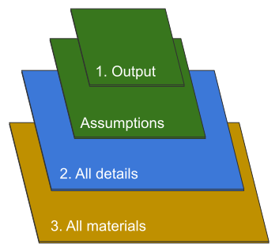

```{r setup, include=FALSE, message = FALSE}
knitr::opts_chunk$set(echo = TRUE)
links <- read.csv("links.csv")
rownames(links) <- links$name
```

# Project on Open Policy Analysis For Cost Effectiveness Analysis of Deworming Interventions

</div></center>
<br>

Open in RStudio: [](`r links['binder', 'url']`)

Go straight to the Shiny app: [here](`r links['shiny_app', 'url']`)

This repository and its accompanying dynamic document and Shiny app are three key components of an Open Policy Analysis (OPA) on the costs and benefits of mass deworming interventions in various settings. Together, these materials create a transparent and reproducible analysis to facilitate collaboration and discussion about deworming policy.



1 - [An interactive plot](`r links['shiny_app', 'url']`), which summarizes the interactions between all key parameters for a given set of assumptions. Materials can be found in: [`code/shiny_app`](`r links['shiny_code', 'url']`).

2 - Open policy report in the form of a [dynamic document](`r links['dw_dd', 'url']`), which details all data, code, and assumptions included in the analysis. Materials can be found in: [`code/dynamic_doc`](`r links['dw_dd_code', 'url']`).

3 - This Github repository, which stores all data, code, and materials necessary to replicate the analysis in full with minimal effort.  

This project complies with the highest levels of the [Open Policy Analysis (OPA) Guidelines](`r links['opa_guidelines', 'url']`). We also look to demonstrate tools, ideas, and practices through which OPA can be implemented in practice. This exercise, and future case studies, in turn will inform the Guidelines.

To learn more about BITSS and our OPA initiative [click here](`r links['bitss_opa', 'url']`). If you would like to collaborate with BITSS to develop a demonstration of a OPA in your organization please email Aleks Bogdanoski (openpolicy@berkeley.edu).  

Major contributions to this project will be acknowledged below. This OPA employs the Contributor Roles Taxonomy ([CRediT](`r links['contributor_taxonomy', 'url']`)). Major contributions are defined as any pushed revisions to language or source code beyond corrections of spelling and grammar.  

## List of Contributors:    
*(in alphabetical order)*  

<!--  
| Name                         | Conceptualization | Writing <br> 
                                                     (Original Draft)| Writing  <br>  
                                                                     (Reviewing and Editing)   | Visualization | Funding   <br> 
                                                                                                                Acquisition   | Project <br> 
                                                                                                                                 Administration | Supervision |Communications |    
-->  

| Name                         | Conceptualization | Writing <br> (Original Draft)| Writing  <br> (Reviewing and Editing)   | Visualization | Funding   <br> Acquisition   | Project <br> Administration | Supervision | Communications |   
|------------------------------|-------------------|-----------------|-------------------------|---------------|--------------|-----------------|-------------|---------------|  
| Sophia Bai                   | --                | --              | S                       | S             | --           | --              | --          |--             |  
| Aleksandar Bogdanoski        | --                | S               | L                       | --            | S            | CL              | --          | S             |  
| Carson Christiano            | --                | --              | --                      | --            | CL           | S               | --          | S             |  
| Fernando Hoces de la Guardia | L                 | L               | S                       | L             | --           | S               | --          | S             |  
| Katherine Hoeberling         | --                | S               | CL                      | --            | CL           | L               | --          | S             |  
| Grace Hollister              | S                 | S               | --                      | S             | --           | --              | CL          | S             |  
| Orianna Jia                  | --                | --              | S                       | --            | --           | --              | --          |--             |  
| Michelle Layvant             | --                | --              | S                       | --            | --           | --              | --          |--             |  
| Keanu Lim                    | --                | --              | --                      | S             | --           | --              | --          |--             |  
| Charles Love                 | --                | --              | --                      | S             | --           | --              | --          |--             |  
| Teng Aleksandra Ma           | --                | --              | S                       | CL            | --           | --              | --          |--             |  
| Dustin Marshall              | --                | --              | S                       | --            | --           | --              | --          | S             |  
| Edward Miguel                | CL                | S               | --                      | S             | L            | --              | L           |--             |  
| Grace Morgan                 | --                | S               | S                       | --            | --           | --              | --          | S             |  
| Emma Ng                      | --                | S               | S                       | S             | --           | --              | --          |--             |  
| Lauren Russel                | --                | --              | S                       | --            | --           | --              | --          | L             |  
| Ryan Scholes                 | --                | --              | --                      | S             | --           | --              | --          |--             |  
| Jiayu Shi                    | --                | --              | --                      | S             | --           | --              | --          |--             |      
| Peter Zhang                  | --                | --              | --                      | S             | --           | --              | --          |--             |      


*Note*: For multiperson tasks, credit is assing with E for equal credit, L and CL for leading and Co-leading, and S for supporting.  

 
This list of contributors to this repository (also available at [this page](`r links['dw_contributions', 'url']`)) is ordered by each individual's number of commits, which may not perfectly reflect their intellectual contribution to this project:

```{r deworming-contributors, echo=FALSE, results="asis", message=FALSE, warning = FALSE}
# adapted from Hadley Wickham's scripts to credit contributors to R for Data Science
## contributors.R (https://github.com/hadley/r4ds/blob/master/contributors.R)
## index.Rmd (https://github.com/hadley/r4ds/blob/master/index.rmd)
## R for Data Science license: https://creativecommons.org/licenses/by-nc-nd/3.0/us/

library(tidyverse)
deworming_contributors <- readr::read_csv(
  "contributors.csv", col_types = list())

cat(str_c(deworming_contributors$desc, collapse = ", "))
```

