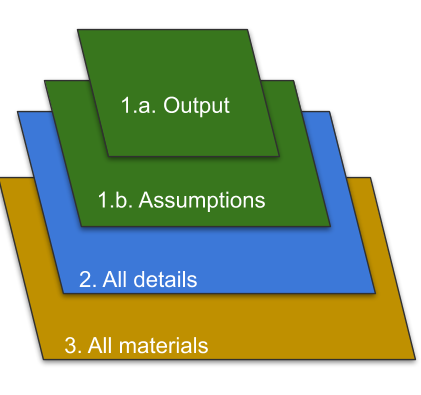

# Case Study on Open Policy Analysis For Cost Effectiveness Analysis of Deworming Interventions.

[See here for a complete list of all the collaborators behind this OPA](LINK TO DEWORMING CONTRIBUTORS).

<!--{style="width: 40%"} {style="width: 50%"}{style="display: block; margin-left: auto;
  margin-right: auto; width: 50%"} 
  
(These are copied directly from the wealth tax OPA readme; do we want to do something similar for this repo?)  -->

Open in RStudio: 

Go straight to the Shiny app: 

<!--
- Can you add a BITSS LOGO?
- can you add OPA LOGO on the right with description of three three outputs on the left?
-->

This repository and its accompanying dynamic document and Shiny app are three key components of an Open Policy Analysis (OPA) on the costs and benefits of mass deworming interventions in various settings. Together, these materials create a transparent and reproducible analysis to facilitate collaboration and discussion about deworming policy.

1 - [An interactive plot](http://wealthtaxsimulator.org/simulator_app/), which summarizes the interactions between all key parameters for a given set of assumptions. Materials can be found in: [`code\shiny_app`](https://github.com/BITSS-OPA/opa-deworming/tree/master/code/shiny_app).

2 - Open policy report in the form of a [dynamic document](http://wealthtaxsimulator.org/analysis/) [replace with link to deworming doc], which details all data, code, and assumptions included in the analysis. Materials can be found in: [`code\dynamic_doc`](https://github.com/BITSS/opa-wealthtax/tree/master/code/dynamic_doc).

3 - This Github repository, which stores all data, code, and materials necessary to replicate the analysis in full with minimal effort.  

This case study complies with the highest levels of the [Open Policy Analysis (OPA) Guidelines](https://www.bitss.org/opa/community-standards/). We also look to demonstrate tools, ideas, and practices through which OPA can be implemented in practice. This exercise, and future case studies, in turn will inform the Guidelines.

To learn more about BITSS and our OPA initiative [click here](https://www.bitss.org/opa/). If you would like to collaborate with BITSS to develop a demonstration of a OPA in your organization please email Aleks Bogdanoski (abogdanoski@berkeley.edu).
